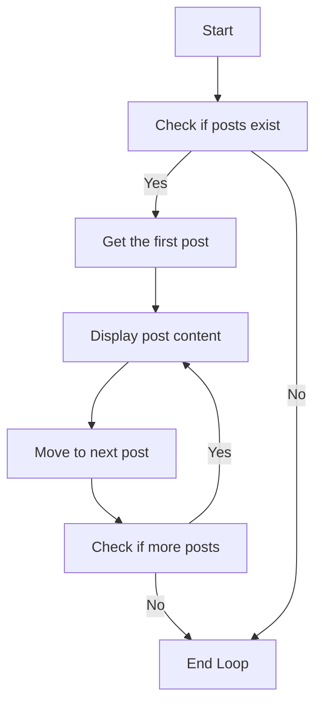

# WordPress Loops

## Introduction

The WordPress Loop is one of the most fundamental concepts in WordPress theme development. It's the mechanism that WordPress uses to display posts, pages, or any other content from your database. Whether you're showing blog posts, products, or custom content types, the Loop is the engine that powers content display on a WordPress site.

In this tutorial, you'll learn how the standard WordPress Loop works, how to customize it, and how to create your own custom loops to display exactly the content you need.

## What is The WordPress Loop?

The WordPress Loop is a PHP code structure that WordPress uses to iterate through posts and display them on a page. Every time you visit a WordPress blog's homepage, archive page, or search results page, WordPress is using the Loop to fetch and display the appropriate content.

Here's a simplified representation of how the WordPress Loop works:



## The Basic WordPress Loop

Here's what the standard WordPress Loop looks like:

```php
<?php
if (have_posts()) :
    while (have_posts()) :
        the_post();
        // Display content for each post
        ?>
        <h2><?php the_title(); ?></h2>
        <div class="entry-content">
            <?php the_content(); ?>
        </div>
        <?php
    endwhile;
else :
    ?>
    <p>No posts found.</p>
    <?php
endif;
?>
```

Let's break down what's happening in this code:

1. `if (have_posts())` - Checks if there are any posts to display
2. `while (have_posts())` - Starts a loop that continues as long as there are posts to display
3. `the_post()` - Sets up the post data for use within the loop
4. `the_title()` and `the_content()` - Template tags that display the post title and content
5. If no posts are found, the "else" part displays a message

## Common Template Tags Used Within the Loop

When working within the Loop, WordPress provides many template tags to display different parts of your posts:

| Template Tag | Description |
| ------------ | ----------- |
| `the_title()` | Displays the post title |
| `the_content()` | Displays the full post content |
| `the_excerpt()` | Displays a shortened version of the post content |
| `the_permalink()` | Outputs the URL of the post |
| `the_author()` | Displays the post author name |
| `the_date()` | Displays the post date |
| `the_time()` | Displays the post time |
| `the_category()` | Displays the post's categories |
| `the_tags()` | Displays the post's tags |
| `the_ID()` | Displays the post ID |

## Customizing the Loop

### Conditional Tags

WordPress provides conditional tags you can use inside the Loop to display content based on specific conditions:

```php
<?php
while (have_posts()) :
    the_post();
    ?>
    <article id="post-<?php the_ID(); ?>" <?php post_class(); ?>>
        <h2><a href="<?php the_permalink(); ?>"><?php the_title(); ?></a></h2>
        
        <?php if (is_single()) : ?>
            <!-- Show full content on single post pages -->
            <div class="entry-content">
                <?php the_content(); ?>
            </div>
        <?php else : ?>
            <!-- Show excerpt on archive/index pages -->
            <div class="entry-summary">
                <?php the_excerpt(); ?>
                <a href="<?php the_permalink(); ?>">Read more</a>
            </div>
        <?php endif; ?>
        
        <footer class="entry-footer">
            <?php if (has_category()) : ?>
                <div class="categories">
                    Categories: <?php the_category(', '); ?>
                </div>
            <?php endif; ?>
        </footer>
    </article>
    <?php
endwhile;
?>
```

### Formatting the Loop Output

You can control how the Loop's output is formatted by adding HTML structure and CSS classes:

```php
<?php
if (have_posts()) :
    ?>
    <div class="posts-container">
        <?php
        while (have_posts()) :
            the_post();
            ?>
            <article class="post-card">
                <?php if (has_post_thumbnail()) : ?>
                    <div class="post-thumbnail">
                        <a href="<?php the_permalink(); ?>">
                            <?php the_post_thumbnail('medium'); ?>
                        </a>
                    </div>
                <?php endif; ?>
                
                <div class="post-content">
                    <h2 class="post-title">
                        <a href="<?php the_permalink(); ?>"><?php the_title(); ?></a>
                    </h2>
                    
                    <div class="post-meta">
                        <span class="post-date"><?php the_date(); ?></span>
                        <span class="post-author">by <?php the_author(); ?></span>
                    </div>
                    
                    <div class="post-excerpt">
                        <?php the_excerpt(); ?>
                    </div>
                    
                    <a class="read-more" href="<?php the_permalink(); ?>">Read More</a>
                </div>
            </article>
            <?php
        endwhile;
        ?>
    </div>
    <?php
else :
    ?>
    <div class="no-posts">
        <p>Sorry, no posts were found.</p>
    </div>
    <?php
endif;
?>
```

## Creating Custom Loops with WP_Query

While the standard WordPress Loop works for many situations, sometimes you need more control. This is where `WP_Query` comes in. It allows you to create custom loops to display specific content.

### Basic Custom Loop Example

Here's a basic example of a custom loop that displays the 3 most recent posts from a specific category:

```php
<?php
$custom_query = new WP_Query([
    'category_name' => 'tutorials',
    'posts_per_page' => 3,
]);

if ($custom_query->have_posts()) :
    ?>
    <div class="recent-tutorials">
        <h2>Recent Tutorials</h2>
        <div class="tutorials-grid">
            <?php
            while ($custom_query->have_posts()) :
                $custom_query->the_post();
                ?>
                <div class="tutorial-card">
                    <h3><a href="<?php the_permalink(); ?>"><?php the_title(); ?></a></h3>
                    <div class="excerpt"><?php the_excerpt(); ?></div>
                </div>
                <?php
            endwhile;
            ?>
        </div>
    </div>
    <?php
    // Reset post data to avoid conflicts with the main loop
    wp_reset_postdata();
else :
    ?>
    <p>No tutorials found</p>
    <?php
endif;
?>
```

### Advanced Query Parameters

`WP_Query` accepts many parameters to fine-tune your custom loops:

```php
<?php
$custom_query = new WP_Query([
    'post_type'      => 'product',          // Custom post type
    'posts_per_page' => 6,                  // Number of posts to display
    'order'          => 'DESC',             // Ascending or descending order
    'orderby'        => 'date',             // What field to order by
    'tax_query'      => [                   // Query by custom taxonomy
        [
            'taxonomy' => 'product_category',
            'field'    => 'slug',
            'terms'    => 'featured',
        ],
    ],
    'meta_query'     => [                   // Query by custom field
        [
            'key'     => 'product_rating',
            'value'   => '4',
            'compare' => '>=',
            'type'    => 'NUMERIC',
        ],
    ],
]);

// Loop through query results
if ($custom_query->have_posts()) {
    while ($custom_query->have_posts()) {
        $custom_query->the_post();
        // Display your post content
    }
    wp_reset_postdata();
}
?>
```

## Practical Examples

### Example 1: Featured Posts Slider

This example creates a custom loop to display featured posts in a slider section:

```php
<?php
$featured_posts = new WP_Query([
    'posts_per_page' => 5,
    'meta_key'       => 'featured_post',
    'meta_value'     => 'yes',
]);

if ($featured_posts->have_posts()) :
    ?>
    <div class="featured-slider">
        <?php
        while ($featured_posts->have_posts()) :
            $featured_posts->the_post();
            $featured_image = get_the_post_thumbnail_url(get_the_ID(), 'large');
            ?>
            <div class="slide" style="background-image: url('<?php echo esc_url($featured_image); ?>');">
                <div class="slide-content">
                    <h2><?php the_title(); ?></h2>
                    <p><?php echo get_the_excerpt(); ?></p>
                    <a href="<?php the_permalink(); ?>" class="btn">Read More</a>
                </div>
            </div>
            <?php
        endwhile;
        ?>
    </div>
    <?php
    wp_reset_postdata();
endif;
?>
```

### Example 2: Related Posts Section

This example shows how to display related posts at the end of a single post:

```php
<?php
// Get current post's categories
$categories = get_the_category();
$category_ids = [];

foreach ($categories as $category) {
    $category_ids[] = $category->term_id;
}

// Query related posts
$related_posts = new WP_Query([
    'category__in'      => $category_ids,
    'posts_per_page'    => 3,
    'post__not_in'      => [get_the_ID()], // Exclude current post
    'orderby'           => 'rand', // Random order
]);

if ($related_posts->have_posts()) :
    ?>
    <div class="related-posts">
        <h3>Related Articles You Might Enjoy</h3>
        <div class="related-posts-grid">
            <?php
            while ($related_posts->have_posts()) :
                $related_posts->the_post();
                ?>
                <div class="related-post">
                    <?php if (has_post_thumbnail()) : ?>
                        <a href="<?php the_permalink(); ?>">
                            <?php the_post_thumbnail('medium'); ?>
                        </a>
                    <?php endif; ?>
                    
                    <h4>
                        <a href="<?php the_permalink(); ?>"><?php the_title(); ?></a>
                    </h4>
                    
                    <div class="post-meta">
                        <?php echo get_the_date(); ?>
                    </div>
                </div>
                <?php
            endwhile;
            ?>
        </div>
    </div>
    <?php
    wp_reset_postdata();
endif;
?>
```

### Example 3: Custom Content Grid

This example creates a grid of posts from multiple post types:

```php
<?php
$content_grid = new WP_Query([
    'post_type'      => ['post', 'product', 'portfolio'],
    'posts_per_page' => 9,
    'orderby'        => 'date',
    'order'          => 'DESC',
]);

if ($content_grid->have_posts()) :
    ?>
    <div class="content-grid">
        <?php
        while ($content_grid->have_posts()) :
            $content_grid->the_post();
            $post_type = get_post_type();
            ?>
            <div class="grid-item <?php echo esc_attr($post_type); ?>">
                <div class="item-inner">
                    <?php if (has_post_thumbnail()) : ?>
                        <div class="item-image">
                            <a href="<?php the_permalink(); ?>">
                                <?php the_post_thumbnail('medium'); ?>
                            </a>
                        </div>
                    <?php endif; ?>
                    
                    <div class="item-content">
                        <span class="item-type"><?php echo esc_html(ucfirst($post_type)); ?></span>
                        <h3><a href="<?php the_permalink(); ?>"><?php the_title(); ?></a></h3>
                        <div class="item-excerpt">
                            <?php echo wp_trim_words(get_the_excerpt(), 15); ?>
                        </div>
                    </div>
                </div>
            </div>
            <?php
        endwhile;
        ?>
    </div>
    <?php
    wp_reset_postdata();
endif;
?>
```

## Pagination in WordPress Loops

Pagination is essential for websites with lots of content. Here's how to implement it:

### Default Pagination

For the default loop, WordPress provides the `the_posts_pagination()` function:

```php
<?php
if (have_posts()) :
    while (have_posts()) :
        the_post();
        // Display post content
    endwhile;
    
    the_posts_pagination([
        'mid_size'  => 2,
        'prev_text' => __('Previous', 'your-theme-text-domain'),
        'next_text' => __('Next', 'your-theme-text-domain'),
    ]);
else :
    echo '<p>No posts found</p>';
endif;
?>
```

### Custom Loop Pagination

For custom loops with `WP_Query`, you'll need to set up pagination manually:

```php
<?php
$paged = (get_query_var('paged')) ? get_query_var('paged') : 1;

$custom_query = new WP_Query([
    'posts_per_page' => 10,
    'paged'          => $paged,
]);

if ($custom_query->have_posts()) :
    while ($custom_query->have_posts()) :
        $custom_query->the_post();
        // Display post content
    endwhile;
    ?>
    
    <div class="custom-pagination">
        <?php
        echo paginate_links([
            'base'         => str_replace(999999999, '%#%', esc_url(get_pagenum_link(999999999))),
            'total'        => $custom_query->max_num_pages,
            'current'      => max(1, $paged),
            'format'       => '?paged=%#%',
            'show_all'     => false,
            'type'         => 'plain',
            'end_size'     => 2,
            'mid_size'     => 1,
            'prev_next'    => true,
            'prev_text'    => __('« Previous', 'your-theme-text-domain'),
            'next_text'    => __('Next »', 'your-theme-text-domain'),
            'add_args'     => false,
            'add_fragment' => '',
        ]);
        ?>
    </div>
    
    <?php
    wp_reset_postdata();
else :
    echo '<p>No posts found</p>';
endif;
?>
```

## Common Mistakes and How to Avoid Them

1. **Forgetting to reset post data**
   Always use `wp_reset_postdata()` after a custom loop to avoid conflicts with the main loop.

2. **Infinite loops**
   Always ensure your while condition will eventually become false.

3. **Query inefficiency**
   Avoid unnecessary database requests by carefully planning your queries and caching results when possible.

4. **Not checking if posts exist**
   Always check if posts exist before starting the loop to avoid errors or empty markup.

5. **Using the wrong loop tags**
   When using `WP_Query`, make sure to use the object's methods (`$query->the_post()`, `$query->have_posts()`), not the global functions.

## Summary

The WordPress Loop is the cornerstone of displaying content in WordPress themes. Understanding how to work with the standard loop and create custom loops with `WP_Query` gives you tremendous flexibility in how you present content to users.

In this tutorial, you've learned:

- How the standard WordPress Loop works
- Common template tags used within the loop
- How to customize the Loop's output
- Creating custom loops with `WP_Query`
- Real-world examples of custom loops
- How to implement pagination
- Common mistakes and how to avoid them

With these skills, you can create dynamic, content-rich WordPress themes that display exactly the content you want, exactly how you want it.

## Additional Resources

To further enhance your WordPress Loop skills, consider exploring:

1. **Pre_get_posts hook** - Modify main queries without custom loops
2. **Post formats** - Customize loop display based on post format
3. **Advanced Custom Fields** - Enhance your posts with custom data
4. **AJAX loading** - Load more posts without page refresh
5. **Transients API** - Cache complicated queries for better performance

## Practice Exercises

1. Create a custom loop that displays posts from a specific category in a grid layout.
2. Build a tabbed content section showing posts from different categories.
3. Implement AJAX pagination for a custom post type archive.
4. Create a "Popular Posts" widget using meta values to track and sort by view count.
5. Build a filterable portfolio using custom taxonomies and AJAX.

By mastering WordPress Loops, you'll be able to create sophisticated content displays that meet any design requirement while maintaining good performance.