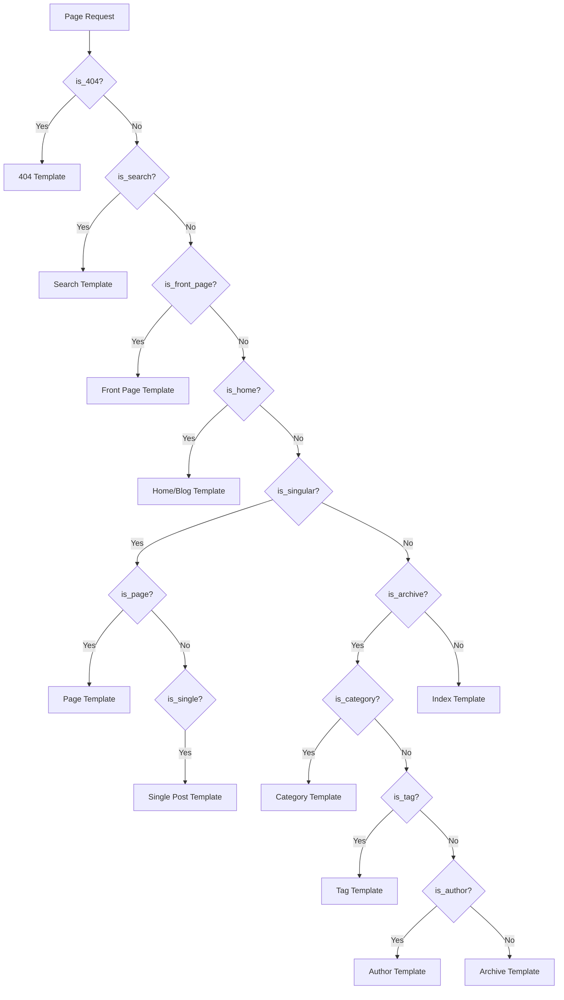

# WordPress Conditional Tags

## Introduction

When developing WordPress themes, you often need to display different content depending on the context - such as showing different layouts on the home page versus single posts, or displaying certain elements only to logged-in users. This is where WordPress conditional tags come into play.

Conditional tags are special PHP functions in WordPress that return either `true` or `false` based on the current page being viewed and other conditions. They allow your theme to make intelligent decisions about what content to display and when to display it.

In this tutorial, you'll learn:
- What conditional tags are and why they're important
- How to use the most common conditional tags
- How to combine conditional tags for more complex logic
- Best practices for implementing conditional tags in your themes

## Understanding Conditional Tags

Conditional tags are WordPress-specific PHP functions that check whether certain conditions are true. They're the backbone of creating dynamic, context-aware WordPress themes.

### Basic Structure

Conditional tags follow this basic pattern:

```php
if (is_something()) {
    // Do something if the condition is true
} else {
    // Do something else if the condition is false
}
```

## Common Conditional Tags

Let's explore some of the most frequently used conditional tags in WordPress theme development.

### Page Type Conditionals

These help determine what type of page is being viewed:

#### `is_front_page()`

Checks if the current page is the front page of the site.

```php
if (is_front_page()) {
    echo '<h1>Welcome to our Homepage!</h1>';
} else {
    echo '<h1>Welcome to our Website!</h1>';
}
```

#### `is_home()`

Checks if the current page is the blog posts index.

```php
if (is_home()) {
    echo '<h2>Latest Blog Posts</h2>';
}
```

:::tip
The difference between `is_front_page()` and `is_home()` can be confusing! `is_front_page()` checks if the current page is what you've set as your site's front page in Settings > Reading. `is_home()` checks if the current page is showing your latest blog posts (which may or may not be your front page).
:::

#### `is_single()`

Checks if the current page is a single post.

```php
if (is_single()) {
    echo '<div class="post-navigation">Next/Previous Post Links</div>';
}
```

You can also check for specific posts:

```php
if (is_single('coffee-brewing-techniques')) {
    echo '<div class="coffee-related-products"></div>';
}
```

#### `is_page()`

Checks if the current page is a static WordPress page.

```php
if (is_page()) {
    echo '<div class="page-content-wrapper">';
    the_content();
    echo '</div>';
}
```

Like `is_single()`, you can check for specific pages:

```php
if (is_page('about-us')) {
    echo '<div class="team-members"></div>';
}
```

### Archive Conditionals

These help you determine if the current page is an archive page:

#### `is_archive()`

Checks if the current page is any type of archive page.

```php
if (is_archive()) {
    echo '<h2>Archive</h2>';
}
```

#### `is_category()`

Checks if the current page is a category archive.

```php
if (is_category()) {
    echo '<h2>Posts in category: ' . single_cat_title('', false) . '</h2>';
}

// Check for a specific category
if (is_category('news')) {
    echo '<div class="breaking-news-banner"></div>';
}
```

#### `is_tag()`

Checks if the current page is a tag archive.

```php
if (is_tag()) {
    echo '<h2>Posts tagged with: ' . single_tag_title('', false) . '</h2>';
}
```

#### `is_author()`

Checks if the current page is an author archive.

```php
if (is_author()) {
    echo '<div class="author-bio">';
    echo get_the_author_meta('description');
    echo '</div>';
}
```

### User-Related Conditionals

These check conditions related to the current user:

#### `is_user_logged_in()`

Checks if the current visitor is logged in.

```php
if (is_user_logged_in()) {
    echo '<div class="welcome-message">Hello, ' . wp_get_current_user()->display_name . '!</div>';
} else {
    echo '<div class="login-prompt">Please <a href="' . wp_login_url() . '">log in</a> to access all features.</div>';
}
```

#### `current_user_can()`

Checks if the current user has specific capabilities.

```php
if (current_user_can('edit_posts')) {
    echo '<a href="' . get_edit_post_link() . '">Edit this post</a>';
}
```

### Query-Related Conditionals

These help you check details about the current query:

#### `have_posts()`

Checks if there are any posts to display.

```php
if (have_posts()) {
    while (have_posts()) {
        the_post();
        // Display post content
    }
} else {
    echo '<p>No posts found.</p>';
}
```

#### `is_search()`

Checks if the current page is a search results page.

```php
if (is_search()) {
    echo '<h2>Search results for: ' . get_search_query() . '</h2>';
}
```

#### `is_404()`

Checks if the current page is a 404 error page.

```php
if (is_404()) {
    echo '<h1>Page Not Found</h1>';
    echo '<p>The page you were looking for doesn\'t exist. Try searching for what you need:</p>';
    get_search_form();
}
```

## Combining Conditional Tags

You can combine multiple conditional tags using PHP's logical operators to create more specific conditions:

### Using AND (&&)

Both conditions must be true:

```php
if (is_single() && is_user_logged_in()) {
    // Content only visible on single posts AND to logged in users
    echo '<div class="premium-content">Special content for logged-in users!</div>';
}
```

### Using OR (||)

At least one condition must be true:

```php
if (is_front_page() || is_home()) {
    // Content visible on either the front page OR the blog page
    echo '<div class="featured-content">Featured Content</div>';
}
```

### Using NOT (!)

Invert a condition:

```php
if (!is_admin()) {
    // Code that only runs on the frontend, not in the admin area
    // This is useful for enqueuing front-end only scripts
}
```

## Real-World Examples

Let's look at some practical applications of conditional tags in theme development:

### Example 1: Dynamic Header Layouts

```php
<header class="site-header">
    <div class="logo">
        <?php if (is_front_page()): ?>
            <h1 class="site-title"><?php bloginfo('name'); ?></h1>
        <?php else: ?>
            <p class="site-title"><a href="<?php echo esc_url(home_url('/')); ?>"><?php bloginfo('name'); ?></a></p>
        <?php endif; ?>
    </div>
    
    <nav class="main-navigation">
        <?php wp_nav_menu(['theme_location' => 'primary']); ?>
    </nav>
    
    <?php if (is_single() || is_page()): ?>
        <div class="breadcrumbs">
            <?php // Breadcrumb code here ?>
        </div>
    <?php endif; ?>
</header>
```

### Example 2: Customized Sidebar for Different Content Types

```php
<div class="sidebar">
    <?php if (is_front_page()): ?>
        <?php dynamic_sidebar('home-sidebar'); ?>
    <?php elseif (is_single()): ?>
        <?php dynamic_sidebar('post-sidebar'); ?>
    <?php elseif (is_page()): ?>
        <?php dynamic_sidebar('page-sidebar'); ?>
    <?php elseif (is_archive()): ?>
        <?php dynamic_sidebar('archive-sidebar'); ?>
    <?php else: ?>
        <?php dynamic_sidebar('default-sidebar'); ?>
    <?php endif; ?>
</div>
```

### Example 3: Content Template Selection

```php
<?php
// Content template selection based on page type
if (is_front_page()) {
    get_template_part('template-parts/content', 'front-page');
} elseif (is_singular('product')) {
    get_template_part('template-parts/content', 'product');
} elseif (is_single()) {
    get_template_part('template-parts/content', 'single');
} elseif (is_page()) {
    get_template_part('template-parts/content', 'page');
} elseif (is_archive()) {
    get_template_part('template-parts/content', 'archive');
} else {
    get_template_part('template-parts/content', 'default');
}
?>
```

### Example 4: User Role-Based Content

```php
<?php
// Show different content based on user role
if (is_user_logged_in()) {
    $user = wp_get_current_user();
    
    if (in_array('administrator', $user->roles)) {
        echo '<div class="admin-message">Hello Admin! Here\'s your quick stats dashboard.</div>';
    } elseif (in_array('editor', $user->roles)) {
        echo '<div class="editor-tools">Quick access to your recent edits.</div>';
    } elseif (in_array('subscriber', $user->roles)) {
        echo '<div class="subscriber-content">Thank you for subscribing!</div>';
    }
} else {
    echo '<div class="signup-prompt">Sign up to access member content!</div>';
}
?>
```

## Best Practices

1. **Consider Performance**: While conditional tags are convenient, excessive use can impact performance. Try to minimize redundant checks.

2. **Think Hierarchically**: Organize your conditionals logically, from most specific to most general cases.

3. **Combine Wisely**: When combining conditions, ensure your logic is sound. Too many nested conditions can become hard to maintain.

4. **Check Documentation**: Always refer to the [WordPress Developer Documentation](https://developer.wordpress.org/themes/basics/conditional-tags/) for up-to-date information on conditional tags.

5. **Use Template Parts**: Pair conditional tags with `get_template_part()` for cleaner and more maintainable code.

## Understanding the Conditional Tag Hierarchy

WordPress follows a specific hierarchy when determining which template file to use. Here's a simplified diagram showing how conditional tags relate to this hierarchy:



This helps visualize how WordPress decides which template to use based on the current context.

## Summary

WordPress conditional tags are powerful tools for creating dynamic, context-aware themes. They allow you to:

- Display different content based on page type
- Create unique layouts for different sections of your site
- Show or hide elements based on user status
- Implement complex logical conditions to control theme behavior

By mastering conditional tags, you can create themes that respond intelligently to different contexts, providing a tailored experience for your users.

## Practice Exercises

1. Create a navigation menu that highlights the current section of the website using conditional tags.

2. Build a footer that displays different content based on whether the user is logged in or not.

3. Create a sidebar that shows different widgets based on whether the page is a blog post, product page, or regular page.

4. Implement a "related posts" section that only appears on single blog posts but not on pages.

5. Create conditional social sharing buttons that appear on posts but not on pages.

## Additional Resources

- [WordPress Developer Handbook: Conditional Tags](https://developer.wordpress.org/themes/basics/conditional-tags/)
- [WordPress Codex: Conditional Tags Index](https://codex.wordpress.org/Conditional_Tags)
- [WordPress Template Hierarchy](https://developer.wordpress.org/themes/basics/template-hierarchy/)

Happy coding!