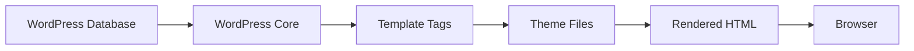

# WordPress Template Tags

## Introduction

When developing WordPress themes, one of the most powerful features at your disposal is the set of WordPress template tags. These are specialized PHP functions that allow you to retrieve and display dynamic content from the WordPress database in your theme files.

Template tags serve as a bridge between your static HTML layout and the dynamic content stored in the WordPress database. They enable you to display post titles, content, author information, dates, and virtually any other data stored in WordPress.

In this tutorial, we'll explore how template tags work, the most commonly used tags, and how to implement them effectively in your WordPress themes.

## What Are WordPress Template Tags?

Template tags are PHP functions specifically designed for WordPress theme development. They typically follow one of two formats:

1. **Get functions**: Retrieve data but don't display it (e.g., `get_the_title()`)
2. **Display functions**: Retrieve and immediately output data (e.g., `the_title()`)

The naming convention is simple:
- Functions that start with `the_` will output content directly
- Functions that start with `get_` will return content for you to manipulate

## Common Template Tags

### Post Title Template Tags

The most basic template tag is for displaying a post title:

```php
// Display the title
the_title();

// Get the title without displaying it
$title = get_the_title();
echo "Custom wrapper: " . $title;
```

**Output:**
```
My Amazing WordPress Post

Custom wrapper: My Amazing WordPress Post
```

### Post Content Template Tags

To display the content of a post:

```php
// Display the full content
the_content();

// Display an excerpt
the_excerpt();

// Get the excerpt without displaying it
$excerpt = get_the_excerpt();
echo "<blockquote>" . $excerpt . "</blockquote>";
```

The `the_content()` function applies WordPress filters to the raw content, converting shortcodes, formatting paragraphs, and more.

### Date and Time Template Tags

To display when a post was published:

```php
// Display the date in the default format
the_date();

// Display the date in a custom format
the_time('F j, Y');

// Get the date without displaying it
$date = get_the_date('Y-m-d');
echo "Published on: " . $date;
```

**Output:**
```
August 15, 2023

August 15, 2023

Published on: 2023-08-15
```

### Author Template Tags

To display information about the post author:

```php
// Display the author name
the_author();

// Display author with a link to their posts
the_author_posts_link();

// Get author ID
$author_id = get_the_author_meta('ID');
```

### Category and Tag Template Tags

To display categories and tags:

```php
// Display categories
the_category(', ');

// Display tags
the_tags('Tags: ', ', ', '');

// Check if post has category
if (has_category('news')) {
    echo "This is a news post!";
}
```

## Conditional Template Tags

WordPress also provides conditional template tags that help you check certain conditions and display content accordingly:

```php
// Check if we're on the home page
if (is_home()) {
    echo "You're on the home page!";
}

// Check if we're on a single post
if (is_single()) {
    echo "You're viewing a single post!";
}

// Check if we're on a specific page
if (is_page('about')) {
    echo "You're on the About page!";
}

// Check if user is logged in
if (is_user_logged_in()) {
    echo "Welcome, registered user!";
}
```

## Template Tags in the Loop

Most template tags are designed to work inside the WordPress Loop. The Loop is a PHP code structure that processes each post:

```php
<?php
if (have_posts()) :
    while (have_posts()) :
        the_post();
        ?>
        <article id="post-<?php the_ID(); ?>" <?php post_class(); ?>>
            <h2>
                <a href="<?php the_permalink(); ?>">
                    <?php the_title(); ?>
                </a>
            </h2>
            <div class="entry-meta">
                Posted on <?php the_date(); ?> by <?php the_author(); ?>
            </div>
            <div class="entry-content">
                <?php the_excerpt(); ?>
                <a href="<?php the_permalink(); ?>">Read more</a>
            </div>
        </article>
        <?php
    endwhile;
else :
    echo '<p>No posts found.</p>';
endif;
?>
```

This code will iterate through all available posts and display their title, date, author, and excerpt, with proper links.

## Creating Custom Template Tags

You can create your own template tags to extend WordPress functionality. Here's a simple example:

```php
// Add this to your theme's functions.php file
function get_formatted_post_date() {
    $time_string = '<time class="entry-date" datetime="%1$s">%2$s</time>';
    
    $time_string = sprintf($time_string,
        get_the_date('c'),
        get_the_date()
    );
    
    return $time_string;
}

function formatted_post_date() {
    echo get_formatted_post_date();
}
```

Now you can use `formatted_post_date()` in your template files to display a nicely formatted date.

## Practical Example: Building a Post Grid

Let's create a practical example of how template tags can be used to build a post grid:

```php
<div class="post-grid">
    <?php
    // Custom query to get the latest 6 posts
    $recent_posts = new WP_Query(array(
        'posts_per_page' => 6,
        'post_type' => 'post'
    ));
    
    if ($recent_posts->have_posts()) :
        while ($recent_posts->have_posts()) : $recent_posts->the_post();
        ?>
        <div class="grid-item">
            <?php if (has_post_thumbnail()) : ?>
                <div class="post-thumbnail">
                    <a href="<?php the_permalink(); ?>">
                        <?php the_post_thumbnail('medium'); ?>
                    </a>
                </div>
            <?php endif; ?>
            
            <h3><a href="<?php the_permalink(); ?>"><?php the_title(); ?></a></h3>
            
            <div class="post-meta">
                <?php echo get_the_date(); ?> | 
                <?php the_category(', '); ?>
            </div>
            
            <div class="post-excerpt">
                <?php echo wp_trim_words(get_the_excerpt(), 15); ?>
                <a href="<?php the_permalink(); ?>" class="read-more">Read More</a>
            </div>
        </div>
        <?php
        endwhile;
        wp_reset_postdata();
    else :
        echo '<p>No posts found.</p>';
    endif;
    ?>
</div>
```

This code creates a responsive grid displaying the latest 6 posts with their featured images, titles, categories, and excerpts.

## Template Tag Workflow

Here's a simple diagram showing how template tags work within WordPress:



## Summary

WordPress template tags are essential tools for theme developers, providing a clean and efficient way to retrieve and display dynamic content. They act as a bridge between your WordPress database and the HTML output of your theme.

Key points to remember:
- Template tags with `the_` prefix display content directly
- Template tags with `get_` prefix return content for further manipulation
- Most template tags work inside the WordPress Loop
- Conditional tags help control what content displays under specific conditions
- You can create your own custom template tags to extend functionality

With a good understanding of template tags, you can create highly dynamic and flexible WordPress themes that display content exactly the way you want.

## Additional Resources

- [WordPress Template Tags Documentation](https://developer.wordpress.org/themes/basics/template-tags/)
- [WordPress Template Tags Reference](https://developer.wordpress.org/reference/functions/)
- [The WordPress Loop Documentation](https://developer.wordpress.org/themes/basics/the-loop/)

## Practice Exercises

1. Create a custom author byline that displays the author's name, avatar, and bio.
2. Build a custom related posts section that shows posts in the same category.
3. Create a custom template tag that displays the estimated reading time for a post.
4. Modify the post meta information to include the comment count and edit link for logged-in users.

By mastering template tags, you'll be able to create more sophisticated and feature-rich WordPress themes that leverage the full power of WordPress's content management capabilities.