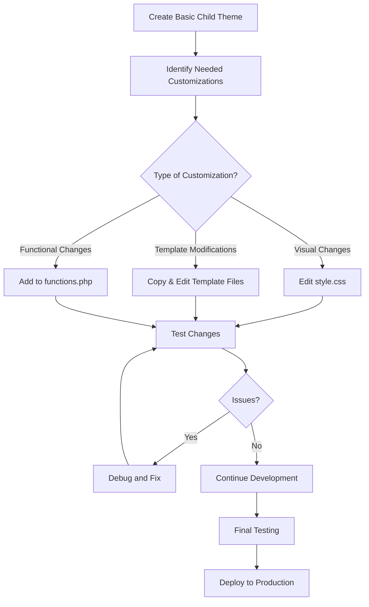

# WordPress Child Themes

## Introduction

WordPress child themes are one of the most powerful features available to WordPress developers and site owners. They provide a safe and efficient way to customize an existing theme without modifying its original files. This approach ensures that your customizations won't be lost when the parent theme receives updates.

In this tutorial, you'll learn everything about WordPress child themes—from understanding their purpose to creating and customizing them for your projects.

## What is a Child Theme?

A WordPress child theme is a theme that inherits functionality, features, and the overall design of another theme, called the parent theme. The child theme allows you to modify or add to the parent theme's functionality without changing any of the parent theme's code.

### Why Use Child Themes?

There are several compelling reasons to use child themes:

1. **Update Safety**: When a parent theme updates, your customizations won't be overwritten
2. **Code Organization**: Keep your custom code separate from the parent theme
3. **Easy Rollback**: If something goes wrong, you can simply deactivate the child theme
4. **Minimal Code**: You only need to include the files you want to modify

## Creating a Basic Child Theme

Let's start by creating a simple child theme. Here's what you'll need:

1. A WordPress installation
2. Access to your website's file system (via FTP or the file manager in your hosting control panel)
3. A text editor

### Step 1: Create the Child Theme Directory

First, navigate to the `wp-content/themes` directory of your WordPress installation and create a new folder for your child theme. The naming convention is typically the parent theme name followed by `-child`.

For example, if your parent theme is "twentytwentythree":

```
wp-content/themes/twentytwentythree-child/
```

### Step 2: Create the style.css File

Inside your child theme folder, create a file named `style.css` with the following content:

```css
/*
Theme Name: Twenty Twenty-Three Child
Theme URI: https://example.com/twentytwentythree-child/
Description: A child theme for the Twenty Twenty-Three theme
Author: Your Name
Author URI: https://example.com
Template: twentytwentythree
Version: 1.0.0
Text Domain: twentytwentythree-child
*/

/* 
This file imports the parent theme's styles and allows you to add your own styles.
*/
```

The most critical part here is the `Template: twentytwentythree` line, which tells WordPress which theme is the parent. Make sure to use the folder name of the parent theme (not its display name).

### Step 3: Create the functions.php File

Next, create a `functions.php` file in your child theme folder:

```php
<?php
/**
 * Twenty Twenty-Three Child Theme functions and definitions
 */

// Enqueue parent theme stylesheet
function twentytwentythree_child_enqueue_styles() {
    $parent_style = 'twentytwentythree-style';

    // Enqueue parent style
    wp_enqueue_style( $parent_style, 
                    get_template_directory_uri() . '/style.css' );
    
    // Enqueue child style
    wp_enqueue_style( 'twentytwentythree-child-style',
                    get_stylesheet_directory_uri() . '/style.css',
                    array( $parent_style ),
                    wp_get_theme()->get('Version')
                );
}
add_action( 'wp_enqueue_scripts', 'twentytwentythree_child_enqueue_styles' );

// Add custom functionality here
```

This code properly loads both the parent theme's stylesheet and your child theme's stylesheet.

### Step 4: Activate the Child Theme

Now, log in to your WordPress dashboard, go to Appearance > Themes, and you should see your child theme listed. Click "Activate" to start using it.

## Customizing a Child Theme

Once you've created a basic child theme, you can start customizing it by overriding files from the parent theme or adding new functionality.

### Overriding Template Files

To override a template file from the parent theme, simply copy it from the parent theme directory to your child theme directory and make your modifications.

For example, to customize the header:

1. Copy `header.php` from the parent theme directory to your child theme directory
2. Edit the copy in your child theme

WordPress will automatically use your child theme's version instead of the parent's.

### Adding Custom CSS

You can add custom CSS directly to your child theme's `style.css` file after the header comment block:

```css
/* Custom CSS begins here */
.site-header {
    background-color: #f5f5f5;
    padding: 20px 0;
}

.entry-title {
    color: #0066cc;
    font-size: 2.5em;
}
```

### Adding Custom Functions

You can add new functions or modify existing ones in your `functions.php` file:

```php
/**
 * Add a custom footer credit
 */
function twentytwentythree_child_footer_credit() {
    echo '<div class="site-info">';
    echo 'Custom footer credit goes here';
    echo '</div>';
}
add_action( 'wp_footer', 'twentytwentythree_child_footer_credit' );
```

## Advanced Child Theme Techniques

Let's explore some more advanced techniques for customizing your child theme.

### Using Theme Hooks

Many WordPress themes provide hooks that allow you to add content at specific points without overriding entire template files:

```php
// Add content before the post content
function twentytwentythree_child_before_post_content() {
    if ( is_single() ) {
        echo '<div class="featured-banner">Featured Post</div>';
    }
}
add_action( 'twentytwentythree_before_post_content', 'twentytwentythree_child_before_post_content' );
```

### Overriding Parent Theme Functions

Sometimes you may need to override a function in the parent theme. This requires careful approach:

```php
// Remove the parent theme function
function remove_parent_theme_function() {
    remove_action( 'wp_head', 'parent_theme_custom_header', 10 );
}
add_action( 'wp_head', 'remove_parent_theme_function', 1 );

// Add your replacement function
function child_theme_custom_header() {
    // Your custom code here
}
add_action( 'wp_head', 'child_theme_custom_header', 10 );
```

### Adding Custom Templates

You can create custom page templates in your child theme:

```php
<?php
/**
 * Template Name: Custom Full Width
 * Description: A full-width template with no sidebar
 */

get_header();
?>

<div id="primary" class="content-area full-width">
    <main id="main" class="site-main" role="main">
        <?php
        while ( have_posts() ) : the_post();
            get_template_part( 'template-parts/content', 'page' );
            
            // If comments are open or we have at least one comment
            if ( comments_open() || get_comments_number() ) :
                comments_template();
            endif;
        endwhile;
        ?>
    </main>
</div>

<?php get_footer(); ?>
```

Save this as `page-custom-full-width.php` in your child theme directory.

## Real-World Examples

### Example 1: E-Commerce Customization

Let's say you're using a parent theme with WooCommerce support and want to customize the product display:

```php
// Add this to your child theme's functions.php
function custom_woocommerce_product_tabs( $tabs ) {
    // Remove the description tab
    unset( $tabs['description'] );
    
    // Rename the additional information tab
    $tabs['additional_information']['title'] = 'Product Specs';
    
    // Add a new tab
    $tabs['custom_tab'] = array(
        'title'    => 'Care Instructions',
        'priority' => 50,
        'callback' => 'custom_care_instructions_tab'
    );
    
    return $tabs;
}
add_filter( 'woocommerce_product_tabs', 'custom_woocommerce_product_tabs' );

function custom_care_instructions_tab() {
    echo '<h2>Care Instructions</h2>';
    echo '<p>Special care instructions for this product.</p>';
}
```

### Example 2: Custom Blog Layout

Here's how to modify your blog layout in a child theme:

1. Create a `content.php` file in your child theme:

```php
<?php
/**
 * Custom content template for blog posts
 */
?>

<article id="post-<?php the_ID(); ?>" <?php post_class('custom-post-style'); ?>>
    <div class="post-thumbnail">
        <?php if (has_post_thumbnail()) : ?>
            <a href="<?php the_permalink(); ?>">
                <?php the_post_thumbnail('large'); ?>
            </a>
        <?php endif; ?>
    </div>
    
    <div class="post-content">
        <header class="entry-header">
            <?php the_title( '<h2 class="entry-title"><a href="' . esc_url( get_permalink() ) . '">', '</a></h2>' ); ?>
            <div class="entry-meta">
                <?php echo get_the_date(); ?> by <?php the_author(); ?>
            </div>
        </header>

        <div class="entry-summary">
            <?php the_excerpt(); ?>
        </div>
        
        <footer class="entry-footer">
            <a href="<?php the_permalink(); ?>" class="read-more-link">
                Continue Reading <span class="screen-reader-text"><?php the_title(); ?></span>
            </a>
        </footer>
    </div>
</article>
```

2. Add custom CSS to style.css:

```css
.custom-post-style {
    display: flex;
    margin-bottom: 3rem;
    border-bottom: 1px solid #eee;
    padding-bottom: 2rem;
}

.post-thumbnail {
    flex: 0 0 35%;
    margin-right: 2rem;
}

.post-content {
    flex: 0 0 65%;
}

.read-more-link {
    display: inline-block;
    background: #0066cc;
    color: white;
    padding: 0.5rem 1rem;
    text-decoration: none;
    border-radius: 3px;
    margin-top: 1rem;
}

.read-more-link:hover {
    background: #004c99;
}
```

## Child Theme Development Workflow

Here's a recommended workflow for developing child themes:



## Best Practices for Child Themes

1. **Keep it Minimal**: Only override what you need to change
2. **Use Hooks When Possible**: Instead of copying entire template files
3. **Comment Your Code**: Document what each customization does
4. **Use a Version Control System**: Track your changes with Git
5. **Test Thoroughly**: Verify your changes across different devices and browsers
6. **Stay Compatible**: Ensure your child theme works with future parent theme updates

## Common Mistakes to Avoid

- **Not Using a Child Theme**: Making changes directly to the parent theme
- **Overriding Too Much**: Copying more files than necessary from the parent theme
- **Not Loading Parent Styles**: Forgetting to properly enqueue the parent theme's stylesheet
- **Using Incorrect Template Name**: Misspelling the parent theme's folder name in the Template field
- **Not Checking Template Hierarchy**: Misunderstanding which template files WordPress loads

## Summary

WordPress child themes provide an elegant solution for customizing themes without directly modifying the parent theme's code. This approach ensures that your customizations remain intact even when the parent theme is updated.

In this tutorial, we've covered:
- What child themes are and why you should use them
- How to create a basic child theme
- Methods for customizing CSS, templates, and functionality
- Advanced techniques and real-world examples
- Best practices and common pitfalls to avoid

By mastering child themes, you gain the ability to create highly customized WordPress sites while maintaining compatibility with future theme updates.

## Additional Resources

- [WordPress Codex: Child Themes](https://developer.wordpress.org/themes/advanced-topics/child-themes/)
- [WordPress Template Hierarchy](https://developer.wordpress.org/themes/basics/template-hierarchy/)
- [The WordPress Hook System](https://developer.wordpress.org/plugins/hooks/)

## Exercises

1. Create a child theme for Twenty Twenty-Three that changes the color scheme and font family.
2. Customize the header template of your child theme to include a custom logo and navigation menu.
3. Add a custom widget area to the footer of your child theme.
4. Create a custom page template that displays posts from a specific category.
5. Modify the WooCommerce product display in your child theme to show a custom message below each product.