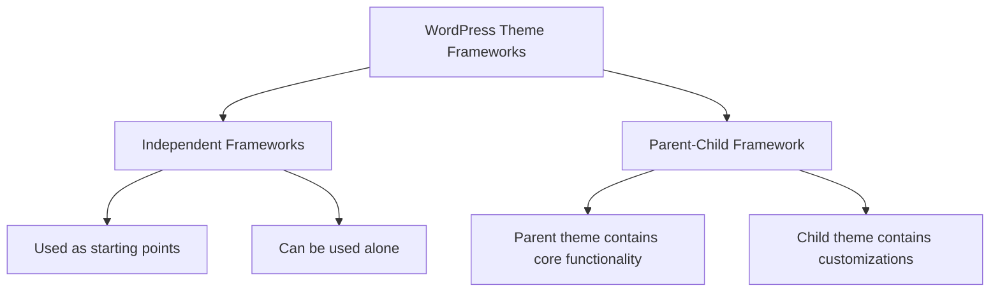

# WordPress Theme Frameworks

## Introduction

When diving into WordPress theme development, you'll quickly discover that building themes from scratch can be time-consuming and repetitive. This is where WordPress theme frameworks come in. Theme frameworks provide a foundation or a set of tools that help developers create WordPress themes more efficiently.

Think of a theme framework as a blueprint or foundation that handles much of the complex functionality and coding structure, allowing you to focus on design and unique features. In this tutorial, we'll explore what theme frameworks are, why they're useful, how to use them, and how they fit into your WordPress development workflow.

## What Are WordPress Theme Frameworks?

A WordPress theme framework is a set of standardized code that serves as a foundation for developing WordPress themes. They typically include:

- Pre-built templates and layout options
- Core functionality like widgets, customizer options, and navigation menus
- Well-structured code that follows WordPress best practices
- Hooks and filters for easy customization
- Features like responsive design, performance optimization, and accessibility compliance

Theme frameworks come in two main types:



1. **Independent Frameworks**: These function as starter themes or "starter kits" that you modify directly. Examples include Underscores (_s), FoundationPress, and Sage.

2. **Parent-Child Frameworks**: These operate on the parent-child theme concept, where the framework itself acts as the parent theme, and you create a child theme to customize it. Examples include Genesis, Divi, and Thesis.

## Why Use WordPress Theme Frameworks?

Using a theme framework offers several advantages:

- **Faster Development**: You don't have to code everything from scratch.
- **Code Quality**: Frameworks typically follow WordPress coding standards and best practices.
- **Maintainability**: Clear structure and documentation make maintenance easier.
- **Updates**: With parent-child setups, the parent theme can be updated without losing customizations.
- **Community**: Popular frameworks have active communities for support and learning.
- **Consistency**: Frameworks provide a consistent development environment for teams.

## Popular WordPress Theme Frameworks

### Underscores (_s)

Underscores is a starter theme created by Automattic, the company behind WordPress. It's designed to give developers a "1000-hour head start" on theme development.

To start using Underscores, you can:

1. Visit [underscores.me](http://underscores.me)
2. Generate a custom theme
3. Download and start customizing

```php
// Example of the Underscores navigation menu structure
<nav id="site-navigation" class="main-navigation">
  <button class="menu-toggle" aria-controls="primary-menu" aria-expanded="false">
    <?php esc_html_e( 'Primary Menu', 'mytheme' ); ?>
  </button>
  <?php
    wp_nav_menu(
      array(
        'theme_location' => 'menu-1',
        'menu_id'        => 'primary-menu',
      )
    );
  ?>
</nav><!-- #site-navigation -->
```

### Genesis Framework

Genesis is a popular premium framework that operates on the parent-child model. It's known for its performance, SEO features, and customization options.

#### Using Genesis Child Themes:

```php
// Example of adding custom widget area in Genesis child theme
function my_custom_sidebar() {
  genesis_register_sidebar( array(
    'id'          => 'custom-sidebar',
    'name'        => __( 'Custom Sidebar', 'my-child-theme' ),
    'description' => __( 'This is a custom sidebar for my theme', 'my-child-theme' ),
  ) );
}
add_action( 'genesis_setup', 'my_custom_sidebar', 15 );
```

### Other Popular Options:

- **Sage**: Modern development workflow with Blade templating and webpack
- **Timber**: Uses Twig templates for cleaner separation of logic and display
- **Gantry**: Advanced framework with drag-and-drop layout builder
- **Beans**: Lightweight framework focusing on UIkit

## Getting Started with a Theme Framework

Let's walk through setting up and customizing a theme using Underscores as an example:

### Step 1: Generate Your Starter Theme

1. Go to [underscores.me](http://underscores.me)
2. Enter your theme name, author, and other details
3. Click "Generate"
4. Download and extract the ZIP file

### Step 2: Understand the Structure

The Underscores structure includes:

```
theme-name/
├── inc/                 # Core theme functionality
├── js/                  # JavaScript files
├── languages/           # Translation files
├── sass/ or css/        # Styling files
├── template-parts/      # Reusable template components
├── functions.php        # Theme functions and setup
├── style.css            # Main stylesheet and theme information
└── [various template files]  # Header, footer, index, etc.
```

### Step 3: Customize Your Theme

#### Modifying the Theme Header:

```php
// In your header.php file
<!doctype html>
<html <?php language_attributes(); ?>>
<head>
  <meta charset="<?php bloginfo( 'charset' ); ?>">
  <meta name="viewport" content="width=device-width, initial-scale=1">
  <link rel="profile" href="https://gmpg.org/xfn/11">

  <?php wp_head(); ?>
</head>

<body <?php body_class(); ?>>
<?php wp_body_open(); ?>
<div id="page" class="site">
  <header id="masthead" class="site-header">
    <div class="custom-header-container">
      <?php the_custom_logo(); ?>
      <div class="site-branding">
        <?php if ( is_front_page() && is_home() ) : ?>
          <h1 class="site-title"><a href="<?php echo esc_url( home_url( '/' ) ); ?>" rel="home"><?php bloginfo( 'name' ); ?></a></h1>
        <?php else : ?>
          <p class="site-title"><a href="<?php echo esc_url( home_url( '/' ) ); ?>" rel="home"><?php bloginfo( 'name' ); ?></a></p>
        <?php endif; ?>
      </div>
    </div>
  </header>
```

#### Adding Custom Functionality:

```php
// In functions.php or a custom inc/ file
function mytheme_custom_features() {
  // Add theme support for custom logo
  add_theme_support(
    'custom-logo',
    array(
      'height'      => 250,
      'width'       => 250,
      'flex-width'  => true,
      'flex-height' => true,
    )
  );
  
  // Add custom image sizes
  add_image_size( 'mytheme-featured', 1200, 600, true );
}
add_action( 'after_setup_theme', 'mytheme_custom_features' );
```

## Building with Parent-Child Theme Frameworks

If you're using a parent-child framework like Genesis, the workflow is slightly different:

### Step 1: Install the Parent Theme

Upload and install the parent theme (e.g., Genesis) in your WordPress installation.

### Step 2: Create a Child Theme

Create a folder in your themes directory with:

```
child-theme/
├── style.css         # Must include parent theme reference
└── functions.php     # Child theme specific functions
```

Your style.css should include:

```css
/*
Theme Name: My Genesis Child
Theme URI: https://example.com/my-genesis-child/
Description: A custom child theme for the Genesis Framework
Author: Your Name
Author URI: https://example.com/
Template: genesis
Version: 1.0.0
*/

/* Import parent theme styles */
@import url('../genesis/style.css');

/* Your custom styles below */
```

### Step 3: Customize Using Hooks

Parent-child frameworks typically use hooks for customization:

```php
// Remove default Genesis header and add your own
remove_action( 'genesis_header', 'genesis_do_header' );
add_action( 'genesis_header', 'my_custom_header' );

function my_custom_header() {
  ?>
  <div class="custom-header">
    <div class="wrap">
      <?php
      do_action( 'my_custom_header_logo' );
      do_action( 'my_custom_header_nav' );
      ?>
    </div>
  </div>
  <?php
}
```

## Real-World Example: Portfolio Theme with Underscores

Let's create a simple portfolio theme using Underscores:

### Step 1: Create Custom Post Type

```php
// In a separate plugin or functions.php
function portfolio_post_type() {
  $args = array(
    'labels' => array(
      'name' => 'Portfolio Items',
      'singular_name' => 'Portfolio Item'
    ),
    'public' => true,
    'has_archive' => true,
    'supports' => array('title', 'editor', 'thumbnail', 'excerpt'),
    'menu_icon' => 'dashicons-portfolio',
    'rewrite' => array('slug' => 'portfolio'),
  );
  
  register_post_type('portfolio', $args);
}
add_action('init', 'portfolio_post_type');
```

### Step 2: Create Custom Template for Portfolio

Create `archive-portfolio.php`:

```php
<?php get_header(); ?>

<main id="primary" class="site-main portfolio-archive">

  <header class="page-header">
    <h1 class="page-title">Portfolio</h1>
  </header>

  <div class="portfolio-grid">
    <?php if ( have_posts() ) : ?>
      <?php while ( have_posts() ) : the_post(); ?>
        <article id="post-<?php the_ID(); ?>" <?php post_class('portfolio-item'); ?>>
          <a href="<?php the_permalink(); ?>">
            <?php if (has_post_thumbnail()) : ?>
              <div class="portfolio-thumbnail">
                <?php the_post_thumbnail('medium'); ?>
              </div>
            <?php endif; ?>
            <h2 class="portfolio-title"><?php the_title(); ?></h2>
          </a>
        </article>
      <?php endwhile; ?>
    <?php else : ?>
      <p>No portfolio items found.</p>
    <?php endif; ?>
  </div>

  <?php the_posts_pagination(); ?>

</main><!-- #main -->

<?php get_sidebar(); ?>
<?php get_footer(); ?>
```

### Step 3: Add Custom Styling

In `style.css` or your SASS files:

```css
.portfolio-grid {
  display: grid;
  grid-template-columns: repeat(auto-fill, minmax(300px, 1fr));
  gap: 30px;
  margin: 2em 0;
}

.portfolio-item {
  border-radius: 5px;
  overflow: hidden;
  box-shadow: 0 3px 10px rgba(0,0,0,0.1);
  transition: transform 0.3s ease;
}

.portfolio-item:hover {
  transform: translateY(-5px);
}

.portfolio-thumbnail {
  height: 200px;
  overflow: hidden;
}

.portfolio-thumbnail img {
  width: 100%;
  height: 100%;
  object-fit: cover;
}

.portfolio-title {
  padding: 15px;
  margin: 0;
  font-size: 1.2em;
}
```

## Creating Your Own Theme Framework

As you gain experience, you might want to create your own framework for consistent project starts:

### Step 1: Start with an Existing Framework

Begin with something like Underscores and customize it to your preferences.

### Step 2: Add Your Common Features

```php
function my_framework_setup() {
  // Theme supports
  add_theme_support( 'title-tag' );
  add_theme_support( 'post-thumbnails' );
  add_theme_support( 'custom-logo' );
  add_theme_support( 'automatic-feed-links' );
  add_theme_support( 'html5', array('search-form', 'comment-form', 'comment-list', 'gallery', 'caption') );
  
  // Navigation menus
  register_nav_menus( array(
    'main-menu' => esc_html__( 'Main Menu', 'my-framework' ),
    'footer-menu' => esc_html__( 'Footer Menu', 'my-framework' ),
  ) );
  
  // Custom image sizes
  add_image_size( 'featured-large', 1200, 600, true );
  add_image_size( 'card-image', 400, 300, true );
}
add_action( 'after_setup_theme', 'my_framework_setup' );
```

### Step 3: Create Reusable Components

```php
// In inc/template-functions.php
function my_framework_post_card() {
  ?>
  <article id="post-<?php the_ID(); ?>" <?php post_class('post-card'); ?>>
    <?php if (has_post_thumbnail()) : ?>
      <div class="post-card__image">
        <a href="<?php the_permalink(); ?>">
          <?php the_post_thumbnail('card-image'); ?>
        </a>
      </div>
    <?php endif; ?>
    
    <div class="post-card__content">
      <h2 class="post-card__title">
        <a href="<?php the_permalink(); ?>"><?php the_title(); ?></a>
      </h2>
      
      <div class="post-card__meta">
        <?php echo get_the_date(); ?> • <?php echo get_the_author_meta('display_name'); ?>
      </div>
      
      <div class="post-card__excerpt">
        <?php the_excerpt(); ?>
      </div>
      
      <a href="<?php the_permalink(); ?>" class="post-card__link">Read more</a>
    </div>
  </article>
  <?php
}
```

### Step 4: Include Customizer Options

```php
// In inc/customizer.php
function my_framework_customizer($wp_customize) {
  // Add section for theme options
  $wp_customize->add_section('my_framework_options', array(
    'title' => __('Theme Options', 'my-framework'),
    'priority' => 130,
  ));
  
  // Add setting for accent color
  $wp_customize->add_setting('accent_color', array(
    'default' => '#e95420',
    'sanitize_callback' => 'sanitize_hex_color',
  ));
  
  // Add control for accent color
  $wp_customize->add_control(new WP_Customize_Color_Control($wp_customize, 'accent_color', array(
    'label' => __('Accent Color', 'my-framework'),
    'section' => 'my_framework_options',
    'settings' => 'accent_color',
  )));
}
add_action('customize_register', 'my_framework_customizer');
```

## Best Practices for Working with Theme Frameworks

1. **Read the Documentation**: Each framework has its unique features and approaches.

2. **Use Child Themes** when appropriate: Don't modify parent theme files directly.

3. **Leverage Hooks and Filters**: Use the framework's built-in customization points.

4. **Follow the Framework's Standards**: Maintain consistency with the framework's coding style.

5. **Keep it Simple**: Avoid over-customizing to the point where updates become difficult.

6. **Version Control**: Use Git or another VCS to track your changes.

7. **Testing**: Always test thoroughly across devices and browsers.

## Common Pitfalls and Solutions

| Pitfall | Solution |
|---------|----------|
| Modifying parent theme files | Create a child theme |
| Framework bloat | Choose a lightweight framework or use a starter theme |
| Version conflicts | Keep frameworks updated and check changelogs |
| Learning curve | Start with simple customizations and gradually learn more |
| Overriding too much | Work within the framework paradigm rather than fighting against it |

## Summary

WordPress theme frameworks provide an excellent foundation for theme development, allowing you to focus on design and unique features rather than reinventing the wheel. Whether you choose a parent-child framework like Genesis or a starter theme like Underscores, frameworks can significantly speed up your development workflow and improve code quality.

Key takeaways:
- Theme frameworks provide structure, functionality, and best practices
- Frameworks come in parent-child and independent/starter varieties
- They save development time and improve code maintainability
- Popular options include Underscores, Genesis, Sage, and Timber
- Custom frameworks can be created for consistent project starts

## Further Learning Resources

1. **Books**:
   - "Professional WordPress Theme Design" by Brad Williams
   - "WordPress Theme Development Beginner's Guide" by Rachel McCollin

2. **Online Courses**:
   - WordPress.org's Theme Developer Handbook
   - Udemy and LinkedIn Learning courses on WordPress theme development

3. **Practice Exercises**:
   - Convert a static HTML template to an Underscores-based theme
   - Create a Genesis child theme with custom widget areas
   - Build a portfolio theme with any framework of your choice
   - Take an existing theme and refactor it to use a framework

4. **Communities**:
   - WordPress.org theme forums
   - Framework-specific communities (like the Genesis community)
   - WordPress Stack Exchange

By mastering WordPress theme frameworks, you'll have a solid foundation for efficient, professional theme development that follows WordPress best practices.