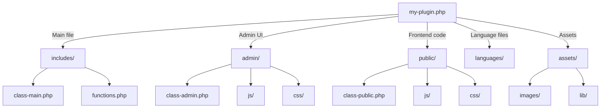

# WordPress Plugin Structure

Understanding the proper structure of a WordPress plugin is crucial before you start developing your own extensions. A well-organized plugin makes development easier, improves maintainability, and follows WordPress best practices. In this tutorial, we'll explore how to structure WordPress plugins properly.

## Introduction to WordPress Plugin Structure

WordPress plugins are essentially collections of PHP files (and sometimes JavaScript, CSS, and other assets) that extend WordPress functionality. While a plugin can be as simple as a single PHP file, more complex plugins follow specific organizational patterns to keep code maintainable and efficient.

At minimum, a WordPress plugin requires:

1. A main plugin file with appropriate header comments
2. Registration with WordPress through hooks and actions

Let's dive into the details of building a well-structured plugin.

## The Main Plugin File

Every WordPress plugin needs a main PHP file with a special header comment that WordPress uses to identify and display your plugin in the admin area.

```php
<?php
/**
 * Plugin Name: My First Plugin
 * Plugin URI: https://example.com/plugins/my-first-plugin
 * Description: This is my first WordPress plugin
 * Version: 1.0.0
 * Author: Your Name
 * Author URI: https://example.com
 * License: GPL v2 or later
 * License URI: https://www.gnu.org/licenses/gpl-2.0.html
 * Text Domain: my-first-plugin
 * Domain Path: /languages
 */

// Prevent direct access to this file
if (!defined('ABSPATH')) {
    exit;
}

// Plugin code starts here
```

The header comment contains metadata about your plugin that WordPress uses to display in the admin plugins list. Only the "Plugin Name" field is required, but it's recommended to include all of the above information.

## Basic Plugin File Structure

For a more organized plugin, consider using this directory structure:

```
my-first-plugin/
├── my-first-plugin.php      # Main plugin file with header
├── includes/                # PHP classes and functions
│   ├── class-main.php
│   └── functions.php
├── admin/                   # Admin-specific code
│   ├── css/
│   ├── js/
│   └── class-admin.php
├── public/                  # Public-facing functionality
│   ├── css/
│   ├── js/
│   └── class-public.php
├── languages/               # Internationalization files
└── README.txt               # Plugin documentation
```

## Plugin Initialization

Your main plugin file should handle basic initialization and include other required files. Here's a simple example of how to structure your main plugin file:

```php
<?php
/**
 * Plugin Name: My First Plugin
 * Description: This is my first WordPress plugin
 * Version: 1.0.0
 * Author: Your Name
 * Text Domain: my-first-plugin
 */

// Prevent direct access to this file
if (!defined('ABSPATH')) {
    exit;
}

// Define plugin constants
define('MFP_VERSION', '1.0.0');
define('MFP_PLUGIN_DIR', plugin_dir_path(__FILE__));
define('MFP_PLUGIN_URL', plugin_dir_url(__FILE__));

// Include required files
require_once MFP_PLUGIN_DIR . 'includes/functions.php';
require_once MFP_PLUGIN_DIR . 'includes/class-main.php';

// Initialize the plugin
function mfp_initialize_plugin() {
    $plugin = new MFP_Main();
    $plugin->init();
}
add_action('plugins_loaded', 'mfp_initialize_plugin');

// Activation hook
register_activation_hook(__FILE__, 'mfp_activate');
function mfp_activate() {
    // Code to run on plugin activation
}

// Deactivation hook
register_deactivation_hook(__FILE__, 'mfp_deactivate');
function mfp_deactivate() {
    // Code to run on plugin deactivation
}
```

## Class-Based Structure

For more complex plugins, using classes helps organize and encapsulate functionality. Here's an example of how your main class might look:

```php
<?php
// includes/class-main.php

class MFP_Main {
    /**
     * Plugin version
     */
    private $version;
    
    /**
     * Initialize the class and set its properties.
     */
    public function __construct() {
        $this->version = MFP_VERSION;
    }
    
    /**
     * Initialize the plugin functionality
     */
    public function init() {
        // Add hooks and actions
        add_action('init', array($this, 'load_textdomain'));
        
        // Initialize admin functionality if in admin area
        if (is_admin()) {
            require_once MFP_PLUGIN_DIR . 'admin/class-admin.php';
            $admin = new MFP_Admin($this->version);
            $admin->init();
        }
        
        // Initialize public-facing functionality
        require_once MFP_PLUGIN_DIR . 'public/class-public.php';
        $public = new MFP_Public($this->version);
        $public->init();
    }
    
    /**
     * Load plugin text domain for translations
     */
    public function load_textdomain() {
        load_plugin_textdomain(
            'my-first-plugin',
            false,
            dirname(plugin_basename(MFP_PLUGIN_DIR)) . '/languages/'
        );
    }
}
```

## Using Namespaces (Modern PHP)

If you're using PHP 5.3 or later (which you should be), consider organizing your plugin with namespaces:

```php
<?php
/**
 * Main plugin class
 * 
 * @package MyFirstPlugin
 */

namespace MyFirstPlugin;

class Plugin {
    /**
     * Plugin instance
     */
    private static $instance = null;
    
    /**
     * Get plugin instance
     */
    public static function get_instance() {
        if (null === self::$instance) {
            self::$instance = new self();
        }
        return self::$instance;
    }
    
    /**
     * Initialize plugin
     */
    public function init() {
        // Plugin initialization code
        add_action('init', [$this, 'load_textdomain']);
    }
    
    /**
     * Load text domain
     */
    public function load_textdomain() {
        load_plugin_textdomain('my-first-plugin', false, dirname(plugin_basename(__FILE__)) . '/languages');
    }
}

// Initialize plugin
add_action('plugins_loaded', function() {
    Plugin::get_instance()->init();
});
```

## Real-World Example: Custom Post Type Plugin

Let's create a simple but practical plugin that registers a custom post type for "Books":

```php
<?php
/**
 * Plugin Name: Book Library
 * Description: Adds a custom post type for books
 * Version: 1.0.0
 * Author: Your Name
 * Text Domain: book-library
 */

// Prevent direct access to this file
if (!defined('ABSPATH')) {
    exit;
}

class Book_Library {
    /**
     * Constructor
     */
    public function __construct() {
        // Register the custom post type
        add_action('init', [$this, 'register_book_post_type']);
        
        // Register custom taxonomy
        add_action('init', [$this, 'register_book_taxonomy']);
        
        // Add meta boxes
        add_action('add_meta_boxes', [$this, 'add_book_meta_boxes']);
        
        // Save meta box data
        add_action('save_post', [$this, 'save_book_meta']);
    }
    
    /**
     * Register the book custom post type
     */
    public function register_book_post_type() {
        $labels = [
            'name'               => __('Books', 'book-library'),
            'singular_name'      => __('Book', 'book-library'),
            'menu_name'          => __('Books', 'book-library'),
            'add_new'            => __('Add New', 'book-library'),
            'add_new_item'       => __('Add New Book', 'book-library'),
            'edit_item'          => __('Edit Book', 'book-library'),
            'new_item'           => __('New Book', 'book-library'),
            'view_item'          => __('View Book', 'book-library'),
            'search_items'       => __('Search Books', 'book-library'),
            'not_found'          => __('No books found', 'book-library'),
            'not_found_in_trash' => __('No books found in trash', 'book-library'),
        ];
        
        $args = [
            'labels'              => $labels,
            'public'              => true,
            'publicly_queryable'  => true,
            'show_ui'             => true,
            'show_in_menu'        => true,
            'query_var'           => true,
            'rewrite'             => ['slug' => 'book'],
            'capability_type'     => 'post',
            'has_archive'         => true,
            'hierarchical'        => false,
            'menu_position'       => null,
            'supports'            => ['title', 'editor', 'author', 'thumbnail', 'excerpt', 'comments'],
            'menu_icon'           => 'dashicons-book',
        ];
        
        register_post_type('book', $args);
    }
    
    /**
     * Register book genre taxonomy
     */
    public function register_book_taxonomy() {
        $labels = [
            'name'              => __('Genres', 'book-library'),
            'singular_name'     => __('Genre', 'book-library'),
            'search_items'      => __('Search Genres', 'book-library'),
            'all_items'         => __('All Genres', 'book-library'),
            'parent_item'       => __('Parent Genre', 'book-library'),
            'parent_item_colon' => __('Parent Genre:', 'book-library'),
            'edit_item'         => __('Edit Genre', 'book-library'),
            'update_item'       => __('Update Genre', 'book-library'),
            'add_new_item'      => __('Add New Genre', 'book-library'),
            'new_item_name'     => __('New Genre Name', 'book-library'),
            'menu_name'         => __('Genre', 'book-library'),
        ];
        
        $args = [
            'hierarchical'      => true,
            'labels'            => $labels,
            'show_ui'           => true,
            'show_admin_column' => true,
            'query_var'         => true,
            'rewrite'           => ['slug' => 'genre'],
        ];
        
        register_taxonomy('genre', ['book'], $args);
    }
    
    /**
     * Add meta boxes for book details
     */
    public function add_book_meta_boxes() {
        add_meta_box(
            'book_details',
            __('Book Details', 'book-library'),
            [$this, 'render_book_details_meta_box'],
            'book',
            'normal',
            'default'
        );
    }
    
    /**
     * Render the book details meta box
     */
    public function render_book_details_meta_box($post) {
        // Add nonce for security
        wp_nonce_field('save_book_meta', 'book_details_nonce');
        
        // Get existing meta values
        $isbn = get_post_meta($post->ID, '_book_isbn', true);
        $price = get_post_meta($post->ID, '_book_price', true);
        $publisher = get_post_meta($post->ID, '_book_publisher', true);
        
        echo '<table class="form-table">';
        
        echo '<tr>';
        echo '<th><label for="book_isbn">' . __('ISBN', 'book-library') . '</label></th>';
        echo '<td><input type="text" id="book_isbn" name="book_isbn" value="' . esc_attr($isbn) . '" class="regular-text"></td>';
        echo '</tr>';
        
        echo '<tr>';
        echo '<th><label for="book_price">' . __('Price', 'book-library') . '</label></th>';
        echo '<td><input type="text" id="book_price" name="book_price" value="' . esc_attr($price) . '" class="regular-text"></td>';
        echo '</tr>';
        
        echo '<tr>';
        echo '<th><label for="book_publisher">' . __('Publisher', 'book-library') . '</label></th>';
        echo '<td><input type="text" id="book_publisher" name="book_publisher" value="' . esc_attr($publisher) . '" class="regular-text"></td>';
        echo '</tr>';
        
        echo '</table>';
    }
    
    /**
     * Save book meta data
     */
    public function save_book_meta($post_id) {
        // Check if we're supposed to be saving
        if (!isset($_POST['book_details_nonce'])) {
            return;
        }
        
        // Verify nonce
        if (!wp_verify_nonce($_POST['book_details_nonce'], 'save_book_meta')) {
            return;
        }
        
        // Check user permissions
        if (!current_user_can('edit_post', $post_id)) {
            return;
        }
        
        // Save the meta data
        if (isset($_POST['book_isbn'])) {
            update_post_meta($post_id, '_book_isbn', sanitize_text_field($_POST['book_isbn']));
        }
        
        if (isset($_POST['book_price'])) {
            update_post_meta($post_id, '_book_price', sanitize_text_field($_POST['book_price']));
        }
        
        if (isset($_POST['book_publisher'])) {
            update_post_meta($post_id, '_book_publisher', sanitize_text_field($_POST['book_publisher']));
        }
    }
}

// Initialize the plugin
new Book_Library();
```

## Plugin File Structure Visual Representation

Let's visualize a typical plugin structure with a diagram:



## Best Practices for Plugin Structure

1. **Use a unique prefix** for all function names, class names, and constants to avoid conflicts with other plugins.

2. **Follow WordPress coding standards** for consistent and readable code.

3. **Keep files focused** - each file should have a single responsibility.

4. **Use proper security measures**:
   - Always validate and sanitize input
   - Use nonces for form submissions
   - Check user capabilities before performing actions

5. **Include a readme.txt file** that follows the WordPress plugin repository format.

6. **Use proper file/folder naming conventions**:
   - Use lowercase letters
   - Use hyphens for folder and file names (e.g., `my-plugin.php`)
   - Use underscores for function and variable names (e.g., `my_plugin_function()`)

7. **Structure classes properly**:
   - One class per file (when possible)
   - Use descriptive class names
   - Consider using namespaces for larger plugins

## Working with Plugin Settings

Many plugins need to store configuration settings. Here's an example of how to create a settings page:

```php
<?php
/**
 * Plugin settings class
 */
class Book_Library_Settings {
    /**
     * Constructor
     */
    public function __construct() {
        // Add admin menu
        add_action('admin_menu', [$this, 'add_admin_menu']);
        
        // Register settings
        add_action('admin_init', [$this, 'register_settings']);
    }
    
    /**
     * Add options page to the admin menu
     */
    public function add_admin_menu() {
        add_options_page(
            __('Book Library Settings', 'book-library'),
            __('Book Library', 'book-library'),
            'manage_options',
            'book-library-settings',
            [$this, 'render_settings_page']
        );
    }
    
    /**
     * Register plugin settings
     */
    public function register_settings() {
        register_setting(
            'book_library_settings',
            'book_library_options'
        );
        
        add_settings_section(
            'book_library_general_section',
            __('General Settings', 'book-library'),
            [$this, 'render_general_section'],
            'book-library-settings'
        );
        
        add_settings_field(
            'display_author',
            __('Display Author', 'book-library'),
            [$this, 'render_display_author_field'],
            'book-library-settings',
            'book_library_general_section'
        );
    }
    
    /**
     * Render general section description
     */
    public function render_general_section() {
        echo '<p>' . __('Configure general plugin settings', 'book-library') . '</p>';
    }
    
    /**
     * Render display author checkbox
     */
    public function render_display_author_field() {
        $options = get_option('book_library_options');
        $value = isset($options['display_author']) ? $options['display_author'] : 0;
        
        echo '<input type="checkbox" name="book_library_options[display_author]" value="1" ' . checked(1, $value, false) . '/>';
        echo '<span class="description">' . __('Display author name on book listings', 'book-library') . '</span>';
    }
    
    /**
     * Render settings page
     */
    public function render_settings_page() {
        ?>
        <div class="wrap">
            <h1><?php echo esc_html(get_admin_page_title()); ?></h1>
            <form method="post" action="options.php">
                <?php
                settings_fields('book_library_settings');
                do_settings_sections('book-library-settings');
                submit_button();
                ?>
            </form>
        </div>
        <?php
    }
}

// Initialize settings
new Book_Library_Settings();
```

## Summary

A well-structured WordPress plugin follows these key principles:

1. **Organization**: Split functionality into logical files and folders
2. **Encapsulation**: Use classes to encapsulate related functionality
3. **Security**: Implement proper security measures
4. **Coding Standards**: Follow WordPress coding standards
5. **Initialization**: Proper initialization and hook registration
6. **Documentation**: Comment your code and provide documentation

By following these principles, you'll create WordPress plugins that are easier to maintain, extend, and share with others.

## Further Learning

To continue improving your WordPress plugin development skills:

1. **Learn WordPress Plugin API**: Study the WordPress Action and Filter hooks to understand how to extend WordPress properly.

2. **Practice with Simple Plugins**: Start by building simple plugins before tackling complex ones.

3. **Examine Well-Written Plugins**: Study popular plugins on GitHub to learn best practices.

4. **Try Different Patterns**: Experiment with different structural patterns like MVC (Model-View-Controller) or DDD (Domain-Driven Design).

## Exercises

1. Create a simple plugin that registers a custom post type with at least three custom meta fields.

2. Extend the Book Library plugin example to add a shortcode that displays a list of books.

3. Create a plugin with a settings page that has at least three different types of form fields (text input, checkbox, select dropdown).

4. Build a plugin that uses AJAX to fetch and display data without refreshing the page.

5. Refactor an existing plugin to use namespaces and autoloading instead of direct includes.

Understanding plugin structure is the foundation for creating well-organized, maintainable WordPress plugins. As you build more complex plugins, a solid structural foundation will make your development process smoother and your code more reliable.