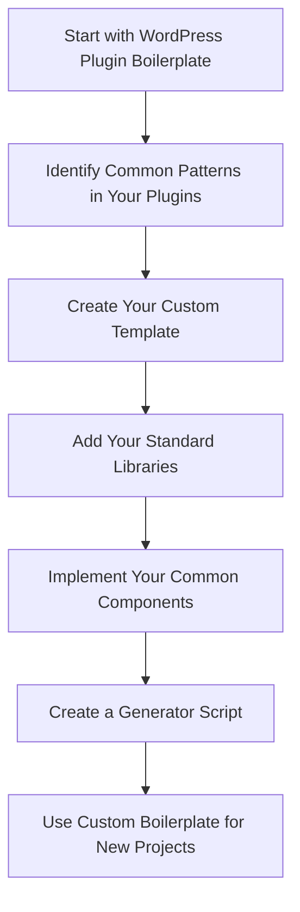

# WordPress Plugin Boilerplate

## Introduction

When starting WordPress plugin development, one of the most challenging aspects is establishing a solid foundation that follows best practices. That's where the WordPress Plugin Boilerplate comes in. It's a standardized, organized, object-oriented foundation for building high-quality WordPress plugins.

The WordPress Plugin Boilerplate was created by Tom McFarlin and is now maintained by the WordPress community. It provides developers with a clear structure that follows WordPress coding standards, making your plugins more maintainable, secure, and professional.

## Why Use the WordPress Plugin Boilerplate?

Before diving into how to use it, let's understand why the WordPress Plugin Boilerplate is valuable:

1. **Standardized Structure**: It provides a consistent file and folder organization.
2. **Object-Oriented Programming (OOP)**: Uses modern PHP practices and OOP principles.
3. **Separation of Concerns**: Clearly separates admin functionality from public-facing code.
4. **WordPress Best Practices**: Follows coding standards and security best practices.
5. **Time-Saving**: Eliminates the need to recreate common plugin infrastructure.

## Getting Started with the WordPress Plugin Boilerplate

### Step 1: Download the Boilerplate

To get started, you'll need to download the WordPress Plugin Boilerplate from GitHub:

```bash
git clone https://github.com/devinvinson/WordPress-Plugin-Boilerplate.git
```

Alternatively, you can download it directly from the [GitHub repository](https://github.com/devinvinson/WordPress-Plugin-Boilerplate).

### Step 2: Setting Up Your Plugin

Once downloaded, follow these steps:

1. Rename the `plugin-name` directory to your desired plugin name (e.g., `my-awesome-plugin`).
2. Open the `plugin-name.php` file in the root directory and rename it to match your plugin (e.g., `my-awesome-plugin.php`).
3. Update the plugin header information in this file to reflect your plugin details.

Here's how the plugin's main file looks before modification:

```php
<?php
/**
 * The plugin bootstrap file
 *
 * @link              http://example.com
 * @since             1.0.0
 * @package           Plugin_Name
 *
 * @wordpress-plugin
 * Plugin Name:       Plugin Name
 * Plugin URI:        http://example.com/plugin-name-uri/
 * Description:       This is a short description of what the plugin does.
 * Version:           1.0.0
 * Author:            Your Name
 * Author URI:        http://example.com/
 * License:           GPL-2.0+
 * License URI:       http://www.gnu.org/licenses/gpl-2.0.txt
 * Text Domain:       plugin-name
 * Domain Path:       /languages
 */

// If this file is called directly, abort.
if ( ! defined( 'WPINC' ) ) {
    die;
}

/**
 * Currently plugin version.
 */
define( 'PLUGIN_NAME_VERSION', '1.0.0' );
```

And here's how it might look after customization:

```php
<?php
/**
 * The plugin bootstrap file
 *
 * @link              https://example.com
 * @since             1.0.0
 * @package           My_Awesome_Plugin
 *
 * @wordpress-plugin
 * Plugin Name:       My Awesome Plugin
 * Plugin URI:        https://example.com/my-awesome-plugin/
 * Description:       This plugin does something amazing.
 * Version:           1.0.0
 * Author:            Your Name
 * Author URI:        https://yourwebsite.com/
 * License:           GPL-2.0+
 * License URI:       http://www.gnu.org/licenses/gpl-2.0.txt
 * Text Domain:       my-awesome-plugin
 * Domain Path:       /languages
 */

// If this file is called directly, abort.
if ( ! defined( 'WPINC' ) ) {
    die;
}

/**
 * Currently plugin version.
 */
define( 'MY_AWESOME_PLUGIN_VERSION', '1.0.0' );
```

### Step 3: Updating Class Names and Namespaces

The boilerplate uses placeholder names throughout the codebase. You'll need to update these to match your plugin name. This involves:

1. Renaming class prefixes from `Plugin_Name` to your plugin name (e.g., `My_Awesome_Plugin`)
2. Changing function prefixes
3. Updating text domains
4. Modifying variable names

To make this process easier, you can use the [WordPress Plugin Boilerplate Generator](https://wppb.me/), which automatically creates a customized version of the boilerplate.

## Understanding the Boilerplate Structure

The WordPress Plugin Boilerplate follows an organized directory structure:

```
plugin-name/
├── admin/                      # Admin-specific functionality
│   ├── class-plugin-name-admin.php
│   ├── css/                    # Admin CSS files
│   ├── js/                     # Admin JavaScript files
│   ├── partials/               # Admin-facing views
├── includes/                   # Core plugin functionality
│   ├── class-plugin-name.php
│   ├── class-plugin-name-activator.php
│   ├── class-plugin-name-deactivator.php
│   ├── class-plugin-name-i18n.php
│   ├── class-plugin-name-loader.php
├── languages/                  # Internationalization files
├── public/                     # Public-facing functionality
│   ├── class-plugin-name-public.php
│   ├── css/                    # Public CSS files
│   ├── js/                     # Public JavaScript files
│   ├── partials/               # Public-facing views
├── index.php                   # Security file
├── plugin-name.php             # Main plugin file
├── uninstall.php               # Cleanup on uninstall
```

Let's examine the key components:

### The Main Plugin File

The main plugin file (originally `plugin-name.php`) is where everything begins. It:

1. Defines plugin metadata
2. Sets up security measures
3. Defines constants
4. Includes the necessary files
5. Registers activation and deactivation hooks
6. Initializes the plugin

### The Includes Directory

The `includes` directory contains the core plugin functionality:

- `class-plugin-name.php`: The main plugin class that coordinates everything
- `class-plugin-name-activator.php`: Handles plugin activation tasks
- `class-plugin-name-deactivator.php`: Handles plugin deactivation tasks
- `class-plugin-name-i18n.php`: Handles internationalization
- `class-plugin-name-loader.php`: Registers all actions and filters

### Admin and Public Directories

These directories separate admin-facing and public-facing functionality:

- `admin/class-plugin-name-admin.php`: Contains admin-specific hooks and functionality
- `public/class-plugin-name-public.php`: Contains public-facing hooks and functionality

## Working with the Boilerplate

Now that we understand the structure, let's see how to add functionality to our plugin.

### Example 1: Adding an Admin Page

Let's create a simple settings page in the WordPress admin area:

1. First, modify the `class-plugin-name-admin.php` file (with your plugin's name substituted):

```php
/**
 * Register the administration menu for this plugin.
 *
 * @since    1.0.0
 */
public function add_plugin_admin_menu() {
    add_menu_page(
        'My Awesome Plugin Settings', 
        'My Awesome Plugin', 
        'manage_options', 
        $this->plugin_name, 
        array($this, 'display_plugin_setup_page'),
        'dashicons-admin-generic',
        90
    );
}

/**
 * Render the settings page for this plugin.
 *
 * @since    1.0.0
 */
public function display_plugin_setup_page() {
    include_once( 'partials/my-awesome-plugin-admin-display.php' );
}
```

2. Then, create the admin view in `admin/partials/my-awesome-plugin-admin-display.php`:

```php
<div class="wrap">
    <h2><?php echo esc_html( get_admin_page_title() ); ?></h2>
    <form method="post" name="my_awesome_plugin_options" action="options.php">
        <?php
        // Output security fields
        settings_fields( 'my_awesome_plugin_options' );
        
        // Output setting sections
        do_settings_sections( 'my_awesome_plugin_options' );
        
        // Submit button
        submit_button();
        ?>
    </form>
</div>
```

3. Finally, register the menu in the admin class constructor:

```php
public function __construct( $plugin_name, $version ) {
    $this->plugin_name = $plugin_name;
    $this->version = $version;
    
    // Add the menu item
    add_action( 'admin_menu', array( $this, 'add_plugin_admin_menu' ) );
}
```

### Example 2: Adding a Shortcode

Let's add a simple shortcode to display content on the front end:

1. Modify the `class-plugin-name-public.php` file:

```php
/**
 * Register all the shortcodes for the plugin
 *
 * @since    1.0.0
 */
public function register_shortcodes() {
    add_shortcode( 'my_awesome_feature', array( $this, 'my_awesome_shortcode' ) );
}

/**
 * Callback function for the shortcode
 *
 * @since    1.0.0
 * @param    array    $atts    Shortcode attributes
 * @return   string   Shortcode output
 */
public function my_awesome_shortcode( $atts ) {
    // Parse attributes
    $atts = shortcode_atts(
        array(
            'title' => 'Default Title',
            'color' => 'blue',
        ),
        $atts,
        'my_awesome_feature'
    );
    
    // Start output buffering
    ob_start();
    
    // Include the partial for this shortcode
    include_once plugin_dir_path( dirname( __FILE__ ) ) . 'public/partials/my-awesome-plugin-shortcode-display.php';
    
    // Return the buffered content
    return ob_get_clean();
}
```

2. Create the public view in `public/partials/my-awesome-plugin-shortcode-display.php`:

```php
<div class="my-awesome-plugin-feature">
    <h3 style="color: <?php echo esc_attr( $atts['color'] ); ?>">
        <?php echo esc_html( $atts['title'] ); ?>
    </h3>
    <p>This is content from my awesome plugin!</p>
</div>
```

3. Register the shortcode in the public class constructor:

```php
public function __construct( $plugin_name, $version ) {
    $this->plugin_name = $plugin_name;
    $this->version = $version;
    
    // Register shortcodes
    $this->register_shortcodes();
}
```

Now users can include the shortcode `[my_awesome_feature title="Custom Title" color="red"]` in their posts or pages.

## The Plugin Loader: Understanding the Action/Filter System

The boilerplate's `class-plugin-name-loader.php` is a key component that implements WordPress's action and filter hooks system in an object-oriented way. Here's how it works:

```php
// In your admin or public class:
$this->loader->add_action( 'admin_menu', $this, 'add_plugin_admin_menu' );
$this->loader->add_filter( 'the_content', $this, 'filter_the_content' );
```

This approach centralizes all hooks, making it easier to manage them. The loader stores these hooks and executes them when `run()` is called from the main plugin class.

## Best Practices When Working with the Boilerplate

1. **Maintain the Structure**: Keep the separation between admin and public functionality.

2. **Use the Loader**: Register all hooks through the loader class.

3. **Prefix Everything**: Use your plugin's unique prefix for functions, classes, and variables to avoid conflicts.

4. **Sanitize and Validate**: Always sanitize inputs and validate data.

```php
// Example of proper data sanitization
$user_input = sanitize_text_field( $_POST['user_input'] ?? '' );

// Example of data validation
if ( ! is_email( $email ) ) {
    // Handle invalid email
}
```

5. **Organize Your Code**: Create additional classes as needed for specific functionality.

6. **Follow WordPress Coding Standards**: Maintain the code style used in the boilerplate.

## Creating a Custom WordPress Plugin Boilerplate

As you become more experienced, you might want to customize the boilerplate to better fit your needs. Here's a workflow diagram showing how you might approach this:



## Summary

The WordPress Plugin Boilerplate provides an excellent foundation for creating well-structured, maintainable WordPress plugins. By following its organization and best practices, you can:

- Create plugins that are easier to maintain and extend
- Follow WordPress coding standards and best practices
- Separate admin and public functionality
- Implement proper security measures
- Save time by not reinventing common structures

Remember that the boilerplate is a starting point. As you build your plugin, you'll need to adapt the structure to fit your specific needs while maintaining the clean organization and good practices it promotes.

## Additional Resources

To continue learning about WordPress plugin development with the boilerplate:

- [WordPress Plugin Boilerplate GitHub Repository](https://github.com/devinvinson/WordPress-Plugin-Boilerplate)
- [WordPress Plugin Handbook](https://developer.wordpress.org/plugins/)
- [WordPress Coding Standards](https://developer.wordpress.org/coding-standards/wordpress-coding-standards/)
- [WordPress Plugin Generator based on the Boilerplate](https://wppb.me/)

## Exercises

1. **Basic**: Download the WordPress Plugin Boilerplate and customize it with your own plugin name and information.

2. **Intermediate**: Add a settings page to your plugin that saves and retrieves options from the WordPress database.

3. **Advanced**: Create a custom post type and associated meta boxes using the boilerplate structure.

4. **Expert**: Extend the boilerplate to include an API class that interacts with the WordPress REST API.

By following this guide and practicing with the exercises, you'll be well on your way to creating professional WordPress plugins using the WordPress Plugin Boilerplate.