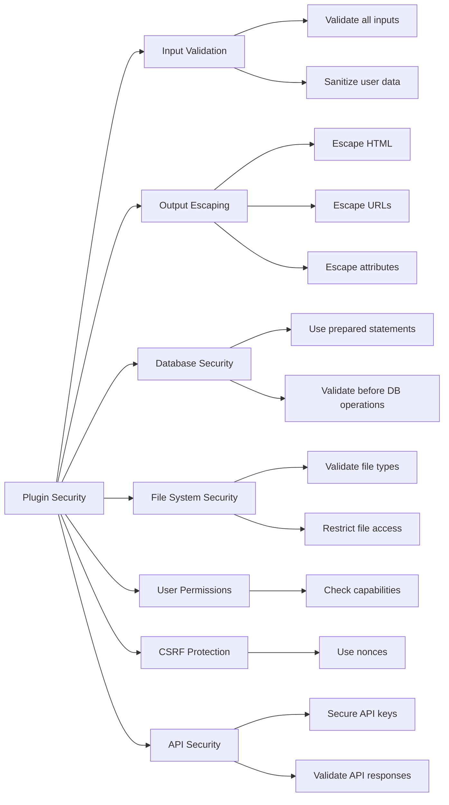

# WordPress Plugin Security

## Introduction

Security is one of the most critical aspects of WordPress plugin development. A vulnerable plugin can compromise not only the website where it's installed but potentially thousands or millions of sites using your code. As plugin developers, we have a responsibility to follow security best practices and protect our users.

In this guide, we'll explore the essential security principles and techniques for WordPress plugin development. Whether you're building your first plugin or improving an existing one, these practices will help you create more secure, robust code.

## Why Plugin Security Matters

WordPress powers over 40% of all websites on the internet. This popularity makes it an attractive target for hackers and malicious actors. Plugins extend WordPress functionality, but each plugin also represents a potential entry point for attacks.

Common consequences of security breaches include:

- Unauthorized data access
- Site defacement 
- Malware injection
- SEO spam
- Server compromise
- Data theft

## Security Principles for WordPress Plugins

### 1. Data Validation and Sanitization

One of the most common security vulnerabilities in WordPress plugins is improper handling of user input. Any data that comes from users or external sources must be validated and sanitized.

#### Validation vs. Sanitization

- **Validation**: Checking if data meets expected criteria (is it the right type, format, etc.)
- **Sanitization**: Cleaning data to make it safe for use (removing or escaping potentially harmful content)

#### Example: Form Input Handling

```php
// BAD: Directly using user input
function my_plugin_process_form() {
    $user_input = $_POST['user_message'];
    update_option('my_plugin_message', $user_input);
}

// GOOD: Validating and sanitizing user input
function my_plugin_process_form() {
    // Check if the field exists
    if (!isset($_POST['user_message'])) {
        return;
    }
    
    // Sanitize the input
    $user_input = sanitize_text_field($_POST['user_message']);
    
    // Update the option with clean data
    update_option('my_plugin_message', $user_input);
}
```

### Key WordPress Sanitization Functions

WordPress provides several built-in functions for sanitizing different types of data:

| Function | Purpose |
|----------|---------|
| `sanitize_text_field()` | Sanitizes a text field |
| `sanitize_email()` | Validates and sanitizes an email address |
| `sanitize_title()` | Sanitizes a string for use as a title |
| `sanitize_key()` | Sanitizes a string key |
| `absint()` | Converts to a non-negative integer |
| `wp_kses()` | Filters HTML, allowing only specified tags |

### 2. Using Nonces for Form Protection

Nonces (Numbers Used Once) are security tokens that WordPress uses to verify that a request comes from an authorized source. They help prevent Cross-Site Request Forgery (CSRF) attacks.

#### Example: Adding a Nonce to a Form

```php
// Creating a form with a nonce
function my_plugin_settings_form() {
    ?>
    <form method="post" action="options.php">
        <?php settings_fields('my_plugin_options'); ?>
        <?php wp_nonce_field('my_plugin_action', 'my_plugin_nonce'); ?>
        
        <input type="text" name="my_plugin_option" value="<?php echo esc_attr(get_option('my_plugin_option')); ?>" />
        <?php submit_button(); ?>
    </form>
    <?php
}

// Verifying the nonce when processing the form
function my_plugin_process_form() {
    // Verify the nonce first
    if (!isset($_POST['my_plugin_nonce']) || 
        !wp_verify_nonce($_POST['my_plugin_nonce'], 'my_plugin_action')) {
        wp_die('Security check failed');
    }
    
    // Process form data (with proper sanitization)
    if (isset($_POST['my_plugin_option'])) {
        update_option('my_plugin_option', sanitize_text_field($_POST['my_plugin_option']));
    }
}
```

### 3. Database Security

Protecting database operations is essential for plugin security.

#### Use Prepared Statements

Always use WordPress's built-in functions or prepared statements when interacting with the database to prevent SQL injection attacks.

```php
// BAD: Direct SQL query with user input
$user_id = $_GET['user_id'];
$results = $wpdb->query("SELECT * FROM $wpdb->users WHERE ID = $user_id");

// GOOD: Using prepared statements
$user_id = isset($_GET['user_id']) ? absint($_GET['user_id']) : 0;
$results = $wpdb->get_results(
    $wpdb->prepare("SELECT * FROM $wpdb->users WHERE ID = %d", $user_id)
);
```

### 4. File System Security

If your plugin interacts with the file system, you must implement security measures to prevent unauthorized access or file uploads.

```php
// File extension validation
function my_plugin_validate_file_extension($file) {
    $allowed_extensions = ['jpg', 'jpeg', 'png', 'gif'];
    $file_extension = strtolower(pathinfo($file['name'], PATHINFO_EXTENSION));
    
    if (!in_array($file_extension, $allowed_extensions)) {
        return new WP_Error('invalid_file', 'Invalid file extension');
    }
    
    return true;
}

// Handling file uploads
function my_plugin_handle_upload() {
    // Verify nonce first
    if (!isset($_POST['my_plugin_upload_nonce']) || 
        !wp_verify_nonce($_POST['my_plugin_upload_nonce'], 'my_plugin_upload')) {
        wp_die('Security check failed');
    }
    
    // Check file
    if (!isset($_FILES['my_file'])) {
        return;
    }
    
    // Validate file extension
    $validation_result = my_plugin_validate_file_extension($_FILES['my_file']);
    if (is_wp_error($validation_result)) {
        wp_die($validation_result->get_error_message());
    }
    
    // Use WordPress built-in upload handling
    require_once(ABSPATH . 'wp-admin/includes/file.php');
    $upload = wp_handle_upload($_FILES['my_file'], ['test_form' => false]);
    
    if (isset($upload['error'])) {
        wp_die($upload['error']);
    }
    
    // File uploaded successfully, $upload['url'] contains the URL
}
```

### 5. Capability Checks and User Permissions

Always check user capabilities before allowing access to administrative features or sensitive operations.

```php
// Example: Checking user capabilities
function my_plugin_admin_page() {
    // Check if user has sufficient permissions
    if (!current_user_can('manage_options')) {
        wp_die(__('You do not have sufficient permissions to access this page.'));
    }
    
    // Continue with admin page rendering...
}

// When registering admin menu
add_action('admin_menu', 'my_plugin_add_admin_menu');
function my_plugin_add_admin_menu() {
    add_options_page(
        'My Plugin Settings',
        'My Plugin',
        'manage_options',  // Required capability
        'my-plugin',
        'my_plugin_admin_page'
    );
}
```

### 6. Secure API Usage

If your plugin interacts with external APIs, ensure you handle this communication securely.

```php
// Making a secure API request
function my_plugin_api_request() {
    $api_key = get_option('my_plugin_api_key');
    $url = 'https://api.example.com/data';
    
    $response = wp_remote_get($url, [
        'headers' => [
            'Authorization' => 'Bearer ' . $api_key,
            'Content-Type' => 'application/json'
        ],
        'timeout' => 30,
        'sslverify' => true  // Always verify SSL certificates
    ]);
    
    if (is_wp_error($response)) {
        return $response;
    }
    
    $body = wp_remote_retrieve_body($response);
    $data = json_decode($body);
    
    // Validate response data before using it
    if (!isset($data->status) || $data->status !== 'success') {
        return new WP_Error('api_error', 'Invalid API response');
    }
    
    return $data;
}
```

### 7. Escaping Output

Always escape data before output to prevent Cross-Site Scripting (XSS) attacks.

```php
// BAD: Outputting unescaped data
function my_plugin_display_message() {
    $message = get_option('my_plugin_message');
    echo '<div class="message">' . $message . '</div>';
}

// GOOD: Escaping output
function my_plugin_display_message() {
    $message = get_option('my_plugin_message');
    echo '<div class="message">' . esc_html($message) . '</div>';
}
```

#### Key WordPress Escaping Functions

| Function | Purpose |
|----------|---------|
| `esc_html()` | Escapes HTML in content |
| `esc_url()` | Escapes a URL for safe output |
| `esc_attr()` | Escapes HTML attributes |
| `esc_js()` | Escapes strings for use in JavaScript |
| `esc_textarea()` | Escapes text for use in a textarea |
| `wp_kses_post()` | Allows specific HTML tags safe for post content |

## Real-World Example: Contact Form Plugin

Let's see how these security principles apply to a simple contact form plugin:

```php
<?php
/**
 * Plugin Name: Secure Contact Form
 * Description: A simple contact form with security best practices
 * Version: 1.0.0
 */

// Register shortcode
add_shortcode('secure_contact_form', 'secure_contact_form_shortcode');

// The shortcode function
function secure_contact_form_shortcode() {
    // Check if the form was submitted
    if (isset($_POST['secure_contact_submit'])) {
        return handle_contact_form_submission();
    }
    
    // Display the form
    return render_contact_form();
}

// Handle form submission
function handle_contact_form_submission() {
    // 1. Verify nonce for security
    if (!isset($_POST['secure_contact_nonce']) || 
        !wp_verify_nonce($_POST['secure_contact_nonce'], 'secure_contact_form_submit')) {
        return '<p class="error">Security verification failed. Please try again.</p>';
    }
    
    // 2. Initialize errors array
    $errors = [];
    
    // 3. Validate and sanitize name
    $name = isset($_POST['secure_contact_name']) ? sanitize_text_field($_POST['secure_contact_name']) : '';
    if (empty($name)) {
        $errors[] = 'Name is required.';
    }
    
    // 4. Validate and sanitize email
    $email = isset($_POST['secure_contact_email']) ? sanitize_email($_POST['secure_contact_email']) : '';
    if (empty($email) || !is_email($email)) {
        $errors[] = 'Valid email is required.';
    }
    
    // 5. Validate and sanitize message
    $message = isset($_POST['secure_contact_message']) ? sanitize_textarea_field($_POST['secure_contact_message']) : '';
    if (empty($message)) {
        $errors[] = 'Message is required.';
    }
    
    // 6. If there are errors, return them
    if (!empty($errors)) {
        $error_html = '<ul class="form-errors">';
        foreach ($errors as $error) {
            $error_html .= '<li>' . esc_html($error) . '</li>';
        }
        $error_html .= '</ul>';
        
        return $error_html . render_contact_form();
    }
    
    // 7. Process the form data (e.g., send email)
    $to = get_option('admin_email');
    $subject = 'Contact Form Submission from ' . esc_html($name);
    $body = "Name: " . esc_html($name) . "\n";
    $body .= "Email: " . esc_html($email) . "\n\n";
    $body .= "Message:\n" . esc_html($message);
    $headers = ['From: ' . esc_html($name) . ' <' . esc_html($email) . '>'];
    
    $sent = wp_mail($to, $subject, $body, $headers);
    
    // 8. Return success or error message
    if ($sent) {
        return '<div class="form-success">Thank you for your message!</div>';
    } else {
        return '<div class="form-error">There was a problem sending your message. Please try again later.</div>';
    }
}

// Render the contact form
function render_contact_form() {
    // Generate a nonce
    $nonce = wp_create_nonce('secure_contact_form_submit');
    
    // Build the form HTML
    $form = '
    <form id="secure-contact-form" method="post">
        <p>
            <label for="secure_contact_name">Name:</label>
            <input type="text" name="secure_contact_name" id="secure_contact_name" value="' . 
            (isset($_POST['secure_contact_name']) ? esc_attr(sanitize_text_field($_POST['secure_contact_name'])) : '') . '" required />
        </p>
        
        <p>
            <label for="secure_contact_email">Email:</label>
            <input type="email" name="secure_contact_email" id="secure_contact_email" value="' . 
            (isset($_POST['secure_contact_email']) ? esc_attr(sanitize_email($_POST['secure_contact_email'])) : '') . '" required />
        </p>
        
        <p>
            <label for="secure_contact_message">Message:</label>
            <textarea name="secure_contact_message" id="secure_contact_message" required>' . 
            (isset($_POST['secure_contact_message']) ? esc_textarea(sanitize_textarea_field($_POST['secure_contact_message'])) : '') . '</textarea>
        </p>
        
        <input type="hidden" name="secure_contact_nonce" value="' . $nonce . '" />
        <p>
            <button type="submit" name="secure_contact_submit">Send Message</button>
        </p>
    </form>
    ';
    
    return $form;
}
```

## Security Checklist for Plugin Development

Use this checklist when developing WordPress plugins:



### Security Checks:

1. ✅ Validate all user input
2. ✅ Sanitize data before storing in the database
3. ✅ Escape all output
4. ✅ Use prepared statements for database queries
5. ✅ Implement nonces for forms
6. ✅ Check user capabilities before operations
7. ✅ Validate file uploads
8. ✅ Use WordPress core functions when possible
9. ✅ Keep API keys and sensitive data secure
10. ✅ Handle errors gracefully, without revealing sensitive info

## Common Security Vulnerabilities

### 1. Cross-Site Scripting (XSS)
XSS attacks involve injecting malicious client-side scripts into web pages viewed by other users. 

**Prevention**: Always escape output using appropriate WordPress escaping functions.

### 2. SQL Injection
Attackers insert malicious SQL code through user inputs that can manipulate your database.

**Prevention**: Use prepared statements and WordPress database functions.

### 3. Cross-Site Request Forgery (CSRF)
CSRF tricks users into performing actions they didn't intend to perform.

**Prevention**: Implement nonces for all forms and state-changing actions.

### 4. File Inclusion Vulnerabilities
Allows attackers to include files from the server or external sources.

**Prevention**: Validate and sanitize all file paths and never use user input directly in file operations.

### 5. Authentication Bypass
Attackers find ways to bypass authentication mechanisms.

**Prevention**: Always check user capabilities and authenticate properly.

## Summary

Security is a vital aspect of WordPress plugin development. By incorporating validation, sanitization, nonces, capability checks, and other security measures, you can protect your users from common vulnerabilities and attacks.

Remember these key principles:
- Validate and sanitize all input
- Escape all output
- Use prepared statements for database queries
- Implement nonces for form protection
- Check user capabilities before performing actions
- Handle files securely
- Keep sensitive data protected
- Stay updated on security best practices

## Additional Resources

1. [WordPress Plugin Security](https://developer.wordpress.org/plugins/security/)
2. [WordPress Coding Standards](https://developer.wordpress.org/coding-standards/wordpress-coding-standards/)
3. [OWASP Top Ten](https://owasp.org/www-project-top-ten/) - Common security vulnerabilities
4. [WordPress Plugin Data Validation](https://developer.wordpress.org/plugins/security/data-validation/)
5. [WordPress Plugin Securing Input](https://developer.wordpress.org/plugins/security/securing-input/)
6. [WordPress Plugin Securing Output](https://developer.wordpress.org/plugins/security/securing-output/)

## Practice Exercises

1. **Security Review**: Review one of your existing plugins (or any open-source plugin) for security vulnerabilities using the checklist from this guide.

2. **Secure Form Implementation**: Create a simple form that collects user data, implementing all the security measures discussed in this guide.

3. **Security Hardening**: Take an intentionally vulnerable plugin example and fix its security issues.

4. **Nonce Implementation**: Practice adding nonce verification to AJAX requests in a WordPress plugin.

5. **Database Security**: Create a plugin that interacts with the database using prepared statements and proper sanitization.

Remember, security is not a one-time task but an ongoing process. Stay informed about new vulnerabilities and security best practices to keep your plugins secure.