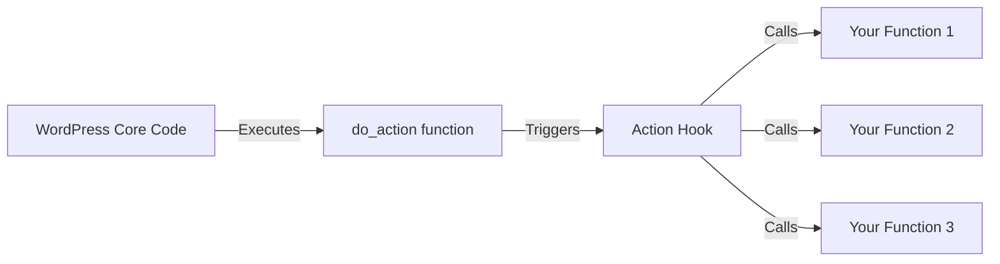
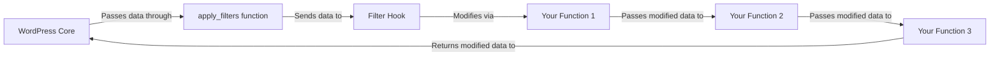

# WordPress Hooks

## Introduction

WordPress hooks are one of the most powerful features of the WordPress architecture. They provide a way for plugin developers to "hook into" the WordPress core, themes, or other plugins to modify or extend functionality without editing the original code files. This approach is crucial for maintaining the security, stability, and upgradeability of WordPress installations.

There are two types of hooks in WordPress:

1. **Action Hooks**: Allow you to add custom functionality at specific points in WordPress execution.
2. **Filter Hooks**: Allow you to modify data during WordPress execution.

Understanding hooks is essential for WordPress plugin development as they form the foundation of WordPress's extensibility model.

## Action Hooks

### What are Action Hooks?

Action hooks allow you to execute custom code at specific points during WordPress's execution process. Think of them as events that occur during WordPress's operation that you can react to.

### How Action Hooks Work



### Using Action Hooks

#### Adding an Action

To use an action hook, you need to:
1. Create a function that contains the code you want to execute
2. Hook that function to a specific action using `add_action()`

Here's the basic syntax:

```php
add_action('hook_name', 'your_function_name', priority, accepted_args);
```

Where:
- `'hook_name'` is the name of the hook
- `'your_function_name'` is your callback function
- `priority` (optional) determines the order in which the function is executed (default is 10)
- `accepted_args` (optional) is the number of arguments your function accepts (default is 1)

#### Example: Adding Content to Footer

Let's create a simple plugin that adds a copyright message to the footer:

```php
function add_copyright_message() {
    echo '<div class="copyright">Copyright © ' . date('Y') . ' My WordPress Site</div>';
}
add_action('wp_footer', 'add_copyright_message');
```

When WordPress runs and reaches the `wp_footer` action hook, it will execute our `add_copyright_message()` function, adding our copyright text to the footer of every page.

#### Removing an Action

You can also remove actions that have been added:

```php
remove_action('hook_name', 'function_name', priority);
```

## Filter Hooks

### What are Filter Hooks?

Filter hooks allow you to modify data during WordPress execution. Unlike action hooks which simply perform tasks, filter hooks are designed to process and return data.

### How Filter Hooks Work



### Using Filter Hooks

#### Adding a Filter

The syntax for adding a filter is similar to actions:

```php
add_filter('hook_name', 'your_function_name', priority, accepted_args);
```

The key difference is that your filter function must return a value—it should process the input and return a modified version.

#### Example: Modifying the Post Title

Let's create a filter that adds an emoji to every post title:

```php
function add_emoji_to_title($title) {
    if (!is_admin() && in_the_loop() && is_single()) {
        return "🔥 " . $title;
    }
    return $title;
}
add_filter('the_title', 'add_emoji_to_title');
```

**Input**: A post with the title "WordPress Hooks Tutorial"
**Output**: "🔥 WordPress Hooks Tutorial"

#### Removing a Filter

Just like actions, you can remove filters:

```php
remove_filter('hook_name', 'function_name', priority);
```

## Creating Your Own Hooks

As your plugins become more complex, you might want to provide hooks for other developers to extend your plugin's functionality.

### Creating an Action Hook

Here's how to create an action hook in your plugin:

```php
function my_plugin_process_data($data) {
    // Process the data
    $processed_data = process_function($data);
    
    // Create an action hook for other developers
    do_action('my_plugin_after_processing', $processed_data);
    
    return $processed_data;
}
```

### Creating a Filter Hook

To create a filter hook:

```php
function my_plugin_generate_content() {
    $content = "Default content";
    
    // Allow other plugins to modify the content
    $content = apply_filters('my_plugin_content', $content);
    
    return $content;
}
```

## Practical Examples

### Example 1: Custom Login Page Styling

```php
// Add custom CSS to the login page
function custom_login_style() {
    ?>
    <style type="text/css">
        body.login {
            background-color: #f5f5f5;
        }
        .login h1 a {
            background-image: url('path/to/your/logo.png');
            background-size: contain;
            width: 320px;
            height: 120px;
        }
        .login form {
            border-radius: 8px;
            box-shadow: 0 4px 10px rgba(0,0,0,0.1);
        }
    </style>
    <?php
}
add_action('login_enqueue_scripts', 'custom_login_style');

// Change the login logo URL
function custom_login_logo_url() {
    return home_url();
}
add_filter('login_headerurl', 'custom_login_logo_url');

// Change the login logo title
function custom_login_logo_url_title() {
    return get_bloginfo('name');
}
add_filter('login_headertext', 'custom_login_logo_url_title');
```

### Example 2: Content Security Plugin

This example shows how to filter post content to remove potentially malicious HTML:

```php
function security_filter_content($content) {
    // Remove script tags
    $content = preg_replace('/<script\b[^>]*>(.*?)<\/script>/is', '', $content);
    
    // Remove onclick and other event handlers
    $content = preg_replace('/(<[^>]+)on\w+=[\'"].*?[\'"]([^>]*>)/i', '$1$2', $content);
    
    // Log attempts to include scripts
    if (strpos($original_content, '<script') !== false) {
        error_log('Attempted script injection detected in post ID: ' . get_the_ID());
    }
    
    return $content;
}
add_filter('the_content', 'security_filter_content');
```

### Example 3: Custom Post Type Registration with Hooks

```php
function register_book_post_type() {
    $labels = array(
        'name' => 'Books',
        'singular_name' => 'Book',
        // More labels...
    );
    
    // Allow other plugins to modify the labels
    $labels = apply_filters('book_cpt_labels', $labels);
    
    $args = array(
        'labels' => $labels,
        'public' => true,
        'has_archive' => true,
        'supports' => array('title', 'editor', 'thumbnail'),
        'rewrite' => array('slug' => 'books'),
    );
    
    // Allow other plugins to modify the arguments
    $args = apply_filters('book_cpt_args', $args);
    
    register_post_type('book', $args);
    
    // Action hook after registration
    do_action('after_book_cpt_registered');
}
add_action('init', 'register_book_post_type');
```

## Common WordPress Hooks

Here are some of the most frequently used WordPress hooks:

### Common Action Hooks

- `wp_enqueue_scripts`: Used to enqueue styles and scripts
- `init`: Runs after WordPress has finished loading but before any headers are sent
- `admin_init`: Similar to `init` but only runs on admin pages
- `admin_menu`: Used to add pages to the admin menu
- `wp_head`: Runs in the `<head>` section of the front-end
- `wp_footer`: Runs at the bottom of the page before the closing `</body>` tag
- `save_post`: Runs when a post is saved
- `publish_post`: Runs when a post is published
- `wp_login`: Runs after a user has logged in

### Common Filter Hooks

- `the_content`: Filters the post content
- `the_title`: Filters the post title
- `the_excerpt`: Filters the post excerpt
- `wp_title`: Filters the page title
- `wp_nav_menu_items`: Filters navigation menu items
- `comment_text`: Filters comment text
- `login_redirect`: Filters the URL to redirect to after login

## Best Practices

1. **Use Proper Priorities**: Use the priority parameter to ensure your functions run in the correct order.

2. **Remove Before Adding**: If you're replacing a function that's hooked, remove it first:

```php
// Remove the default function
remove_action('save_post', 'default_save_function');

// Add your custom function
add_action('save_post', 'my_custom_save_function');
```

3. **Check Function Existence**: Before hooking functions, make sure they exist:

```php
if (function_exists('my_function')) {
    add_action('hook_name', 'my_function');
}
```

4. **Use Descriptive Function Names**: Name your functions descriptively, often including the plugin name as a prefix:

```php
function my_plugin_modify_content($content) {
    // Function code
    return $content;
}
```

5. **Document Your Hooks**: If creating hooks for others, document them thoroughly.

## Debugging Hooks

When developing plugins, it's often useful to see which hooks are firing and in what order. This simple debugging function can help:

```php
function debug_hooks($hook_name) {
    echo "<pre>Hook fired: $hook_name</pre>";
}

// Add to all hooks (use only for debugging!)
function add_hook_debug() {
    global $wp_filter;
    foreach ($wp_filter as $tag => $hook) {
        add_action($tag, function() use ($tag) { 
            debug_hooks($tag); 
        });
    }
}
add_action('after_setup_theme', 'add_hook_debug');
```

**Warning**: Only use the above code for debugging, and never in a production environment!

## Summary

WordPress hooks are a powerful system that allows developers to extend and modify WordPress functionality without changing core files. The two types of hooks—actions and filters—serve different but complementary purposes:

- **Action hooks** allow you to add custom functionality at specific points in WordPress execution
- **Filter hooks** allow you to modify data as it's being processed

By mastering WordPress hooks, you can create plugins that seamlessly integrate with WordPress and other plugins while maintaining clean, maintainable code.

## Additional Resources

- [WordPress Developer Documentation: Actions](https://developer.wordpress.org/plugins/hooks/actions/)
- [WordPress Developer Documentation: Filters](https://developer.wordpress.org/plugins/hooks/filters/)
- [WordPress Plugin Handbook](https://developer.wordpress.org/plugins/)

## Exercises

1. **Basic Action Hook**: Create a plugin that displays a "Thanks for visiting!" message at the bottom of every page using the `wp_footer` action hook.

2. **Custom Filter**: Write a filter that automatically adds the reading time to the beginning of each post's content.

3. **Hook Combination**: Create a plugin that uses both action and filter hooks to add a custom widget area to the footer and modify how widgets are displayed in that area.

4. **Custom Hooks**: Create a simple plugin with your own custom action and filter hooks, then write a second plugin that extends the first one using those hooks.