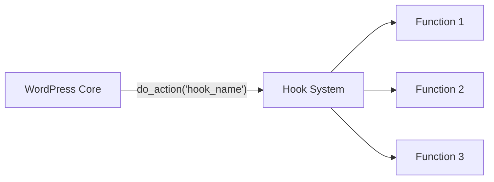

# WordPress Actions

## Introduction

WordPress actions are a fundamental part of the WordPress hook system, providing a way for your code to "hook into" specific points in WordPress's execution flow. Actions allow you to add custom functionality at predetermined moments without modifying WordPress core files.

Think of actions as events that occur during WordPress processing—when a post is published, a user logs in, or a page loads. Your plugin can listen for these events and execute custom code when they happen.

In this tutorial, we'll explore:
- What WordPress actions are and why they're essential
- How to use existing WordPress actions
- How to create your own custom actions
- Real-world applications and practical examples

## Understanding WordPress Actions

Actions are a type of hook in WordPress that allow you to add or modify functionality at specific points in the WordPress execution cycle. They work on a publisher-subscriber pattern (also known as the observer pattern).



When WordPress reaches a certain point in its execution, it may call `do_action('some_action')`, and any functions that have been "hooked" to that action using `add_action()` will be executed.

### The Anatomy of WordPress Actions

WordPress actions consist of two main parts:

1. **Action Hooks** - Points in the WordPress code where `do_action()` is called
2. **Callback Functions** - Your custom functions that run when an action is triggered

Here's the basic syntax for hooking a function to an action:

```php
add_action('action_name', 'your_callback_function', priority, accepted_args);
```

Where:
- `action_name` is the name of the action hook
- `your_callback_function` is the function to execute
- `priority` (optional) determines the order of execution (default: 10)
- `accepted_args` (optional) specifies how many arguments your function accepts (default: 1)

## Using Existing WordPress Actions

WordPress has hundreds of built-in action hooks you can use. Let's start with some common ones:

### Example 1: Adding Content After Post Content

This example adds a "Thank you for reading" message after each post content:

```php
function add_thank_you_message($content) {
    if (is_single() && !is_admin()) {
        $content .= '<div class="thank-you-message">Thank you for reading this post!</div>';
    }
    return $content;
}
add_filter('the_content', 'add_thank_you_message');
```

### Example 2: Executing Code During Plugin Activation

This example creates a custom database table when your plugin is activated:

```php
function my_plugin_create_db_table() {
    global $wpdb;
    $table_name = $wpdb->prefix . 'my_custom_table';
    
    $charset_collate = $wpdb->get_charset_collate();
    
    $sql = "CREATE TABLE $table_name (
        id mediumint(9) NOT NULL AUTO_INCREMENT,
        time datetime DEFAULT '0000-00-00 00:00:00' NOT NULL,
        name tinytext NOT NULL,
        text text NOT NULL,
        PRIMARY KEY  (id)
    ) $charset_collate;";
    
    require_once(ABSPATH . 'wp-admin/includes/upgrade.php');
    dbDelta($sql);
}
register_activation_hook(__FILE__, 'my_plugin_create_db_table');
```

### Example 3: Adding a Custom Footer to Admin Pages

```php
function add_custom_admin_footer() {
    echo '<p>Thank you for creating with <a href="https://wordpress.org/">WordPress</a> | Running My Awesome Plugin v1.0</p>';
}
add_action('admin_footer_text', 'add_custom_admin_footer');
```

## Common WordPress Action Hooks

Here are some frequently used WordPress action hooks:

| Action Hook | Description | When It Fires |
|------------|-------------|--------------|
| `init` | Initialization | After WordPress is fully loaded |
| `wp_enqueue_scripts` | Enqueue styles/scripts | When enqueueing scripts for frontend |
| `admin_enqueue_scripts` | Admin scripts | When enqueueing scripts for admin |
| `wp_head` | Page head | Before closing `</head>` tag |
| `wp_footer` | Page footer | Before closing `</body>` tag |
| `admin_menu` | Admin menus | When admin menu is being built |
| `save_post` | Save post | When a post is saved |
| `publish_post` | Publish post | When a post is published |
| `wp_login` | User login | After a user logs in |

## Creating Your Own Custom Actions

One of the powerful features of WordPress is the ability to create your own actions for other plugins to hook into. This helps make your plugin extensible.

### Step 1: Define Your Action Hook

Use the `do_action()` function to create an action hook:

```php
function my_plugin_process_data($data) {
    // Process data
    $processed_data = process_my_data($data);
    
    // Allow other plugins to hook into this point
    do_action('my_plugin_data_processed', $processed_data);
    
    return $processed_data;
}
```

### Step 2: Document Your Action Hook

It's important to document your custom actions for other developers:

```php
/**
 * Fires after data has been processed by My Plugin.
 *
 * @since 1.0.0
 * @param array $processed_data The processed data array.
 */
do_action('my_plugin_data_processed', $processed_data);
```

### Step 3: Using Your Custom Action (for other developers)

Other developers can now hook into your action:

```php
function my_extension_use_processed_data($processed_data) {
    // Do something with the processed data
    update_option('my_extension_last_data', $processed_data);
}
add_action('my_plugin_data_processed', 'my_extension_use_processed_data');
```

## Action Priorities and Multiple Hooks

### Understanding Priority

The priority parameter in `add_action()` determines the order in which callback functions are executed when multiple functions are hooked to the same action.

```php
// This will run first (default priority is 10)
add_action('wp_footer', 'function_one');

// This will run second (higher number means later execution)
add_action('wp_footer', 'function_two', 20);

// This will run before everything (lower number means earlier execution)
add_action('wp_footer', 'function_three', 5);
```

The execution order would be: `function_three`, `function_one`, `function_two`.

### Managing Arguments

Some actions pass multiple arguments to callback functions. You need to specify how many arguments your function accepts:

```php
function save_post_handler($post_id, $post, $update) {
    // Handle post saving
    // $post_id - ID of the post
    // $post - the post object
    // $update - whether this is an update or new post
}
add_action('save_post', 'save_post_handler', 10, 3);  // Accept 3 arguments
```

## Real-World Applications

Let's look at some practical applications of WordPress actions.

### Example 1: Send Email Notification When a New Post is Published

```php
function send_new_post_notification($post_id) {
    $post = get_post($post_id);
    
    // Only send for published posts
    if ($post->post_status != 'publish' || $post->post_type != 'post') {
        return;
    }
    
    $admin_email = get_option('admin_email');
    $subject = 'New Post Published: ' . $post->post_title;
    $message = 'A new post has been published on your site: ' . 
               "\n\nTitle: " . $post->post_title .
               "\n\nURL: " . get_permalink($post_id);
               
    wp_mail($admin_email, $subject, $message);
}
add_action('wp_insert_post', 'send_new_post_notification');
```

### Example 2: Track User Login Activity

```php
function track_user_login($user_login, $user) {
    // Record login time and IP
    $user_id = $user->ID;
    $login_time = current_time('mysql');
    $ip_address = $_SERVER['REMOTE_ADDR'];
    
    // Store the login info in user meta
    add_user_meta($user_id, 'last_login', $login_time);
    add_user_meta($user_id, 'last_login_ip', $ip_address);
    
    // You could also log to a custom table or external service
    do_action('custom_user_login_tracked', $user_id, $login_time, $ip_address);
}
add_action('wp_login', 'track_user_login', 10, 2);
```

### Example 3: Add Custom Dashboard Widget

```php
function add_custom_dashboard_widget() {
    wp_add_dashboard_widget(
        'custom_dashboard_widget',
        'Website Statistics',
        'display_custom_dashboard_widget'
    );
}
add_action('wp_dashboard_setup', 'add_custom_dashboard_widget');

function display_custom_dashboard_widget() {
    $posts_count = wp_count_posts();
    $comments_count = wp_count_comments();
    
    echo '<p>Published Posts: ' . $posts_count->publish . '</p>';
    echo '<p>Approved Comments: ' . $comments_count->approved . '</p>';
}
```

## Removing Actions

Sometimes you may need to remove an action that's been added by WordPress core or another plugin:

```php
// Remove the default wp_generator tag
remove_action('wp_head', 'wp_generator');

// Remove a function with a specific priority
remove_action('save_post', 'some_function', 20);
```

If you're removing an action that was added by a class method, use this approach:

```php
// Remove class method
remove_action('init', array($object_instance, 'method_name'));
```

## Best Practices for Working with Actions

1. **Use Specific Hook Names**: When creating custom actions, use specific, namespaced names to avoid conflicts.

2. **Check if Action Exists**: Before using `do_action()`, consider using `has_action()` to check if any functions are hooked.

3. **Document Your Actions**: Always document custom actions for other developers.

4. **Use Appropriate Priorities**: Be mindful of the priority parameter to ensure actions run in the correct order.

5. **Clean Up After Your Plugin**: Remove any actions you've added when your plugin is deactivated.

6. **Be Mindful of Performance**: Actions that run on frequently triggered hooks should be optimized for performance.

## Debugging Actions

To debug which actions are firing and what's hooked to them, you can use:

```php
function debug_actions() {
    global $wp_actions;
    error_log(print_r($wp_actions, true));
}
add_action('shutdown', 'debug_actions');
```

You can also use plugins like "Query Monitor" or "Hook Sniffer" for more comprehensive debugging.

## Summary

WordPress actions are a powerful way to extend and customize WordPress without modifying core files. They allow your code to:

- Add functionality at specific points in WordPress execution
- Modify default WordPress behavior
- Make your plugins extendable by other developers
- Create modular, maintainable code

Understanding actions is essential for WordPress plugin development as they form the backbone of how WordPress plugins interact with the core system and each other.

## Exercises

1. Create a plugin that uses the `wp_footer` action to add a custom message at the bottom of your site.
2. Hook into the `save_post` action to create a log entry each time a post is saved.
3. Create your own custom action that fires after a specific process in your plugin, then write another function that hooks into it.
4. Use `remove_action()` to disable a default WordPress behavior (like emoji support).
5. Create a plugin that uses three different action priorities to control the order of execution.

## Additional Resources

- [WordPress Developer Handbook on Actions](https://developer.wordpress.org/plugins/hooks/actions/)
- [WordPress Hook Reference](https://developer.wordpress.org/reference/hooks/)
- [Plugin API in WordPress Codex](https://codex.wordpress.org/Plugin_API)

By mastering WordPress actions, you'll be well on your way to creating powerful, flexible plugins that integrate seamlessly with WordPress and other plugins in the ecosystem.