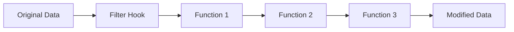

# WordPress Filters

## Introduction

WordPress filters are one of the most powerful features of the WordPress plugin architecture. They provide a way to modify data during the execution of WordPress without modifying the core files. Filters are hooks that allow you to intercept and modify data before it's used by WordPress or before it's displayed to the user.

Unlike actions (which allow you to add functionality at specific points), filters are specifically designed to *transform* data. Think of them as pipes where data flows through, and your code can intercept, modify, and then return the data before it continues on its journey.

## How WordPress Filters Work

At their core, WordPress filters follow a simple pattern:

1. WordPress generates some data
2. The data is passed through a filter
3. Any functions hooked to that filter can modify the data
4. The modified data continues on its original path



## Basic Filter Usage

### Adding a Filter

To use a filter, you need to hook your custom function to it using `add_filter()`:

```php
add_filter('filter_name', 'your_callback_function', priority, accepted_args);
```

Parameters:
- `filter_name`: The name of the filter to hook into
- `your_callback_function`: Your function that will modify the data
- `priority`: Optional (default 10). Determines the order in which functions execute
- `accepted_args`: Optional (default 1). Number of arguments your function accepts

### Creating a Simple Filter Function

Let's create a filter that modifies post titles to make them uppercase:

```php
// Hook our function to the 'the_title' filter
add_filter('the_title', 'make_title_uppercase');

// Define our callback function
function make_title_uppercase($title) {
    // Convert the title to uppercase
    $title = strtoupper($title);
    
    // Return the modified title
    return $title;
}
```

**What this does:**
- When WordPress displays a post title, it passes the title through the `the_title` filter
- Our `make_title_uppercase()` function receives the title as an argument
- We modify the title by converting it to uppercase using PHP's `strtoupper()` function
- We return the modified title, which WordPress will then display

### Removing a Filter

You can also remove filters using `remove_filter()`:

```php
remove_filter('filter_name', 'callback_function', priority);
```

If you need to remove a filter added by another plugin or theme, you'll need to match the priority level that was used when adding the filter.

## Common WordPress Filters

WordPress provides hundreds of filters you can use. Here are some of the most commonly used ones:

| Filter Name | Description | Default Arguments |
|-------------|-------------|------------------|
| `the_content` | Filters the post content before it's displayed | `$content` |
| `the_title` | Filters the post title | `$title`, `$post_id` |
| `the_excerpt` | Filters the post excerpt | `$excerpt` |
| `get_the_excerpt` | Filters the retrieved post excerpt | `$excerpt`, `$post` |
| `comment_text` | Filters the comment text | `$comment_content` |
| `wp_title` | Filters the page title | `$title`, `$sep`, `$seplocation` |
| `admin_footer_text` | Filters the "Thank you" text displayed in the admin footer | `$text` |

## Practical Examples

### Example 1: Adding a Copyright Notice to Content

This example adds a copyright notice at the end of each post's content:

```php
// Add copyright notice to the end of post content
add_filter('the_content', 'add_copyright_notice');

function add_copyright_notice($content) {
    // Only add to single post pages
    if (is_single()) {
        $copyright = '<div class="copyright-notice">';
        $copyright .= '<p>© ' . date('Y') . ' - ' . get_bloginfo('name') . '. All rights reserved.</p>';
        $copyright .= '</div>';
        
        $content .= $copyright;
    }
    
    return $content;
}
```

**Before (original content):**
```
This is my blog post content.
```

**After (filtered content):**
```
This is my blog post content.

© 2023 - My WordPress Blog. All rights reserved.
```

### Example 2: Modifying Search Results

This example modifies search results to only include posts, not pages:

```php
// Modify search to only return posts, not pages
add_filter('pre_get_posts', 'search_posts_only');

function search_posts_only($query) {
    // Check if this is the main query and a search request
    if ($query->is_main_query() && $query->is_search()) {
        // Set post type to 'post' only
        $query->set('post_type', 'post');
    }
    
    return $query;
}
```

### Example 3: Creating a Custom Excerpt Length

WordPress excerpts are typically truncated at 55 words. This example changes that length to 25 words:

```php
// Change excerpt length to 25 words
add_filter('excerpt_length', 'custom_excerpt_length');

function custom_excerpt_length($length) {
    return 25;
}
```

### Example 4: Adding a Class to Menu Items

This example adds a custom CSS class to specific menu items:

```php
add_filter('nav_menu_css_class', 'add_custom_menu_class', 10, 3);

function add_custom_menu_class($classes, $item, $args) {
    // Add a class for items that link to the About page
    if (strpos($item->url, 'about') !== false) {
        $classes[] = 'about-menu-item';
    }
    
    return $classes;
}
```

## Working with Multiple Arguments

Some WordPress filters pass multiple arguments to the callback function. You need to specify the number of arguments when adding your filter:

```php
// Add a filter that uses multiple arguments
add_filter('the_title', 'customize_title_by_id', 10, 2);

function customize_title_by_id($title, $id) {
    // Add post ID to the title for specific post types
    if (get_post_type($id) === 'product') {
        $title .= ' [ID: ' . $id . ']';
    }
    
    return $title;
}
```

## Creating Your Own Filters

You can create your own filters in your plugin, allowing other developers to modify your plugin's data:

```php
function my_plugin_process_text($text) {
    // Let other plugins modify the text
    $filtered_text = apply_filters('my_plugin_text', $text);
    
    // Continue processing with the filtered text
    return $filtered_text;
}
```

Other developers can now hook into your filter:

```php
// In another plugin
add_filter('my_plugin_text', 'modify_plugin_text');

function modify_plugin_text($text) {
    return str_replace('old text', 'new text', $text);
}
```

## Filter Priority

The priority parameter in `add_filter()` determines the order in which functions execute when multiple functions are hooked to the same filter. Lower numbers run first (default is 10):

```php
// Run early (priority 5)
add_filter('the_content', 'add_disclaimer_to_content', 5);

// Run at default priority (10)
add_filter('the_content', 'add_social_buttons', 10);

// Run late (priority 20)
add_filter('the_content', 'add_related_posts', 20);
```

## Best Practices for Working with Filters

1. **Always return a value** from your filter callback function - filters expect a modified value to be returned.

2. **Match the expected data type** - if a filter provides a string, return a string, not an array or another data type.

3. **Keep filter callbacks focused** - each filter function should do one specific modification.

4. **Use meaningful priority values** - don't arbitrarily set priorities unless you need a specific execution order.

5. **Document your filters** - if you create custom filters, document them so other developers know how to use them.

6. **Check if you're on the right hook** - some filters only make sense in certain contexts.

```php
add_filter('the_content', 'modify_specific_post_content');

function modify_specific_post_content($content) {
    // Only modify content for post ID 42
    if (get_the_ID() === 42) {
        $content = '<div class="special-content">' . $content . '</div>';
    }
    
    return $content;
}
```

## Common Mistakes to Avoid

1. **Not returning a value** - this will break the filter chain and potentially cause errors.

2. **Forgetting the priority when removing filters** - if you don't specify the same priority used when adding the filter, the removal won't work.

3. **Heavy processing in frequently used filters** - filters like `the_content` run on every post display, so keep them efficient.

4. **Infinite loops** - be careful not to create situations where your filter triggers itself.

## Actions vs. Filters

It's important to understand the difference between WordPress actions and filters:

| Feature | Actions | Filters |
|---------|---------|---------|
| Purpose | Execute functions at specific points | Modify data before it's used |
| Return value | Not required | Required |
| Data modification | No | Yes |
| Function | `do_action()` | `apply_filters()` |
| Hook registration | `add_action()` | `add_filter()` |

## Summary

WordPress filters are a powerful way to modify data as it flows through WordPress. They allow plugin developers to customize WordPress behavior without modifying core files. By understanding how to use filters effectively, you can:

- Modify content, titles, and other text throughout WordPress
- Customize search results and queries
- Create extensible plugins that other developers can modify
- Change WordPress default settings and behaviors

Filters are one of the core concepts that make WordPress so flexible and extensible. By mastering filters, you'll be able to customize WordPress to meet your specific needs without hacking core files.

## Exercises

1. Create a filter that adds a "Read time" estimate to the beginning of each post's content.

2. Write a filter that removes shortcodes from excerpts but keeps them in the main content.

3. Create a custom filter in your plugin and demonstrate how to apply it and hook into it.

4. Use filters to modify the default WordPress login error message to be more secure (not revealing whether the username or password was incorrect).

5. Create a filter that modifies the comment submission form to add a custom field.

## Additional Resources

- [WordPress Developer Handbook: Filter Reference](https://developer.wordpress.org/reference/hooks/filter-reference/)
- [WordPress Filter Hook Database](https://adambrown.info/p/wp_hooks)
- [WordPress Codex: Plugin API](https://codex.wordpress.org/Plugin_API)
- [Understanding WordPress Filters](https://www.smashingmagazine.com/2009/08/10-useful-wordpress-hook-hacks/)

Happy filtering!