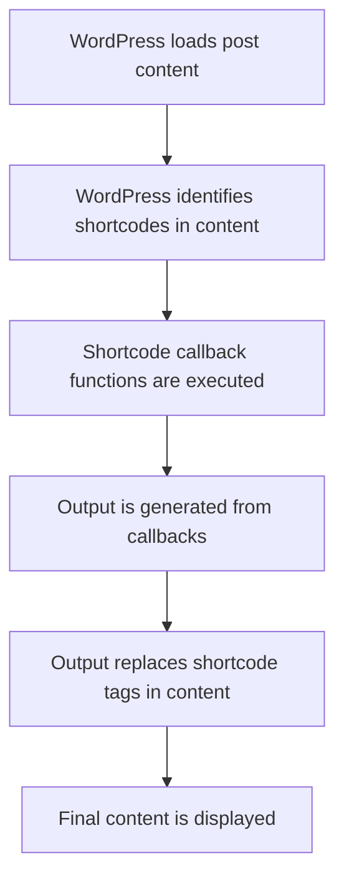

# WordPress Shortcode API

## Introduction

WordPress Shortcodes provide a simple yet powerful way to create special content or functionality that users can add to their posts, pages, or widgets using simple bracket-enclosed keywords. The Shortcode API allows developers to create custom shortcodes that generate dynamic content or perform specific actions when used in WordPress content.

Shortcodes are like mini-programs enclosed in square brackets that you can insert anywhere in your WordPress content. For example, the built-in gallery shortcode `[gallery]` allows users to insert an image gallery without writing complex HTML.

In this tutorial, we'll explore how to create custom shortcodes in your WordPress plugins, handle attributes, and implement more advanced shortcode features.

## Why Use Shortcodes?

Shortcodes bridge the gap between complex functionality and user-friendly implementation:

- They allow non-technical users to embed complex features without knowing code
- They maintain content portability and safety
- They enable dynamic content insertion in static posts and pages
- They provide a consistent interface for users

## Basic Shortcode Creation

Let's start with creating a simple shortcode that displays a customized greeting message.

### Step 1: Register Your Shortcode

To create a shortcode, you use the `add_shortcode()` function, which takes two parameters:
- The shortcode tag (name)
- A callback function that handles the shortcode's functionality

```php
function wpb_greeting_shortcode() {
    return "Hello, WordPress Shortcode World!";
}
add_shortcode('greeting', 'wpb_greeting_shortcode');
```

### Step 2: Using Your Shortcode

Once registered, users can add the shortcode in their content like this:

```
[greeting]
```

When WordPress processes this, it will output:

```
Hello, WordPress Shortcode World!
```

## Adding Attributes to Shortcodes

Shortcodes become more powerful when you add attributes to customize their behavior.

```php
function wpb_custom_greeting_shortcode($atts) {
    // Define default attributes
    $attributes = shortcode_atts(array(
        'name' => 'friend',
        'color' => 'black'
    ), $atts);
    
    // Generate output with the provided attributes
    $output = '<p style="color:' . esc_attr($attributes['color']) . ';">';
    $output .= 'Hello, ' . esc_html($attributes['name']) . '!';
    $output .= '</p>';
    
    return $output;
}
add_shortcode('custom_greeting', 'wpb_custom_greeting_shortcode');
```

### Using the Shortcode with Attributes

```
[custom_greeting name="John" color="blue"]
```

Output:
```html
<p style="color:blue;">Hello, John!</p>
```

Without specifying attributes, it will use the defaults:

```
[custom_greeting]
```

Output:
```html
<p style="color:black;">Hello, friend!</p>
```

## Enclosing Shortcodes (With Content)

Enclosing shortcodes have an opening and closing tag, allowing you to manipulate the content placed between them.

```php
function wpb_highlight_shortcode($atts, $content = null) {
    // Define default attributes
    $attributes = shortcode_atts(array(
        'color' => 'yellow',
    ), $atts);
    
    // Return the content wrapped in a span with background color
    return '<span style="background-color:' . esc_attr($attributes['color']) . ';">' . 
           do_shortcode($content) . 
           '</span>';
}
add_shortcode('highlight', 'wpb_highlight_shortcode');
```

### Using the Enclosing Shortcode

```
[highlight]This text will have a yellow highlight.[/highlight]

[highlight color="lightblue"]This text will have a light blue highlight.[/highlight]
```

Output:
```html
<span style="background-color:yellow;">This text will have a yellow highlight.</span>

<span style="background-color:lightblue;">This text will have a light blue highlight.</span>
```

Notice that we used `do_shortcode($content)` in our function. This allows WordPress to process any nested shortcodes within our content.

## Shortcode Best Practices

### 1. Sanitize and Escape Output

Always sanitize input and escape output to prevent security vulnerabilities:

```php
function wpb_user_info_shortcode($atts) {
    $attributes = shortcode_atts(array(
        'field' => 'display_name',
    ), $atts);
    
    $current_user = wp_get_current_user();
    
    if ($current_user->ID === 0) {
        return 'Not logged in';
    }
    
    // Safely get a user field
    $field = sanitize_text_field($attributes['field']);
    
    if (isset($current_user->$field)) {
        return esc_html($current_user->$field);
    }
    
    return '';
}
add_shortcode('user_info', 'wpb_user_info_shortcode');
```

### 2. Return, Don't Echo

Always return the shortcode content rather than echoing it:

```php
// GOOD - returns content
function wpb_good_shortcode() {
    return "This is the right way";
}

// BAD - echoes content - don't do this
function wpb_bad_shortcode() {
    echo "This will cause issues";
    // No return statement!
}
```

### 3. Handling Shortcode Conflicts

If your shortcode might conflict with other plugins or themes, use a unique prefix:

```php
// Using a unique prefix for your shortcodes
add_shortcode('mycompany_feature', 'mycompany_feature_shortcode');
```

## Practical Examples

### Example 1: Recent Posts Shortcode

Let's create a shortcode that displays a list of recent posts with customizable parameters:

```php
function wpb_recent_posts_shortcode($atts) {
    // Define default attributes
    $attributes = shortcode_atts(array(
        'count' => 5,
        'category' => '',
        'show_date' => 'false',
        'show_excerpt' => 'false',
    ), $atts);
    
    // Convert string attributes to proper types
    $post_count = intval($attributes['count']);
    $show_date = ($attributes['show_date'] === 'true');
    $show_excerpt = ($attributes['show_excerpt'] === 'true');
    
    // Set up the query
    $query_args = array(
        'post_type' => 'post',
        'posts_per_page' => $post_count,
    );
    
    // Add category if specified
    if (!empty($attributes['category'])) {
        $query_args['category_name'] = $attributes['category'];
    }
    
    $recent_posts = new WP_Query($query_args);
    
    // Start output buffering
    ob_start();
    
    if ($recent_posts->have_posts()) :
        echo '<ul class="recent-posts-shortcode">';
        
        while ($recent_posts->have_posts()) : $recent_posts->the_post();
            echo '<li>';
            
            echo '<a href="' . esc_url(get_permalink()) . '">' . esc_html(get_the_title()) . '</a>';
            
            if ($show_date) {
                echo ' <span class="post-date">(' . esc_html(get_the_date()) . ')</span>';
            }
            
            if ($show_excerpt && has_excerpt()) {
                echo '<div class="post-excerpt">' . wp_kses_post(get_the_excerpt()) . '</div>';
            }
            
            echo '</li>';
        endwhile;
        
        echo '</ul>';
        
        // Restore original post data
        wp_reset_postdata();
    else:
        echo '<p>No recent posts found.</p>';
    endif;
    
    // Return the buffered content
    return ob_get_clean();
}
add_shortcode('recent_posts', 'wpb_recent_posts_shortcode');
```

### Using the Recent Posts Shortcode

```
[recent_posts count="3" category="news" show_date="true" show_excerpt="true"]
```

### Example 2: Custom Button Shortcode

```php
function wpb_button_shortcode($atts, $content = null) {
    // Define default attributes
    $attributes = shortcode_atts(array(
        'url' => '#',
        'color' => 'blue',
        'size' => 'medium',
        'target' => '_self',
    ), $atts);
    
    // Define CSS classes based on attributes
    $button_classes = array('wpb-button');
    $button_classes[] = 'wpb-button-' . sanitize_html_class($attributes['color']);
    $button_classes[] = 'wpb-button-' . sanitize_html_class($attributes['size']);
    
    // Generate the HTML for the button
    $button = sprintf(
        '<a href="%1$s" class="%2$s" target="%3$s">%4$s</a>',
        esc_url($attributes['url']),
        esc_attr(implode(' ', $button_classes)),
        esc_attr($attributes['target']),
        do_shortcode($content)
    );
    
    return $button;
}
add_shortcode('button', 'wpb_button_shortcode');
```

### Using the Button Shortcode

```
[button url="https://example.com" color="green" size="large" target="_blank"]Click Here[/button]
```

To make this button shortcode fully functional, you would also need to add CSS styles to your theme or plugin.

## Advanced Shortcode Techniques

### Nested Shortcodes

Shortcodes can be nested within other shortcodes using `do_shortcode()`:

```php
function wpb_box_shortcode($atts, $content = null) {
    $attributes = shortcode_atts(array(
        'style' => 'info', // info, warning, error
    ), $atts);
    
    $output = '<div class="wpb-box wpb-box-' . esc_attr($attributes['style']) . '">';
    $output .= do_shortcode($content); // Process any nested shortcodes
    $output .= '</div>';
    
    return $output;
}
add_shortcode('box', 'wpb_box_shortcode');
```

### Using the Box Shortcode with Nested Shortcodes

```
[box style="warning"]
  Important: [highlight color="yellow"]You must backup your database[/highlight] before upgrading.
[/box]
```

### Self-Closing vs. Enclosing Shortcodes

The same shortcode can be designed to work both ways:

```php
function wpb_message_shortcode($atts, $content = null) {
    $attributes = shortcode_atts(array(
        'text' => 'Default message',
    ), $atts);
    
    // If there's content between the shortcode tags, use that
    // Otherwise, use the text attribute
    $message = !empty($content) ? do_shortcode($content) : esc_html($attributes['text']);
    
    return '<div class="message">' . $message . '</div>';
}
add_shortcode('message', 'wpb_message_shortcode');
```

Usage:
```
[message text="Hello World"] <!-- Self-closing -->

[message]Hello <strong>World</strong>[/message] <!-- Enclosing -->
```

### Shortcode API Lifecycle

Here's a visual representation of how shortcodes are processed:



## Common Issues and Solutions

### 1. Wpautop Conflicts

WordPress's automatic paragraph function (`wpautop`) can sometimes break shortcodes. To fix this:

```php
// Remove and re-add wpautop filter with modified priority
remove_filter('the_content', 'wpautop');
add_filter('the_content', 'wpautop', 12);
```

### 2. Shortcode in Widgets

To enable shortcodes in widgets:

```php
add_filter('widget_text', 'do_shortcode');
```

### 3. Preventing Shortcodes in Excerpts

If you want to prevent shortcodes from being processed in excerpts:

```php
function wpb_custom_excerpt($text) {
    // Remove shortcode tags from the excerpt
    $text = strip_shortcodes($text);
    return $text;
}
add_filter('get_the_excerpt', 'wpb_custom_excerpt');
```

## Summary

The WordPress Shortcode API provides a powerful way to extend WordPress functionality without requiring users to write code. In this tutorial, we've covered:

- Basic shortcode creation
- Adding attributes to shortcodes
- Creating enclosing shortcodes with content
- Best practices for security and usability
- Practical examples of useful shortcodes
- Advanced techniques for nested shortcodes

By mastering shortcodes, you can create plugins that provide rich functionality in an easy-to-use format that even non-technical WordPress users can implement.

## Exercises

1. Create a shortcode that displays the current date in various formats based on attributes.
2. Build a "team member" shortcode that shows a person's name, title, and bio.
3. Develop a shortcode that creates a tabbed content interface.
4. Create a shortcode that retrieves and displays data from a custom post type.
5. Build a pricing table shortcode with multiple pricing levels and features.

## Additional Resources

- [WordPress Shortcode API Documentation](https://developer.wordpress.org/plugins/shortcodes/)
- [WordPress Codex: Shortcode API](https://codex.wordpress.org/Shortcode_API)
- [WordPress Developer Resources: Shortcodes](https://developer.wordpress.org/plugins/shortcodes/basic-shortcodes/)

Remember, shortcodes are a powerful tool that, when used correctly, can greatly enhance the user experience of your WordPress plugins and make complex functionality accessible to all users.