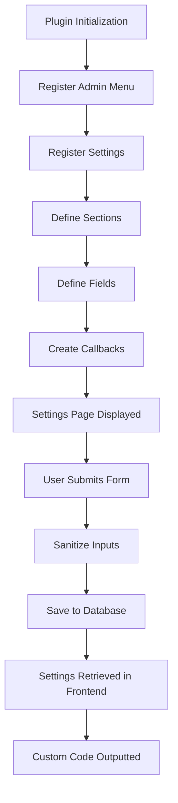

# WordPress Settings API

## Introduction

The WordPress Settings API provides a standardized way for plugin developers to create settings pages and handle configuration options. It helps you build consistent, secure, and well-integrated admin interfaces for your plugins with minimal effort.

In this tutorial, we'll explore how to use the WordPress Settings API to:

- Create settings pages in the WordPress admin area
- Define and organize settings fields and sections
- Validate and sanitize user inputs
- Store and retrieve settings values securely

By the end of this guide, you'll be able to implement professional-grade settings interfaces for your WordPress plugins.

## Why Use the Settings API?

Before diving into code, let's understand why the Settings API is important:

1. **Security**: The Settings API handles nonce verification and permission checks automatically
2. **Consistency**: Your settings pages will match the WordPress admin UI style
3. **Accessibility**: Built-in accessibility features are included
4. **Validation**: Simplified input validation and sanitization
5. **Maintainability**: Standardized approach makes code easier to maintain

## Core Settings API Functions

Here are the primary functions you'll use with the Settings API:

- `register_setting()`: Registers a setting and its data
- `add_settings_section()`: Adds a new section to a settings page
- `add_settings_field()`: Adds a new field to a settings section
- `settings_fields()`: Outputs hidden fields for a settings page
- `do_settings_sections()`: Outputs all sections for a settings page

## Basic Implementation Example

Let's create a simple plugin with a settings page. We'll build a "Site Customizer" plugin that lets users add custom CSS and JavaScript.

### Step 1: Create the Plugin File Structure

```
site-customizer/
├── site-customizer.php
└── includes/
    └── settings.php
```

### Step 2: Set Up the Main Plugin File

```php
<?php
/**
 * Plugin Name: Site Customizer
 * Description: Add custom CSS and JavaScript to your WordPress site
 * Version: 1.0.0
 * Author: Your Name
 */

// Exit if accessed directly
if (!defined('ABSPATH')) {
    exit;
}

// Include settings file
require_once plugin_dir_path(__FILE__) . 'includes/settings.php';

// Initialize settings
function site_customizer_init() {
    new Site_Customizer_Settings();
}
add_action('plugins_loaded', 'site_customizer_init');
```

### Step 3: Create the Settings Class

In `includes/settings.php`:

```php
<?php

class Site_Customizer_Settings {
    
    // Class constructor
    public function __construct() {
        // Add admin menu
        add_action('admin_menu', array($this, 'add_menu_page'));
        
        // Register settings
        add_action('admin_init', array($this, 'register_settings'));
    }
    
    // Add menu page
    public function add_menu_page() {
        add_options_page(
            'Site Customizer Settings',  // Page title
            'Site Customizer',           // Menu title
            'manage_options',            // Capability
            'site-customizer',           // Menu slug
            array($this, 'settings_page') // Callback function
        );
    }
    
    // Register settings
    public function register_settings() {
        // Register setting
        register_setting(
            'site_customizer_options',          // Option group
            'site_customizer_options',          // Option name
            array($this, 'sanitize_settings')   // Sanitize callback
        );
        
        // Add settings section
        add_settings_section(
            'site_customizer_main',             // Section ID
            'Customization Settings',           // Section title
            array($this, 'section_callback'),   // Section callback
            'site-customizer'                   // Page slug
        );
        
        // Add settings fields
        add_settings_field(
            'custom_css',                       // Field ID
            'Custom CSS',                       // Field title
            array($this, 'css_field_callback'), // Field callback
            'site-customizer',                  // Page slug
            'site_customizer_main'              // Section ID
        );
        
        add_settings_field(
            'custom_js',
            'Custom JavaScript',
            array($this, 'js_field_callback'),
            'site-customizer',
            'site_customizer_main'
        );
    }
    
    // Section callback
    public function section_callback() {
        echo '<p>Add custom CSS and JavaScript to your site.</p>';
    }
    
    // CSS field callback
    public function css_field_callback() {
        $options = get_option('site_customizer_options');
        $css = isset($options['custom_css']) ? $options['custom_css'] : '';
        ?>
        <textarea name="site_customizer_options[custom_css]" rows="10" cols="50" class="large-text code"><?php echo esc_textarea($css); ?></textarea>
        <p class="description">Enter custom CSS styles. Do not include &lt;style&gt; tags.</p>
        <?php
    }
    
    // JS field callback
    public function js_field_callback() {
        $options = get_option('site_customizer_options');
        $js = isset($options['custom_js']) ? $options['custom_js'] : '';
        ?>
        <textarea name="site_customizer_options[custom_js]" rows="10" cols="50" class="large-text code"><?php echo esc_textarea($js); ?></textarea>
        <p class="description">Enter custom JavaScript code. Do not include &lt;script&gt; tags.</p>
        <?php
    }
    
    // Sanitize settings
    public function sanitize_settings($input) {
        $output = array();
        
        // Sanitize CSS
        if (isset($input['custom_css'])) {
            $output['custom_css'] = wp_strip_all_tags($input['custom_css']);
        }
        
        // Sanitize JS (note: in real-world scenarios, you'd want more robust JS sanitization)
        if (isset($input['custom_js'])) {
            $output['custom_js'] = $input['custom_js'];
        }
        
        return $output;
    }
    
    // Settings page display
    public function settings_page() {
        ?>
        <div class="wrap">
            <h1><?php echo esc_html(get_admin_page_title()); ?></h1>
            <form method="post" action="options.php">
                <?php
                // Output security fields
                settings_fields('site_customizer_options');
                
                // Output setting sections and their fields
                do_settings_sections('site-customizer');
                
                // Output save settings button
                submit_button();
                ?>
            </form>
        </div>
        <?php
    }
}
```

### Step 4: Implement the Custom Code in Frontend

Let's add another file to our plugin that outputs the custom CSS and JavaScript:

```php
<?php
// Add this to your main plugin file

// Output custom CSS and JS
function site_customizer_output_custom_code() {
    $options = get_option('site_customizer_options');
    
    // Output CSS if not empty
    if (!empty($options['custom_css'])) {
        echo '<style type="text/css">' . "\n";
        echo wp_strip_all_tags($options['custom_css']) . "\n";
        echo '</style>' . "\n";
    }
    
    // Output JS if not empty
    if (!empty($options['custom_js'])) {
        echo '<script>' . "\n";
        echo $options['custom_js'] . "\n";
        echo '</script>' . "\n";
    }
}
add_action('wp_head', 'site_customizer_output_custom_code');
```

## Understanding the Flow

Let's break down what's happening in our implementation:



## Advanced Settings API Techniques

Now that we've covered the basics, let's explore some advanced techniques you can use with the Settings API.

### Organizing Multiple Settings Sections

For more complex plugins, you might want to organize settings into multiple sections:

```php
public function register_settings() {
    // Register setting (just once)
    register_setting(
        'site_customizer_options',
        'site_customizer_options',
        array($this, 'sanitize_settings')
    );
    
    // CSS Section
    add_settings_section(
        'css_section',
        'CSS Settings',
        array($this, 'css_section_callback'),
        'site-customizer'
    );
    
    add_settings_field(
        'custom_css',
        'Custom CSS',
        array($this, 'css_field_callback'),
        'site-customizer',
        'css_section'
    );
    
    // JavaScript Section
    add_settings_section(
        'js_section',
        'JavaScript Settings',
        array($this, 'js_section_callback'),
        'site-customizer'
    );
    
    add_settings_field(
        'custom_js',
        'Custom JavaScript',
        array($this, 'js_field_callback'),
        'site-customizer',
        'js_section'
    );
    
    // Performance Section
    add_settings_section(
        'performance_section',
        'Performance Settings',
        array($this, 'performance_section_callback'),
        'site-customizer'
    );
    
    add_settings_field(
        'minify_code',
        'Minify Code',
        array($this, 'minify_field_callback'),
        'site-customizer',
        'performance_section'
    );
}
```

### Using Different Field Types

The Settings API can handle various types of form fields. Here are some examples:

#### Text Input

```php
public function text_field_callback() {
    $options = get_option('my_plugin_options');
    $value = isset($options['text_field']) ? $options['text_field'] : '';
    ?>
    <input type="text" name="my_plugin_options[text_field]" value="<?php echo esc_attr($value); ?>" class="regular-text">
    <?php
}
```

#### Checkbox

```php
public function checkbox_field_callback() {
    $options = get_option('my_plugin_options');
    $checked = isset($options['checkbox_field']) ? checked($options['checkbox_field'], 1, false) : '';
    ?>
    <input type="checkbox" name="my_plugin_options[checkbox_field]" value="1" <?php echo $checked; ?>>
    <span class="description">Check this box to enable the feature</span>
    <?php
}
```

#### Radio Buttons

```php
public function radio_field_callback() {
    $options = get_option('my_plugin_options');
    $value = isset($options['radio_field']) ? $options['radio_field'] : 'option1';
    ?>
    <input type="radio" name="my_plugin_options[radio_field]" value="option1" <?php checked($value, 'option1'); ?>> Option 1<br />
    <input type="radio" name="my_plugin_options[radio_field]" value="option2" <?php checked($value, 'option2'); ?>> Option 2<br />
    <input type="radio" name="my_plugin_options[radio_field]" value="option3" <?php checked($value, 'option3'); ?>> Option 3
    <?php
}
```

#### Select Dropdown

```php
public function select_field_callback() {
    $options = get_option('my_plugin_options');
    $value = isset($options['select_field']) ? $options['select_field'] : '';
    ?>
    <select name="my_plugin_options[select_field]">
        <option value="option1" <?php selected($value, 'option1'); ?>>Option 1</option>
        <option value="option2" <?php selected($value, 'option2'); ?>>Option 2</option>
        <option value="option3" <?php selected($value, 'option3'); ?>>Option 3</option>
    </select>
    <?php
}
```

### Creating a Tabbed Settings Interface

For plugins with many settings, tabs can improve the user experience:

```php
public function settings_page() {
    $active_tab = isset($_GET['tab']) ? $_GET['tab'] : 'general';
    ?>
    <div class="wrap">
        <h1><?php echo esc_html(get_admin_page_title()); ?></h1>
        
        <h2 class="nav-tab-wrapper">
            <a href="?page=my-plugin&tab=general" class="nav-tab <?php echo $active_tab == 'general' ? 'nav-tab-active' : ''; ?>">General</a>
            <a href="?page=my-plugin&tab=advanced" class="nav-tab <?php echo $active_tab == 'advanced' ? 'nav-tab-active' : ''; ?>">Advanced</a>
            <a href="?page=my-plugin&tab=help" class="nav-tab <?php echo $active_tab == 'help' ? 'nav-tab-active' : ''; ?>">Help</a>
        </h2>
        
        <form method="post" action="options.php">
            <?php
            // Output the correct settings sections based on the active tab
            if ($active_tab == 'general') {
                settings_fields('my_plugin_general_options');
                do_settings_sections('my-plugin-general');
            } elseif ($active_tab == 'advanced') {
                settings_fields('my_plugin_advanced_options');
                do_settings_sections('my-plugin-advanced');
            } else {
                // Help tab doesn't need settings fields
                echo '<h3>Help & Documentation</h3>';
                echo '<p>Here is how to use this plugin...</p>';
            }
            
            // Don't show submit button on the help tab
            if ($active_tab != 'help') {
                submit_button();
            }
            ?>
        </form>
    </div>
    <?php
}
```

### Enhancing Form Fields with JavaScript

You can add interactivity to your settings page with JavaScript:

```php
public function enqueue_admin_scripts($hook) {
    // Only load on our settings page
    if ('settings_page_my-plugin' != $hook) {
        return;
    }
    
    wp_enqueue_script(
        'my-plugin-admin', 
        plugin_dir_url(__FILE__) . 'js/admin.js', 
        array('jquery'), 
        '1.0.0', 
        true
    );
}
```

Then in your `admin.js` file:

```javascript
jQuery(document).ready(function($) {
    // Toggle dependent fields
    $('#toggle_field').on('change', function() {
        if ($(this).is(':checked')) {
            $('.dependent-fields').show();
        } else {
            $('.dependent-fields').hide();
        }
    }).trigger('change');
    
    // Color picker initialization
    if ($.fn.wpColorPicker) {
        $('.color-field').wpColorPicker();
    }
});
```

## Best Practices for the Settings API

To create professional, user-friendly settings pages:

1. **Group Related Settings**: Organize similar settings into logical sections.

2. **Validate and Sanitize**: Always sanitize user inputs to prevent security issues:

```php
public function sanitize_settings($input) {
    $output = array();
    
    // Sanitize each field
    foreach ($input as $key => $value) {
        if ($key === 'text_field') {
            $output[$key] = sanitize_text_field($value);
        } elseif ($key === 'url_field') {
            $output[$key] = esc_url_raw($value);
        } elseif ($key === 'email_field') {
            $output[$key] = sanitize_email($value);
        } elseif ($key === 'checkbox_field') {
            $output[$key] = (isset($value) && $value == 1) ? 1 : 0;
        }
    }
    
    // Add error messages
    if (!empty($input['email_field']) && !is_email($input['email_field'])) {
        add_settings_error(
            'my_plugin_options',
            'invalid-email',
            'Please enter a valid email address.',
            'error'
        );
    }
    
    return $output;
}
```

3. **Provide Helpful Descriptions**: Include clear descriptions for each option.

4. **Use Default Values**: Always set sensible default values.

5. **Add Validation Feedback**: Use `add_settings_error()` to provide user feedback.

6. **Follow WordPress UI Guidelines**: Match your settings pages to the WordPress admin style.

## Settings API vs Custom Options Pages

While you can create custom options pages from scratch, the Settings API offers several advantages:

- **Security**: Built-in nonce protection and permission checking
- **Integration**: Automatic inclusion in the WordPress settings ecosystem
- **Consistency**: Matches the WordPress admin UI patterns
- **Future-proof**: Your settings page will adapt to WordPress UI changes

## Common Issues and Solutions

### Settings Not Saving

If your settings aren't saving, check:

1. The option group in `settings_fields()` matches what you used in `register_setting()`
2. You're using the correct option name in your form fields
3. Your sanitize callback isn't returning an empty array

### Sections Not Displaying

If sections aren't appearing, ensure:

1. The section ID in `add_settings_field()` matches what you used in `add_settings_section()`
2. The page slug is consistent across all functions
3. You're calling `do_settings_sections()` with the correct page slug

### Field Callbacks Not Running

If field callbacks aren't running, verify:

1. Your callback method exists and is spelled correctly
2. If using a class, your callback references are properly formatted: `array($this, 'method_name')`

## Summary

The WordPress Settings API provides a structured, secure, and standardized way to create settings pages for your plugins. By following the patterns outlined in this tutorial, you can:

1. Create professional settings interfaces
2. Organize options into logical sections
3. Validate and sanitize user inputs
4. Save settings securely in the WordPress database
5. Retrieve and use settings throughout your plugin

The Settings API might seem complex at first, but its structured approach pays off in the long run with more maintainable, secure, and user-friendly configuration interfaces.

## Exercises

1. Create a settings page for a plugin with at least three different types of form fields (text, checkbox, select).
2. Add field validation that displays error messages for invalid inputs.
3. Implement a tabbed interface with at least two different settings sections.
4. Create a setting that toggles the visibility of other dependent settings using JavaScript.
5. Add a custom validation rule that checks if a field value is unique before saving.

## Additional Resources

- [WordPress Settings API Documentation](https://developer.wordpress.org/plugins/settings/settings-api/)
- [WordPress Data Validation](https://developer.wordpress.org/themes/theme-security/data-validation/)
- [WordPress Coding Standards](https://developer.wordpress.org/coding-standards/wordpress-coding-standards/)