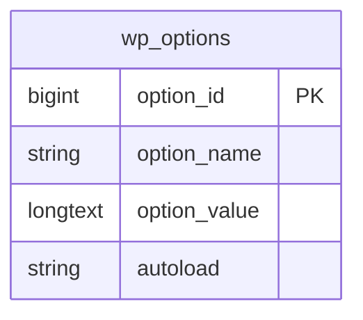

# WordPress Options API

## Introduction

The WordPress Options API provides a simple and standardized way to store and retrieve data in the WordPress database. Unlike custom database tables, options are stored in a single table (`wp_options`), making them perfect for configuration settings and persistent data that doesn't require complex relationships.

Options are essentially name-value pairs that persist between page loads and sessions, making them ideal for:

- Plugin settings
- Configuration values
- User preferences
- Feature toggles
- Any data that needs to be stored across WordPress sessions

In this guide, we'll explore how to use the Options API in your WordPress plugins, complete with practical examples and best practices.

## Understanding the Options API

The WordPress Options API consists of four primary functions:

1. `add_option()`: Adds a new option to the database
2. `get_option()`: Retrieves an option's value from the database
3. `update_option()`: Updates an existing option's value
4. `delete_option()`: Removes an option from the database

Let's look at each function in detail.

## Working with Options

### Adding Options

Use `add_option()` to create a new option if it doesn't already exist:

```php
/**
 * Add a new option to the database
 *
 * @param string $option   Name of the option to add
 * @param mixed  $value    Value to add
 * @param string $autoload Whether to load the option when WordPress starts (yes/no)
 * @param string $deprecated Description field (deprecated since WordPress 2.3.0)
 * @return bool True if option added, false otherwise
 */
add_option( 'my_plugin_version', '1.0.0', 'yes' );
```

This function returns `false` if the option already exists, making it safe to use during plugin activation without overwriting existing values.

### Retrieving Options

To retrieve an option's value, use `get_option()`:

```php
/**
 * Retrieve an option value from the database
 *
 * @param string $option   Name of the option to retrieve
 * @param mixed  $default  Default value to return if option doesn't exist
 * @return mixed The option value
 */
$version = get_option( 'my_plugin_version', '0.0.0' );
echo "Current plugin version: " . $version;
// Output: Current plugin version: 1.0.0 (if the option exists)
// Output: Current plugin version: 0.0.0 (if the option doesn't exist)
```

The second parameter provides a default value if the option doesn't exist.

### Updating Options

To change an option's value, use `update_option()`:

```php
/**
 * Update an option in the database
 *
 * @param string $option   Name of the option to update
 * @param mixed  $value    New value for the option
 * @param string $autoload Whether to load the option when WordPress starts (yes/no)
 * @return bool True if option updated, false otherwise
 */
$updated = update_option( 'my_plugin_version', '1.0.1' );

if ( $updated ) {
    echo "Version updated successfully!";
} else {
    echo "Version was already 1.0.1 or update failed.";
}
```

`update_option()` creates the option if it doesn't exist, making it versatile for both new and existing options.

### Deleting Options

When you need to remove an option, use `delete_option()`:

```php
/**
 * Delete an option from the database
 *
 * @param string $option Name of the option to delete
 * @return bool True if option deleted, false otherwise
 */
$deleted = delete_option( 'my_plugin_version' );

if ( $deleted ) {
    echo "Version information removed.";
} else {
    echo "Could not remove version information or it didn't exist.";
}
```

## Storing Complex Data

Options can store more than just simple strings and numbers. You can store arrays, objects, and other complex PHP data types, which WordPress automatically serializes and deserializes:

```php
// Storing an array of settings
$settings = [
    'enable_feature_x' => true,
    'max_items' => 5,
    'custom_colors' => [
        'primary' => '#007bff',
        'secondary' => '#6c757d',
        'success' => '#28a745'
    ]
];

update_option( 'my_plugin_settings', $settings );

// Later, retrieving the settings
$saved_settings = get_option( 'my_plugin_settings', [] );
if ( !empty( $saved_settings ) ) {
    $max_items = $saved_settings['max_items'];
    $primary_color = $saved_settings['custom_colors']['primary'];
    
    echo "Maximum items: " . $max_items;
    echo "<br />";
    echo "Primary color: " . $primary_color;
}

// Output:
// Maximum items: 5
// Primary color: #007bff
```

## Best Practices for Using the Options API

### 1. Use Unique Option Names

To avoid conflicts with other plugins, prefix your option names with your plugin's name:

```php
// Good
add_option( 'my_calendar_plugin_settings', $settings );

// Not good - too generic
add_option( 'calendar_settings', $settings );
```

### 2. Group Related Settings

Instead of creating multiple options for related settings, group them into a single option as an array:

```php
// Better approach - one option with multiple settings
$settings = [
    'api_key' => 'abc123',
    'enable_feature_x' => true,
    'daily_limit' => 1000
];
update_option( 'my_plugin_settings', $settings );

// Less efficient approach - multiple separate options
update_option( 'my_plugin_api_key', 'abc123' );
update_option( 'my_plugin_enable_feature_x', true );
update_option( 'my_plugin_daily_limit', 1000 );
```

### 3. Consider Autoloading

When adding options, the `autoload` parameter determines whether WordPress loads the option on every page load:

```php
// Autoload this option (good for frequently used settings)
add_option( 'my_plugin_version', '1.0.0', 'yes' );

// Don't autoload this option (better for rarely used or large options)
add_option( 'my_plugin_large_data', $large_dataset, 'no' );
```

- Use `'yes'` for small, frequently used options
- Use `'no'` for large or rarely used options to improve performance

### 4. Validate and Sanitize Input

Always validate and sanitize data before storing it:

```php
// Sanitize and validate before saving
function save_my_plugin_settings( $input ) {
    $clean = [];
    
    // Sanitize text field
    $clean['api_key'] = sanitize_text_field( $input['api_key'] );
    
    // Validate and force numeric value
    $clean['daily_limit'] = absint( $input['daily_limit'] );
    
    // Validate boolean
    $clean['enable_feature_x'] = isset( $input['enable_feature_x'] ) ? true : false;
    
    return $clean;
}

// Use the sanitized values
$user_input = $_POST['settings']; // Assuming this comes from a form
$clean_settings = save_my_plugin_settings( $user_input );
update_option( 'my_plugin_settings', $clean_settings );
```

## Real-World Example: Creating a Plugin Settings Page

Let's create a comprehensive example of a plugin that uses the Options API to store and manage settings:

```php
<?php
/**
 * Plugin Name: Example Settings Plugin
 * Description: Demonstrates using the WordPress Options API
 * Version: 1.0.0
 */

// Prevent direct access
if ( ! defined( 'ABSPATH' ) ) {
    exit;
}

class Example_Settings_Plugin {
    // Default settings
    private $defaults = [
        'api_key' => '',
        'enable_feature' => false,
        'max_items' => 5,
        'notification_email' => ''
    ];
    
    public function __construct() {
        // Add settings page to admin menu
        add_action( 'admin_menu', array( $this, 'add_settings_page' ) );
        
        // Register settings
        add_action( 'admin_init', array( $this, 'register_settings' ) );
        
        // Initialize options if they don't exist
        register_activation_hook( __FILE__, array( $this, 'activate_plugin' ) );
    }
    
    /**
     * Plugin activation hook - set default options
     */
    public function activate_plugin() {
        // Only add default options if they don't already exist
        if ( false === get_option( 'esp_settings' ) ) {
            add_option( 'esp_settings', $this->defaults );
        }
    }
    
    /**
     * Add settings page to admin menu
     */
    public function add_settings_page() {
        add_options_page(
            'Example Settings',
            'Example Settings',
            'manage_options',
            'example-settings',
            array( $this, 'render_settings_page' )
        );
    }
    
    /**
     * Register plugin settings
     */
    public function register_settings() {
        register_setting(
            'esp_settings_group',
            'esp_settings',
            array( $this, 'sanitize_settings' )
        );
    }
    
    /**
     * Sanitize settings before saving
     */
    public function sanitize_settings( $input ) {
        $sanitized = [];
        
        // API Key - sanitize as text
        $sanitized['api_key'] = isset( $input['api_key'] ) 
            ? sanitize_text_field( $input['api_key'] )
            : $this->defaults['api_key'];
            
        // Feature toggle - ensure boolean
        $sanitized['enable_feature'] = isset( $input['enable_feature'] ) ? true : false;
        
        // Max items - ensure positive integer
        $sanitized['max_items'] = isset( $input['max_items'] )
            ? absint( $input['max_items'] )
            : $this->defaults['max_items'];
            
        // Notification email - validate email
        $sanitized['notification_email'] = isset( $input['notification_email'] )
            ? sanitize_email( $input['notification_email'] )
            : $this->defaults['notification_email'];
            
        return $sanitized;
    }
    
    /**
     * Render the settings page
     */
    public function render_settings_page() {
        // Get current settings with defaults as fallback
        $settings = get_option( 'esp_settings', $this->defaults );
        ?>
        <div class="wrap">
            <h1>Example Settings</h1>
            <form method="post" action="options.php">
                <?php settings_fields( 'esp_settings_group' ); ?>
                
                <table class="form-table">
                    <tr>
                        <th scope="row">API Key</th>
                        <td>
                            <input type="text" name="esp_settings[api_key]" 
                                value="<?php echo esc_attr( $settings['api_key'] ); ?>" 
                                class="regular-text" />
                            <p class="description">Enter your API key.</p>
                        </td>
                    </tr>
                    <tr>
                        <th scope="row">Enable Feature</th>
                        <td>
                            <input type="checkbox" name="esp_settings[enable_feature]" 
                                <?php checked( $settings['enable_feature'], true ); ?> />
                            <span class="description">Enable the special feature.</span>
                        </td>
                    </tr>
                    <tr>
                        <th scope="row">Maximum Items</th>
                        <td>
                            <input type="number" name="esp_settings[max_items]" 
                                value="<?php echo esc_attr( $settings['max_items'] ); ?>" 
                                class="small-text" min="1" max="100" />
                            <p class="description">Maximum number of items to display (1-100).</p>
                        </td>
                    </tr>
                    <tr>
                        <th scope="row">Notification Email</th>
                        <td>
                            <input type="email" name="esp_settings[notification_email]" 
                                value="<?php echo esc_attr( $settings['notification_email'] ); ?>" 
                                class="regular-text" />
                            <p class="description">Where to send notifications.</p>
                        </td>
                    </tr>
                </table>
                
                <?php submit_button(); ?>
            </form>
        </div>
        <?php
    }
}

// Initialize the plugin
$example_settings_plugin = new Example_Settings_Plugin();
```

This example demonstrates:
1. Setting default options on plugin activation
2. Creating an admin settings page
3. Using the Settings API with the Options API
4. Properly sanitizing and validating input
5. Storing related settings as a single option array

## Options API vs. Site Options

If you're building a multisite-compatible plugin, you might need to consider using network-wide options:

| Function | Site-specific | Network-wide |
|---------|--------------|-------------|
| Add option | `add_option()` | `add_site_option()` |
| Get option | `get_option()` | `get_site_option()` |
| Update option | `update_option()` | `update_site_option()` |
| Delete option | `delete_option()` | `delete_site_option()` |

## Understanding How Options Are Stored

The WordPress Options API stores data in the `wp_options` table with these columns:



- `option_id`: Auto-incremented ID
- `option_name`: The name you use in functions like `get_option()`
- `option_value`: The stored data (automatically serialized if needed)
- `autoload`: Whether WordPress loads this option at startup ('yes' or 'no')

## Transients vs. Options

While the Options API is great for persistent data, WordPress offers another API called Transients for temporary data:

```php
// Set a transient that expires in 1 hour
set_transient( 'my_plugin_cached_data', $data, HOUR_IN_SECONDS );

// Later, retrieve the transient
$cached_data = get_transient( 'my_plugin_cached_data' );
if ( false === $cached_data ) {
    // Transient has expired or doesn't exist
    $cached_data = get_fresh_data();
    set_transient( 'my_plugin_cached_data', $cached_data, HOUR_IN_SECONDS );
}
```

Use the Options API for:
- Configuration settings
- User preferences
- Any data that should persist indefinitely

Use Transients for:
- Cached API responses
- Temporary data
- Data that should expire after a specific time

## Summary

The WordPress Options API is a powerful system for storing and managing plugin data:

- Use `add_option()` to create new options
- Use `get_option()` to retrieve option values
- Use `update_option()` to modify existing options
- Use `delete_option()` to remove options
- Group related settings into single array options
- Always sanitize and validate data before storing
- Consider the `autoload` parameter for performance optimization

By following the patterns and best practices outlined in this guide, you can effectively manage persistent data in your WordPress plugins while maintaining compatibility with WordPress core and other plugins.

## Additional Resources

- [WordPress Codex: Options API](https://codex.wordpress.org/Options_API)
- [WordPress Developer Documentation: Functions Reference](https://developer.wordpress.org/reference/functions/get_option/)
- [WordPress Developer Documentation: Settings API](https://developer.wordpress.org/plugins/settings/settings-api/)

## Practice Exercises

1. Create a simple WordPress plugin that stores user preferences (e.g., color scheme, display options) using the Options API.
2. Modify the example plugin to include option importing and exporting functionality.
3. Build a plugin that uses both the Options API and Transients API appropriately for different types of data.
4. Create a plugin that uses network-wide options for a multisite configuration.

By mastering the WordPress Options API, you'll have a solid foundation for developing plugins that can store and manage settings in a WordPress-compatible way.