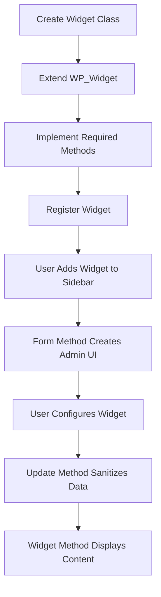

# WordPress Widget API

## Introduction

Widgets are an essential part of WordPress that allow users to add and arrange various functionality in their website's sidebar, footer, and other widget-ready areas. The WordPress Widget API provides developers with a structured way to create custom widgets that users can easily manage through the WordPress admin interface.

In this tutorial, you'll learn:

- What widgets are and how they work
- How to create custom widgets using the WordPress Widget API
- How to register widgets with WordPress
- How to handle widget form input and output
- Best practices for widget development

## What are WordPress Widgets?

Widgets are small blocks of functionality that can be placed into widget-ready areas of a WordPress theme (commonly called "sidebars", even when they're not on the side of the page). WordPress comes with several built-in widgets such as:

- Recent Posts
- Categories
- Calendar
- Search
- Tag Cloud

The real power of widgets comes from their drag-and-drop interface in the WordPress admin panel, allowing users to customize their site without writing code.

## Creating a Basic Widget

To create a widget in WordPress, you need to:

1. Create a class that extends the `WP_Widget` class
2. Implement specific methods required by the Widget API
3. Register your widget with WordPress

Let's create a simple example widget that displays a customizable greeting message.

```php
<?php
/**
 * Simple Greeting Widget
 */
class Simple_Greeting_Widget extends WP_Widget {
    
    /**
     * Constructor
     */
    public function __construct() {
        parent::__construct(
            'simple_greeting_widget', // Base ID
            'Simple Greeting', // Widget name in UI
            array(
                'description' => 'A widget that displays a greeting message',
            )
        );
    }
    
    /**
     * Widget front-end display
     */
    public function widget( $args, $instance ) {
        echo $args['before_widget'];
        
        if ( ! empty( $instance['title'] ) ) {
            echo $args['before_title'] . apply_filters( 'widget_title', $instance['title'] ) . $args['after_title'];
        }
        
        $message = ! empty( $instance['message'] ) ? $instance['message'] : 'Hello, World!';
        
        echo '<div class="greeting-text">' . esc_html( $message ) . '</div>';
        
        echo $args['after_widget'];
    }
    
    /**
     * Widget form in admin
     */
    public function form( $instance ) {
        $title = ! empty( $instance['title'] ) ? $instance['title'] : '';
        $message = ! empty( $instance['message'] ) ? $instance['message'] : 'Hello, World!';
        ?>
        <p>
            <label for="<?php echo esc_attr( $this->get_field_id( 'title' ) ); ?>">Title:</label>
            <input 
                class="widefat" 
                id="<?php echo esc_attr( $this->get_field_id( 'title' ) ); ?>" 
                name="<?php echo esc_attr( $this->get_field_name( 'title' ) ); ?>" 
                type="text" 
                value="<?php echo esc_attr( $title ); ?>">
        </p>
        <p>
            <label for="<?php echo esc_attr( $this->get_field_id( 'message' ) ); ?>">Greeting Message:</label>
            <input 
                class="widefat" 
                id="<?php echo esc_attr( $this->get_field_id( 'message' ) ); ?>" 
                name="<?php echo esc_attr( $this->get_field_name( 'message' ) ); ?>" 
                type="text" 
                value="<?php echo esc_attr( $message ); ?>">
        </p>
        <?php
    }
    
    /**
     * Sanitize widget form values as they are saved
     */
    public function update( $new_instance, $old_instance ) {
        $instance = array();
        $instance['title'] = ( ! empty( $new_instance['title'] ) ) ? sanitize_text_field( $new_instance['title'] ) : '';
        $instance['message'] = ( ! empty( $new_instance['message'] ) ) ? sanitize_text_field( $new_instance['message'] ) : '';
        
        return $instance;
    }
}

// Register the widget
function register_simple_greeting_widget() {
    register_widget( 'Simple_Greeting_Widget' );
}
add_action( 'widgets_init', 'register_simple_greeting_widget' );
```

## Understanding the Widget API Methods

Let's break down the key methods required for creating a widget:

### Constructor: `__construct()`

The constructor initializes the widget and sets its basic properties:

```php
public function __construct() {
    parent::__construct(
        'widget_id',        // Base ID
        'Widget Name',      // Name shown in the UI
        array(
            'description' => 'Widget description shown in the UI',
        )
    );
}
```

### Front-end Display: `widget()`

This method handles how the widget is displayed on the front end of the site:

```php
public function widget( $args, $instance ) {
    // $args contains widget wrapper elements from the theme
    // $instance contains the widget settings
    
    // Output widget content
}
```

The `$args` parameter contains elements provided by the theme, such as:
- `before_widget`: HTML to display before the widget
- `after_widget`: HTML to display after the widget
- `before_title`: HTML to display before the widget title
- `after_title`: HTML to display after the widget title

The `$instance` parameter contains all the saved settings for this specific instance of the widget.

### Admin Form: `form()`

This method creates the form that appears in the admin when configuring the widget:

```php
public function form( $instance ) {
    // Build the admin form
    // $instance contains the current settings
}
```

### Saving Settings: `update()`

This method processes and sanitizes the widget settings when saved:

```php
public function update( $new_instance, $old_instance ) {
    // Process and sanitize widget options before saving
    // Return the sanitized data
}
```

## Registering Your Widget

After creating your widget class, you need to register it with WordPress using the `register_widget()` function:

```php
function register_my_widget() {
    register_widget( 'My_Custom_Widget' );
}
add_action( 'widgets_init', 'register_my_widget' );
```

## Advanced Widget Example

Let's create a more advanced widget that displays recent posts with thumbnail images and excerpt:

```php
<?php
/**
 * Enhanced Recent Posts Widget
 */
class Enhanced_Recent_Posts_Widget extends WP_Widget {

    public function __construct() {
        parent::__construct(
            'enhanced_recent_posts',
            'Enhanced Recent Posts',
            array(
                'description' => 'Displays recent posts with thumbnails and excerpts',
            )
        );
    }

    public function widget( $args, $instance ) {
        $title = apply_filters( 'widget_title', $instance['title'] );
        $num_posts = $instance['num_posts'];
        $show_thumbnail = isset( $instance['show_thumbnail'] ) ? $instance['show_thumbnail'] : false;
        $show_excerpt = isset( $instance['show_excerpt'] ) ? $instance['show_excerpt'] : false;
        $excerpt_length = isset( $instance['excerpt_length'] ) ? $instance['excerpt_length'] : 55;
        
        echo $args['before_widget'];
        
        if ( ! empty( $title ) ) {
            echo $args['before_title'] . $title . $args['after_title'];
        }
        
        $query_args = array(
            'post_type' => 'post',
            'posts_per_page' => $num_posts,
            'post_status' => 'publish',
            'ignore_sticky_posts' => true,
        );
        
        $recent_posts = new WP_Query( $query_args );
        
        if ( $recent_posts->have_posts() ) {
            echo '<ul class="enhanced-recent-posts">';
            
            while ( $recent_posts->have_posts() ) {
                $recent_posts->the_post();
                echo '<li class="recent-post-item">';
                
                // Display thumbnail if enabled
                if ( $show_thumbnail && has_post_thumbnail() ) {
                    echo '<div class="post-thumbnail">';
                    echo '<a href="' . esc_url( get_permalink() ) . '">';
                    the_post_thumbnail( 'thumbnail' );
                    echo '</a>';
                    echo '</div>';
                }
                
                echo '<div class="post-content">';
                echo '<h4 class="post-title"><a href="' . esc_url( get_permalink() ) . '">' . esc_html( get_the_title() ) . '</a></h4>';
                
                // Display excerpt if enabled
                if ( $show_excerpt ) {
                    echo '<div class="post-excerpt">';
                    
                    if ( has_excerpt() ) {
                        echo wp_trim_words( get_the_excerpt(), $excerpt_length );
                    } else {
                        echo wp_trim_words( get_the_content(), $excerpt_length );
                    }
                    
                    echo '</div>';
                }
                
                echo '</div>';
                echo '</li>';
            }
            
            echo '</ul>';
            wp_reset_postdata();
        } else {
            echo '<p>No posts found.</p>';
        }
        
        echo $args['after_widget'];
    }

    public function form( $instance ) {
        $title = ! empty( $instance['title'] ) ? $instance['title'] : 'Recent Posts';
        $num_posts = ! empty( $instance['num_posts'] ) ? absint( $instance['num_posts'] ) : 5;
        $show_thumbnail = isset( $instance['show_thumbnail'] ) ? (bool) $instance['show_thumbnail'] : true;
        $show_excerpt = isset( $instance['show_excerpt'] ) ? (bool) $instance['show_excerpt'] : true;
        $excerpt_length = ! empty( $instance['excerpt_length'] ) ? absint( $instance['excerpt_length'] ) : 55;
        ?>
        <p>
            <label for="<?php echo esc_attr( $this->get_field_id( 'title' ) ); ?>">Title:</label>
            <input 
                class="widefat" 
                id="<?php echo esc_attr( $this->get_field_id( 'title' ) ); ?>" 
                name="<?php echo esc_attr( $this->get_field_name( 'title' ) ); ?>" 
                type="text" 
                value="<?php echo esc_attr( $title ); ?>">
        </p>
        <p>
            <label for="<?php echo esc_attr( $this->get_field_id( 'num_posts' ) ); ?>">Number of posts to show:</label>
            <input 
                class="tiny-text" 
                id="<?php echo esc_attr( $this->get_field_id( 'num_posts' ) ); ?>" 
                name="<?php echo esc_attr( $this->get_field_name( 'num_posts' ) ); ?>" 
                type="number" 
                step="1" 
                min="1" 
                max="20" 
                value="<?php echo esc_attr( $num_posts ); ?>">
        </p>
        <p>
            <input 
                class="checkbox" 
                type="checkbox" 
                id="<?php echo esc_attr( $this->get_field_id( 'show_thumbnail' ) ); ?>" 
                name="<?php echo esc_attr( $this->get_field_name( 'show_thumbnail' ) ); ?>"
                <?php checked( $show_thumbnail ); ?>>
            <label for="<?php echo esc_attr( $this->get_field_id( 'show_thumbnail' ) ); ?>">
                Display post thumbnail?
            </label>
        </p>
        <p>
            <input 
                class="checkbox" 
                type="checkbox" 
                id="<?php echo esc_attr( $this->get_field_id( 'show_excerpt' ) ); ?>" 
                name="<?php echo esc_attr( $this->get_field_name( 'show_excerpt' ) ); ?>"
                <?php checked( $show_excerpt ); ?>>
            <label for="<?php echo esc_attr( $this->get_field_id( 'show_excerpt' ) ); ?>">
                Display post excerpt?
            </label>
        </p>
        <p>
            <label for="<?php echo esc_attr( $this->get_field_id( 'excerpt_length' ) ); ?>">Excerpt length (words):</label>
            <input 
                class="tiny-text" 
                id="<?php echo esc_attr( $this->get_field_id( 'excerpt_length' ) ); ?>" 
                name="<?php echo esc_attr( $this->get_field_name( 'excerpt_length' ) ); ?>" 
                type="number" 
                step="1" 
                min="10" 
                max="100" 
                value="<?php echo esc_attr( $excerpt_length ); ?>">
        </p>
        <?php
    }

    public function update( $new_instance, $old_instance ) {
        $instance = array();
        $instance['title'] = ( ! empty( $new_instance['title'] ) ) ? sanitize_text_field( $new_instance['title'] ) : '';
        $instance['num_posts'] = ( ! empty( $new_instance['num_posts'] ) ) ? absint( $new_instance['num_posts'] ) : 5;
        $instance['show_thumbnail'] = isset( $new_instance['show_thumbnail'] ) ? (bool) $new_instance['show_thumbnail'] : false;
        $instance['show_excerpt'] = isset( $new_instance['show_excerpt'] ) ? (bool) $new_instance['show_excerpt'] : false;
        $instance['excerpt_length'] = ( ! empty( $new_instance['excerpt_length'] ) ) ? absint( $new_instance['excerpt_length'] ) : 55;
        
        return $instance;
    }
}

// Register the widget
function register_enhanced_recent_posts_widget() {
    register_widget( 'Enhanced_Recent_Posts_Widget' );
}
add_action( 'widgets_init', 'register_enhanced_recent_posts_widget' );
```

## Widget Lifecycle and Workflow

Understanding the widget workflow is crucial for successful widget development:



## Best Practices for Widget Development

1. **Security**:
   - Always sanitize and validate user input using WordPress functions like `sanitize_text_field()` and `absint()`
   - Use `esc_html()`, `esc_attr()`, and `esc_url()` when outputting data

2. **Performance**:
   - Keep widget processing lightweight
   - Consider caching results for complex queries
   - Use WordPress transients API for data that doesn't need to update frequently

3. **Accessibility**:
   - Use proper form labels for form fields
   - Maintain good HTML structure
   - Follow WordPress accessibility guidelines

4. **Internationalization**:
   - Make all user-facing strings translatable using `__()` or `_e()` functions
   - Provide a text domain for translations

5. **User Experience**:
   - Keep forms simple and intuitive
   - Provide clear descriptions and labels
   - Use standard WordPress UI elements

## Adding CSS and JavaScript to Widgets

Sometimes you need to include CSS and JavaScript to enhance your widget. Here's how to do it properly:

```php
/**
 * Enqueue widget scripts and styles
 */
function widget_scripts_and_styles() {
    // Only load on front-end, not in admin
    if ( ! is_admin() ) {
        wp_enqueue_style( 
            'enhanced-recent-posts-style', 
            plugin_dir_url( __FILE__ ) . 'css/widget-style.css',
            array(),
            '1.0.0'
        );
        
        wp_enqueue_script(
            'enhanced-recent-posts-script',
            plugin_dir_url( __FILE__ ) . 'js/widget-script.js',
            array( 'jquery' ),
            '1.0.0',
            true
        );
    }
}
add_action( 'wp_enqueue_scripts', 'widget_scripts_and_styles' );
```

## Adding a Complete Widget to a Plugin

Here's how you would typically incorporate a widget into a WordPress plugin:

```php
<?php
/**
 * Plugin Name: My Custom Widgets
 * Description: A collection of custom widgets for WordPress.
 * Version: 1.0.0
 * Author: Your Name
 * License: GPL v2 or later
 */

// Exit if accessed directly
if ( ! defined( 'ABSPATH' ) ) {
    exit;
}

// Include widget classes
require_once plugin_dir_path( __FILE__ ) . 'widgets/simple-greeting-widget.php';
require_once plugin_dir_path( __FILE__ ) . 'widgets/enhanced-recent-posts-widget.php';

// Register widgets
function my_custom_widgets_init() {
    register_widget( 'Simple_Greeting_Widget' );
    register_widget( 'Enhanced_Recent_Posts_Widget' );
}
add_action( 'widgets_init', 'my_custom_widgets_init' );

// Enqueue assets
function my_custom_widgets_assets() {
    wp_enqueue_style(
        'my-custom-widgets-style',
        plugin_dir_url( __FILE__ ) . 'assets/css/widgets.css',
        array(),
        '1.0.0'
    );
    
    wp_enqueue_script(
        'my-custom-widgets-script',
        plugin_dir_url( __FILE__ ) . 'assets/js/widgets.js',
        array( 'jquery' ),
        '1.0.0',
        true
    );
}
add_action( 'wp_enqueue_scripts', 'my_custom_widgets_assets' );
```

## Summary

The WordPress Widget API provides a powerful way to create custom functionality that users can easily add to their websites. In this tutorial, you've learned:

1. How the WordPress Widget API works
2. How to create simple and advanced widgets
3. The required methods for widget development
4. Best practices for creating secure and user-friendly widgets
5. How to integrate widgets into a WordPress plugin

By following these practices, you can create widgets that enhance the functionality of WordPress sites and provide value to users.

## Additional Resources

For further learning about WordPress Widget development:

- [WordPress Developer Documentation - Widgets API](https://developer.wordpress.org/themes/functionality/widgets/)
- [WordPress Codex - Widget API](https://codex.wordpress.org/Widgets_API)
- [WordPress Developer Resources - Writing a Widget](https://developer.wordpress.org/themes/functionality/widgets/developing-widgets/)

## Exercises

1. Create a basic widget that displays a customizable quote with author attribution.
2. Modify the Enhanced Recent Posts widget to include categories and tags for each post.
3. Create a social media links widget with icon options.
4. Build a widget that connects to a third-party API to display weather information.
5. Create a widget that showcases your portfolio items with filters and sorting options.

Happy widget developing!