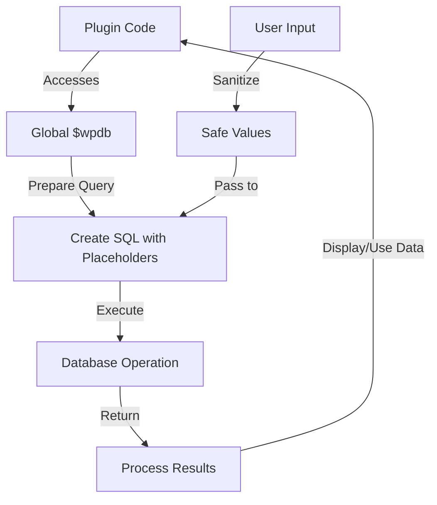

# WordPress Database API

## Introduction

The WordPress Database API provides a standardized way for plugin developers to interact with the WordPress database. It's a crucial part of plugin development that allows you to store, retrieve, update, and delete data in a secure and efficient manner.

WordPress uses the `wpdb` class to handle database operations. This class provides methods to perform common SQL operations while abstracting away some of the complexity and ensuring proper security practices.

In this guide, we'll explore how to use the WordPress Database API effectively in your plugins, ensuring your database interactions are secure, efficient, and follow WordPress best practices.

## The `wpdb` Global Object

WordPress makes the database connection available through the global `$wpdb` object. This object is an instance of the `wpdb` class and provides access to the database connection and various helper methods.

### Accessing the `wpdb` Object

```php
global $wpdb;

// Now you can use $wpdb to interact with the database
```

### Important Properties of `$wpdb`

The `$wpdb` object contains several useful properties:

```php
global $wpdb;

// WordPress table names
echo $wpdb->posts;      // wp_posts
echo $wpdb->users;      // wp_users
echo $wpdb->options;    // wp_options

// Database prefix (typically "wp_")
echo $wpdb->prefix;     // wp_

// Last executed query
echo $wpdb->last_query; // SELECT * FROM wp_posts WHERE...

// Last inserted ID
echo $wpdb->insert_id;  // 42
```

## Basic Database Operations

The `wpdb` class provides methods for the four basic database operations: Select, Insert, Update, and Delete.

### Retrieving Data with SELECT

WordPress provides several methods to retrieve data:

#### 1. `get_results()` - Fetch multiple rows

```php
global $wpdb;

// Get all published posts
$results = $wpdb->get_results(
    "SELECT ID, post_title FROM {$wpdb->posts} WHERE post_status = 'publish' LIMIT 5"
);

// Process results
foreach ($results as $post) {
    echo "Post ID: {$post->ID}, Title: {$post->post_title}<br />";
}
```

**Output:**
```
Post ID: 1, Title: Hello World!
Post ID: 2, Title: Sample Page
Post ID: 3, Title: Privacy Policy
...
```

#### 2. `get_row()` - Fetch a single row

```php
global $wpdb;

// Get a specific post
$post = $wpdb->get_row(
    $wpdb->prepare(
        "SELECT * FROM {$wpdb->posts} WHERE ID = %d",
        1
    )
);

if ($post) {
    echo "Post Title: {$post->post_title}<br />";
    echo "Post Content: " . substr($post->post_content, 0, 50) . "...<br />";
}
```

#### 3. `get_var()` - Fetch a single value

```php
global $wpdb;

// Count published posts
$count = $wpdb->get_var(
    "SELECT COUNT(*) FROM {$wpdb->posts} WHERE post_status = 'publish' AND post_type = 'post'"
);

echo "Total published posts: $count";
```

#### 4. `get_col()` - Fetch a single column

```php
global $wpdb;

// Get all post IDs
$post_ids = $wpdb->get_col(
    "SELECT ID FROM {$wpdb->posts} WHERE post_type = 'post' LIMIT 10"
);

echo "Post IDs: " . implode(', ', $post_ids);
```

### Creating Data with INSERT

The `insert()` method allows you to add new rows to a table:

```php
global $wpdb;

// Insert a new option
$result = $wpdb->insert(
    $wpdb->options,
    [
        'option_name' => 'my_plugin_setting',
        'option_value' => 'some_value',
        'autoload' => 'yes'
    ],
    [
        '%s', // format for option_name (string)
        '%s', // format for option_value (string)
        '%s'  // format for autoload (string)
    ]
);

if ($result) {
    echo "Insert successful! New ID: {$wpdb->insert_id}";
} else {
    echo "Insert failed: {$wpdb->last_error}";
}
```

### Updating Data with UPDATE

Update existing records with the `update()` method:

```php
global $wpdb;

// Update an option
$result = $wpdb->update(
    $wpdb->options,
    [
        'option_value' => 'new_value' // data to update
    ],
    [
        'option_name' => 'my_plugin_setting' // where clause
    ],
    [
        '%s' // format for option_value (string)
    ],
    [
        '%s' // format for option_name in where clause (string)
    ]
);

if ($result !== false) {
    echo "Update successful! Rows affected: $result";
} else {
    echo "Update failed: {$wpdb->last_error}";
}
```

### Deleting Data with DELETE

Remove records with the `delete()` method:

```php
global $wpdb;

// Delete an option
$result = $wpdb->delete(
    $wpdb->options,
    [
        'option_name' => 'my_plugin_setting' // where clause
    ],
    [
        '%s' // format for option_name (string)
    ]
);

if ($result !== false) {
    echo "Delete successful! Rows affected: $result";
} else {
    echo "Delete failed: {$wpdb->last_error}";
}
```

## Using Prepared Statements for Security

One of the most important aspects of database interaction is security. WordPress provides prepared statements to help prevent SQL injection attacks.

### The `prepare()` Method

The `prepare()` method works similar to PHP's `sprintf()` but is optimized for SQL:

```php
global $wpdb;

$user_id = 4; // Potential unsafe user input
$status = 'publish';

// Safe query with prepared statement
$query = $wpdb->prepare(
    "SELECT * FROM {$wpdb->posts} WHERE post_author = %d AND post_status = %s",
    $user_id,
    $status
);

$results = $wpdb->get_results($query);
```

### Placeholder Types

The `prepare()` method supports several placeholders:

- `%d` - Integer
- `%f` - Float
- `%s` - String
- `%` - Literal percentage character

```php
global $wpdb;

// Example with different placeholder types
$query = $wpdb->prepare(
    "SELECT * FROM {$wpdb->postmeta} 
    WHERE post_id = %d 
    AND meta_key = %s 
    AND meta_value > %f",
    42,
    'price',
    19.99
);
```

## Creating Custom Database Tables

For plugins that need to store custom data, you might need to create your own tables.

### Table Creation Process

Here's how to create a custom table during plugin activation:

```php
function my_plugin_create_table() {
    global $wpdb;
    
    $table_name = $wpdb->prefix . 'my_plugin_data';
    $charset_collate = $wpdb->get_charset_collate();
    
    $sql = "CREATE TABLE $table_name (
        id mediumint(9) NOT NULL AUTO_INCREMENT,
        time datetime DEFAULT '0000-00-00 00:00:00' NOT NULL,
        name varchar(100) NOT NULL,
        text text NOT NULL,
        url varchar(100) DEFAULT '' NOT NULL,
        PRIMARY KEY  (id)
    ) $charset_collate;";
    
    // The dbDelta function examines the current table structure, compares it
    // to the desired table structure, and either adds or modifies the table as needed.
    require_once(ABSPATH . 'wp-admin/includes/upgrade.php');
    dbDelta($sql);
}

// Hook to plugin activation
register_activation_hook(__FILE__, 'my_plugin_create_table');
```

### Working with Custom Tables

Once you've created your custom table, you can interact with it like any other table:

```php
function my_plugin_save_data($name, $text, $url) {
    global $wpdb;
    
    $table_name = $wpdb->prefix . 'my_plugin_data';
    
    return $wpdb->insert(
        $table_name,
        [
            'time' => current_time('mysql'),
            'name' => $name,
            'text' => $text,
            'url' => $url
        ],
        [
            '%s', // time format
            '%s', // name format
            '%s', // text format
            '%s'  // url format
        ]
    );
}
```

## Real-world Example: Custom Event Tracker Plugin

Let's create a simple event tracker plugin that demonstrates the WordPress Database API in action.

### Step 1: Create the Table on Plugin Activation

```php
// Plugin Name: Simple Event Tracker
// Description: Tracks custom events on your WordPress site
// Version: 1.0
// Author: Your Name

function set_event_tracker_create_table() {
    global $wpdb;
    
    $table_name = $wpdb->prefix . 'event_tracker';
    $charset_collate = $wpdb->get_charset_collate();
    
    $sql = "CREATE TABLE $table_name (
        id mediumint(9) NOT NULL AUTO_INCREMENT,
        event_time datetime DEFAULT '0000-00-00 00:00:00' NOT NULL,
        event_type varchar(50) NOT NULL,
        event_data text NOT NULL,
        user_id bigint(20) DEFAULT 0 NOT NULL,
        PRIMARY KEY  (id),
        KEY event_type (event_type),
        KEY user_id (user_id)
    ) $charset_collate;";
    
    require_once(ABSPATH . 'wp-admin/includes/upgrade.php');
    dbDelta($sql);
}

register_activation_hook(__FILE__, 'set_event_tracker_create_table');
```

### Step 2: Create Functions to Track Events

```php
function track_event($event_type, $event_data = []) {
    global $wpdb;
    
    $table_name = $wpdb->prefix . 'event_tracker';
    $current_user_id = get_current_user_id();
    
    // Convert array data to JSON
    if (is_array($event_data)) {
        $event_data = json_encode($event_data);
    }
    
    return $wpdb->insert(
        $table_name,
        [
            'event_time' => current_time('mysql'),
            'event_type' => $event_type,
            'event_data' => $event_data,
            'user_id' => $current_user_id
        ],
        [
            '%s', // event_time format
            '%s', // event_type format
            '%s', // event_data format
            '%d'  // user_id format
        ]
    );
}

// Example usage
function track_post_view($post_id) {
    track_event('post_view', [
        'post_id' => $post_id,
        'post_title' => get_the_title($post_id),
        'referrer' => isset($_SERVER['HTTP_REFERER']) ? $_SERVER['HTTP_REFERER'] : ''
    ]);
}

// Hook to track post views
add_action('wp', function() {
    if (is_single()) {
        track_post_view(get_the_ID());
    }
});
```

### Step 3: Create an Admin Page to View Events

```php
function event_tracker_admin_menu() {
    add_menu_page(
        'Event Tracker',
        'Events',
        'manage_options',
        'event-tracker',
        'event_tracker_admin_page',
        'dashicons-chart-area',
        30
    );
}
add_action('admin_menu', 'event_tracker_admin_menu');

function event_tracker_admin_page() {
    global $wpdb;
    $table_name = $wpdb->prefix . 'event_tracker';
    
    // Get recent events
    $events = $wpdb->get_results(
        "SELECT * FROM $table_name ORDER BY event_time DESC LIMIT 50"
    );
    
    // Display events
    echo '<div class="wrap">';
    echo '<h1>Event Tracker</h1>';
    
    if ($events) {
        echo '<table class="wp-list-table widefat fixed striped">';
        echo '<thead><tr>';
        echo '<th>Time</th><th>Event</th><th>User</th><th>Data</th>';
        echo '</tr></thead>';
        echo '<tbody>';
        
        foreach ($events as $event) {
            $user_info = get_userdata($event->user_id);
            $username = $user_info ? $user_info->user_login : 'Guest';
            $data = json_decode($event->event_data, true);
            $pretty_data = is_array($data) ? '<pre>' . print_r($data, true) . '</pre>' : $event->event_data;
            
            echo '<tr>';
            echo '<td>' . $event->event_time . '</td>';
            echo '<td>' . esc_html($event->event_type) . '</td>';
            echo '<td>' . esc_html($username) . '</td>';
            echo '<td>' . $pretty_data . '</td>';
            echo '</tr>';
        }
        
        echo '</tbody></table>';
    } else {
        echo '<p>No events tracked yet.</p>';
    }
    
    echo '</div>';
}
```

## Best Practices for Using the WordPress Database API

When working with the WordPress Database API, keep these best practices in mind:

1. **Always use prepared statements** for queries that include user input to prevent SQL injection attacks.

2. **Use WordPress table names** via the `$wpdb` properties rather than hardcoding them.

3. **Add proper indices** to your custom tables for fields that will be used in WHERE clauses to improve performance.

4. **Sanitize and validate input data** before storing it in the database.

5. **Use database transactions** for complex operations that involve multiple queries:

```php
global $wpdb;

// Start transaction
$wpdb->query('START TRANSACTION');

try {
    // Multiple database operations
    $success1 = $wpdb->insert(/* ... */);
    $success2 = $wpdb->update(/* ... */);
    
    if ($success1 && $success2) {
        $wpdb->query('COMMIT'); // Commit changes if all operations succeed
        return true;
    } else {
        throw new Exception('Database operation failed');
    }
} catch (Exception $e) {
    $wpdb->query('ROLLBACK'); // Rollback on failure
    return false;
}
```

6. **Limit result sets** in queries using LIMIT to prevent memory issues with large datasets.

7. **Check for errors** after database operations:

```php
$result = $wpdb->query($query);
if ($result === false) {
    // Handle error
    error_log('Database error: ' . $wpdb->last_error);
}
```

8. **Consider using WordPress functions** like `update_option()`, `get_post_meta()`, etc., when appropriate instead of direct database queries.

## Database API Workflow

Here's a visual representation of typical database operations in WordPress:



## Summary

The WordPress Database API provides a powerful and secure way to interact with the WordPress database. By using the `wpdb` class and its methods, you can:

- Retrieve data with `get_results()`, `get_row()`, `get_var()`, and `get_col()`
- Insert data with `insert()`
- Update data with `update()`
- Delete data with `delete()`
- Create secure queries with `prepare()`
- Create custom tables for your plugin data

Remember to always use prepared statements when handling user input and follow WordPress coding standards and best practices for database operations.

## Additional Resources

- [WordPress Developer Documentation: Database API](https://developer.wordpress.org/plugins/database/)
- [WordPress Codex: wpdb Class](https://codex.wordpress.org/Class_Reference/wpdb)
- [WordPress Codex: Creating Tables with Plugins](https://codex.wordpress.org/Creating_Tables_with_Plugins)

## Exercises

1. Create a simple plugin that tracks the number of times each post is viewed and displays this count in the admin area.

2. Extend the event tracker example to include filtering by event type and date range.

3. Create a custom table to store user feedback responses and build a simple form to collect and display this feedback.

4. Write a function that optimizes a large database query by using pagination and proper indexing.

5. Implement database error handling and logging in a plugin to capture and report any database issues.