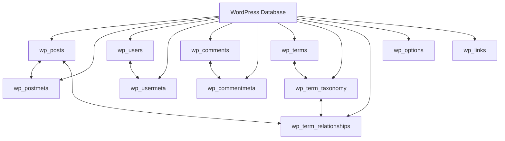
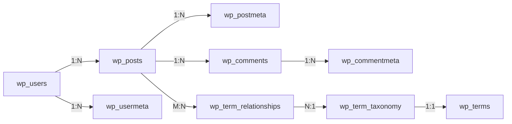

# WordPress Database Structure

## Introduction

When you install WordPress, it creates a set of tables in a MySQL database to store all your website's content and settings. Understanding this database structure is crucial for WordPress developers who want to build custom plugins, themes, or troubleshoot issues effectively.

In this guide, we'll explore the WordPress database structure, learn about the core tables, understand how they relate to each other, and look at practical ways to interact with the database.

## The WordPress Database Schema

WordPress uses MySQL (or MariaDB) as its database management system. Upon installation, WordPress creates a set of tables with a standard prefix (typically `wp_`, though this can be customized during installation for security reasons).

Here's an overview of the WordPress database structure with its default tables:



Let's explore each core table and its purpose.

## Core Database Tables

### 1. Content Storage Tables

#### wp_posts

The `wp_posts` table is one of the most important tables in WordPress. It stores:
- Blog posts
- Pages
- Attachments (media files)
- Navigation menu items
- Custom post types
- Revisions

```sql
DESCRIBE wp_posts;
```

The table includes these key fields:
- `ID`: Unique identifier for each post
- `post_author`: User ID of the post author
- `post_date`: Publication date
- `post_content`: The main content
- `post_title`: The title
- `post_excerpt`: The excerpt
- `post_status`: Publication status (publish, draft, etc.)
- `post_name`: URL slug
- `post_type`: Type (post, page, attachment, etc.)

#### wp_postmeta

This table stores additional data (metadata) related to posts:

```sql
DESCRIBE wp_postmeta;
```

Key fields:
- `meta_id`: Unique identifier for each metadata entry
- `post_id`: The post ID this metadata belongs to
- `meta_key`: The metadata key name
- `meta_value`: The value of the metadata

### 2. User Tables

#### wp_users

Stores user account information:

```sql
DESCRIBE wp_users;
```

Key fields:
- `ID`: Unique identifier for each user
- `user_login`: Username
- `user_pass`: Encrypted password
- `user_email`: Email address
- `user_registered`: Registration date
- `display_name`: Name displayed publicly

#### wp_usermeta

Stores additional user data:

```sql
DESCRIBE wp_usermeta;
```

Key fields:
- `umeta_id`: Unique identifier for each user metadata
- `user_id`: The user ID this metadata belongs to
- `meta_key`: The metadata key name
- `meta_value`: The value of the metadata

### 3. Taxonomy Tables

#### wp_terms

Stores taxonomy terms (categories, tags, etc.):

```sql
DESCRIBE wp_terms;
```

Key fields:
- `term_id`: Unique identifier for each term
- `name`: The name of the term
- `slug`: URL-friendly version of the name
- `term_group`: For grouping terms (rarely used)

#### wp_term_taxonomy

Defines what each term is:

```sql
DESCRIBE wp_term_taxonomy;
```

Key fields:
- `term_taxonomy_id`: Unique identifier
- `term_id`: Corresponds to wp_terms.term_id
- `taxonomy`: Type of taxonomy (category, post_tag, etc.)
- `description`: Description of the term
- `parent`: Parent term ID (for hierarchical taxonomies)
- `count`: Number of posts associated with the term

#### wp_term_relationships

Links posts to taxonomy terms:

```sql
DESCRIBE wp_term_relationships;
```

Key fields:
- `object_id`: Usually the post ID
- `term_taxonomy_id`: The term taxonomy ID
- `term_order`: For ordering terms (rarely used)

### 4. Comment Tables

#### wp_comments

Stores comments:

```sql
DESCRIBE wp_comments;
```

Key fields:
- `comment_ID`: Unique identifier for each comment
- `comment_post_ID`: The post ID the comment belongs to
- `comment_author`: Name of the comment author
- `comment_author_email`: Email of the comment author
- `comment_date`: Date of the comment
- `comment_content`: The comment text
- `comment_approved`: Approval status

#### wp_commentmeta

Stores additional comment metadata:

```sql
DESCRIBE wp_commentmeta;
```

Key fields:
- `meta_id`: Unique identifier for each metadata
- `comment_id`: The comment ID this metadata belongs to
- `meta_key`: The metadata key name
- `meta_value`: The value of the metadata

### 5. Options Table

#### wp_options

Stores site-wide settings and configuration:

```sql
DESCRIBE wp_options;
```

Key fields:
- `option_id`: Unique identifier for each option
- `option_name`: The name of the option
- `option_value`: The value of the option
- `autoload`: Whether to load this option when WordPress starts

### 6. Links Table (Deprecated)

#### wp_links

An older table that stored blogroll links (largely unused in modern WordPress):

```sql
DESCRIBE wp_links;
```

## Table Relationships

Understanding how WordPress tables relate to each other is crucial:



For example:
- One post can have multiple post meta entries
- One user can create multiple posts
- One post can have multiple comments
- Posts can belong to multiple categories or tags

## Interacting with the WordPress Database

WordPress provides a set of functions to safely interact with the database. Direct SQL queries should be avoided when possible.

### Getting Data from the Database

#### Example 1: Retrieving Posts

```php
// Get the 5 most recent published posts
$recent_posts = wp_get_recent_posts(array(
    'numberposts' => 5,
    'post_status' => 'publish'
));

foreach ($recent_posts as $post) {
    echo '<p>' . $post['post_title'] . '</p>';
}
```

#### Example 2: Retrieving Custom Fields (Post Meta)

```php
// Get a custom field value for a specific post
$post_id = 123;
$location = get_post_meta($post_id, 'location', true);

echo 'Event location: ' . $location;
```

### Updating Data in the Database

#### Example 3: Updating a Post

```php
// Update a post title
$post_data = array(
    'ID' => 123,
    'post_title' => 'Updated Title'
);

wp_update_post($post_data);
```

#### Example 4: Working with Options

```php
// Save a setting
update_option('my_plugin_version', '1.0.0');

// Get a setting
$version = get_option('my_plugin_version', 'default_value');
echo 'Plugin version: ' . $version;
```

### Direct Database Access (When Necessary)

While WordPress functions should be your first choice, sometimes you may need direct database access:

```php
global $wpdb;

// Get all posts with a specific meta value
$results = $wpdb->get_results(
    $wpdb->prepare(
        "SELECT * FROM {$wpdb->posts} p
        JOIN {$wpdb->postmeta} pm ON p.ID = pm.post_id
        WHERE pm.meta_key = %s
        AND pm.meta_value = %s",
        'featured',
        'yes'
    )
);

foreach ($results as $post) {
    echo $post->post_title . '<br />';
}
```

## Real-World Applications

### Example 1: Building a Custom Dashboard Widget

Let's create a dashboard widget that shows posts with pending comments:

```php
function custom_dashboard_widget() {
    global $wpdb;
    
    $pending_comments = $wpdb->get_results(
        "SELECT p.ID, p.post_title, COUNT(c.comment_ID) as pending_count
        FROM {$wpdb->posts} p
        JOIN {$wpdb->comments} c ON p.ID = c.comment_post_ID
        WHERE c.comment_approved = '0'
        GROUP BY p.ID
        ORDER BY pending_count DESC
        LIMIT 5"
    );
    
    if ($pending_comments) {
        echo '<ul>';
        foreach ($pending_comments as $post) {
            $edit_link = get_edit_post_link($post->ID);
            echo '<li>';
            echo '<a href="' . esc_url($edit_link) . '">';
            echo esc_html($post->post_title);
            echo '</a> - ';
            echo esc_html($post->pending_count) . ' pending comments';
            echo '</li>';
        }
        echo '</ul>';
    } else {
        echo 'No posts with pending comments.';
    }
}

function register_custom_dashboard_widget() {
    wp_add_dashboard_widget(
        'custom_dashboard_widget',
        'Posts with Pending Comments',
        'custom_dashboard_widget'
    );
}
add_action('wp_dashboard_setup', 'register_custom_dashboard_widget');
```

### Example 2: Custom Database Report

Creating a function to analyze post publication patterns:

```php
function analyze_posting_patterns() {
    global $wpdb;
    
    $monthly_counts = $wpdb->get_results(
        "SELECT YEAR(post_date) as year, 
        MONTH(post_date) as month, 
        COUNT(*) as post_count 
        FROM {$wpdb->posts} 
        WHERE post_type = 'post' 
        AND post_status = 'publish' 
        GROUP BY YEAR(post_date), MONTH(post_date) 
        ORDER BY year DESC, month DESC 
        LIMIT 12"
    );
    
    echo '<table class="widefat">';
    echo '<thead><tr><th>Month/Year</th><th>Posts Published</th></tr></thead>';
    echo '<tbody>';
    
    foreach ($monthly_counts as $data) {
        $date = new DateTime($data->year . '-' . $data->month . '-01');
        echo '<tr>';
        echo '<td>' . $date->format('F Y') . '</td>';
        echo '<td>' . $data->post_count . '</td>';
        echo '</tr>';
    }
    
    echo '</tbody></table>';
}
```

## Database Optimization Considerations

Working with the WordPress database efficiently requires attention to optimization:

1. **Use Indexes**: WordPress core tables are indexed, but custom tables may need careful index planning.
2. **Caching**: Avoid repeated queries by caching results with the Transients API:

```php
function get_complex_data() {
    // Check if the data is cached
    $data = get_transient('my_complex_data');
    
    // If no cache, generate data
    if ($data === false) {
        global $wpdb;
        
        $data = $wpdb->get_results("SELECT * FROM {$wpdb->posts} WHERE post_type = 'post' LIMIT 100");
        
        // Cache for 1 hour (3600 seconds)
        set_transient('my_complex_data', $data, 3600);
    }
    
    return $data;
}
```

3. **Batch Processing**: When working with large datasets, process in batches to avoid timeouts:

```php
function process_posts_in_batches($batch_size = 50) {
    $offset = 0;
    $processed = 0;
    
    while (true) {
        $posts = get_posts(array(
            'post_type' => 'post',
            'posts_per_page' => $batch_size,
            'offset' => $offset
        ));
        
        if (empty($posts)) {
            break; // No more posts to process
        }
        
        foreach ($posts as $post) {
            // Process each post...
            $processed++;
        }
        
        $offset += $batch_size;
        
        // Optional: add a small delay to reduce server load
        usleep(100000); // 100ms pause
    }
    
    return $processed;
}
```

## Summary

The WordPress database structure is carefully designed to manage content, users, settings, and taxonomies efficiently. Key takeaways:

1. WordPress uses a series of interconnected tables to store different types of data
2. The `wp_posts` table is central, storing all content including posts, pages, and attachments
3. Metadata tables store additional information for posts, users, and comments
4. The taxonomy system connects posts to categories and tags
5. WordPress provides API functions to safely interact with the database
6. For advanced operations, direct database access is possible with `$wpdb`

Understanding this structure is fundamental for WordPress development, allowing you to create efficient, powerful plugins and themes that leverage the full capability of the WordPress platform.

## Additional Resources

- [WordPress Database Description](https://codex.wordpress.org/Database_Description) - Detailed documentation of the WordPress database schema
- [WordPress Developer Resources](https://developer.wordpress.org/) - Official WordPress developer documentation
- [WordPress Data API](https://developer.wordpress.org/plugins/database/) - Guide to working with WordPress data

## Practice Exercises

1. Write a function that lists all users who have published posts in the last 30 days.
2. Create a function that identifies orphaned post meta (metadata where the associated post no longer exists).
3. Develop a simple plugin that creates a custom table to track post view counts.
4. Write a query to find posts with specific combinations of taxonomy terms.
5. Create a function that migrates data from a custom field to a different database structure.

By mastering the WordPress database structure, you'll be equipped to build more powerful and efficient WordPress solutions.