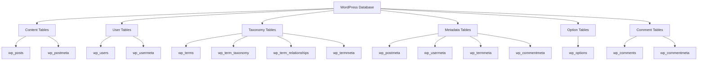
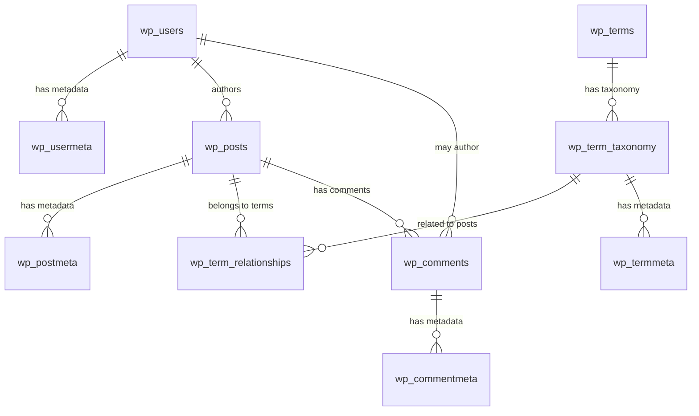

# WordPress Tables

## Introduction

WordPress uses MySQL or MariaDB as its backend database system to store all your website's content, settings, and other essential data. Understanding the WordPress database structure is crucial for developing custom functionality, optimizing performance, and troubleshooting issues.

In this guide, we'll explore the core WordPress database tables, their structure, relationships, and how you can interact with them in your development projects. Whether you're building plugins, themes, or just want to understand how WordPress stores data, this knowledge will be invaluable.

## WordPress Database Overview

When you install WordPress, it creates a set of tables in your database with the prefix you specified during installation (default is `wp_`). These tables store everything from posts and pages to user information and site settings.



## Core WordPress Tables

Let's explore the main tables that power WordPress:

### 1. wp_posts

This is one of the most important tables in WordPress. It stores all your content including posts, pages, attachments, revisions, and custom post types.

#### Table Structure

```sql
CREATE TABLE `wp_posts` (
  `ID` bigint(20) unsigned NOT NULL AUTO_INCREMENT,
  `post_author` bigint(20) unsigned NOT NULL DEFAULT 0,
  `post_date` datetime NOT NULL DEFAULT '0000-00-00 00:00:00',
  `post_date_gmt` datetime NOT NULL DEFAULT '0000-00-00 00:00:00',
  `post_content` longtext NOT NULL,
  `post_title` text NOT NULL,
  `post_excerpt` text NOT NULL,
  `post_status` varchar(20) NOT NULL DEFAULT 'publish',
  `comment_status` varchar(20) NOT NULL DEFAULT 'open',
  `ping_status` varchar(20) NOT NULL DEFAULT 'open',
  `post_password` varchar(255) NOT NULL DEFAULT '',
  `post_name` varchar(200) NOT NULL DEFAULT '',
  `to_ping` text NOT NULL,
  `pinged` text NOT NULL,
  `post_modified` datetime NOT NULL DEFAULT '0000-00-00 00:00:00',
  `post_modified_gmt` datetime NOT NULL DEFAULT '0000-00-00 00:00:00',
  `post_content_filtered` longtext NOT NULL,
  `post_parent` bigint(20) unsigned NOT NULL DEFAULT 0,
  `guid` varchar(255) NOT NULL DEFAULT '',
  `menu_order` int(11) NOT NULL DEFAULT 0,
  `post_type` varchar(20) NOT NULL DEFAULT 'post',
  `post_mime_type` varchar(100) NOT NULL DEFAULT '',
  `comment_count` bigint(20) NOT NULL DEFAULT 0,
  PRIMARY KEY (`ID`)
);
```

#### Key Fields

- `ID`: Unique identifier for each post
- `post_author`: ID of the user who created the post (links to wp_users.ID)
- `post_content`: The actual content of the post
- `post_title`: The title of the post
- `post_status`: Status of the post (publish, draft, etc.)
- `post_type`: Type of post (post, page, attachment, revision, or custom post type)

#### Example Query

To retrieve all published blog posts:

```php
global $wpdb;
$published_posts = $wpdb->get_results(
    "SELECT ID, post_title, post_date 
     FROM {$wpdb->posts} 
     WHERE post_type = 'post' 
     AND post_status = 'publish' 
     ORDER BY post_date DESC"
);

// Output
foreach ($published_posts as $post) {
    echo "<p>Post ID: {$post->ID}<br />";
    echo "Title: {$post->post_title}<br />";
    echo "Published: {$post->post_date}</p>";
}
```

### 2. wp_postmeta

This table stores additional information (metadata) related to posts.

#### Table Structure

```sql
CREATE TABLE `wp_postmeta` (
  `meta_id` bigint(20) unsigned NOT NULL AUTO_INCREMENT,
  `post_id` bigint(20) unsigned NOT NULL DEFAULT 0,
  `meta_key` varchar(255) DEFAULT NULL,
  `meta_value` longtext,
  PRIMARY KEY (`meta_id`),
  KEY `post_id` (`post_id`),
  KEY `meta_key` (`meta_key`(191))
);
```

#### Key Fields

- `meta_id`: Unique identifier for each metadata entry
- `post_id`: ID of the post this metadata belongs to
- `meta_key`: Name of the metadata
- `meta_value`: Value of the metadata

#### Example Query

To retrieve all custom fields for a specific post:

```php
global $wpdb;
$post_id = 123; // Replace with your post ID
$custom_fields = $wpdb->get_results(
    $wpdb->prepare(
        "SELECT meta_key, meta_value 
         FROM {$wpdb->postmeta} 
         WHERE post_id = %d",
        $post_id
    )
);

// Output
foreach ($custom_fields as $field) {
    echo "<p>Meta Key: {$field->meta_key}<br />";
    echo "Meta Value: {$field->meta_value}</p>";
}
```

### 3. wp_users

This table stores user account information.

#### Table Structure

```sql
CREATE TABLE `wp_users` (
  `ID` bigint(20) unsigned NOT NULL AUTO_INCREMENT,
  `user_login` varchar(60) NOT NULL DEFAULT '',
  `user_pass` varchar(255) NOT NULL DEFAULT '',
  `user_nicename` varchar(50) NOT NULL DEFAULT '',
  `user_email` varchar(100) NOT NULL DEFAULT '',
  `user_url` varchar(100) NOT NULL DEFAULT '',
  `user_registered` datetime NOT NULL DEFAULT '0000-00-00 00:00:00',
  `user_activation_key` varchar(255) NOT NULL DEFAULT '',
  `user_status` int(11) NOT NULL DEFAULT 0,
  `display_name` varchar(250) NOT NULL DEFAULT '',
  PRIMARY KEY (`ID`),
  KEY `user_login_key` (`user_login`),
  KEY `user_nicename` (`user_nicename`),
  KEY `user_email` (`user_email`)
);
```

#### Key Fields

- `ID`: Unique identifier for each user
- `user_login`: Username for logging in
- `user_pass`: Hashed password
- `user_email`: Email address
- `display_name`: Name displayed on the site

### 4. wp_usermeta

Stores additional information about users.

#### Table Structure

```sql
CREATE TABLE `wp_usermeta` (
  `umeta_id` bigint(20) unsigned NOT NULL AUTO_INCREMENT,
  `user_id` bigint(20) unsigned NOT NULL DEFAULT 0,
  `meta_key` varchar(255) DEFAULT NULL,
  `meta_value` longtext,
  PRIMARY KEY (`umeta_id`),
  KEY `user_id` (`user_id`),
  KEY `meta_key` (`meta_key`(191))
);
```

### 5. wp_options

Stores site-wide options and configuration settings.

#### Table Structure

```sql
CREATE TABLE `wp_options` (
  `option_id` bigint(20) unsigned NOT NULL AUTO_INCREMENT,
  `option_name` varchar(191) NOT NULL DEFAULT '',
  `option_value` longtext NOT NULL,
  `autoload` varchar(20) NOT NULL DEFAULT 'yes',
  PRIMARY KEY (`option_id`),
  UNIQUE KEY `option_name` (`option_name`),
  KEY `autoload` (`autoload`)
);
```

#### Key Fields

- `option_id`: Unique identifier for each option
- `option_name`: Name of the option
- `option_value`: Value of the option
- `autoload`: Determines if the option is loaded automatically with WordPress

#### Example Query

```php
global $wpdb;
$site_title = $wpdb->get_var(
    "SELECT option_value 
     FROM {$wpdb->options} 
     WHERE option_name = 'blogname'"
);

echo "Site Title: {$site_title}";
```

### 6. wp_comments

Stores comments submitted to posts and pages.

#### Table Structure

```sql
CREATE TABLE `wp_comments` (
  `comment_ID` bigint(20) unsigned NOT NULL AUTO_INCREMENT,
  `comment_post_ID` bigint(20) unsigned NOT NULL DEFAULT 0,
  `comment_author` tinytext NOT NULL,
  `comment_author_email` varchar(100) NOT NULL DEFAULT '',
  `comment_author_url` varchar(200) NOT NULL DEFAULT '',
  `comment_author_IP` varchar(100) NOT NULL DEFAULT '',
  `comment_date` datetime NOT NULL DEFAULT '0000-00-00 00:00:00',
  `comment_date_gmt` datetime NOT NULL DEFAULT '0000-00-00 00:00:00',
  `comment_content` text NOT NULL,
  `comment_karma` int(11) NOT NULL DEFAULT 0,
  `comment_approved` varchar(20) NOT NULL DEFAULT '1',
  `comment_agent` varchar(255) NOT NULL DEFAULT '',
  `comment_type` varchar(20) NOT NULL DEFAULT 'comment',
  `comment_parent` bigint(20) unsigned NOT NULL DEFAULT 0,
  `user_id` bigint(20) unsigned NOT NULL DEFAULT 0,
  PRIMARY KEY (`comment_ID`)
);
```

### 7. Taxonomy Tables

WordPress uses several tables to manage taxonomies (categories, tags, etc.):

- `wp_terms`: Stores taxonomy terms (category names, tag names)
- `wp_term_taxonomy`: Links terms to taxonomies
- `wp_term_relationships`: Links posts to terms
- `wp_termmeta`: Stores metadata for taxonomy terms

## Table Relationships

Understanding the relationships between WordPress tables is crucial for complex database operations.



## Working with WordPress Tables

### Using wpdb Class

WordPress provides the `wpdb` class to safely interact with the database:

```php
global $wpdb;

// SELECT query
$results = $wpdb->get_results("SELECT * FROM {$wpdb->posts} LIMIT 5");

// INSERT query
$wpdb->insert(
    $wpdb->postmeta,
    array(
        'post_id' => 123,
        'meta_key' => 'custom_field',
        'meta_value' => 'Custom value'
    ),
    array('%d', '%s', '%s')
);

// UPDATE query
$wpdb->update(
    $wpdb->posts,
    array('post_title' => 'Updated Title'),  // data
    array('ID' => 123),                      // where
    array('%s'),                             // data format
    array('%d')                              // where format
);

// DELETE query
$wpdb->delete(
    $wpdb->postmeta,
    array('meta_id' => 456),
    array('%d')
);
```

### Using WordPress Functions

WordPress provides many wrapper functions that interact with the database:

```php
// Get post data
$post = get_post(123);
echo $post->post_title;

// Get post meta
$meta_value = get_post_meta(123, 'custom_field', true);
echo $meta_value;

// Update post meta
update_post_meta(123, 'custom_field', 'New value');

// Get user data
$user = get_userdata(1);
echo $user->display_name;

// Get option
$site_title = get_option('blogname');
echo $site_title;

// Update option
update_option('blogname', 'My New Site Title');
```

## Real-World Examples

### Example 1: Creating a Custom Dashboard Widget to Show Recent Posts

```php
function custom_dashboard_widget() {
    global $wpdb;
    
    $recent_posts = $wpdb->get_results(
        "SELECT ID, post_title, post_date 
         FROM {$wpdb->posts} 
         WHERE post_type = 'post' 
         AND post_status = 'publish' 
         ORDER BY post_date DESC 
         LIMIT 5"
    );
    
    if ($recent_posts) {
        echo '<ul>';
        foreach ($recent_posts as $post) {
            $edit_link = get_edit_post_link($post->ID);
            echo '<li>';
            echo '<a href="' . $edit_link . '">' . $post->post_title . '</a>';
            echo ' - ' . human_time_diff(strtotime($post->post_date), current_time('timestamp')) . ' ago';
            echo '</li>';
        }
        echo '</ul>';
    } else {
        echo '<p>No recent posts found.</p>';
    }
}

function add_custom_dashboard_widget() {
    wp_add_dashboard_widget(
        'custom_dashboard_widget',
        'Recent Posts',
        'custom_dashboard_widget'
    );
}
add_action('wp_dashboard_setup', 'add_custom_dashboard_widget');
```

### Example 2: Finding Orphaned Post Meta

This script finds and counts metadata entries that don't have associated posts:

```php
function find_orphaned_postmeta() {
    global $wpdb;
    
    $orphaned_meta = $wpdb->get_var(
        "SELECT COUNT(pm.meta_id)
         FROM {$wpdb->postmeta} pm
         LEFT JOIN {$wpdb->posts} p ON p.ID = pm.post_id
         WHERE p.ID IS NULL"
    );
    
    return $orphaned_meta;
}

// Usage
$orphaned_count = find_orphaned_postmeta();
echo "Found {$orphaned_count} orphaned postmeta entries";
```

### Example 3: Creating Custom Database Reports

```php
function posts_by_author_report() {
    global $wpdb;
    
    $results = $wpdb->get_results(
        "SELECT u.display_name, COUNT(p.ID) as post_count
         FROM {$wpdb->users} u
         LEFT JOIN {$wpdb->posts} p ON u.ID = p.post_author AND p.post_type = 'post' AND p.post_status = 'publish'
         GROUP BY u.ID
         ORDER BY post_count DESC"
    );
    
    echo '<h2>Posts by Author</h2>';
    echo '<table class="widefat">';
    echo '<thead><tr><th>Author</th><th>Published Posts</th></tr></thead>';
    echo '<tbody>';
    
    foreach ($results as $row) {
        echo '<tr>';
        echo '<td>' . $row->display_name . '</td>';
        echo '<td>' . $row->post_count . '</td>';
        echo '</tr>';
    }
    
    echo '</tbody></table>';
}
```

## Best Practices When Working with WordPress Tables

1. **Always use prepared statements** to prevent SQL injection:

```php
$wpdb->prepare("SELECT * FROM {$wpdb->posts} WHERE post_author = %d", $author_id);
```

2. **Use WordPress functions** when available instead of direct SQL queries:

```php
// Instead of direct SQL to get post data
$post = get_post(123);

// Instead of direct SQL to get all posts
$posts = get_posts(['post_type' => 'post', 'posts_per_page' => 10]);
```

3. **Prefix custom table names** to avoid conflicts:

```php
$table_name = $wpdb->prefix . 'my_custom_table';
```

4. **Use appropriate data formats** when inserting or updating:

```php
$wpdb->insert(
    $wpdb->postmeta,
    array('post_id' => 123, 'meta_value' => 'test'),
    array('%d', '%s') // Specifying integer and string formats
);
```

5. **Index your custom tables** for better performance.

6. **Batch operations** for large datasets:

```php
// Process 100 records at a time
$offset = 0;
$limit = 100;

do {
    $results = $wpdb->get_results($wpdb->prepare(
        "SELECT * FROM {$wpdb->posts} 
         WHERE post_type = 'post' 
         LIMIT %d, %d",
         $offset, $limit
    ));
    
    // Process $results
    foreach ($results as $post) {
        // Do something with each post
    }
    
    $offset += $limit;
} while (count($results) == $limit);
```

## Summary

WordPress database tables are the foundation of your WordPress site, storing everything from content and users to settings and relationships. Understanding these tables and how they relate to each other is essential for advanced WordPress development.

In this guide, we've covered:
- The core WordPress database tables and their structures
- Relationships between different tables
- How to query WordPress tables using `wpdb` and WordPress functions
- Real-world examples of working with WordPress tables
- Best practices for database operations

By mastering WordPress tables, you'll be able to create more efficient, powerful, and robust plugins and themes.

## Additional Resources and Exercises

### Resources
1. [WordPress Codex: Database Description](https://codex.wordpress.org/Database_Description)
2. [WordPress Developer Resources: wpdb Class](https://developer.wordpress.org/reference/classes/wpdb/)
3. [WordPress Data: The Definitive Guide to WordPress Database](https://deliciousbrains.com/tour-wordpress-database/)

### Exercises

1. **Basic**: Write a query to find all published posts that have a specific meta key.
2. **Intermediate**: Create a function that counts how many posts each author has created, broken down by post status.
3. **Advanced**: Build a custom admin page that displays database statistics about your WordPress site (number of posts, pages, users, comments, etc.).
4. **Expert**: Create a tool that identifies and optionally cleans up orphaned data in your WordPress database (meta entries without a parent, revisions older than X days, etc.).

Remember to always back up your database before performing any direct database operations, especially when making changes to data.