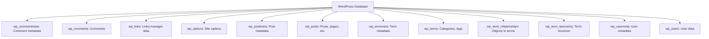
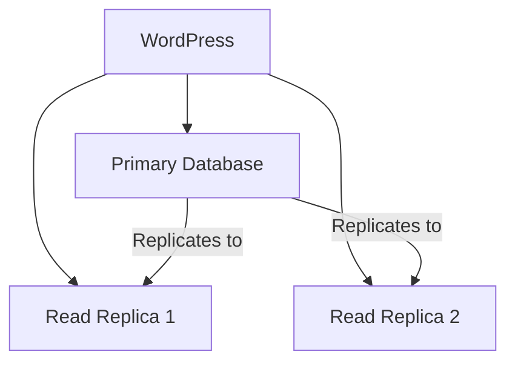

# WordPress Database Optimization

## Introduction

WordPress relies heavily on its database to store and retrieve information for your website. Over time, as your site grows with more content, comments, revisions, and plugin data, the database can become bloated and inefficient. This can lead to slower page loading times, higher server resource consumption, and a poor user experience for your visitors.

Database optimization is the process of improving the performance and efficiency of your WordPress database. By implementing proper optimization techniques, you can significantly speed up your website, reduce server load, and ensure a smoother experience for your users.

In this guide, we'll explore various methods to optimize your WordPress database, from basic cleanup to advanced performance-tuning techniques suitable for beginners.

## Why Database Optimization Matters

Before diving into optimization techniques, let's understand why database optimization is crucial:

1. **Faster Page Loading**: An optimized database results in quicker query execution and faster page loads
2. **Better Server Performance**: Less database bloat means reduced server resource usage
3. **Improved User Experience**: Faster sites lead to better user engagement and retention
4. **Higher SEO Rankings**: Page speed is a ranking factor for search engines
5. **Reduced Backup Size**: Smaller databases are quicker to back up and restore

## Understanding WordPress Database Structure

The WordPress database consists of several tables that store different types of data. A standard WordPress installation includes 12 default tables, although plugins and themes may add more:



Each table serves a specific purpose, and they're all connected through relationships that allow WordPress to function as a content management system.

## Basic Database Optimization Techniques

### 1. Clean Up Post Revisions

WordPress automatically saves revisions of your posts and pages as you edit them. While this is useful for content recovery, it can lead to database bloat.

You can limit the number of revisions by adding this line to your `wp-config.php` file:

```php
define('WP_POST_REVISIONS', 3); // Limits to 3 revisions per post
```

To disable revisions completely:

```php
define('WP_POST_REVISIONS', false);
```

### 2. Remove Auto-Saved Drafts

WordPress auto-saves your content periodically. You can adjust the auto-save interval by adding this to your `wp-config.php`:

```php
define('AUTOSAVE_INTERVAL', 300); // Set auto-save to 5 minutes (300 seconds)
```

### 3. Clear Trash Automatically

By default, WordPress keeps items in trash for 30 days. You can change this by adding:

```php
define('EMPTY_TRASH_DAYS', 7); // Empty trash after 7 days
```

To disable the trash feature completely:

```php
define('EMPTY_TRASH_DAYS', 0);
```

### 4. Clean Up Database Tables

The following SQL queries can help clean up common sources of database bloat. Always back up your database before running these queries!

Remove post revisions:

```sql
DELETE FROM wp_posts WHERE post_type = 'revision';
```

Delete trashed posts:

```sql
DELETE FROM wp_posts WHERE post_status = 'trash';
```

Remove orphaned post meta:

```sql
DELETE pm
FROM wp_postmeta pm
LEFT JOIN wp_posts p ON p.ID = pm.post_id
WHERE p.ID IS NULL;
```

Clean up orphaned comment meta:

```sql
DELETE cm
FROM wp_commentmeta cm
LEFT JOIN wp_comments c ON c.comment_ID = cm.comment_id
WHERE c.comment_ID IS NULL;
```

## Intermediate Optimization Techniques

### 1. Database Table Optimization

MySQL tables can become fragmented over time. Running the OPTIMIZE TABLE command helps reorganize the data storage and update table statistics:

```sql
OPTIMIZE TABLE wp_posts;
OPTIMIZE TABLE wp_postmeta;
OPTIMIZE TABLE wp_options;
```

To optimize all tables at once:

```php
// This PHP code would optimize all tables in the database
global $wpdb;
$tables = $wpdb->get_results('SHOW TABLES');
foreach ($tables as $table) {
  foreach ($table as $t) {
    $wpdb->query("OPTIMIZE TABLE $t");
  }
}
```

### 2. Cleanup WP Options Table

The `wp_options` table often contains transients (temporary data) that may not be properly cleaned up:

```sql
DELETE FROM wp_options WHERE option_name LIKE '%\_transient\_%' AND autoload = 'yes';
```

### 3. Index Critical Database Fields

Adding indexes to frequently queried fields can dramatically improve performance:

```sql
ALTER TABLE wp_postmeta ADD INDEX meta_value (meta_value(32));
```

### 4. Implement Database Caching

Add object caching to your WordPress site by using a persistent object cache like Redis or Memcached. This reduces database queries significantly.

Here's a simple implementation with the Redis Object Cache plugin:

1. Install a Redis server on your host
2. Add this to your `wp-config.php`:

```php
define('WP_CACHE', true);
define('WP_REDIS_HOST', '127.0.0.1');  // Redis server address
define('WP_REDIS_PORT', 6379);          // Redis port
```

## Advanced Optimization Techniques

### 1. Database Replication

For high-traffic websites, implementing a primary-replica database setup can distribute the database load:



### 2. Database Query Monitoring

Monitor slow database queries by enabling the MySQL slow query log. Add this to your MySQL configuration:

```
slow_query_log = 1
slow_query_log_file = /var/log/mysql/slow-query.log
long_query_time = 1
```

### 3. Optimize wp_options Table

The `wp_options` table can become a bottleneck, especially with the `autoload` field set to 'yes'. Here's how to find the biggest autoloaded options:

```sql
SELECT option_name, length(option_value) as option_value_length 
FROM wp_options 
WHERE autoload='yes' 
ORDER BY option_value_length DESC 
LIMIT 10;
```

Then, for options that don't need to be autoloaded:

```sql
UPDATE wp_options SET autoload = 'no' WHERE option_name = 'some_big_option';
```

## Using Plugins for Database Optimization

Several plugins can help automate the database optimization process:

### WP-Optimize

WP-Optimize is a comprehensive tool that helps clean and optimize your database:

```php
// Example of how WP-Optimize might run a cleanup task
function wp_optimize_example() {
    // Clean post revisions
    $wpdb->query("DELETE FROM $wpdb->posts WHERE post_type = 'revision'");
    
    // Clean auto drafts
    $wpdb->query("DELETE FROM $wpdb->posts WHERE post_status = 'auto-draft'");
}
```

### Advanced Database Cleaner

This plugin offers detailed analysis and cleaning options for your database:

```php
// Advanced Database Cleaner might analyze tables like this
function analyze_tables_example() {
    $tables = $wpdb->get_results('SHOW TABLES');
    foreach ($tables as $table) {
        foreach ($table as $t) {
            $rows = $wpdb->get_var("SELECT COUNT(*) FROM $t");
            $size = $wpdb->get_var("SELECT ROUND(((DATA_LENGTH + INDEX_LENGTH) / 1024 / 1024), 2) 
                                   FROM information_schema.TABLES 
                                   WHERE TABLE_SCHEMA = '$wpdb->dbname' AND TABLE_NAME = '$t'");
            // Output: Table name, number of rows, size in MB
        }
    }
}
```

## Real-World Case Study

Let's look at a practical example of database optimization impact:

A WordPress blog with 500 posts and 3 years of content was experiencing slow load times (average 4.5 seconds). After implementing:

1. Cleaning 2,500+ post revisions
2. Removing 15,000+ spam comments
3. Optimizing database tables
4. Adding proper indexes
5. Implementing Redis object cache

The results were:
- Database size reduced from 250MB to 70MB
- Page load time decreased to 1.8 seconds
- Server CPU usage dropped by 35%

```php
// Before optimization
$before = microtime(true);
// Run a complex query
$results = $wpdb->get_results("SELECT * FROM wp_posts JOIN wp_postmeta ON wp_posts.ID = wp_postmeta.post_id WHERE post_status = 'publish'");
echo "Query execution time: " . (microtime(true) - $before) . " seconds";
// Output: Query execution time: 2.34 seconds

// After optimization
$before = microtime(true);
// Same query after database optimization
$results = $wpdb->get_results("SELECT * FROM wp_posts JOIN wp_postmeta ON wp_posts.ID = wp_postmeta.post_id WHERE post_status = 'publish'");
echo "Query execution time: " . (microtime(true) - $before) . " seconds";
// Output: Query execution time: 0.78 seconds
```

## Best Practices for Ongoing Database Maintenance

1. **Regular Backups**: Always back up your database before optimization
2. **Scheduled Cleanups**: Run optimization tasks weekly or monthly
3. **Monitor Growth**: Keep an eye on database size and performance metrics
4. **Update Statistics**: Regularly update MySQL's internal statistics
5. **Review Queries**: Monitor and optimize slow-running queries
6. **Update WordPress**: Keep WordPress core, themes, and plugins updated

## Summary

Database optimization is a crucial aspect of maintaining a high-performance WordPress website. By implementing the techniques covered in this guide—from basic cleanup to advanced optimizations—you can significantly improve your site's speed and efficiency.

Remember that database optimization is not a one-time task but an ongoing maintenance process. Regular optimization ensures your WordPress site continues to perform at its best, providing an excellent experience for your users and maintaining good SEO rankings.

## Additional Resources and Exercises

### Resources

1. MySQL Documentation on OPTIMIZE TABLE: [MySQL Documentation](https://dev.mysql.com/doc/refman/8.0/en/optimize-table.html)
2. WordPress Codex on Database Optimization: [WordPress Codex](https://wordpress.org/support/article/optimization/)

### Practice Exercises

1. **Exercise 1**: Create a backup of your WordPress database, then count the number of post revisions in your database.
2. **Exercise 2**: Write a safe cleanup script that removes transient options older than 30 days.
3. **Exercise 3**: Monitor your site's load time before and after implementing database optimization techniques.
4. **Exercise 4**: Create a monthly maintenance schedule for database optimization tasks.

By regularly implementing these optimization techniques, you'll ensure your WordPress database remains efficient, fast, and reliable for years to come.