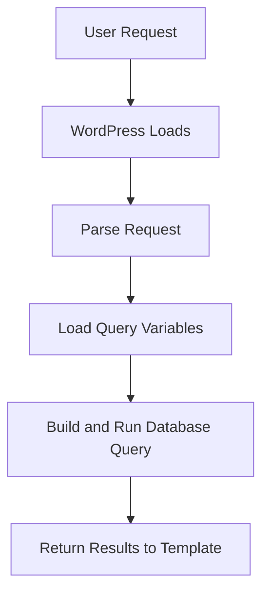

# WordPress Queries

## Introduction

WordPress provides a robust system for interacting with its database through various query functions and classes. These queries allow you to retrieve posts, pages, users, and other content types stored in the WordPress database. Understanding how to properly query the WordPress database is essential for theme and plugin developers who want to customize content display and create advanced functionality.

In this tutorial, we'll explore the WordPress querying system, focusing on the main methods for retrieving data from the database:

1. Built-in WordPress functions like `get_posts()` and `query_posts()`
2. The powerful `WP_Query` class
3. Direct database access using `$wpdb`

Let's dive in and learn how to effectively query the WordPress database!

## The WordPress Query Process

Before we explore specific query methods, it's important to understand the basic WordPress query process:



When a user visits a WordPress page, WordPress determines what content to display by querying the database based on the URL parameters and site configuration. The results are then passed to the appropriate template for display.

## Built-in Query Functions

WordPress offers several built-in functions that let you query the database without writing raw SQL.

### get_posts()

The `get_posts()` function provides a simple way to retrieve posts from the database.

```php
<?php
$args = array(
    'post_type'      => 'post',
    'posts_per_page' => 5,
    'category_name'  => 'tutorials'
);

$posts = get_posts($args);

foreach ($posts as $post) {
    setup_postdata($post);
    echo '<h2>' . get_the_title() . '</h2>';
    echo '<div class="entry-content">' . get_the_excerpt() . '</div>';
}

wp_reset_postdata(); // Reset the global $post variable
?>
```

**Output:**
This would display 5 posts from the 'tutorials' category, showing each post's title and excerpt.

### query_posts()

The `query_posts()` function modifies the main WordPress query. Note that this function should be used with caution as it replaces the main query completely.

```php
<?php
// Not recommended for most cases
query_posts(array(
    'post_type'      => 'post',
    'posts_per_page' => 3,
    'orderby'        => 'date',
    'order'          => 'DESC'
));

if (have_posts()) {
    while (have_posts()) {
        the_post();
        echo '<h2>' . get_the_title() . '</h2>';
    }
}

wp_reset_query(); // Reset the query
?>
```

**Note:** `query_posts()` is generally discouraged because it completely replaces the main query and can cause issues with pagination, templates, and other WordPress functionality.

## The WP_Query Class

The recommended way to create custom queries in WordPress is using the `WP_Query` class. It's more powerful, flexible, and doesn't interfere with the main query.

### Basic Usage of WP_Query

```php
<?php
// Initialize a new WP_Query object
$featured_query = new WP_Query(array(
    'post_type'      => 'post',
    'posts_per_page' => 3,
    'category_name'  => 'featured',
    'orderby'        => 'date',
    'order'          => 'DESC'
));

// Start the loop
if ($featured_query->have_posts()) {
    echo '<div class="featured-posts">';
    while ($featured_query->have_posts()) {
        $featured_query->the_post();
        echo '<article>';
        echo '<h3><a href="' . get_permalink() . '">' . get_the_title() . '</a></h3>';
        echo get_the_excerpt();
        echo '</article>';
    }
    echo '</div>';
}

// Reset post data
wp_reset_postdata();
?>
```

**Output:**
This would display 3 posts from the 'featured' category with titles linked to their respective pages and excerpts.

### Advanced Query Parameters

`WP_Query` accepts many parameters to customize your query. Here are some common ones:

```php
<?php
$complex_query = new WP_Query(array(
    'post_type'      => array('post', 'page'), // Multiple post types
    'posts_per_page' => 10,
    'post_status'    => 'publish',
    'tax_query'      => array(    // Query by taxonomy
        'relation' => 'AND',
        array(
            'taxonomy' => 'category',
            'field'    => 'slug',
            'terms'    => 'news',
        ),
        array(
            'taxonomy' => 'post_tag',
            'field'    => 'slug',
            'terms'    => 'featured',
        )
    ),
    'meta_query'     => array(    // Query by custom fields
        array(
            'key'     => 'rating',
            'value'   => '4',
            'compare' => '>=',
            'type'    => 'NUMERIC'
        )
    ),
    'date_query'     => array(    // Query by date
        array(
            'after'    => '2023-01-01',
            'before'   => '2023-12-31',
            'inclusive' => true,
        ),
    ),
    'orderby'        => 'meta_value_num',
    'meta_key'       => 'rating',
    'order'          => 'DESC',
));

// Use the query results
// ...
?>
```

## Real-World Examples

Let's look at some common real-world scenarios for WordPress queries.

### Example 1: Custom Post Type Archive

Creating a custom display for a "Projects" custom post type:

```php
<?php
function display_projects() {
    $projects_query = new WP_Query(array(
        'post_type'      => 'project',
        'posts_per_page' => 12,
        'orderby'        => 'date',
        'order'          => 'DESC',
    ));
    
    $output = '<div class="projects-grid">';
    
    if ($projects_query->have_posts()) {
        while ($projects_query->have_posts()) {
            $projects_query->the_post();
            
            $output .= '<div class="project-card">';
            if (has_post_thumbnail()) {
                $output .= get_the_post_thumbnail(null, 'medium', array('class' => 'project-thumbnail'));
            }
            $output .= '<h3>' . get_the_title() . '</h3>';
            $output .= '<p>' . get_the_excerpt() . '</p>';
            $output .= '<a href="' . get_permalink() . '" class="read-more">View Project</a>';
            $output .= '</div>';
        }
    } else {
        $output .= '<p>No projects found.</p>';
    }
    
    wp_reset_postdata();
    $output .= '</div>';
    
    return $output;
}

// Use as a shortcode
add_shortcode('display_projects', 'display_projects');
?>
```

### Example 2: Related Posts by Category

Display related posts at the end of a single post:

```php
<?php
function display_related_posts() {
    // Get current post's categories
    $categories = get_the_category();
    
    if (!$categories) {
        return '';
    }
    
    // Extract category IDs
    $category_ids = array();
    foreach ($categories as $category) {
        $category_ids[] = $category->term_id;
    }
    
    $current_post_id = get_the_ID();
    
    // Query related posts
    $related_query = new WP_Query(array(
        'category__in'   => $category_ids,
        'post__not_in'   => array($current_post_id),
        'posts_per_page' => 3,
        'orderby'        => 'rand', // Random selection for variety
    ));
    
    $output = '<div class="related-posts">';
    $output .= '<h3>Related Posts</h3>';
    
    if ($related_query->have_posts()) {
        $output .= '<ul>';
        while ($related_query->have_posts()) {
            $related_query->the_post();
            $output .= '<li><a href="' . get_permalink() . '">' . get_the_title() . '</a></li>';
        }
        $output .= '</ul>';
    } else {
        $output .= '<p>No related posts found.</p>';
    }
    
    wp_reset_postdata();
    $output .= '</div>';
    
    return $output;
}
?>
```

## Direct Database Access with $wpdb

For more complex queries or when you need to access tables that aren't well-covered by WordPress functions, you can use the global `$wpdb` object to run direct SQL queries.

```php
<?php
global $wpdb;

// Get all users who registered in the last 30 days
$recent_users = $wpdb->get_results(
    "SELECT ID, user_login, user_email, user_registered 
    FROM {$wpdb->users} 
    WHERE user_registered >= DATE_SUB(NOW(), INTERVAL 30 DAY) 
    ORDER BY user_registered DESC"
);

if ($recent_users) {
    echo '<h3>Recently Registered Users</h3>';
    echo '<ul>';
    foreach ($recent_users as $user) {
        echo '<li>' . esc_html($user->user_login) . ' - ' . esc_html($user->user_registered) . '</li>';
    }
    echo '</ul>';
} else {
    echo '<p>No recent registrations.</p>';
}
?>
```

**Note:** Always sanitize input and escape output when using direct database queries to prevent SQL injection attacks.

## Best Practices for WordPress Queries

1. **Use `WP_Query` instead of `query_posts()`** for most custom queries.
2. **Always reset the post data** using `wp_reset_postdata()` after a custom `WP_Query` loop.
3. **Limit the number of posts** returned with the `posts_per_page` parameter to avoid memory issues.
4. **Cache complex queries** using the Transients API for better performance.
5. **Use specific parameters** instead of fetching all posts and filtering them in PHP.
6. **Sanitize user input** to prevent SQL injection when building queries.
7. **Minimize the use of `$wpdb`** for direct database access when WordPress functions can do the job.

## Summary

WordPress provides multiple ways to query its database, from simple functions like `get_posts()` to the powerful `WP_Query` class and direct database access with `$wpdb`. Each method has its appropriate use cases:

- Use `WP_Query` for most custom queries that don't modify the main loop
- Use `get_posts()` for simple, lightweight queries when you just need an array of posts
- Use `$wpdb` only when you need direct database access that WordPress functions don't provide

Understanding WordPress queries enables you to build dynamic, customized websites that display exactly the content you want, in the format you need.

## Additional Resources

- [WordPress Codex: WP_Query](https://developer.wordpress.org/reference/classes/wp_query/)
- [WordPress Codex: Query Overview](https://developer.wordpress.org/themes/basics/the-loop/)
- [WordPress Query Monitor plugin](https://wordpress.org/plugins/query-monitor/) - A great tool for debugging queries

## Practice Exercises

1. Create a custom query to display the 5 most recent posts from a specific category with thumbnails.
2. Build a query that shows posts with a specific custom field value.
3. Create a tabbed interface that uses different queries to display posts sorted by different criteria (most recent, most commented, highest rating).
4. Implement pagination in a custom `WP_Query` loop.
5. Create a function that finds posts similar to the current one based on shared tags.

By mastering WordPress queries, you'll be able to create more dynamic and customized websites that meet your specific needs!