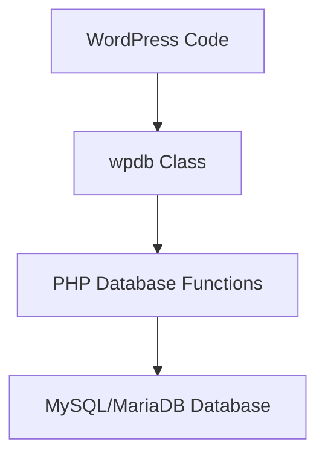

# WordPress wpdb Class

## Introduction

The `wpdb` class is one of the most powerful tools in the WordPress developer's toolkit. It provides a standardized way to interact with the WordPress database, making it easier to perform operations like querying data, inserting records, updating information, and deleting content.

Whether you're building a plugin, theme, or simply need to access data directly, understanding how to use the `wpdb` class properly is essential for WordPress development.

## What is the wpdb Class?

The `wpdb` class is a wrapper for PHP's database interaction functions, specifically designed for WordPress. It allows developers to perform database operations without writing raw SQL queries directly, adding layers of security and convenience.



## Accessing the wpdb Object

In WordPress, the `wpdb` class is instantiated automatically and made available through the global `$wpdb` variable. Here's how you can access it:

```php
global $wpdb;
```

This line gives you access to the `$wpdb` object, which provides methods for interacting with the database.

## Basic Database Operations

### Reading Data with get_results()

The most common database operation is retrieving data. The `get_results()` method allows you to run a SELECT query and fetch multiple rows.

```php
global $wpdb;

// Simple query to get all posts
$results = $wpdb->get_results("SELECT ID, post_title FROM {$wpdb->posts} WHERE post_status = 'publish' LIMIT 5");

// Output:
foreach ($results as $post) {
    echo "Post ID: {$post->ID}, Title: {$post->post_title}<br />";
}
```

Output:
```
Post ID: 1, Title: Hello World!
Post ID: 2, Title: Sample Page
Post ID: 3, Title: Privacy Policy
Post ID: 4, Title: About Us
Post ID: 5, Title: Contact Us
```

### Reading a Single Row with get_row()

If you need just one row, use the `get_row()` method:

```php
global $wpdb;

// Get a specific post
$post = $wpdb->get_row("SELECT * FROM {$wpdb->posts} WHERE ID = 1");

if ($post) {
    echo "Post title: {$post->post_title}<br />";
    echo "Post content: " . substr($post->post_content, 0, 50) . "...<br />";
}
```

### Getting a Single Value with get_var()

For retrieving a single value, use `get_var()`:

```php
global $wpdb;

// Count published posts
$count = $wpdb->get_var("SELECT COUNT(*) FROM {$wpdb->posts} WHERE post_status = 'publish' AND post_type = 'post'");

echo "Number of published posts: {$count}";
```

### Inserting Data

To insert data into a database table, use the `insert()` method:

```php
global $wpdb;

// Data to insert
$data = [
    'post_title' => 'My New Post',
    'post_content' => 'This is the content of my new post.',
    'post_status' => 'draft',
    'post_author' => 1,
    'post_type' => 'post',
    'post_date' => current_time('mysql')
];

// Insert the data
$wpdb->insert(
    $wpdb->posts, // table
    $data,        // data
    ['%s', '%s', '%s', '%d', '%s', '%s'] // data format
);

// Check if insertion was successful
if ($wpdb->insert_id) {
    echo "Post created successfully with ID: {$wpdb->insert_id}";
} else {
    echo "Error creating post: " . $wpdb->last_error;
}
```

### Updating Data

To update existing records, use the `update()` method:

```php
global $wpdb;

// Data to update
$data = [
    'post_title' => 'Updated Post Title',
    'post_modified' => current_time('mysql')
];

// Where condition
$where = [
    'ID' => 123 // Post ID to update
];

// Update the post
$wpdb->update(
    $wpdb->posts, // table
    $data,        // data
    $where,       // where
    ['%s', '%s'], // data format
    ['%d']        // where format
);

if ($wpdb->last_error) {
    echo "Error updating post: " . $wpdb->last_error;
} else {
    echo "Post updated successfully!";
}
```

### Deleting Data

To delete records, use the `delete()` method:

```php
global $wpdb;

// Where condition
$where = [
    'ID' => 123 // Post ID to delete
];

// Delete the post
$wpdb->delete(
    $wpdb->posts, // table
    $where,       // where
    ['%d']        // where format
);

if ($wpdb->last_error) {
    echo "Error deleting post: " . $wpdb->last_error;
} else {
    echo "Post deleted successfully!";
}
```

## Using Prepared Statements for Security

WordPress's `wpdb` provides a secure way to query the database using prepared statements. This helps protect against SQL injection attacks.

### The prepare() Method

The `prepare()` method is similar to PHP's `printf()` but for SQL queries:

```php
global $wpdb;

$post_id = 1;
$query = $wpdb->prepare(
    "SELECT * FROM {$wpdb->posts} WHERE ID = %d",
    $post_id
);

$post = $wpdb->get_row($query);
```

#### Placeholders in Prepared Statements

| Placeholder | Description             | Example           |
|-------------|-------------------------|-------------------|
| `%d`        | Integer                 | `123`             |
| `%f`        | Float                   | `3.14`            |
| `%s`        | String                  | `'Hello World'`   |

### Multiple Variables in Prepared Statements

You can use multiple variables in a prepared statement:

```php
global $wpdb;

$post_type = 'post';
$post_status = 'publish';
$limit = 10;

$query = $wpdb->prepare(
    "SELECT ID, post_title 
    FROM {$wpdb->posts} 
    WHERE post_type = %s 
    AND post_status = %s 
    LIMIT %d",
    $post_type,
    $post_status,
    $limit
);

$results = $wpdb->get_results($query);
```

## Creating Custom Tables

Sometimes you need to create custom tables for your plugin or theme. Here's how:

```php
function create_custom_table() {
    global $wpdb;
    
    $table_name = $wpdb->prefix . 'custom_table';
    $charset_collate = $wpdb->get_charset_collate();
    
    $sql = "CREATE TABLE $table_name (
        id mediumint(9) NOT NULL AUTO_INCREMENT,
        time datetime DEFAULT '0000-00-00 00:00:00' NOT NULL,
        name varchar(255) NOT NULL,
        text text NOT NULL,
        url varchar(100) DEFAULT '' NOT NULL,
        PRIMARY KEY  (id)
    ) $charset_collate;";
    
    // Include WordPress database migration file
    require_once(ABSPATH . 'wp-admin/includes/upgrade.php');
    dbDelta($sql);
}
```

You would typically call this function during plugin activation:

```php
register_activation_hook(__FILE__, 'create_custom_table');
```

## Working with Table Prefixes

WordPress uses table prefixes to allow multiple WordPress installations to share a single database. The `wpdb` class makes working with these prefixes easy.

### Core Tables

WordPress core tables are available as properties of the `$wpdb` object:

```php
global $wpdb;

// These reference the tables with the proper prefix
echo $wpdb->posts;     // wp_posts
echo $wpdb->options;   // wp_options
echo $wpdb->users;     // wp_users
echo $wpdb->comments;  // wp_comments
```

### Custom Tables

For custom tables, use the `prefix` property:

```php
global $wpdb;

$table_name = $wpdb->prefix . 'custom_table'; // wp_custom_table
```

## Common wpdb Properties and Methods

| Property/Method        | Description                                      |
|------------------------|--------------------------------------------------|
| `$wpdb->insert_id`     | ID generated by the last INSERT operation        |
| `$wpdb->num_rows`      | Number of rows returned by the last query        |
| `$wpdb->last_result`   | Result of the last query                         |
| `$wpdb->last_query`    | The last query executed                          |
| `$wpdb->last_error`    | Last error, if any                               |
| `$wpdb->prefix`        | Table prefix configured for WordPress             |
| `$wpdb->show_errors()` | Turn error display on                            |
| `$wpdb->hide_errors()` | Turn error display off                           |
| `$wpdb->flush()`       | Clear previous query results                     |

## Real-world Example: Creating a Simple Post View Counter

Let's build a simple post view counter to demonstrate real-world usage of the `wpdb` class:

```php
/**
 * Increment post view count and return current count
 *
 * @param int $post_id The post ID
 * @return int The updated view count
 */
function increment_post_views($post_id) {
    global $wpdb;
    
    // First, check if we already have a record
    $view_count = get_post_meta($post_id, 'post_views', true);
    
    if ($view_count === '') {
        // No existing count, start at 1
        add_post_meta($post_id, 'post_views', '1', true);
        return 1;
    } else {
        // Increment the existing count
        $view_count++;
        update_post_meta($post_id, 'post_views', $view_count);
        return $view_count;
    }
}

/**
 * Display the post view count
 */
function display_post_views() {
    global $post;
    
    // Increment views when post is viewed
    if (is_single()) {
        $views = increment_post_views($post->ID);
    } else {
        $views = get_post_meta($post->ID, 'post_views', true);
        $views = $views ? $views : '0';
    }
    
    echo '<div class="post-views">This post has been viewed ' . number_format($views) . ' times</div>';
}

// Use this function in your theme
// add_action('wp_head', 'display_post_views');
```

## Advanced Example: Creating a Custom Database Report

Let's create a function that generates a report of the most popular post categories:

```php
/**
 * Generate a report of the most popular categories
 *
 * @param int $limit Number of categories to return
 * @return array Category data
 */
function get_popular_categories($limit = 5) {
    global $wpdb;
    
    $query = $wpdb->prepare(
        "SELECT t.name, t.slug, t.term_id, COUNT(p.ID) as post_count
        FROM {$wpdb->terms} AS t
        INNER JOIN {$wpdb->term_taxonomy} AS tt ON t.term_id = tt.term_id
        INNER JOIN {$wpdb->term_relationships} AS tr ON tt.term_taxonomy_id = tr.term_taxonomy_id
        INNER JOIN {$wpdb->posts} AS p ON p.ID = tr.object_id
        WHERE tt.taxonomy = 'category'
        AND p.post_status = 'publish'
        GROUP BY t.term_id
        ORDER BY post_count DESC
        LIMIT %d",
        $limit
    );
    
    $categories = $wpdb->get_results($query);
    
    return $categories;
}

// Example usage
$popular_cats = get_popular_categories(3);
echo "<h3>Most Popular Categories:</h3>";
echo "<ul>";
foreach ($popular_cats as $cat) {
    echo "<li>{$cat->name} ({$cat->post_count} posts)</li>";
}
echo "</ul>";
```

## Best Practices When Using wpdb

1. **Always use prepared statements** to prevent SQL injection
2. **Check for errors** after database operations
3. **Use WordPress functions** like `get_posts()` when possible, before resorting to direct database queries
4. **Include appropriate indexes** in custom tables for better performance
5. **Test your queries** with larger datasets to ensure they scale well
6. **Handle transaction management** for operations that require multiple queries to be atomic

## Common Mistakes to Avoid

1. **Not escaping user input** - Always use prepared statements
2. **Ignoring error handling** - Check for errors after operations
3. **Not validating data types** - Ensure you're using the correct placeholder types
4. **Writing inefficient queries** - Optimize your queries for performance
5. **Not using transactions** - For operations that need to be atomic
6. **Hardcoding table names** - Always use `$wpdb->prefix`

## Summary

The WordPress `wpdb` class is a powerful tool for interacting with the database in a secure and efficient way. It provides methods for all common database operations:

- Reading data with `get_results()`, `get_row()`, and `get_var()`
- Writing data with `insert()`, `update()`, and `delete()`
- Securing queries with the `prepare()` method
- Creating custom tables and managing database schema

By mastering the `wpdb` class, you'll be able to build more sophisticated WordPress plugins and themes that can efficiently store and retrieve data.

## Additional Resources

- [WordPress Codex: wpdb Class](https://codex.wordpress.org/Class_Reference/wpdb)
- [WordPress Developer Resources: Custom Database Tables](https://developer.wordpress.org/plugins/databases/creating-tables/)
- [WordPress Database Functions](https://developer.wordpress.org/reference/classes/wpdb/)

## Exercises

1. Create a function that retrieves the 5 most recent comments for a specific post using `wpdb`.
2. Write code to create a custom table that stores user activity logs.
3. Create a function that performs a complex JOIN between WordPress posts and a custom table.
4. Write a function that updates multiple records in a transaction to ensure data integrity.
5. Create a simple caching system that saves expensive query results to the `wp_options` table.

Remember that while direct database access is powerful, WordPress provides many helper functions that should be used when available as they include additional hooks, filters, and security measures.