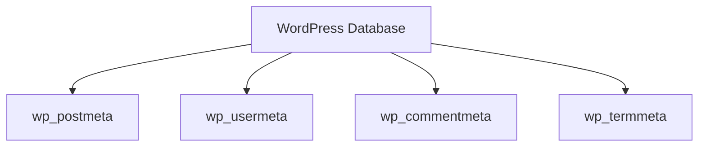

# WordPress Meta Data

## Introduction

WordPress meta data is a powerful and flexible system that allows for storing additional information beyond what's available in the core database tables. Meta data extends the functionality of WordPress by providing a way to attach custom data to posts, users, comments, and terms. This mechanism is fundamental to WordPress's extensibility and is heavily used by plugins, themes, and custom functionality.

In this tutorial, we'll explore WordPress meta data in depth, understand its structure in the database, and learn how to effectively work with it in your projects.

## What is Meta Data?

Meta data (or metadata) in WordPress refers to custom information that doesn't fit into the standard fields of the core database tables. It's essentially a key-value storage system that allows for:

- Attaching custom fields to posts (including pages and custom post types)
- Storing user preferences or profile information
- Adding additional information to comments
- Attaching custom data to taxonomy terms

Think of meta data as "extra information" that extends WordPress's default capabilities.

## WordPress Meta Tables

WordPress stores meta data in four different tables in the database:



Each table has a similar structure:

- **wp_postmeta**: Stores meta data for posts, pages, and custom post types
- **wp_usermeta**: Stores meta data for users
- **wp_commentmeta**: Stores meta data for comments
- **wp_termmeta**: Stores meta data for taxonomy terms

Let's look at the structure of these tables, using `wp_postmeta` as an example:

| Column | Description |
|--------|-------------|
| meta_id | Primary key for the meta data entry |
| post_id | The ID of the post this meta data is associated with |
| meta_key | The key (name) of the meta data |
| meta_value | The value of the meta data |

The other meta tables follow this same pattern, with the second column changing to match the entity type (user_id, comment_id, or term_id).

## Working with Post Meta Data

Post meta data is the most commonly used form of meta data in WordPress. It's often referred to as "custom fields" in the WordPress admin interface.

### Adding Post Meta

To add meta data to a post, you can use the `add_post_meta()` function:

```php
// Add a simple meta value
add_post_meta($post_id, 'rating', '5 stars', true);

// Add a complex meta value (array)
$location = array(
    'latitude' => '40.7128',
    'longitude' => '-74.0060',
    'city' => 'New York'
);
add_post_meta($post_id, 'location_data', $location);
```

The third parameter is the meta value, and the fourth parameter (true) means this is a unique key that shouldn't be duplicated.

### Retrieving Post Meta

To get post meta data, use the `get_post_meta()` function:

```php
// Get a single meta value
$rating = get_post_meta($post_id, 'rating', true); 
echo $rating; // Output: 5 stars

// Get all meta values for a key (returns array)
$locations = get_post_meta($post_id, 'location_data');

// Get all meta data for a post (returns associative array)
$all_meta = get_post_meta($post_id);
```

The third parameter (true) tells WordPress to return a single value rather than an array.

### Updating Post Meta

To update existing meta data, use the `update_post_meta()` function:

```php
// Update a meta value
update_post_meta($post_id, 'rating', '4 stars');

// Update a complex meta value
$new_location = array(
    'latitude' => '34.0522',
    'longitude' => '-118.2437',
    'city' => 'Los Angeles'
);
update_post_meta($post_id, 'location_data', $new_location);
```

If the meta key doesn't exist, `update_post_meta()` will create it.

### Deleting Post Meta

To remove meta data, use the `delete_post_meta()` function:

```php
// Delete a specific meta value
delete_post_meta($post_id, 'rating', '4 stars');

// Delete all meta values with the given key
delete_post_meta($post_id, 'rating');
```

## Working with User Meta Data

User meta data works similarly to post meta data but is associated with users.

### Adding User Meta

```php
// Add user meta
add_user_meta($user_id, 'phone_number', '555-123-4567', true);
```

### Getting User Meta

```php
// Get a single user meta value
$phone = get_user_meta($user_id, 'phone_number', true);
echo $phone; // Output: 555-123-4567

// Get all meta data for a user
$all_user_meta = get_user_meta($user_id);
```

### Updating User Meta

```php
// Update user meta
update_user_meta($user_id, 'phone_number', '555-987-6543');
```

### Deleting User Meta

```php
// Delete user meta
delete_user_meta($user_id, 'phone_number');
```

## Working with Comment and Term Meta

WordPress also provides functions for working with comment meta and term meta:

### Comment Meta Functions

- `add_comment_meta($comment_id, $meta_key, $meta_value, $unique = false)`
- `get_comment_meta($comment_id, $meta_key = '', $single = false)`
- `update_comment_meta($comment_id, $meta_key, $meta_value, $prev_value = '')`
- `delete_comment_meta($comment_id, $meta_key, $meta_value = '')`

### Term Meta Functions

- `add_term_meta($term_id, $meta_key, $meta_value, $unique = false)`
- `get_term_meta($term_id, $meta_key = '', $single = false)`
- `update_term_meta($term_id, $meta_key, $meta_value, $prev_value = '')`
- `delete_term_meta($term_id, $meta_key, $meta_value = '')`

## Practical Examples

### Example 1: Building a Product Catalog with Custom Fields

Let's create a simple product custom post type with meta data for price, SKU, and inventory:

```php
// Register the Product custom post type
function register_product_post_type() {
    register_post_type('product', 
        array(
            'labels' => array(
                'name' => 'Products',
                'singular_name' => 'Product'
            ),
            'public' => true,
            'has_archive' => true,
            'supports' => array('title', 'editor', 'thumbnail')
        )
    );
}
add_action('init', 'register_product_post_type');

// Add a meta box for product details
function add_product_meta_box() {
    add_meta_box(
        'product_details',
        'Product Details',
        'product_details_callback',
        'product',
        'normal',
        'high'
    );
}
add_action('add_meta_boxes', 'add_product_meta_box');

// Callback function for the meta box
function product_details_callback($post) {
    // Add nonce for security
    wp_nonce_field('product_meta_nonce', 'product_meta_nonce');
    
    // Get existing meta values
    $price = get_post_meta($post->ID, '_product_price', true);
    $sku = get_post_meta($post->ID, '_product_sku', true);
    $stock = get_post_meta($post->ID, '_product_stock', true);
    
    // Meta box HTML
    ?>
    <p>
        <label for="product_price">Price ($):</label>
        <input type="text" id="product_price" name="product_price" value="<?php echo esc_attr($price); ?>">
    </p>
    <p>
        <label for="product_sku">SKU:</label>
        <input type="text" id="product_sku" name="product_sku" value="<?php echo esc_attr($sku); ?>">
    </p>
    <p>
        <label for="product_stock">Stock Quantity:</label>
        <input type="number" id="product_stock" name="product_stock" value="<?php echo esc_attr($stock); ?>">
    </p>
    <?php
}

// Save the meta data when the post is saved
function save_product_meta($post_id) {
    // Check if nonce is set and valid
    if (!isset($_POST['product_meta_nonce']) || !wp_verify_nonce($_POST['product_meta_nonce'], 'product_meta_nonce')) {
        return;
    }
    
    // Check if user has permissions
    if (!current_user_can('edit_post', $post_id)) {
        return;
    }
    
    // Save meta data
    if (isset($_POST['product_price'])) {
        update_post_meta($post_id, '_product_price', sanitize_text_field($_POST['product_price']));
    }
    
    if (isset($_POST['product_sku'])) {
        update_post_meta($post_id, '_product_sku', sanitize_text_field($_POST['product_sku']));
    }
    
    if (isset($_POST['product_stock'])) {
        update_post_meta($post_id, '_product_stock', absint($_POST['product_stock']));
    }
}
add_action('save_post_product', 'save_product_meta');

// Display product details on the frontend
function display_product_details() {
    if (is_singular('product')) {
        global $post;
        
        $price = get_post_meta($post->ID, '_product_price', true);
        $sku = get_post_meta($post->ID, '_product_sku', true);
        $stock = get_post_meta($post->ID, '_product_stock', true);
        
        echo '<div class="product-details">';
        echo '<p><strong>Price:</strong> $' . esc_html($price) . '</p>';
        echo '<p><strong>SKU:</strong> ' . esc_html($sku) . '</p>';
        echo '<p><strong>Stock:</strong> ' . esc_html($stock) . ' units available</p>';
        echo '</div>';
    }
}
add_action('the_content', 'display_product_details');
```

This example shows a complete workflow:

1. Creating a custom post type
2. Adding a meta box to the edit screen
3. Saving meta data
4. Displaying meta data on the frontend

### Example 2: User Profile Extensions

Let's add social media links to user profiles:

```php
// Add fields to user profile
function add_social_media_fields($user) {
    ?>
    <h3>Social Media Profiles</h3>
    <table class="form-table">
        <tr>
            <th><label for="twitter">Twitter</label></th>
            <td>
                <input type="text" name="twitter" id="twitter" value="<?php echo esc_attr(get_user_meta($user->ID, 'twitter', true)); ?>" class="regular-text" />
                <span class="description">Your Twitter username (without @)</span>
            </td>
        </tr>
        <tr>
            <th><label for="facebook">Facebook</label></th>
            <td>
                <input type="text" name="facebook" id="facebook" value="<?php echo esc_attr(get_user_meta($user->ID, 'facebook', true)); ?>" class="regular-text" />
                <span class="description">Your Facebook profile URL</span>
            </td>
        </tr>
        <tr>
            <th><label for="linkedin">LinkedIn</label></th>
            <td>
                <input type="text" name="linkedin" id="linkedin" value="<?php echo esc_attr(get_user_meta($user->ID, 'linkedin', true)); ?>" class="regular-text" />
                <span class="description">Your LinkedIn profile URL</span>
            </td>
        </tr>
    </table>
    <?php
}
add_action('show_user_profile', 'add_social_media_fields');
add_action('edit_user_profile', 'add_social_media_fields');

// Save user profile fields
function save_social_media_fields($user_id) {
    if (!current_user_can('edit_user', $user_id)) {
        return false;
    }
    
    update_user_meta($user_id, 'twitter', sanitize_text_field($_POST['twitter']));
    update_user_meta($user_id, 'facebook', sanitize_text_field($_POST['facebook']));
    update_user_meta($user_id, 'linkedin', sanitize_text_field($_POST['linkedin']));
}
add_action('personal_options_update', 'save_social_media_fields');
add_action('edit_user_profile_update', 'save_social_media_fields');

// Display social links on author page
function display_author_social_links() {
    if (is_author()) {
        $author_id = get_the_author_meta('ID');
        $twitter = get_user_meta($author_id, 'twitter', true);
        $facebook = get_user_meta($author_id, 'facebook', true);
        $linkedin = get_user_meta($author_id, 'linkedin', true);
        
        echo '<div class="author-social-links">';
        if ($twitter) {
            echo '<a href="https://twitter.com/' . esc_attr($twitter) . '" target="_blank">Twitter</a>';
        }
        if ($facebook) {
            echo '<a href="' . esc_url($facebook) . '" target="_blank">Facebook</a>';
        }
        if ($linkedin) {
            echo '<a href="' . esc_url($linkedin) . '" target="_blank">LinkedIn</a>';
        }
        echo '</div>';
    }
}
add_action('wp_footer', 'display_author_social_links');
```

## Best Practices for Working with Meta Data

1. **Use Prefixes**: Prefix your meta keys to avoid conflicts with other plugins or themes:
   ```php
   update_post_meta($post_id, 'my_plugin_featured_image', $value);
   ```

2. **Use Underscores for "Hidden" Meta**: Meta keys that start with an underscore won't appear in the custom fields UI:
   ```php
   update_post_meta($post_id, '_my_plugin_internal_data', $value);
   ```

3. **Serialize Complex Data**: When storing arrays or objects, WordPress automatically serializes them, but be cautious about the size:
   ```php
   $complex_data = array('key1' => 'value1', 'key2' => 'value2');
   update_post_meta($post_id, 'my_plugin_complex_data', $complex_data);
   ```

4. **Consider Using JSON**: For more complex data that you might need to access via JavaScript:
   ```php
   update_post_meta($post_id, 'my_plugin_json_data', json_encode($complex_data));
   // Later, to use in JavaScript:
   $json_data = get_post_meta($post_id, 'my_plugin_json_data', true);
   echo '<script>const myData = ' . $json_data . ';</script>';
   ```

5. **Optimize Queries**: If you need multiple meta values, get them all at once:
   ```php
   // Inefficient - multiple database queries
   $meta1 = get_post_meta($post_id, 'key1', true);
   $meta2 = get_post_meta($post_id, 'key2', true);
   
   // More efficient - one database query
   $all_meta = get_post_meta($post_id);
   $meta1 = isset($all_meta['key1'][0]) ? $all_meta['key1'][0] : '';
   $meta2 = isset($all_meta['key2'][0]) ? $all_meta['key2'][0] : '';
   ```

6. **Clean Up After Yourself**: When your plugin or theme is uninstalled, delete its meta data.

## Common Issues and Solutions

### Issue: Meta Values Not Being Saved

Make sure you're properly sanitizing and validating your data:

```php
// Properly sanitize data before saving
$clean_text = sanitize_text_field($_POST['my_field']);
$clean_url = esc_url_raw($_POST['my_url']);
$clean_number = absint($_POST['my_number']);

// Save the sanitized data
update_post_meta($post_id, 'my_plugin_text', $clean_text);
update_post_meta($post_id, 'my_plugin_url', $clean_url);
update_post_meta($post_id, 'my_plugin_number', $clean_number);
```

### Issue: Serialized Data Corruption

When manually manipulating serialized data, you can easily corrupt it:

```php
// DON'T do this - can lead to serialization errors
$serialized_data = get_post_meta($post_id, 'complex_data', true);
$modified_serialized = str_replace('old_text', 'new_text', $serialized_data);
update_post_meta($post_id, 'complex_data', $modified_serialized);

// DO this instead
$data = get_post_meta($post_id, 'complex_data', true);
$data['field_to_change'] = 'new_value';
update_post_meta($post_id, 'complex_data', $data); // WordPress will re-serialize
```

### Issue: Performance with Large Meta Data Sets

If you have custom post types with a lot of meta data, consider:

1. Only retrieving the specific fields you need
2. Using proper database indexing if you search by meta values
3. Caching results for expensive meta queries

## Meta Data in the WordPress REST API

WordPress also exposes meta data through its REST API:

```php
// Register meta fields to make them available in the REST API
function register_post_meta_for_rest_api() {
    register_post_meta('post', 'my_plugin_feature_enabled', array(
        'show_in_rest' => true,
        'single' => true,
        'type' => 'boolean',
    ));
    
    register_post_meta('product', '_product_price', array(
        'show_in_rest' => true,
        'single' => true,
        'type' => 'number',
    ));
}
add_action('init', 'register_post_meta_for_rest_api');
```

## Summary

WordPress meta data is a powerful system that allows you to extend WordPress's default functionality by adding custom data to posts, users, comments, and terms. The key points to remember are:

- Meta data is stored in key-value pairs in dedicated database tables
- WordPress provides functions to add, get, update, and delete meta data
- Meta data can store simple values or complex data structures
- Following best practices helps maintain performance and compatibility
- Meta data can be exposed through the WordPress REST API

By understanding how to effectively work with meta data, you can create more flexible and feature-rich WordPress themes, plugins, and applications.

## Additional Resources

- [WordPress Developer Documentation on Post Meta](https://developer.wordpress.org/reference/functions/add_post_meta/)
- [WordPress Developer Documentation on User Meta](https://developer.wordpress.org/reference/functions/add_user_meta/)
- [WordPress Developer Documentation on Comment Meta](https://developer.wordpress.org/reference/functions/add_comment_meta/)
- [WordPress Developer Documentation on Term Meta](https://developer.wordpress.org/reference/functions/add_term_meta/)

## Exercises

1. Create a simple plugin that adds a "Featured" checkbox to posts and displays a star icon next to featured posts in the post list.
2. Build a user profile extension that allows users to set their expertise level in different programming languages.
3. Create a custom post type for "Books" with meta fields for author, ISBN, publication date, and genre.
4. Implement a rating system for comments using comment meta data.
5. Create a custom taxonomy for "Skills" and use term meta to store additional information like skill difficulty level.