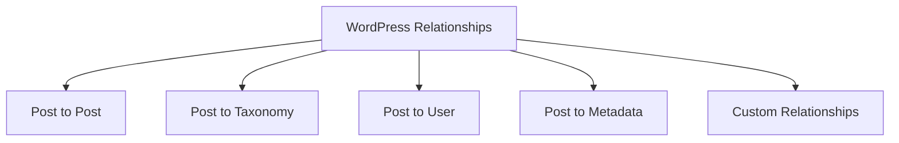
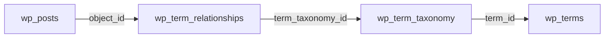

# WordPress Relationships

## Introduction

In any content management system, data relationships are essential for creating structured, interconnected content. WordPress uses a relational database (MySQL) to store and manage data, establishing various types of relationships between different entities. Understanding these relationships is crucial for effective WordPress development, especially when you need to query related data, extend functionality, or build custom features.

In this guide, we'll explore the various relationship types in WordPress's database structure and how they connect different content elements together. We'll also look at practical examples of querying these relationships and how to create custom relationships for your projects.

## Core Relationship Types in WordPress

WordPress database relationships can be categorized into several main types:



Let's explore each of these relationship types in detail.

## 1. Post to Post Relationships

WordPress has several built-in post-to-post relationships:

### Parent-Child Relationships

WordPress pages and certain custom post types can form hierarchical structures through parent-child relationships.

**Example: Retrieving child pages of a parent page**

```php
<?php
$args = array(
    'post_type'      => 'page',
    'posts_per_page' => -1,
    'post_parent'    => 123, // Parent page ID
    'order'          => 'ASC',
    'orderby'        => 'menu_order'
);

$child_pages = new WP_Query($args);

if ($child_pages->have_posts()) :
    while ($child_pages->have_posts()) : $child_pages->the_post();
        echo '<h3>' . get_the_title() . '</h3>';
        echo '<div>' . get_the_excerpt() . '</div>';
    endwhile;
    wp_reset_postdata();
else :
    echo 'No child pages found';
endif;
?>
```

### Attachments and Media

Media items in WordPress are stored as attachment post types and can be related to other posts.

**Example: Retrieving attachments for a specific post**

```php
<?php
$args = array(
    'post_type'      => 'attachment',
    'posts_per_page' => -1,
    'post_parent'    => get_the_ID(),
    'post_status'    => 'any'
);

$attachments = new WP_Query($args);

if ($attachments->have_posts()) :
    echo '<ul class="post-attachments">';
    while ($attachments->have_posts()) : $attachments->the_post();
        echo '<li><a href="' . wp_get_attachment_url(get_the_ID()) . '">' . get_the_title() . '</a></li>';
    endwhile;
    echo '</ul>';
    wp_reset_postdata();
endif;
?>
```

## 2. Post to Taxonomy Relationships

WordPress uses taxonomies to categorize and organize content. Categories, tags, and custom taxonomies create relationships between posts and terms.

### Example: Displaying posts by category

```php
<?php
$category_id = 5; // The category ID
$args = array(
    'cat' => $category_id,
    'posts_per_page' => 10
);

$category_posts = new WP_Query($args);

if ($category_posts->have_posts()) :
    while ($category_posts->have_posts()) : $category_posts->the_post();
        echo '<h3><a href="' . get_permalink() . '">' . get_the_title() . '</a></h3>';
    endwhile;
    wp_reset_postdata();
endif;
?>
```

### Under the Hood: How Taxonomies Connect to Posts

In the WordPress database, the relationship between posts and taxonomy terms is managed through three tables:

1. `wp_terms` - Stores the actual taxonomy terms
2. `wp_term_taxonomy` - Maps terms to their taxonomies
3. `wp_term_relationships` - Creates the connection between posts and terms



## 3. Post to User Relationships

Posts in WordPress are always related to users, primarily through authorship. Each post has an author represented by the `post_author` field.

### Example: Getting posts by a specific author

```php
<?php
$author_id = 1; // The user ID
$args = array(
    'author' => $author_id,
    'posts_per_page' => 5
);

$author_posts = new WP_Query($args);

if ($author_posts->have_posts()) :
    echo '<h2>Posts by ' . get_the_author_meta('display_name', $author_id) . '</h2>';
    echo '<ul>';
    while ($author_posts->have_posts()) : $author_posts->the_post();
        echo '<li><a href="' . get_permalink() . '">' . get_the_title() . '</a></li>';
    endwhile;
    echo '</ul>';
    wp_reset_postdata();
endif;
?>
```

## 4. Post to Metadata Relationships

WordPress uses metadata to store additional information about posts, users, comments, and terms. The relationship between a post and its metadata is one-to-many.

### Example: Retrieving and displaying custom post meta

```php
<?php
$post_id = get_the_ID();
$price = get_post_meta($post_id, 'product_price', true);
$color = get_post_meta($post_id, 'product_color', true);

if (!empty($price)) {
    echo '<p>Price: $' . esc_html($price) . '</p>';
}

if (!empty($color)) {
    echo '<p>Color: ' . esc_html($color) . '</p>';
}
?>
```

### Adding Custom Meta Data

```php
<?php
// Save custom meta data when post is saved
function save_product_meta_data($post_id) {
    if (defined('DOING_AUTOSAVE') && DOING_AUTOSAVE) 
        return;

    if (isset($_POST['product_price'])) {
        update_post_meta(
            $post_id,
            'product_price',
            sanitize_text_field($_POST['product_price'])
        );
    }
    
    if (isset($_POST['product_color'])) {
        update_post_meta(
            $post_id,
            'product_color',
            sanitize_text_field($_POST['product_color'])
        );
    }
}
add_action('save_post', 'save_product_meta_data');
?>
```

## 5. Creating Custom Relationships

Sometimes the built-in WordPress relationships aren't enough for complex projects. Here are methods to create custom relationships:

### Method 1: Using Post Meta

This is the simplest approach, storing related post IDs in the post meta table.

```php
<?php
// Store related posts
function save_related_posts($post_id) {
    if (isset($_POST['related_posts']) && is_array($_POST['related_posts'])) {
        $related_posts = array_map('intval', $_POST['related_posts']);
        update_post_meta($post_id, 'related_posts', $related_posts);
    }
}
add_action('save_post', 'save_related_posts');

// Display related posts
function display_related_posts() {
    $post_id = get_the_ID();
    $related_posts = get_post_meta($post_id, 'related_posts', true);
    
    if (!empty($related_posts) && is_array($related_posts)) {
        echo '<h3>Related Posts</h3>';
        echo '<ul>';
        
        foreach ($related_posts as $related_id) {
            echo '<li><a href="' . get_permalink($related_id) . '">' . get_the_title($related_id) . '</a></li>';
        }
        
        echo '</ul>';
    }
}
?>
```

### Method 2: Using Custom Database Tables

For more complex relationships, you might need to create custom database tables.

```php
<?php
// Create a custom table on plugin activation
function create_relationships_table() {
    global $wpdb;
    $table_name = $wpdb->prefix . 'custom_relationships';
    
    $charset_collate = $wpdb->get_charset_collate();
    
    $sql = "CREATE TABLE $table_name (
        id mediumint(9) NOT NULL AUTO_INCREMENT,
        post_id bigint(20) NOT NULL,
        related_id bigint(20) NOT NULL,
        relationship_type varchar(50) NOT NULL,
        relationship_order int(11) NOT NULL DEFAULT 0,
        PRIMARY KEY  (id),
        KEY post_id (post_id),
        KEY related_id (related_id),
        KEY relationship_type (relationship_type)
    ) $charset_collate;";
    
    require_once(ABSPATH . 'wp-admin/includes/upgrade.php');
    dbDelta($sql);
}
register_activation_hook(__FILE__, 'create_relationships_table');

// Add a relationship
function add_custom_relationship($post_id, $related_id, $type = 'related', $order = 0) {
    global $wpdb;
    $table_name = $wpdb->prefix . 'custom_relationships';
    
    return $wpdb->insert(
        $table_name,
        array(
            'post_id' => $post_id,
            'related_id' => $related_id,
            'relationship_type' => $type,
            'relationship_order' => $order
        )
    );
}

// Get related posts
function get_custom_related_posts($post_id, $type = 'related') {
    global $wpdb;
    $table_name = $wpdb->prefix . 'custom_relationships';
    
    $related_ids = $wpdb->get_col(
        $wpdb->prepare(
            "SELECT related_id FROM $table_name 
             WHERE post_id = %d AND relationship_type = %s
             ORDER BY relationship_order ASC",
            $post_id, $type
        )
    );
    
    return $related_ids;
}
?>
```

### Method 3: Using Advanced Custom Fields (ACF)

ACF simplifies creating relationships between posts with its Relationship field type.

```php
<?php
// Display related posts using ACF relationship field
function display_acf_related_posts() {
    $related_posts = get_field('related_posts');
    
    if ($related_posts) {
        echo '<div class="related-posts">';
        echo '<h3>Related Articles</h3>';
        echo '<ul>';
        
        foreach ($related_posts as $post) {
            setup_postdata($post);
            echo '<li>';
            echo '<a href="' . get_permalink($post) . '">' . get_the_title($post) . '</a>';
            echo '</li>';
        }
        
        echo '</ul>';
        echo '</div>';
        wp_reset_postdata();
    }
}
?>
```

## Real-World Application: Building a Product Recommendation System

Let's create a practical example of using WordPress relationships to build a product recommendation system for a WooCommerce store.

### Step 1: Create a function to establish relationships based on purchase patterns

```php
<?php
function update_product_relationships($order_id) {
    // Get order
    $order = wc_get_order($order_id);
    
    // Get items in this order
    $items = $order->get_items();
    
    // Skip if less than 2 items
    if (count($items) < 2) {
        return;
    }
    
    // Extract product IDs
    $product_ids = array();
    foreach ($items as $item) {
        $product_ids[] = $item->get_product_id();
    }
    
    // Create relationships between all products in this order
    for ($i = 0; $i < count($product_ids); $i++) {
        for ($j = $i + 1; $j < count($product_ids); $j++) {
            // Get existing relationship count
            $count = (int) get_post_meta($product_ids[$i], '_related_purchase_' . $product_ids[$j], true);
            
            // Increment relationship counts in both directions
            update_post_meta($product_ids[$i], '_related_purchase_' . $product_ids[$j], $count + 1);
            update_post_meta($product_ids[$j], '_related_purchase_' . $product_ids[$i], $count + 1);
        }
    }
}
add_action('woocommerce_payment_complete', 'update_product_relationships');
?>
```

### Step 2: Create a function to display product recommendations

```php
<?php
function display_product_recommendations() {
    global $product;
    
    if (!$product) {
        return;
    }
    
    $product_id = $product->get_id();
    $recommendations = array();
    
    // Query post meta for relationship data
    global $wpdb;
    $meta_keys = $wpdb->get_results(
        $wpdb->prepare(
            "SELECT meta_key, meta_value FROM $wpdb->postmeta 
             WHERE post_id = %d AND meta_key LIKE %s
             ORDER BY meta_value+0 DESC
             LIMIT 5",
            $product_id,
            '_related_purchase_%'
        )
    );
    
    // Extract product IDs from meta keys
    foreach ($meta_keys as $meta) {
        $related_id = (int) str_replace('_related_purchase_', '', $meta->meta_key);
        $recommendations[$related_id] = (int) $meta->meta_value;
    }
    
    // Display recommendations
    if (!empty($recommendations)) {
        echo '<div class="product-recommendations">';
        echo '<h3>Frequently Bought Together</h3>';
        echo '<ul class="products">';
        
        foreach (array_keys($recommendations) as $related_id) {
            $related_product = wc_get_product($related_id);
            
            if (!$related_product || !$related_product->is_visible()) {
                continue;
            }
            
            echo '<li class="product">';
            echo '<a href="' . get_permalink($related_id) . '">';
            echo $related_product->get_image();
            echo '<h4>' . $related_product->get_name() . '</h4>';
            echo '<span class="price">' . $related_product->get_price_html() . '</span>';
            echo '</a>';
            echo '</li>';
        }
        
        echo '</ul>';
        echo '</div>';
    }
}
add_action('woocommerce_after_single_product_summary', 'display_product_recommendations', 15);
?>
```

## Summary

WordPress relationships form the backbone of how data is connected and structured within the CMS. Understanding these connections is essential for effective WordPress development:

1. **Post to Post Relationships** - Parent-child pages, attachments, and other hierarchical structures
2. **Post to Taxonomy Relationships** - How posts connect to categories, tags, and custom taxonomies
3. **Post to User Relationships** - Primarily through post authorship
4. **Post to Metadata Relationships** - How additional information is stored for posts
5. **Custom Relationships** - Ways to establish your own relationship structures

By leveraging these relationship structures, you can create more complex, interconnected WordPress sites with richer functionality and better content organization.

## Additional Resources and Exercises

### Resources
- [WordPress Database Description](https://codex.wordpress.org/Database_Description)
- [WordPress Developer Documentation on WP_Query](https://developer.wordpress.org/reference/classes/wp_query/)
- [Custom Database Tables in WordPress](https://developer.wordpress.org/reference/functions/dbdelta/)

### Exercises

1. **Basic Relationship Query**: Write a function that displays all categories a post belongs to, along with counts of other posts in those categories.

2. **Custom Taxonomy Relationships**: Create a custom taxonomy called "Project Types" for a "Projects" custom post type, and write a function that displays related projects of the same type.

3. **Advanced Relationship System**: Design a system that tracks and displays "related articles" based on shared taxonomy terms, with more shared terms resulting in higher relationship strength.

4. **Content Recommendation Engine**: Build upon the product recommendation example to create a content recommendation engine that suggests blog posts based on user reading history stored in cookies or user meta.

5. **Bidirectional Relationships**: Create a system where establishing a relationship between Post A and Post B automatically creates the inverse relationship from Post B to Post A.