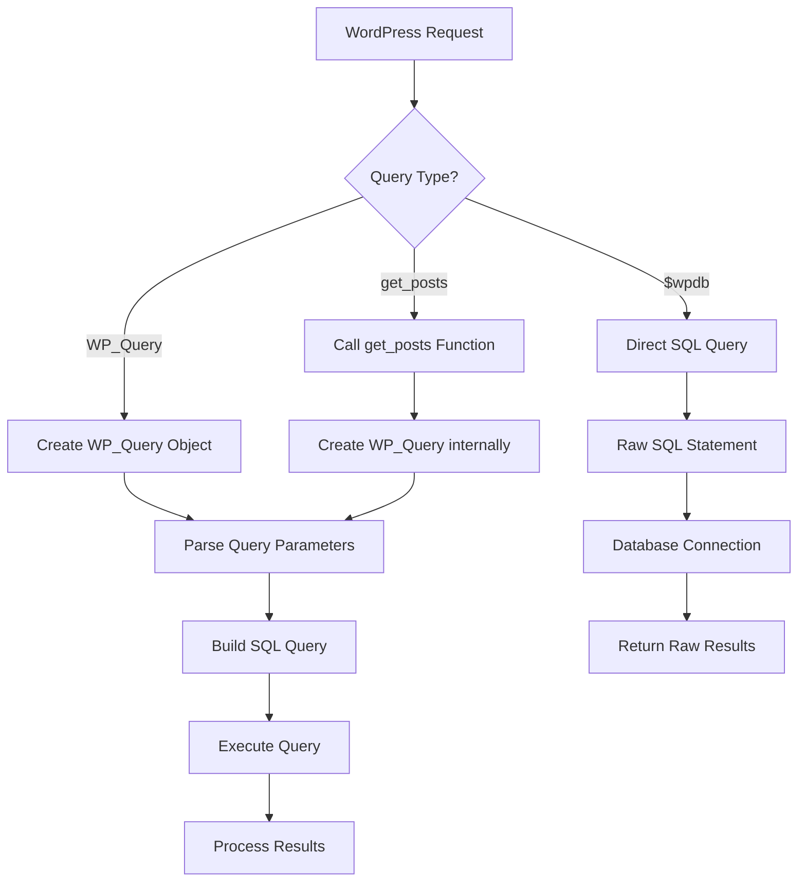

# WordPress Custom Queries

## Introduction

WordPress manages its content through a well-structured database, and while the platform provides many built-in functions to retrieve content, there are times when you need more specific data or custom filtering. This is where custom queries come in.

Custom queries allow you to pull exactly the information you need from the WordPress database, giving you greater control over what content is displayed and how it's organized. Whether you're building a custom theme, plugin, or just want to display posts in a unique way, understanding how to create custom queries is an essential skill for WordPress developers.

In this tutorial, we'll explore the three main approaches to creating custom queries in WordPress:

1. The `WP_Query` class (most common and recommended)
2. The `get_posts()` function
3. Direct database queries using the `$wpdb` global object

## The WP_Query Class

`WP_Query` is the most flexible and powerful way to create custom queries in WordPress. It's an object-oriented approach that provides numerous parameters for filtering and sorting content.

### Basic Usage

The basic pattern for using `WP_Query` follows these steps:

1. Create a new instance with query parameters
2. Check if posts were found
3. Loop through the posts
4. Reset post data when finished

```php
<?php
// 1. Create a new WP_Query instance
$custom_query = new WP_Query([
    'post_type' => 'post',
    'posts_per_page' => 5,
    'category_name' => 'news'
]);

// 2. Check if posts were found
if ($custom_query->have_posts()) :
    // 3. Loop through posts
    while ($custom_query->have_posts()) : $custom_query->the_post();
        // Display post content
        ?>
        <h2><?php the_title(); ?></h2>
        <div class="excerpt"><?php the_excerpt(); ?></div>
        <?php
    endwhile;
    
    // 4. Reset post data
    wp_reset_postdata();
else :
    echo '<p>No posts found</p>';
endif;
?>
```

### Common WP_Query Parameters

`WP_Query` accepts dozens of parameters. Here are some of the most commonly used ones:

```php
$args = [
    // Content type
    'post_type' => 'post',           // 'post', 'page', custom post type, or array of types
    
    // Quantity
    'posts_per_page' => 10,          // Number of posts to display
    'offset' => 0,                   // Number of posts to skip
    
    // Order
    'order' => 'DESC',               // 'ASC' or 'DESC'
    'orderby' => 'date',             // 'date', 'title', 'name', 'rand', 'comment_count', etc.
    
    // Filtering by date
    'date_query' => [                // Complex date queries
        [
            'year' => 2023,
            'month' => 10,
        ]
    ],
    
    // Filtering by taxonomy (categories, tags, etc.)
    'cat' => 5,                      // Category ID
    'category_name' => 'news',       // Category slug
    'tag' => 'featured',             // Tag slug
    
    // Custom taxonomy queries
    'tax_query' => [
        [
            'taxonomy' => 'genre',
            'field' => 'slug',
            'terms' => ['sci-fi', 'fantasy'],
            'operator' => 'IN'
        ]
    ],
    
    // Custom field (meta) queries
    'meta_key' => 'rating',
    'meta_value' => '5',
    'meta_compare' => '>=',
    
    // More complex meta queries
    'meta_query' => [
        [
            'key' => 'color',
            'value' => 'blue',
            'compare' => '='
        ]
    ],
    
    // Search
    's' => 'search term',            // Search keyword
    
    // Author
    'author' => 1,                   // Author ID
    'author_name' => 'admin'         // Author username
];

$custom_query = new WP_Query($args);
```

### Practical Example: Featured Products with Custom Fields

Let's create a query to display featured products with a rating of 4 or higher:

```php
<?php
// Query for featured products with high ratings
$featured_products = new WP_Query([
    'post_type' => 'product',
    'posts_per_page' => 6,
    'meta_query' => [
        'relation' => 'AND',
        [
            'key' => 'featured',
            'value' => 'yes',
            'compare' => '='
        ],
        [
            'key' => 'rating',
            'value' => 4,
            'compare' => '>=',
            'type' => 'NUMERIC'
        ]
    ],
    'orderby' => 'meta_value_num',
    'meta_key' => 'rating',
    'order' => 'DESC'
]);

// Display the products
if ($featured_products->have_posts()) :
    echo '<div class="featured-products">';
    while ($featured_products->have_posts()) : $featured_products->the_post();
        ?>
        <div class="product">
            <h3><?php the_title(); ?></h3>
            <?php if (has_post_thumbnail()) : ?>
                <div class="thumbnail"><?php the_post_thumbnail('medium'); ?></div>
            <?php endif; ?>
            <div class="rating">Rating: <?php echo get_post_meta(get_the_ID(), 'rating', true); ?>/5</div>
            <div class="price"><?php echo get_post_meta(get_the_ID(), 'price', true); ?></div>
            <a href="<?php the_permalink(); ?>" class="button">View Product</a>
        </div>
        <?php
    endwhile;
    echo '</div>';
    wp_reset_postdata();
else :
    echo '<p>No featured products found.</p>';
endif;
?>
```

## The get_posts() Function

The `get_posts()` function is a simplified wrapper for `WP_Query`. It accepts most of the same parameters but returns an array of post objects instead of a query object.

### Basic Usage

```php
<?php
$posts = get_posts([
    'post_type' => 'post',
    'numberposts' => 5,
    'category_name' => 'news'
]);

if ($posts) {
    foreach ($posts as $post) {
        setup_postdata($post);
        ?>
        <h2><?php the_title(); ?></h2>
        <div class="excerpt"><?php the_excerpt(); ?></div>
        <?php
    }
    wp_reset_postdata();
} else {
    echo '<p>No posts found</p>';
}
?>
```

### Key Differences from WP_Query

1. Returns an array of post objects rather than a query object
2. Uses `numberposts` instead of `posts_per_page` (though both work)
3. Doesn't require the loop and `have_posts()` checks
4. Automatically suppresses filters by default (`suppress_filters` is set to `true`)

### When to Use get_posts()

`get_posts()` is ideal when:

- You need a simple array of posts without pagination
- You're working with a limited number of posts
- You're using the posts data in a way that doesn't fit the standard loop

## Direct Database Queries with $wpdb

For more complex or specialized queries, WordPress provides the global `$wpdb` object that allows you to write custom SQL queries directly.

### Basic Usage

```php
<?php
global $wpdb;

// Get all post titles and authors where the post has more than 10 comments
$results = $wpdb->get_results(
    "SELECT p.post_title, p.post_author, COUNT(c.comment_ID) as comment_count 
    FROM {$wpdb->posts} as p 
    JOIN {$wpdb->comments} as c ON p.ID = c.comment_post_ID 
    WHERE p.post_status = 'publish' 
    GROUP BY p.ID 
    HAVING comment_count > 10 
    ORDER BY comment_count DESC"
);

if ($results) {
    echo '<ul>';
    foreach ($results as $post) {
        $author = get_userdata($post->post_author);
        echo '<li>';
        echo esc_html($post->post_title) . ' by ' . esc_html($author->display_name);
        echo ' (' . esc_html($post->comment_count) . ' comments)';
        echo '</li>';
    }
    echo '</ul>';
} else {
    echo '<p>No posts found with more than 10 comments.</p>';
}
?>
```

### Common $wpdb Methods

- `get_results()`: Returns an array of database row objects
- `get_row()`: Returns a single row as an object
- `get_col()`: Returns a single column as an array
- `get_var()`: Returns a single variable
- `prepare()`: Prepares a SQL query for safe execution
- `query()`: Executes a SQL query directly

### Security Concerns with $wpdb

Direct SQL queries can be powerful but also dangerous if not properly secured. Always use the `prepare()` method to sanitize inputs:

```php
<?php
global $wpdb;

// UNSAFE - Vulnerable to SQL injection
$category_id = $_GET['category'];  // User input
$unsafe_query = "SELECT * FROM {$wpdb->posts} WHERE post_category = $category_id";

// SAFE - Using prepare() method
$safe_query = $wpdb->prepare(
    "SELECT * FROM {$wpdb->posts} WHERE post_category = %d",
    intval($category_id)
);
$results = $wpdb->get_results($safe_query);
?>
```

### When to Use $wpdb

Use direct database queries when:

- You need data that spans multiple tables not easily accessible via `WP_Query`
- You need to perform complex calculations or aggregations
- You're working with custom tables
- Performance is critical and you need to optimize the SQL query

## Practical Examples

### Example 1: Related Posts by Category

Create a function to display related posts based on the current post's categories:

```php
<?php
function display_related_posts() {
    // Get current post categories
    $categories = get_the_category();
    
    if ($categories) {
        $category_ids = [];
        foreach ($categories as $category) {
            $category_ids[] = $category->term_id;
        }
        
        $related_query = new WP_Query([
            'post_type' => 'post',
            'posts_per_page' => 3,
            'post__not_in' => [get_the_ID()], // Exclude current post
            'category__in' => $category_ids,  // Include posts from same categories
            'orderby' => 'rand'               // Random order
        ]);
        
        if ($related_query->have_posts()) {
            echo '<div class="related-posts">';
            echo '<h3>Related Posts</h3>';
            echo '<ul>';
            
            while ($related_query->have_posts()) {
                $related_query->the_post();
                echo '<li>';
                echo '<a href="' . get_permalink() . '">' . get_the_title() . '</a>';
                echo '</li>';
            }
            
            echo '</ul>';
            echo '</div>';
            
            wp_reset_postdata();
        }
    }
}
?>
```

### Example 2: Recent Posts from Multiple Custom Post Types

```php
<?php
// Get recent posts from multiple custom post types
$recent_content = new WP_Query([
    'post_type' => ['post', 'product', 'event'],
    'posts_per_page' => 10,
    'orderby' => 'date',
    'order' => 'DESC'
]);

if ($recent_content->have_posts()) :
    echo '<div class="recent-content">';
    echo '<h2>Recent Content</h2>';
    
    while ($recent_content->have_posts()) : $recent_content->the_post();
        $post_type = get_post_type();
        ?>
        <div class="item <?php echo esc_attr($post_type); ?>">
            <span class="type"><?php echo esc_html(get_post_type_object($post_type)->labels->singular_name); ?></span>
            <h3><a href="<?php the_permalink(); ?>"><?php the_title(); ?></a></h3>
            <span class="date"><?php echo get_the_date(); ?></span>
        </div>
        <?php
    endwhile;
    
    echo '</div>';
    wp_reset_postdata();
endif;
?>
```

### Example 3: Custom Query with Pagination

```php
<?php
// Get current page
$paged = (get_query_var('paged')) ? get_query_var('paged') : 1;

// Custom query with pagination
$archive_query = new WP_Query([
    'post_type' => 'post',
    'posts_per_page' => 5,
    'category_name' => 'technology',
    'paged' => $paged
]);

if ($archive_query->have_posts()) :
    while ($archive_query->have_posts()) : $archive_query->the_post();
        // Post content here
        the_title('<h2>', '</h2>');
        the_excerpt();
    endwhile;
    
    // Pagination
    echo '<div class="pagination">';
    $big = 999999999; // need an unlikely integer
    echo paginate_links([
        'base' => str_replace($big, '%#%', esc_url(get_pagenum_link($big))),
        'format' => '?paged=%#%',
        'current' => max(1, $paged),
        'total' => $archive_query->max_num_pages
    ]);
    echo '</div>';
    
    wp_reset_postdata();
else :
    echo '<p>No posts found</p>';
endif;
?>
```

## Query Optimization Tips

Custom queries can impact site performance if not optimized properly. Here are some tips:

1. **Be specific** - Only request the data you need
2. **Limit post fields** - Use `'fields' => 'ids'` when you only need post IDs
3. **Use caching** - Cache query results with the Transients API
4. **Minimize queries** - Combine multiple queries when possible
5. **Use proper indexes** - When using `$wpdb`, ensure your SQL uses indexed columns

### Caching Example

```php
<?php
function get_featured_products() {
    // Check for cached results
    $cache_key = 'featured_products_cache';
    $featured_products = get_transient($cache_key);
    
    if (false === $featured_products) {
        // Cache not found, run the query
        $query = new WP_Query([
            'post_type' => 'product',
            'posts_per_page' => 6,
            'meta_key' => 'featured',
            'meta_value' => 'yes'
        ]);
        
        // Store posts in an array
        $featured_products = [];
        if ($query->have_posts()) {
            while ($query->have_posts()) {
                $query->the_post();
                $featured_products[] = [
                    'id' => get_the_ID(),
                    'title' => get_the_title(),
                    'permalink' => get_permalink(),
                    'thumbnail' => get_the_post_thumbnail_url(null, 'thumbnail'),
                    'price' => get_post_meta(get_the_ID(), 'price', true)
                ];
            }
            wp_reset_postdata();
        }
        
        // Cache the results for 12 hours
        set_transient($cache_key, $featured_products, 12 * HOUR_IN_SECONDS);
    }
    
    return $featured_products;
}

// Usage
$products = get_featured_products();
foreach ($products as $product) {
    echo '<div class="product">';
    echo '<h3><a href="' . esc_url($product['permalink']) . '">' . esc_html($product['title']) . '</a></h3>';
    if ($product['thumbnail']) {
        echo '';
    }
    echo '<div class="price">' . esc_html($product['price']) . '</div>';
    echo '</div>';
}
?>
```

## Understanding Query Structure

Let's visualize how WordPress queries work under the hood:



## Summary

WordPress custom queries provide powerful tools for retrieving and displaying content in exactly the way you need. Let's recap the main approaches:

- **WP_Query**: The most flexible and WordPress-friendly way to query posts. Best for most custom query needs.
- **get_posts()**: A simplified wrapper for WP_Query that returns an array of posts. Good for simple queries without pagination.
- **$wpdb**: Direct database access for complex or custom table queries. Most powerful but requires careful security handling.

When deciding which method to use, consider:

1. Complexity of your query requirements
2. Performance needs
3. Whether you're working with standard WordPress posts or custom data
4. Security implications

Mastering custom queries opens up endless possibilities for customizing WordPress websites and creating unique user experiences.

## Exercises to Practice

1. Create a custom query to display posts from the last 30 days that have at least one comment.
2. Build a "Popular Posts" widget using a custom query that orders posts by comment count.
3. Write a custom query that finds posts with similar tags to the current post.
4. Create a query that spans multiple custom post types and sorts them by a custom field value.
5. Write a direct $wpdb query that finds all users who have published more than 5 posts.

## Additional Resources

- [WordPress Developer Documentation - WP_Query](https://developer.wordpress.org/reference/classes/wp_query/)
- [WordPress Developer Documentation - $wpdb](https://developer.wordpress.org/reference/classes/wpdb/)
- [WordPress Codex - Function Reference/get posts](https://codex.wordpress.org/Function_Reference/get_posts)
- [Performance Best Practices for WordPress Queries](https://10up.github.io/Engineering-Best-Practices/performance/#performance-optimizations)
- [WordPress Database Optimization](https://wordpress.org/support/article/optimization/#database-optimization)

By mastering WordPress custom queries, you'll gain much more control over content display and functionality in your themes and plugins, enabling you to create more dynamic and engaging websites.