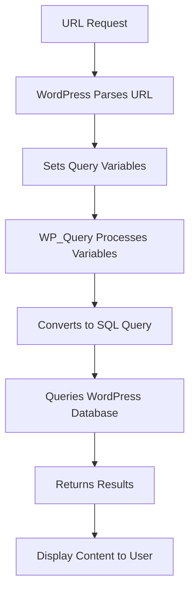

# WordPress Query Variables

## Introduction

WordPress query variables form the backbone of how WordPress retrieves specific content from the database. They act as parameters that tell WordPress exactly what content you want to display on your site. Whether you're retrieving posts from a specific category, showing pages by a particular author, or implementing custom queries for specialized content, understanding query variables is essential for WordPress development.

In this tutorial, we'll explore what query variables are, how they work with the WordPress database, and how you can leverage them to create dynamic and efficient WordPress websites.

## What Are WordPress Query Variables?

Query variables are parameters that WordPress uses to determine what content should be retrieved from the database and displayed on a given page. When a visitor accesses a URL on your WordPress site, WordPress parses that URL and sets up various query variables behind the scenes to fetch the appropriate content.

For example, when someone visits a category page, WordPress sets a query variable to indicate which category's posts should be displayed. Similarly, when viewing a single post, WordPress sets query variables to specify which post should be shown.

## The Main Query and WP_Query

WordPress has two primary ways of working with query variables:

1. **The Main Query**: This is automatically created by WordPress when a page loads
2. **Custom Queries**: These are created manually using the `WP_Query` class

### The Main Query

The main query is created by WordPress based on the URL being accessed. WordPress examines the URL, sets appropriate query variables, and then retrieves the corresponding content from the database.

The results of the main query are stored in the global `$wp_query` object, which you can access from anywhere in your theme or plugin:

```php
global $wp_query;
echo "Total posts found: " . $wp_query->found_posts;
```

### Custom Queries with WP_Query

For more specialized content retrieval, you can create custom queries using the `WP_Query` class:

```php
$custom_query = new WP_Query([
  'category_name' => 'tutorials',
  'posts_per_page' => 5
]);

if ($custom_query->have_posts()) {
  while ($custom_query->have_posts()) {
    $custom_query->the_post();
    echo '<h2>' . get_the_title() . '</h2>';
    the_excerpt();
  }
  // Reset post data to avoid conflicts with the main query
  wp_reset_postdata();
}
```

## Common Query Variables

WordPress supports numerous query variables for retrieving specific content. Here are some of the most commonly used ones:

### Post-Related Query Variables

| Query Variable | Description | Example |
|---------------|------------|---------|
| `p` | Retrieve a specific post by ID | `'p' => 123` |
| `name` | Retrieve a post by its slug | `'name' => 'hello-world'` |
| `page_id` | Retrieve a page by ID | `'page_id' => 456` |
| `pagename` | Retrieve a page by slug | `'pagename' => 'about-us'` |
| `post_type` | Specify the post type to retrieve | `'post_type' => 'product'` |
| `posts_per_page` | Number of posts to display | `'posts_per_page' => 10` |

### Taxonomy-Related Query Variables

| Query Variable | Description | Example |
|---------------|------------|---------|
| `cat` | Retrieve posts from a category ID | `'cat' => 5` |
| `category_name` | Retrieve posts from a category slug | `'category_name' => 'news'` |
| `tag` | Retrieve posts with a specific tag slug | `'tag' => 'featured'` |
| `tax_query` | Complex taxonomy queries | (see examples below) |

### Author and Date-Related Query Variables

| Query Variable | Description | Example |
|---------------|------------|---------|
| `author` | Retrieve posts by author ID | `'author' => 2` |
| `author_name` | Retrieve posts by author nicename | `'author_name' => 'johndoe'` |
| `year`, `month`, `day` | Retrieve posts from specific date | `'year' => 2023, 'month' => 10` |

### Search and Custom Field Query Variables

| Query Variable | Description | Example |
|---------------|------------|---------|
| `s` | Search term | `'s' => 'wordpress'` |
| `meta_key` | Custom field key | `'meta_key' => 'price'` |
| `meta_value` | Custom field value | `'meta_value' => '19.99'` |
| `meta_query` | Complex meta queries | (see examples below) |

## Practical Examples

### Example 1: Displaying Posts from a Specific Category with Custom Ordering

```php
$featured_tutorials = new WP_Query([
  'category_name' => 'tutorials',
  'posts_per_page' => 5,
  'orderby' => 'date',
  'order' => 'DESC'
]);

if ($featured_tutorials->have_posts()) {
  echo '<div class="featured-tutorials">';
  echo '<h2>Latest Tutorials</h2>';
  
  while ($featured_tutorials->have_posts()) {
    $featured_tutorials->the_post();
    echo '<article>';
    echo '<h3><a href="' . get_permalink() . '">' . get_the_title() . '</a></h3>';
    echo '<div class="meta">Published: ' . get_the_date() . '</div>';
    the_excerpt();
    echo '</article>';
  }
  
  echo '</div>';
  wp_reset_postdata();
}
```

**Output:** This will display the 5 most recent posts from the "tutorials" category, each showing the title (linked to the post), publication date, and excerpt.

### Example 2: Advanced Taxonomy Queries with tax_query

The `tax_query` parameter allows for complex taxonomy filtering:

```php
$query = new WP_Query([
  'post_type' => 'product',
  'posts_per_page' => 12,
  'tax_query' => [
    'relation' => 'AND',
    [
      'taxonomy' => 'product_category',
      'field'    => 'slug',
      'terms'    => 'electronics',
    ],
    [
      'taxonomy' => 'product_tag',
      'field'    => 'slug',
      'terms'    => ['sale', 'discount'],
      'operator' => 'IN',
    ],
  ],
]);
```

This query retrieves products that are in the "electronics" category AND have either the "sale" OR "discount" tag.

### Example 3: Custom Field (Meta) Queries with meta_query

The `meta_query` parameter enables filtering by custom fields:

```php
$query = new WP_Query([
  'post_type' => 'property',
  'posts_per_page' => 20,
  'meta_query' => [
    'relation' => 'AND',
    [
      'key' => 'price',
      'value' => 200000,
      'type' => 'NUMERIC',
      'compare' => '<=',
    ],
    [
      'key' => 'bedrooms',
      'value' => 3,
      'type' => 'NUMERIC',
      'compare' => '>=',
    ],
  ],
]);
```

This query retrieves properties with a price less than or equal to $200,000 AND with 3 or more bedrooms.

## How Query Variables Work With the Database

When you create a query using query variables, WordPress translates these into SQL statements that fetch data from the database. Let's see how this works:



For example, if you have a query like:

```php
$query = new WP_Query([
  'category_name' => 'news',
  'posts_per_page' => 5
]);
```

WordPress might generate SQL similar to:

```sql
SELECT wp_posts.* 
FROM wp_posts 
INNER JOIN wp_term_relationships ON (wp_posts.ID = wp_term_relationships.object_id) 
INNER JOIN wp_term_taxonomy ON (wp_term_relationships.term_taxonomy_id = wp_term_taxonomy.term_taxonomy_id) 
INNER JOIN wp_terms ON (wp_term_taxonomy.term_id = wp_terms.term_id) 
WHERE 1=1 
  AND wp_posts.post_type = 'post' 
  AND wp_posts.post_status = 'publish' 
  AND wp_terms.slug = 'news' 
  AND wp_term_taxonomy.taxonomy = 'category' 
ORDER BY wp_posts.post_date DESC 
LIMIT 0, 5
```

## Modifying Query Variables

### Using pre_get_posts

The `pre_get_posts` action hook allows you to modify the main query before it runs. This is useful for altering archive pages, search results, or other built-in WordPress pages:

```php
function modify_main_query($query) {
  // Ensure we're modifying only the main query on the frontend
  if (!is_admin() && $query->is_main_query()) {
    
    // Modify category archives to show 12 posts instead of default
    if ($query->is_category()) {
      $query->set('posts_per_page', 12);
    }
    
    // On the home page, exclude the 'announcements' category
    if ($query->is_home()) {
      $query->set('cat', '-5'); // -5 is the category ID to exclude
    }
  }
}
add_action('pre_get_posts', 'modify_main_query');
```

### Accessing Current Query Variables

You can access the current query variables using the `get_query_var()` function:

```php
$current_category = get_query_var('category_name');
echo "You are viewing posts from the category: " . $current_category;

// Or from the global query object
global $wp_query;
$current_author = $wp_query->get('author_name');
echo "Showing posts by: " . $current_author;
```

## Performance Considerations

When working with query variables, keep these performance best practices in mind:

1. **Be Specific**: Only request the data you need by specifying exactly which fields to return.

```php
$query = new WP_Query([
  'post_type' => 'post',
  'posts_per_page' => 10,
  'fields' => 'ids', // Only return post IDs, not entire post objects
]);
```

2. **Use Pagination**: Always set reasonable `posts_per_page` limits.

3. **Cache Query Results**: For complex or expensive queries, consider caching results:

```php
// Check if results are cached
$cached_results = wp_cache_get('my_special_query', 'queries');

if (false === $cached_results) {
  // Run query if no cache exists
  $query = new WP_Query([/* parameters */]);
  $results = $query->posts;
  
  // Cache for 1 hour (3600 seconds)
  wp_cache_set('my_special_query', $results, 'queries', 3600);
  
  return $results;
} else {
  return $cached_results;
}
```

4. **Avoid Redundant Queries**: Don't create multiple similar queries when one can do the job.

## Summary

WordPress query variables provide a powerful way to retrieve and display specific content from your WordPress database. Through the main query and custom `WP_Query` objects, you can:

- Retrieve posts by type, category, tag, author, date, and more
- Create complex queries with custom taxonomies and meta fields
- Modify existing queries to customize archive pages and search results
- Optimize database performance with proper query techniques

Understanding how query variables work is fundamental for WordPress developers who want to create dynamic, content-rich websites without writing raw SQL queries.

## Additional Resources

Here are some practical exercises to reinforce your understanding of WordPress query variables:

1. Create a custom page template that displays the 5 most recent posts from a specific category alongside 5 most commented posts.

2. Build a "related posts" feature that shows posts with the same tags as the current post.

3. Create a custom archive page that filters posts by multiple taxonomies and custom fields.

4. Build a real estate listing with filtering options using meta_query and tax_query.

For more information, consult these official WordPress resources:

- [WordPress Developer Documentation for WP_Query](https://developer.wordpress.org/reference/classes/wp_query/)
- [WordPress Codex on Query Variables](https://codex.wordpress.org/WordPress_Query_Vars)

Happy coding!