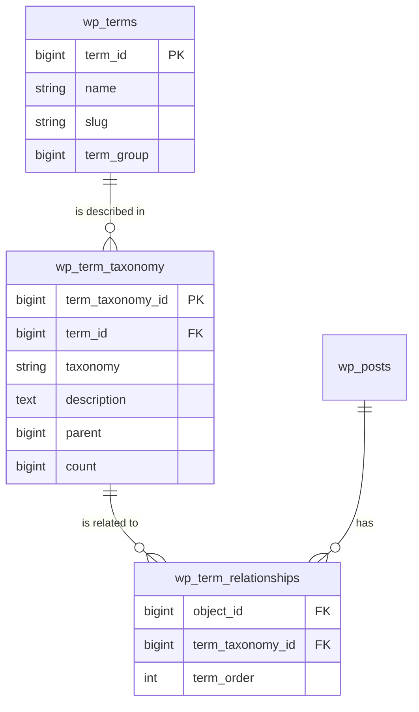

# WordPress Taxonomy Queries

## Introduction

Taxonomies are a fundamental way WordPress organizes content. Whether you're working with categories, tags, or custom taxonomies, understanding how to query taxonomy data is essential for building dynamic WordPress websites and plugins. In this tutorial, we'll explore the WordPress Taxonomy Query API and learn how to effectively retrieve and manipulate taxonomy data from the WordPress database.

Taxonomies in WordPress serve as a classification system that helps organize content. The most common built-in taxonomies are:

- **Categories**: Hierarchical groupings for posts
- **Tags**: Non-hierarchical keywords for posts
- **Post Formats**: Predefined formats like "gallery" or "video"
- **Custom Taxonomies**: User-defined classifications for any post type

## Understanding the WordPress Taxonomy Database Structure

Before diving into queries, let's understand how taxonomies are stored in the WordPress database:



WordPress uses three tables to manage taxonomies:

1. `wp_terms`: Stores the actual taxonomy terms (name and slug)
2. `wp_term_taxonomy`: Links terms to their taxonomy type and stores hierarchy info
3. `wp_term_relationships`: Creates relationships between posts and terms

## Basic Taxonomy Queries

### Get Terms by Taxonomy

The most common taxonomy query is retrieving terms from a specific taxonomy. WordPress provides the `get_terms()` function for this purpose:

```php
$categories = get_terms([
    'taxonomy' => 'category',
    'hide_empty' => false,
]);

if (!empty($categories) && !is_wp_error($categories)) {
    echo '<ul>';
    foreach ($categories as $category) {
        echo '<li>' . $category->name . '</li>';
    }
    echo '</ul>';
}
```

**Output:**
```
• Uncategorized
• WordPress
• Programming
• Web Development
```

### Parameters for `get_terms()`

The `get_terms()` function accepts many parameters to refine queries:

```php
$args = [
    'taxonomy'      => 'category',      // Which taxonomy to query
    'hide_empty'    => true,            // Hide terms with no posts
    'orderby'       => 'name',          // Order by name, count, etc.
    'order'         => 'ASC',           // ASC or DESC
    'number'        => 5,               // Number of terms to return
    'exclude'       => [1, 15],         // Exclude specific term IDs
    'include'       => [],              // Include only specific term IDs
    'child_of'      => 0,               // Get children of this term ID
    'parent'        => 0,               // Get direct children of this term ID
    'fields'        => 'all',           // all, ids, id=>name, etc.
    'slug'          => '',              // Filter by term slug
    'name'          => '',              // Filter by term name
    'meta_query'    => [],              // Query term meta
    'count'         => false,           // Whether to return term count
];

$terms = get_terms($args);
```

## Working with Term Relationships

### Get Terms for a Specific Post

To retrieve all terms associated with a post:

```php
$post_id = 42;
$post_categories = get_the_terms($post_id, 'category');

if ($post_categories && !is_wp_error($post_categories)) {
    echo '<p>Categories for Post #' . $post_id . ':</p>';
    echo '<ul>';
    foreach ($post_categories as $category) {
        echo '<li>' . $category->name . ' (' . $category->count . ' posts)</li>';
    }
    echo '</ul>';
}
```

**Output:**
```
Categories for Post #42:
• WordPress (24 posts)
• Programming (18 posts)
```

### Get Posts by Taxonomy Term

To find all posts in a specific category or with a specific tag:

```php
$args = [
    'post_type'      => 'post',
    'posts_per_page' => 5,
    'tax_query'      => [
        [
            'taxonomy' => 'category',
            'field'    => 'slug',
            'terms'    => 'wordpress',
        ],
    ],
];

$query = new WP_Query($args);

if ($query->have_posts()) {
    echo '<h3>Latest WordPress Posts</h3>';
    echo '<ul>';
    while ($query->have_posts()) {
        $query->the_post();
        echo '<li><a href="' . get_permalink() . '">' . get_the_title() . '</a></li>';
    }
    echo '</ul>';
    wp_reset_postdata();
} else {
    echo '<p>No posts found</p>';
}
```

## Advanced Taxonomy Queries

### Multiple Taxonomy Conditions

You can create complex queries with multiple taxonomy conditions:

```php
$args = [
    'post_type'      => 'post',
    'posts_per_page' => 10,
    'tax_query'      => [
        'relation' => 'AND',
        [
            'taxonomy' => 'category',
            'field'    => 'slug',
            'terms'    => 'wordpress',
        ],
        [
            'taxonomy' => 'post_tag',
            'field'    => 'slug',
            'terms'    => ['tutorial', 'beginner'],
            'operator' => 'IN',
        ],
    ],
];

$query = new WP_Query($args);
```

This query retrieves posts that are in the "wordpress" category AND have either the "tutorial" OR "beginner" tag.

### Nested Tax Queries

You can create even more complex nested queries:

```php
$args = [
    'post_type' => 'post',
    'tax_query' => [
        'relation' => 'OR',
        [
            'taxonomy' => 'category',
            'field'    => 'slug',
            'terms'    => 'wordpress',
        ],
        [
            'relation' => 'AND',
            [
                'taxonomy' => 'category',
                'field'    => 'slug',
                'terms'    => 'programming',
            ],
            [
                'taxonomy' => 'post_tag',
                'field'    => 'slug',
                'terms'    => 'php',
            ],
        ],
    ],
];
```

This query finds posts that are either in the "wordpress" category OR are in both the "programming" category AND have the "php" tag.

## Creating Custom Term Meta Queries

WordPress 4.4+ supports term meta, allowing you to store and query additional data with taxonomy terms:

```php
// First, add some term meta
$term_id = 42;
add_term_meta($term_id, 'featured', 'yes', true);

// Then, query terms with meta conditions
$terms = get_terms([
    'taxonomy'   => 'category',
    'hide_empty' => false,
    'meta_query' => [
        [
            'key'     => 'featured',
            'value'   => 'yes',
            'compare' => '=',
        ],
    ],
]);

if (!empty($terms) && !is_wp_error($terms)) {
    echo '<h3>Featured Categories</h3>';
    echo '<ul>';
    foreach ($terms as $term) {
        echo '<li>' . $term->name . '</li>';
    }
    echo '</ul>';
}
```

## Real-World Applications

### Building a Taxonomy-Based Navigation

Here's a practical example of building a category and subcategory navigation menu:

```php
function display_category_tree($taxonomy = 'category') {
    // Get all parent categories (those with no parent)
    $parent_terms = get_terms([
        'taxonomy'   => $taxonomy,
        'hide_empty' => false,
        'parent'     => 0,
    ]);
    
    if (!empty($parent_terms) && !is_wp_error($parent_terms)) {
        echo '<ul class="category-tree">';
        
        foreach ($parent_terms as $parent_term) {
            echo '<li class="parent-category">';
            echo '<a href="' . get_term_link($parent_term) . '">' . $parent_term->name . '</a>';
            
            // Get child terms
            $child_terms = get_terms([
                'taxonomy'   => $taxonomy,
                'hide_empty' => false,
                'parent'     => $parent_term->term_id,
            ]);
            
            if (!empty($child_terms) && !is_wp_error($child_terms)) {
                echo '<ul class="child-categories">';
                foreach ($child_terms as $child_term) {
                    echo '<li><a href="' . get_term_link($child_term) . '">' . $child_term->name . '</a></li>';
                }
                echo '</ul>';
            }
            
            echo '</li>';
        }
        
        echo '</ul>';
    }
}

// Usage
display_category_tree('category');
```

### Tag Cloud with Custom Styling

Create a custom tag cloud that sizes tags based on post count:

```php
function custom_tag_cloud() {
    $tags = get_terms([
        'taxonomy' => 'post_tag',
        'orderby'  => 'count',
        'order'    => 'DESC',
        'number'   => 20,
    ]);
    
    if (!empty($tags) && !is_wp_error($tags)) {
        $max_count = 0;
        
        // Find the maximum count
        foreach ($tags as $tag) {
            if ($tag->count > $max_count) {
                $max_count = $tag->count;
            }
        }
        
        echo '<div class="custom-tag-cloud">';
        
        foreach ($tags as $tag) {
            // Calculate font size between 80% and 180% based on count
            $font_size = 80 + (($tag->count / $max_count) * 100);
            echo '<a href="' . get_term_link($tag) . '" style="font-size: ' . $font_size . '%;">';
            echo $tag->name . ' (' . $tag->count . ')';
            echo '</a> ';
        }
        
        echo '</div>';
    }
}
```

## Performance Considerations

When working with taxonomy queries, keep these performance tips in mind:

1. **Use `fields` parameter** when you only need specific data:
   ```php
   // Only get term IDs (much faster)
   $term_ids = get_terms([
       'taxonomy' => 'category',
       'fields'   => 'ids',
   ]);
   ```

2. **Cache results** for expensive queries:
   ```php
   $cache_key = 'my_taxonomy_query_' . md5(serialize($args));
   $results = wp_cache_get($cache_key);
   
   if (false === $results) {
       $results = get_terms($args);
       wp_cache_set($cache_key, $results, '', 3600); // Cache for 1 hour
   }
   ```

3. **Use `'update_term_meta_cache' => false`** when you don't need term meta:
   ```php
   $query = new WP_Query([
       'tax_query' => [...],
       'update_term_meta_cache' => false,
   ]);
   ```

## Summary

WordPress Taxonomy Queries provide a powerful way to organize and retrieve content based on categories, tags, and custom taxonomies. In this tutorial, we've covered:

- Basic taxonomy queries using `get_terms()`
- Retrieving terms associated with specific posts
- Finding posts based on taxonomy terms
- Creating complex and nested taxonomy queries
- Working with term meta
- Practical applications like navigation menus and tag clouds
- Performance considerations for taxonomy queries

By mastering taxonomy queries, you can create more dynamic and well-organized WordPress sites with powerful content relationships.

## Additional Resources and Exercises

### Resources
- [WordPress Developer Documentation on Taxonomies](https://developer.wordpress.org/themes/basics/categories-tags-custom-taxonomies/)
- [WordPress Codex: Function Reference for get_terms()](https://developer.wordpress.org/reference/functions/get_terms/)
- [WordPress Codex: WP_Query Taxonomy Parameters](https://developer.wordpress.org/reference/classes/wp_query/#taxonomy-parameters)

### Exercises

1. Create a function that displays posts from the same category as the current post, excluding the current post.
2. Build a filter system that allows users to filter blog posts by multiple taxonomy terms simultaneously.
3. Create a custom widget that shows terms from a custom taxonomy, with the size of each term proportional to its usage.
4. Implement a "related posts" feature that finds posts sharing the most taxonomy terms with the current post.
5. Create a breadcrumb navigation system for hierarchical taxonomies that shows the full parent-child relationship.