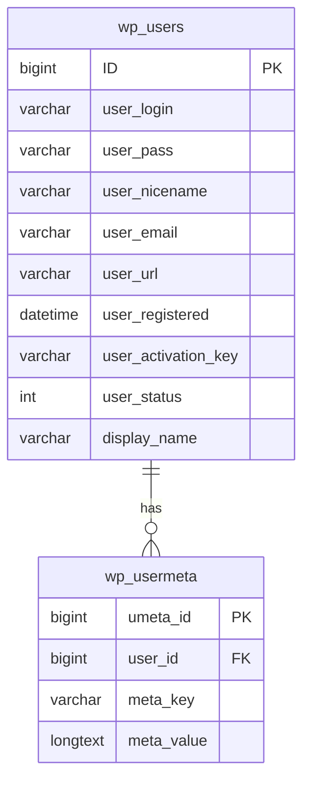

# WordPress User Queries

## Introduction

WordPress stores user information in its database, and provides powerful APIs to retrieve, filter, and manipulate this data. Whether you're building a membership site, customizing a user directory, or implementing role-based functionality, understanding how to effectively query user data is essential for WordPress developers.

In this guide, we'll explore WordPress User Queries - specifically focusing on the `WP_User_Query` class and related functions that allow you to interact with user data in WordPress. By the end, you'll be able to create efficient and flexible queries to retrieve specific sets of users based on various criteria.

## The WordPress Users Database

Before diving into queries, let's understand where WordPress stores user data:



WordPress stores core user data in the `wp_users` table and additional user metadata in the `wp_usermeta` table. This separation allows WordPress to store any amount of custom data associated with users.

## Getting User Data: Basic Approaches

### 1. Using `get_userdata()` for Single Users

The simplest way to retrieve information about a specific user is with the `get_userdata()` function:

```php
// Get user with ID = 1
$user = get_userdata(1);

// Check if user exists
if ($user) {
    echo "Username: " . $user->user_login . "<br />";
    echo "Email: " . $user->user_email . "<br />";
    echo "Display Name: " . $user->display_name . "<br />";
    
    // Access roles
    echo "Roles: " . implode(", ", $user->roles) . "<br />";
}
```

**Output:**
```
Username: admin
Email: admin@example.com
Display Name: Admin
Roles: administrator
```

### 2. Using `get_users()` for Multiple Users

When you need to retrieve multiple users with simple filtering criteria, `get_users()` provides a straightforward approach:

```php
// Get all administrators
$admins = get_users([
    'role' => 'administrator'
]);

// Output results
echo "Found " . count($admins) . " administrators:<br />";
foreach ($admins as $admin) {
    echo "- " . $admin->display_name . " (" . $admin->user_email . ")<br />";
}
```

**Output:**
```
Found 2 administrators:
- Admin (admin@example.com)
- Jane Doe (jane@example.com)
```

## The WP_User_Query Class

For more complex user queries, WordPress provides the `WP_User_Query` class. This offers maximum flexibility and control over your user queries.

### Basic Structure

Here's the basic pattern for using `WP_User_Query`:

```php
// Define query arguments
$args = [
    // Query parameters go here
];

// Create the query
$user_query = new WP_User_Query($args);

// Get the results
$users = $user_query->get_results();

// Process the results
if (!empty($users)) {
    foreach ($users as $user) {
        // Do something with each user
    }
} else {
    echo "No users found.";
}
```

### Common Query Parameters

Let's explore some common parameters you can use with `WP_User_Query`:

#### Roles and Capabilities

```php
// Find users with specific role
$args = [
    'role' => 'editor'
];

// Find users with multiple roles (OR relationship)
$args = [
    'role__in' => ['editor', 'author']
];

// Find users with specific capability
$args = [
    'capability' => 'edit_others_posts'
];
```

#### Meta Queries

User meta queries allow you to filter users based on their metadata:

```php
// Find users with a specific meta key/value
$args = [
    'meta_query' => [
        [
            'key' => 'country',
            'value' => 'Canada',
            'compare' => '='
        ]
    ]
];

// Multiple meta conditions (AND relationship)
$args = [
    'meta_query' => [
        'relation' => 'AND',
        [
            'key' => 'country',
            'value' => 'Canada',
            'compare' => '='
        ],
        [
            'key' => 'age',
            'value' => 30,
            'compare' => '>',
            'type' => 'NUMERIC'
        ]
    ]
];
```

#### Search and Ordering

```php
// Search users by keyword
$args = [
    'search' => '*John*'  // Wildcards for partial matching
];

// Order results
$args = [
    'orderby' => 'registered',  // Sort by registration date
    'order' => 'DESC'           // Newest first
];
```

#### Pagination

```php
// Implement pagination
$args = [
    'number' => 10,    // Users per page
    'offset' => 0,     // Skip first N users
];

// Alternative pagination approach
$args = [
    'number' => 10,
    'paged' => get_query_var('paged') ? get_query_var('paged') : 1,
];
```

## Practical Examples

### Example 1: Building a User Directory

This example shows how to create a paginated user directory sorted by name:

```php
function display_user_directory() {
    $paged = (get_query_var('paged')) ? get_query_var('paged') : 1;
    $users_per_page = 10;
    
    $args = [
        'number' => $users_per_page,
        'paged' => $paged,
        'orderby' => 'display_name',
        'order' => 'ASC',
        // Exclude administrators from the listing
        'role__not_in' => ['administrator']
    ];
    
    $user_query = new WP_User_Query($args);
    $users = $user_query->get_results();
    $total_users = $user_query->get_total();
    
    // Start output
    $output = '<div class="user-directory">';
    
    if (!empty($users)) {
        foreach ($users as $user) {
            $avatar = get_avatar($user->ID, 64);
            
            $output .= '<div class="user-card">';
            $output .= $avatar;
            $output .= '<h3>' . esc_html($user->display_name) . '</h3>';
            $output .= '<p class="user-role">' . implode(', ', $user->roles) . '</p>';
            $output .= '</div>';
        }
        
        // Add pagination
        $total_pages = ceil($total_users / $users_per_page);
        if ($total_pages > 1) {
            $output .= '<div class="pagination">';
            $output .= paginate_links([
                'base' => add_query_arg('paged', '%#%'),
                'format' => '',
                'prev_text' => '&laquo; Previous',
                'next_text' => 'Next &raquo;',
                'total' => $total_pages,
                'current' => $paged
            ]);
            $output .= '</div>';
        }
    } else {
        $output .= '<p>No users found.</p>';
    }
    
    $output .= '</div>';
    return $output;
}

// Usage: echo display_user_directory();
```

### Example 2: Finding Users Based on Activity

Let's find active users who have published content recently:

```php
function get_active_authors($days_ago = 30) {
    // Get timestamp for X days ago
    $time_threshold = time() - ($days_ago * DAY_IN_SECONDS);
    $formatted_date = date('Y-m-d H:i:s', $time_threshold);
    
    // Find authors with recent posts
    $args = [
        'role__in' => ['author', 'editor', 'administrator'],
        'meta_query' => [
            [
                'key' => '_last_post_date',
                'value' => $formatted_date,
                'compare' => '>=',
                'type' => 'DATETIME'
            ]
        ],
        'orderby' => 'meta_value',
        'meta_key' => '_last_post_date',
        'order' => 'DESC'
    ];
    
    $user_query = new WP_User_Query($args);
    return $user_query->get_results();
}

// Usage
$active_authors = get_active_authors();
foreach ($active_authors as $author) {
    echo $author->display_name . ' published content recently.<br />';
}
```

:::tip
To make the above example work properly, you'd need to store the last post date as user meta whenever a user publishes content. This could be done with a hook like `publish_post`.
:::

### Example 3: Custom User Search Form

This example creates a custom AJAX-powered user search form:

```php
// Enqueue necessary scripts in your plugin/theme
function enqueue_user_search_scripts() {
    wp_enqueue_script(
        'user-search',
        get_template_directory_uri() . '/js/user-search.js',
        ['jquery'],
        '1.0',
        true
    );
    
    wp_localize_script(
        'user-search',
        'user_search_data',
        [
            'ajax_url' => admin_url('admin-ajax.php'),
            'nonce' => wp_create_nonce('user_search_nonce')
        ]
    );
}
add_action('wp_enqueue_scripts', 'enqueue_user_search_scripts');

// AJAX handler for user search
function ajax_user_search() {
    // Check nonce for security
    check_ajax_referer('user_search_nonce', 'nonce');
    
    $search_term = isset($_POST['search_term']) ? sanitize_text_field($_POST['search_term']) : '';
    $role = isset($_POST['role']) ? sanitize_text_field($_POST['role']) : '';
    
    $args = [
        'search' => "*{$search_term}*",
        'search_columns' => ['user_login', 'user_email', 'display_name'],
        'number' => 10,
    ];
    
    // Add role if specified
    if (!empty($role)) {
        $args['role'] = $role;
    }
    
    $user_query = new WP_User_Query($args);
    $users = $user_query->get_results();
    
    $result = [];
    if (!empty($users)) {
        foreach ($users as $user) {
            $result[] = [
                'id' => $user->ID,
                'name' => $user->display_name,
                'email' => $user->user_email,
                'avatar' => get_avatar_url($user->ID, ['size' => 32]),
                'url' => get_author_posts_url($user->ID)
            ];
        }
    }
    
    wp_send_json_success($result);
}
add_action('wp_ajax_user_search', 'ajax_user_search');
add_action('wp_ajax_nopriv_user_search', 'ajax_user_search');
```

The HTML form in your template:

```html
<div class="user-search-form">
    <input type="text" id="search-term" placeholder="Search users...">
    <select id="role-filter">
        <option value="">All roles</option>
        <option value="subscriber">Subscribers</option>
        <option value="author">Authors</option>
        <option value="editor">Editors</option>
    </select>
    <button id="search-users">Search</button>
    <div id="search-results"></div>
</div>
```

The JavaScript (jQuery) for handling the search:

```javascript
// This would go in your js/user-search.js file
jQuery(document).ready(function($) {
    $('#search-users').on('click', function() {
        const searchTerm = $('#search-term').val();
        const role = $('#role-filter').val();
        
        $.ajax({
            url: user_search_data.ajax_url,
            type: 'POST',
            data: {
                action: 'user_search',
                nonce: user_search_data.nonce,
                search_term: searchTerm,
                role: role
            },
            success: function(response) {
                const $results = $('#search-results');
                $results.empty();
                
                if (response.success && response.data.length > 0) {
                    const $list = $('<ul class="user-list"></ul>');
                    
                    $.each(response.data, function(i, user) {
                        $list.append(`
                            <li class="user-item">
                                
                                <a href="${user.url}" class="user-link">
                                    <span class="user-name">${user.name}</span>
                                    <span class="user-email">${user.email}</span>
                                </a>
                            </li>
                        `);
                    });
                    
                    $results.append($list);
                } else {
                    $results.append('<p>No users found matching your criteria.</p>');
                }
            }
        });
    });
});
```

## Performance Considerations

When working with user queries, especially on sites with many users, consider these performance tips:

1. **Use Field Selection**: Limit the fields you retrieve to only what you need.

```php
$args = [
    'fields' => ['ID', 'display_name', 'user_email'],
    // Other parameters...
];
```

2. **Count Users Efficiently**: If you only need the count, use the `count_total` parameter.

```php
$args = [
    'role' => 'subscriber',
    'count_total' => true,
    // Other parameters...
];

$user_query = new WP_User_Query($args);
$total_users = $user_query->get_total();
echo "Total subscribers: " . $total_users;
```

3. **Avoid Unnecessary Meta Queries**: Meta queries are resource-intensive. Use them only when necessary and try to optimize them.

4. **Use Caching**: For expensive queries, implement caching:

```php
function get_featured_users() {
    $cache_key = 'featured_users';
    $featured_users = wp_cache_get($cache_key);
    
    if (false === $featured_users) {
        $args = [
            'meta_key' => 'is_featured',
            'meta_value' => 'yes'
        ];
        
        $user_query = new WP_User_Query($args);
        $featured_users = $user_query->get_results();
        
        // Cache for 12 hours
        wp_cache_set($cache_key, $featured_users, '', 12 * HOUR_IN_SECONDS);
    }
    
    return $featured_users;
}
```

## Understanding User Query Hooks

WordPress provides several hooks to modify user queries:

### `pre_user_query`

This filter allows you to modify the `WP_User_Query` object before the database query is executed:

```php
function modify_user_query($user_query) {
    // Add conditions to the query
    if (isset($user_query->query_vars['role']) && $user_query->query_vars['role'] === 'author') {
        // Modify the query for authors
        global $wpdb;
        $user_query->query_from .= " INNER JOIN {$wpdb->prefix}usermeta AS um ON um.user_id = {$wpdb->users}.ID";
        $user_query->query_where .= " AND um.meta_key = 'post_count' AND um.meta_value > 0";
    }
    
    return $user_query;
}
add_filter('pre_user_query', 'modify_user_query');
```

## Summary

WordPress User Queries provide a powerful way to interact with user data in your WordPress database. Through the `WP_User_Query` class and related functions like `get_users()` and `get_userdata()`, you can efficiently retrieve and filter user information based on various criteria.

We've explored:
- Basic methods for fetching user data
- How to use the `WP_User_Query` class
- Common query parameters for filtering users
- Practical examples including user directories and search functionality
- Performance optimization techniques
- Hooks for customizing user queries

By mastering these concepts, you can build sophisticated user management functionality for your WordPress sites, from membership directories to custom user dashboards.

## Additional Resources and Exercises

### Resources
- [WordPress Developer Documentation: WP_User_Query](https://developer.wordpress.org/reference/classes/wp_user_query/)
- [WordPress Codex: Users](https://codex.wordpress.org/Users)

### Exercises

1. **Basic Exercise**: Create a function that retrieves all users who registered in the last 30 days and display their information.

2. **Intermediate Exercise**: Build a custom dashboard widget that shows the top 5 contributors based on post count.

3. **Advanced Exercise**: Create a user export tool that allows administrators to export user data based on various filters (role, registration date, custom fields) to CSV format.

4. **Challenge**: Implement a "related authors" feature that shows authors who write about similar topics based on post categories and tags.

By working through these resources and exercises, you'll solidify your understanding of WordPress User Queries and develop practical skills for working with user data in your projects.