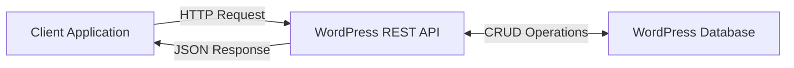

# WordPress REST API

## Introduction

The WordPress REST API is a powerful interface that allows developers to interact with WordPress websites programmatically. REST (Representational State Transfer) is an architectural style for designing networked applications, and the WordPress REST API implements this style to expose WordPress data and functionality through HTTP endpoints.

With the WordPress REST API, you can:

- Read, create, update, and delete WordPress content (posts, pages, custom post types)
- Manage users, comments, taxonomies, and media
- Build mobile applications, single-page applications, or custom admin interfaces
- Connect WordPress with other applications and services

Whether you're building a custom front-end for your WordPress site, creating a mobile app, or integrating WordPress with other systems, the REST API provides a standardized, powerful way to access WordPress data.

## Understanding REST API Basics

Before diving into the WordPress-specific implementation, let's understand some REST API fundamentals:

### Key Concepts

1. **Endpoints**: URLs that represent different resources
2. **HTTP Methods**: GET, POST, PUT, DELETE to perform different operations
3. **JSON**: The standard format for data exchange
4. **Authentication**: Methods to secure API access



## WordPress REST API Structure

The WordPress REST API is organized around a core URL structure:

```
https://your-wordpress-site.com/wp-json/
```

This base URL is then extended with namespaces and endpoints:

```
https://your-wordpress-site.com/wp-json/{namespace}/{resource}/{identifier}
```

For example:
- `wp/v2` is the core WordPress namespace (version 2)
- `posts` is a resource endpoint
- `42` could be a specific post ID

So a full URL might look like:

```
https://your-wordpress-site.com/wp-json/wp/v2/posts/42
```

## Making Your First API Request

Let's start by retrieving posts from a WordPress site using the REST API:

### Using JavaScript

```javascript
// Fetch all published posts
fetch('https://your-wordpress-site.com/wp-json/wp/v2/posts')
  .then(response => response.json())
  .then(posts => {
    console.log(posts);
    // Do something with the posts data
    posts.forEach(post => {
      console.log(post.title.rendered);
    });
  })
  .catch(error => console.error('Error fetching posts:', error));
```

### Using PHP

```php
<?php
// Fetch all published posts
$response = wp_remote_get('https://your-wordpress-site.com/wp-json/wp/v2/posts');

if (is_wp_error($response)) {
    echo 'Error: ' . $response->get_error_message();
} else {
    $posts = json_decode(wp_remote_retrieve_body($response), true);
    
    // Do something with the posts data
    foreach ($posts as $post) {
        echo $post['title']['rendered'] . '<br />';
    }
}
```

## Common Endpoints

Here are some of the most commonly used WordPress REST API endpoints:

| Endpoint | Description |
|----------|-------------|
| `/wp/v2/posts` | Access to posts |
| `/wp/v2/pages` | Access to pages |
| `/wp/v2/users` | Access to users |
| `/wp/v2/media` | Access to media files |
| `/wp/v2/categories` | Access to categories |
| `/wp/v2/tags` | Access to tags |
| `/wp/v2/comments` | Access to comments |

## Working with Parameters

The WordPress REST API supports various parameters to filter, sort, and paginate results:

### Pagination

```
/wp-json/wp/v2/posts?per_page=5&page=2
```

This retrieves 5 posts per page, showing page 2.

### Filtering

```
/wp-json/wp/v2/posts?categories=7
```

This retrieves posts in category with ID 7.

### Ordering

```
/wp-json/wp/v2/posts?order=asc&orderby=title
```

This retrieves posts ordered by title in ascending order.

### Example with Multiple Parameters

```javascript
// Fetch 5 posts from category 7, ordered by title
fetch('https://your-wordpress-site.com/wp-json/wp/v2/posts?per_page=5&categories=7&order=asc&orderby=title')
  .then(response => response.json())
  .then(posts => {
    console.log(posts);
  })
  .catch(error => console.error('Error:', error));
```

## Authentication

Many REST API operations, especially those that create, update, or delete content, require authentication. WordPress supports several authentication methods:

### 1. Cookie Authentication (for Same-Origin Requests)

Uses WordPress's built-in cookie/nonce system. Useful for admin-ajax.php replacements.

```javascript
// First get the nonce
const nonce = wpApiSettings.nonce;

// Then use it in your request
fetch('https://your-wordpress-site.com/wp-json/wp/v2/posts', {
  method: 'POST',
  headers: {
    'Content-Type': 'application/json',
    'X-WP-Nonce': nonce
  },
  credentials: 'same-origin',
  body: JSON.stringify({
    title: 'New Post via REST API',
    content: 'This is the content of my post.',
    status: 'publish'
  })
})
.then(response => response.json())
.then(data => console.log('Success:', data))
.catch(error => console.error('Error:', error));
```

### 2. Application Passwords (Recommended for External Applications)

Since WordPress 5.6, you can generate application passwords in your user profile.

```javascript
// Using Application Password with fetch
fetch('https://your-wordpress-site.com/wp-json/wp/v2/posts', {
  method: 'POST',
  headers: {
    'Content-Type': 'application/json',
    'Authorization': 'Basic ' + btoa('username:application_password')
  },
  body: JSON.stringify({
    title: 'New Post via REST API',
    content: 'This is the content of my post.',
    status: 'publish'
  })
})
.then(response => response.json())
.then(data => console.log('Success:', data))
.catch(error => console.error('Error:', error));
```

### 3. OAuth 1.0a

For more complex third-party applications, OAuth 1.0a provides a secure way to authenticate without storing user credentials.

## CRUD Operations with the REST API

Let's look at how to perform Create, Read, Update, and Delete operations:

### Create (POST)

```javascript
// Create a new post
fetch('https://your-wordpress-site.com/wp-json/wp/v2/posts', {
  method: 'POST',
  headers: {
    'Content-Type': 'application/json',
    'Authorization': 'Basic ' + btoa('username:application_password')
  },
  body: JSON.stringify({
    title: 'New Post Title',
    content: 'Content of the post',
    excerpt: 'Post excerpt',
    status: 'publish'
  })
})
.then(response => response.json())
.then(data => console.log('Post created:', data))
.catch(error => console.error('Error creating post:', error));
```

### Read (GET)

```javascript
// Get a specific post by ID
fetch('https://your-wordpress-site.com/wp-json/wp/v2/posts/42')
  .then(response => response.json())
  .then(post => console.log('Post details:', post))
  .catch(error => console.error('Error fetching post:', error));
```

### Update (PUT)

```javascript
// Update an existing post
fetch('https://your-wordpress-site.com/wp-json/wp/v2/posts/42', {
  method: 'PUT',
  headers: {
    'Content-Type': 'application/json',
    'Authorization': 'Basic ' + btoa('username:application_password')
  },
  body: JSON.stringify({
    title: 'Updated Post Title',
    content: 'Updated content'
  })
})
.then(response => response.json())
.then(data => console.log('Post updated:', data))
.catch(error => console.error('Error updating post:', error));
```

### Delete (DELETE)

```javascript
// Delete a post
fetch('https://your-wordpress-site.com/wp-json/wp/v2/posts/42', {
  method: 'DELETE',
  headers: {
    'Content-Type': 'application/json',
    'Authorization': 'Basic ' + btoa('username:application_password')
  }
})
.then(response => response.json())
.then(data => console.log('Post deleted:', data))
.catch(error => console.error('Error deleting post:', error));
```

## Custom Endpoints

One of the most powerful features of the WordPress REST API is the ability to create custom endpoints. This allows you to expose custom functionality or data in a RESTful way.

### Registering a Custom Endpoint

Add this code to your theme's `functions.php` file or in a plugin:

```php
<?php
// Register a custom endpoint
add_action('rest_api_init', function () {
  register_rest_route('my-plugin/v1', '/latest-posts/', array(
    'methods' => 'GET',
    'callback' => 'get_latest_custom_posts',
    'permission_callback' => '__return_true'
  ));
});

// Callback function for the endpoint
function get_latest_custom_posts() {
  $args = array(
    'post_type' => 'post',
    'posts_per_page' => 5,
    'orderby' => 'date',
    'order' => 'DESC',
  );
  
  $posts = get_posts($args);
  $data = array();
  
  foreach ($posts as $post) {
    $post_data = array(
      'id' => $post->ID,
      'title' => $post->post_title,
      'excerpt' => $post->post_excerpt,
      'date' => $post->post_date,
      'url' => get_permalink($post->ID)
    );
    
    $data[] = $post_data;
  }
  
  return $data;
}
```

Now you can access your custom endpoint:

```
https://your-wordpress-site.com/wp-json/my-plugin/v1/latest-posts/
```

### Adding Arguments to Custom Endpoints

You can also accept parameters in your custom endpoints:

```php
<?php
add_action('rest_api_init', function () {
  register_rest_route('my-plugin/v1', '/posts-by-category/(?P<id>\d+)', array(
    'methods' => 'GET',
    'callback' => 'get_posts_by_category',
    'permission_callback' => '__return_true',
    'args' => array(
      'id' => array(
        'validate_callback' => function($param) {
          return is_numeric($param);
        }
      ),
    ),
  ));
});

function get_posts_by_category($request) {
  $category_id = $request['id'];
  
  $args = array(
    'post_type' => 'post',
    'posts_per_page' => 10,
    'cat' => $category_id
  );
  
  $posts = get_posts($args);
  $data = array();
  
  foreach ($posts as $post) {
    $data[] = array(
      'id' => $post->ID,
      'title' => $post->post_title,
      'url' => get_permalink($post->ID)
    );
  }
  
  return $data;
}
```

Access it like this:
```
https://your-wordpress-site.com/wp-json/my-plugin/v1/posts-by-category/5
```

## Practical Example: Building a Simple React App with WordPress REST API

Let's create a simple React application that displays your latest posts:

```jsx
import React, { useState, useEffect } from 'react';

function WordPressPosts() {
  const [posts, setPosts] = useState([]);
  const [isLoading, setIsLoading] = useState(true);
  const [error, setError] = useState(null);

  useEffect(() => {
    // Fetch posts when component mounts
    fetch('https://your-wordpress-site.com/wp-json/wp/v2/posts?_embed&per_page=5')
      .then(response => {
        if (!response.ok) {
          throw new Error('Network response was not ok');
        }
        return response.json();
      })
      .then(data => {
        setPosts(data);
        setIsLoading(false);
      })
      .catch(error => {
        setError('Error fetching posts: ' + error.message);
        setIsLoading(false);
      });
  }, []);

  if (isLoading) return <div>Loading posts...</div>;
  if (error) return <div>{error}</div>;

  return (
    <div className="posts-container">
      <h2>Latest Posts</h2>
      {posts.map(post => (
        <div key={post.id} className="post-card">
          <h3 dangerouslySetInnerHTML={{ __html: post.title.rendered }} />
          
          {post._embedded && post._embedded['wp:featuredmedia'] && (
            
          )}
          
          <div dangerouslySetInnerHTML={{ __html: post.excerpt.rendered }} />
          
          <a href={post.link} target="_blank" rel="noopener noreferrer">
            Read more
          </a>
        </div>
      ))}
    </div>
  );
}

export default WordPressPosts;
```

Note the use of `_embed` parameter in the API request. This tells WordPress to include related resources (like featured images, author info) in the response.

## Performance Considerations

When working with the WordPress REST API, keep these performance tips in mind:

1. **Request only what you need**: Use the `_fields` parameter to limit returned fields
   ```
   /wp-json/wp/v2/posts?_fields=id,title,excerpt
   ```

2. **Pagination**: Don't fetch too many items at once
   ```
   /wp-json/wp/v2/posts?per_page=10&page=1
   ```

3. **Caching**: Implement caching for API responses

4. **Embed related resources** when needed to reduce multiple requests
   ```
   /wp-json/wp/v2/posts?_embed
   ```

## Security Best Practices

1. **Use HTTPS**: Always secure your API communications
2. **Validate and sanitize data**: Both incoming and outgoing
3. **Use proper authentication**: Application passwords for external apps
4. **Set proper permissions**: Use `permission_callback` in custom endpoints
5. **Implement rate limiting**: Protect against abuse

## Summary

The WordPress REST API provides a powerful way to interact with WordPress programmatically. It allows developers to create, read, update, and delete WordPress content using standard HTTP methods, making it ideal for building custom applications, headless WordPress setups, or integrating WordPress with other systems.

We've covered:
- The basics of REST API architecture
- Core WordPress endpoints
- CRUD operations
- Authentication methods
- Creating custom endpoints
- Building a simple React app consuming WordPress data

By leveraging the WordPress REST API, you can transform WordPress from a traditional CMS into a robust application platform that can power websites, mobile apps, and other custom solutions.

## Additional Resources

- [WordPress REST API Handbook](https://developer.wordpress.org/rest-api/)
- [WP REST API Documentation](https://developer.wordpress.org/rest-api/reference/)
- [Using the WordPress REST API with JavaScript](https://css-tricks.com/using-the-wordpress-rest-api-with-javascript/)

## Exercises

1. Create a custom endpoint that returns the 5 most popular posts based on comment count
2. Build a simple HTML/JavaScript page that displays your latest WordPress posts using fetch
3. Create a form that allows users to submit posts to your WordPress site via the REST API
4. Extend the React example to include pagination for browsing through all posts

By practicing with these exercises, you'll gain hands-on experience with the WordPress REST API and its capabilities.