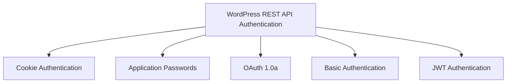

# WordPress REST Authentication

In this guide, we'll explore various methods of authenticating with the WordPress REST API. Authentication is crucial for securing your API endpoints and ensuring that only authorized users can access or modify your WordPress data.

## Introduction to REST API Authentication

The WordPress REST API provides powerful capabilities for interacting with your WordPress site programmatically. However, accessing certain endpoints or performing write operations requires proper authentication. Without authentication, anyone could potentially modify your site's content!

Authentication answers two important questions:
1. Who is making this request?
2. Does this person have permission to perform this action?

WordPress REST API offers several authentication methods, each suitable for different scenarios.

## Authentication Methods Overview



Let's examine each authentication method in detail.

## Cookie Authentication

Cookie authentication is the default method WordPress uses for logged-in users.

### How it Works

1. A user logs into WordPress through the regular login form
2. WordPress sets authentication cookies in the user's browser
3. These cookies are automatically sent with subsequent API requests
4. WordPress verifies these cookies to authenticate the user

### Nonce Requirement

For security reasons, cookie authentication requires a nonce (a one-time token) to be sent with each request. This helps prevent Cross-Site Request Forgery (CSRF) attacks.

#### Example: Obtaining and Using a Nonce

```javascript
// First, we need to get a nonce
fetch('/wp-json/wp/v2/')
  .then(response => response.json())
  .then(data => {
    // Extract the nonce from the response
    const wpNonce = data.nonce;
    
    // Now use the nonce in a request that requires authentication
    return fetch('/wp-json/wp/v2/posts', {
      method: 'POST',
      headers: {
        'Content-Type': 'application/json',
        'X-WP-Nonce': wpNonce
      },
      credentials: 'include', // Important! Ensures cookies are sent
      body: JSON.stringify({
        title: 'My New Post',
        content: 'This is the content of my post.',
        status: 'publish'
      })
    });
  })
  .then(response => response.json())
  .then(newPost => {
    console.log('Post created:', newPost);
  })
  .catch(error => {
    console.error('Error:', error);
  });
```

### When to Use Cookie Authentication

Cookie authentication is ideal for:
- Browser-based applications where a user is already logged into WordPress
- Theme and plugin development where users are authenticated through the WordPress login system
- Admin-level functionalities within the WordPress dashboard

## Application Passwords

Application Passwords is a feature introduced in WordPress 5.6 that provides a secure way to authenticate API requests without sharing your main WordPress password.

### How to Generate Application Passwords

1. Navigate to your WordPress profile page in the admin dashboard
2. Scroll down to the "Application Passwords" section
3. Enter a name for your application (e.g., "My Custom App")
4. Click "Add New Application Password"
5. WordPress will generate a new password - copy it immediately (it will only be shown once!)

### Using Application Passwords

Application Passwords use HTTP Basic Authentication under the hood, but they're more secure because:
- They're specific to an application
- They can be revoked individually
- They don't expose your main WordPress password

#### Example: Making a Request with Application Passwords

```javascript
const username = 'your_username';
const appPassword = 'XXXX XXXX XXXX XXXX XXXX XXXX'; // The generated app password

// Create the authorization header
const headers = new Headers();
headers.append('Authorization', 'Basic ' + btoa(username + ':' + appPassword));

// Make the authenticated request
fetch('/wp-json/wp/v2/posts', {
  method: 'GET',
  headers: headers
})
  .then(response => response.json())
  .then(posts => {
    console.log('Retrieved posts:', posts);
  })
  .catch(error => {
    console.error('Error:', error);
  });
```

### When to Use Application Passwords

Application Passwords are ideal for:
- External applications that need to interact with your WordPress site
- Mobile apps that need WordPress API access
- Any situation where you need programmatic access from outside WordPress itself
- Development and testing environments

## OAuth 1.0a Authentication

For more complex applications that need to act on behalf of users without storing their credentials, OAuth 1.0a provides a robust authentication framework.

### How OAuth 1.0a Works with WordPress

1. Your application registers with the WordPress site to get consumer keys
2. Users authorize your application to access their account
3. Your application receives tokens to make authenticated requests

To use OAuth 1.0a with WordPress, you'll need to install and configure the [OAuth 1.0a Server plugin](https://github.com/WP-API/OAuth1).

### Example OAuth 1.0a Flow in WordPress

```javascript
// This is a simplified example and would typically require a library to handle OAuth signatures

// Step 1: Request temporary credentials
// Your application would make this request with consumer key and secret
const requestTokenUrl = '/wp-json/oauth1/request';

// Step 2: User authorization
// Redirect user to authorization URL
const authorizeUrl = '/wp-json/oauth1/authorize?oauth_token=TEMPORARY_TOKEN';

// Step 3: Exchange for token credentials
// After user authorizes, exchange the temporary token for access tokens
const accessTokenUrl = '/wp-json/oauth1/access';

// Step 4: Make authenticated requests with the access token
// Usually handled by an OAuth library that creates proper signature
fetch('/wp-json/wp/v2/posts', {
  headers: {
    // OAuth headers would go here, generated by library
  }
})
  .then(response => response.json())
  .then(data => console.log(data));
```

### When to Use OAuth 1.0a

OAuth 1.0a is ideal for:
- Public applications that act on behalf of users
- Applications where users shouldn't share their WordPress credentials
- Complex applications with multiple user integrations
- Enterprise-level applications that require delegated access

## Basic Authentication (For Development Only)

Basic Authentication is the simplest form of HTTP authentication, where credentials are sent in the request header.

⚠️ **WARNING**: Basic Authentication should **NEVER** be used in production environments as it sends credentials with every request in an encoded (but not encrypted) format.

### Setting Up Basic Authentication

1. Install the [Basic Authentication plugin](https://github.com/WP-API/Basic-Auth) (development purposes only)
2. The plugin enables HTTP Basic Authentication for API requests

### Example: Using Basic Authentication

```javascript
const username = 'your_username';
const password = 'your_password';

// Create the authentication header
const headers = new Headers();
headers.append('Authorization', 'Basic ' + btoa(username + ':' + password));

// Make an authenticated request
fetch('/wp-json/wp/v2/posts', {
  method: 'GET',
  headers: headers
})
  .then(response => response.json())
  .then(posts => {
    console.log('Posts:', posts);
  })
  .catch(error => {
    console.error('Error:', error);
  });
```

### When to Use Basic Authentication

Basic Authentication should **only** be used for:
- Local development environments
- Testing purposes
- When behind additional security layers (like VPN)

Never use Basic Authentication in production environments!

## JWT Authentication

JSON Web Tokens (JWT) provide a modern alternative for API authentication that's particularly useful for headless WordPress setups.

### Setting Up JWT Authentication

You'll need to install a JWT plugin such as [JWT Authentication for WP REST API](https://wordpress.org/plugins/jwt-authentication-for-wp-rest-api/).

### How JWT Authentication Works

1. Client sends credentials to get a token
2. WordPress verifies credentials and returns a JWT
3. Client stores this token and sends it with subsequent requests
4. Server validates the token for each request

### Example: Using JWT Authentication

```javascript
// Step 1: Get a JWT token
fetch('/wp-json/jwt-auth/v1/token', {
  method: 'POST',
  headers: {
    'Content-Type': 'application/json'
  },
  body: JSON.stringify({
    username: 'your_username',
    password: 'your_password'
  })
})
  .then(response => response.json())
  .then(data => {
    // Store the token
    const token = data.token;
    
    // Step 2: Use the token for authenticated requests
    return fetch('/wp-json/wp/v2/posts', {
      headers: {
        'Authorization': 'Bearer ' + token
      }
    });
  })
  .then(response => response.json())
  .then(posts => {
    console.log('Posts:', posts);
  })
  .catch(error => {
    console.error('Error:', error);
  });
```

### When to Use JWT Authentication

JWT Authentication is ideal for:
- Headless WordPress configurations
- Single Page Applications (SPAs)
- Mobile applications
- Modern JavaScript frameworks (React, Vue, Angular)
- Any decoupled architecture where cookies aren't practical

## Comparison of Authentication Methods

| Method | Security Level | Use Case | Complexity | Production Ready |
|--------|---------------|----------|------------|-----------------|
| Cookie | Good (with HTTPS) | Browser apps | Low | Yes |
| Application Passwords | High | External apps | Low | Yes |
| OAuth 1.0a | Very High | Multi-user apps | High | Yes |
| Basic Auth | Low | Development only | Very Low | No |
| JWT | High | Headless WP | Medium | Yes (with proper plugin) |

## Handling Authentication Errors

When authentication fails, the WordPress REST API returns specific status codes and error messages:

- `401 Unauthorized`: Authentication credentials were missing or invalid
- `403 Forbidden`: The authenticated user doesn't have permission for this action

### Example: Handling Authentication Errors

```javascript
fetch('/wp-json/wp/v2/posts', {
  headers: {
    'Authorization': 'Bearer INVALID_TOKEN'
  }
})
  .then(response => {
    if (!response.ok) {
      // Check for specific error types
      if (response.status === 401) {
        throw new Error('Authentication failed. Please log in again.');
      } else if (response.status === 403) {
        throw new Error('You do not have permission to access this resource.');
      } else {
        throw new Error('An error occurred: ' + response.status);
      }
    }
    return response.json();
  })
  .then(data => {
    console.log('Success:', data);
  })
  .catch(error => {
    console.error('Error:', error.message);
    // Handle the error appropriately in your UI
  });
```

## Best Practices for REST API Authentication

1. **Always use HTTPS**: Regardless of the authentication method, always serve your API over HTTPS to encrypt data in transit.

2. **Implement proper error handling**: Provide clear feedback when authentication fails.

3. **Use the least privileged access**: Authenticate with users that have only the permissions they need.

4. **Set appropriate token expiration**: For JWT and OAuth tokens, set reasonable expiration times.

5. **Sanitize inputs and validate data**: Even with authentication, always sanitize user inputs.

6. **Implement rate limiting**: Protect your API from abuse with rate limiting.

7. **Monitor for suspicious activity**: Keep logs of authentication attempts and investigate unusual patterns.

## Real-World Example: Creating a WordPress Post Editor

Let's build a simple external post editor application that uses Application Passwords for authentication:

```html
<!DOCTYPE html>
<html lang="en">
<head>
    <meta charset="UTF-8">
    <meta name="viewport" content="width=device-width, initial-scale=1.0">
    <title>WordPress Post Editor</title>
    <style>
        body { font-family: Arial, sans-serif; max-width: 800px; margin: 0 auto; padding: 20px; }
        .form-group { margin-bottom: 15px; }
        label { display: block; margin-bottom: 5px; }
        input[type="text"], textarea { width: 100%; padding: 8px; }
        textarea { height: 200px; }
        button { padding: 10px 15px; background: #0073aa; color: white; border: none; cursor: pointer; }
        .message { padding: 10px; margin: 10px 0; }
        .success { background-color: #d4edda; color: #155724; }
        .error { background-color: #f8d7da; color: #721c24; }
    </style>
</head>
<body>
    <h1>WordPress Post Editor</h1>
    
    <div class="form-group">
        <label for="site-url">WordPress Site URL:</label>
        <input type="text" id="site-url" placeholder="https://example.com">
    </div>
    
    <div class="form-group">
        <label for="username">Username:</label>
        <input type="text" id="username">
    </div>
    
    <div class="form-group">
        <label for="app-password">Application Password:</label>
        <input type="text" id="app-password" placeholder="xxxx xxxx xxxx xxxx xxxx xxxx">
    </div>
    
    <div class="form-group">
        <label for="post-title">Post Title:</label>
        <input type="text" id="post-title">
    </div>
    
    <div class="form-group">
        <label for="post-content">Post Content:</label>
        <textarea id="post-content"></textarea>
    </div>
    
    <button id="submit-post">Create Post</button>
    
    <div id="message-container"></div>

    <script>
        document.getElementById('submit-post').addEventListener('click', function() {
            // Get form values
            const siteUrl = document.getElementById('site-url').value.replace(/\/$/, '');
            const username = document.getElementById('username').value;
            const appPassword = document.getElementById('app-password').value.replace(/\s/g, '');
            const postTitle = document.getElementById('post-title').value;
            const postContent = document.getElementById('post-content').value;
            
            // Validate inputs
            if (!siteUrl || !username || !appPassword || !postTitle || !postContent) {
                showMessage('Please fill in all fields', 'error');
                return;
            }
            
            // Create authorization header
            const headers = new Headers();
            headers.append('Authorization', 'Basic ' + btoa(username + ':' + appPassword));
            headers.append('Content-Type', 'application/json');
            
            // Create post data
            const postData = {
                title: postTitle,
                content: postContent,
                status: 'publish'
            };
            
            // Send request to WordPress REST API
            fetch(`${siteUrl}/wp-json/wp/v2/posts`, {
                method: 'POST',
                headers: headers,
                body: JSON.stringify(postData)
            })
            .then(response => {
                if (!response.ok) {
                    if (response.status === 401) {
                        throw new Error('Authentication failed. Please check your credentials.');
                    } else {
                        throw new Error(`Error: ${response.status}`);
                    }
                }
                return response.json();
            })
            .then(post => {
                showMessage(`Post created successfully! <a href="${post.link}" target="_blank">View Post</a>`, 'success');
            })
            .catch(error => {
                showMessage(error.message, 'error');
            });
        });
        
        function showMessage(message, type) {
            const container = document.getElementById('message-container');
            container.innerHTML = `<div class="message ${type}">${message}</div>`;
        }
    </script>
</body>
</html>
```

This example demonstrates:
1. How to use Application Passwords for external authentication
2. Proper error handling for authentication issues
3. How to construct and send an authenticated API request
4. Basic user feedback for success and failure scenarios

## Summary

WordPress REST API authentication is essential for securing your API endpoints and ensuring proper access control. We've explored several authentication methods:

1. **Cookie Authentication**: Simple for browser-based applications where users are already logged into WordPress.
2. **Application Passwords**: Ideal for external applications needing WordPress API access without sharing main credentials.
3. **OAuth 1.0a**: Best for complex applications that act on behalf of users without storing their credentials.
4. **Basic Authentication**: Only for development and testing environments.
5. **JWT Authentication**: Perfect for modern headless WordPress setups and SPAs.

The best authentication method depends on your specific use case, security requirements, and application architecture. Always follow security best practices, especially using HTTPS for all API communications.

## Additional Resources

- [WordPress REST API Handbook - Authentication](https://developer.wordpress.org/rest-api/using-the-rest-api/authentication/)
- [WordPress Application Passwords Documentation](https://make.wordpress.org/core/2020/11/05/application-passwords-integration-guide/)
- [JWT Authentication for WP REST API](https://wordpress.org/plugins/jwt-authentication-for-wp-rest-api/)
- [OAuth 1.0a Server Plugin](https://github.com/WP-API/OAuth1)

## Exercises

1. Generate an Application Password in your WordPress installation and use it to retrieve a list of posts via the REST API.
2. Create a simple web form that uses Cookie Authentication to create a new post on your WordPress site.
3. Implement JWT Authentication on your WordPress site and build a simple login system that stores and uses the JWT token.
4. Build a small application that handles authentication errors gracefully with user-friendly messages.
5. Compare the performance of different authentication methods by measuring response times for identical API requests.