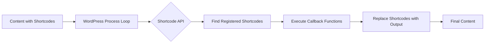

# WordPress Shortcode API

## Introduction

WordPress Shortcode API provides a simple yet powerful way to create macros that can be used within your WordPress content. Shortcodes are small code snippets enclosed in square brackets that, when added to posts or pages, transform into complex elements or dynamic content. Think of shortcodes as shortcuts that allow you to add features or elements to your WordPress site without writing complex HTML or PHP code directly in your content editor.

Shortcodes bridge the gap between what non-technical content editors can easily do and what developers can implement behind the scenes. They allow you to:

- Insert dynamic content
- Create complex layouts
- Embed media or special features
- Add functionality that would otherwise require coding knowledge

## Understanding Shortcodes

### What is a Shortcode?

A shortcode is a WordPress-specific code that lets you do things with very little effort. Shortcodes can be added to WordPress posts, pages, or widgets.

Basic syntax of a shortcode:

```
[shortcode_name]
```

Shortcodes with attributes:

```
[shortcode_name attribute="value"]
```

Shortcodes with content:

```
[shortcode_name attribute="value"]Content here[/shortcode_name]
```

### Built-in WordPress Shortcodes

WordPress comes with several built-in shortcodes:

- `[gallery]` - Creates an image gallery
- `[caption]` - Adds a caption to an image
- `[video]` - Embeds video files
- `[audio]` - Embeds audio files
- `[embed]` - Automatically embeds links to supported services

## Creating Your First Shortcode

Let's start by creating a simple shortcode that displays a greeting message:

```php
function greeting_shortcode($atts) {
    $attributes = shortcode_atts(
        array(
            'name' => 'friend',
        ), 
        $atts
    );
    
    return 'Hello, ' . esc_html($attributes['name']) . '!';
}

add_shortcode('greeting', 'greeting_shortcode');
```

With this shortcode registered, you can now use `[greeting]` in your content, and it will display "Hello, friend!". Or use `[greeting name="John"]` to display "Hello, John!".

### Breaking Down the Code

1. We define a function `greeting_shortcode()` that will handle our shortcode.
2. We use `shortcode_atts()` to set up default attributes and merge them with user-provided ones.
3. We return the output that will replace the shortcode when displayed.
4. Finally, we register the shortcode using `add_shortcode()`, which takes two parameters:
   - The shortcode tag name (`'greeting'`)
   - The callback function (`'greeting_shortcode'`)

### Where to Add This Code

Add this code to your theme's `functions.php` file or, even better, to a custom plugin.

## Working with Shortcode Attributes

Attributes make shortcodes flexible. Let's create a more advanced example that outputs a customizable button:

```php
function custom_button_shortcode($atts, $content = null) {
    // Default values
    $attributes = shortcode_atts(
        array(
            'url' => '#',
            'color' => 'blue',
            'size' => 'medium',
            'target' => '_self',
        ), 
        $atts
    );
    
    // Sanitize inputs
    $url = esc_url($attributes['url']);
    $color = esc_attr($attributes['color']);
    $size = esc_attr($attributes['size']);
    $target = esc_attr($attributes['target']);
    $content = $content ? esc_html($content) : 'Click Here';
    
    // Generate button HTML
    $button = '<a href="' . $url . '" class="custom-button ' . $color . ' ' . $size . '" target="' . $target . '">';
    $button .= $content;
    $button .= '</a>';
    
    return $button;
}

add_shortcode('button', 'custom_button_shortcode');
```

Now you can use the shortcode like this:

```
[button url="https://example.com" color="red" size="large" target="_blank"]Visit Website[/button]
```

Output:
```html
<a href="https://example.com" class="custom-button red large" target="_blank">Visit Website</a>
```

## Enclosing Shortcodes

Enclosing shortcodes have an opening and closing tag, allowing content to be placed between them. This content is passed to your shortcode function as the second parameter.

Here's an example of a shortcode that wraps content in a styled box:

```php
function info_box_shortcode($atts, $content = null) {
    $attributes = shortcode_atts(
        array(
            'type' => 'info', // info, warning, error, success
            'title' => '',
        ), 
        $atts
    );
    
    $output = '<div class="info-box ' . esc_attr($attributes['type']) . '">';
    
    if (!empty($attributes['title'])) {
        $output .= '<h4>' . esc_html($attributes['title']) . '</h4>';
    }
    
    $output .= '<div class="info-box-content">';
    // Process any nested shortcodes and ensure correct HTML
    $output .= do_shortcode(wpautop($content));
    $output .= '</div></div>';
    
    return $output;
}

add_shortcode('infobox', 'info_box_shortcode');
```

Usage:

```
[infobox type="warning" title="Important Note"]
Pay attention to this important information.
This can save you hours of troubleshooting!
[/infobox]
```

## Nested Shortcodes

You can nest shortcodes within other shortcodes. To process nested shortcodes, use the `do_shortcode()` function on the content.

Here's an example of a columns layout with nested content:

```php
function column_shortcode($atts, $content = null) {
    $attributes = shortcode_atts(
        array(
            'width' => '50%',
        ), 
        $atts
    );
    
    return '<div class="column" style="width: ' . esc_attr($attributes['width']) . ';">' . 
           do_shortcode($content) . 
           '</div>';
}

function columns_container_shortcode($atts, $content = null) {
    return '<div class="columns-container">' . do_shortcode($content) . '</div>';
}

add_shortcode('column', 'column_shortcode');
add_shortcode('columns', 'columns_container_shortcode');
```

Usage:

```
[columns]
    [column width="30%"]First column content[/column]
    [column width="40%"]Middle column content[/column]
    [column width="30%"]Last column content[/column]
[/columns]
```

## Best Practices for Creating Shortcodes

### Security

Always sanitize inputs and escape outputs:

- Use `shortcode_atts()` to define allowed attributes
- Sanitize inputs with functions like `sanitize_text_field()`
- Escape outputs with functions like `esc_html()`, `esc_attr()`, or `esc_url()`

### Performance

- Keep shortcode functions lightweight
- Avoid excessive database queries
- Consider caching outputs for complex shortcodes

### User Experience

- Choose intuitive, descriptive shortcode names
- Document your shortcodes for users
- Provide sensible defaults for attributes
- Return meaningful error messages for invalid inputs

## Real-World Application: Create a Pricing Table Shortcode

Let's create a more complex shortcode system for displaying pricing tables:

```php
// Pricing table container
function pricing_table_shortcode($atts, $content = null) {
    $attributes = shortcode_atts(
        array(
            'columns' => '3',
        ), 
        $atts
    );
    
    return '<div class="pricing-table columns-' . esc_attr($attributes['columns']) . '">' . 
           do_shortcode($content) . 
           '</div>';
}

// Individual pricing plan
function pricing_plan_shortcode($atts, $content = null) {
    $attributes = shortcode_atts(
        array(
            'title' => 'Basic Plan',
            'price' => '$0',
            'period' => 'month',
            'featured' => 'no',
            'button_text' => 'Sign Up',
            'button_url' => '#',
        ), 
        $atts
    );
    
    $featured_class = ($attributes['featured'] === 'yes') ? ' featured-plan' : '';
    
    $output = '<div class="pricing-plan' . $featured_class . '">';
    $output .= '<h3 class="plan-title">' . esc_html($attributes['title']) . '</h3>';
    $output .= '<div class="plan-price"><span class="price">' . esc_html($attributes['price']) . '</span>';
    $output .= '<span class="period">/' . esc_html($attributes['period']) . '</span></div>';
    $output .= '<div class="plan-features">' . do_shortcode($content) . '</div>';
    $output .= '<div class="plan-action">';
    $output .= '<a href="' . esc_url($attributes['button_url']) . '" class="button plan-button">';
    $output .= esc_html($attributes['button_text']) . '</a>';
    $output .= '</div></div>';
    
    return $output;
}

// Plan feature
function plan_feature_shortcode($atts, $content = null) {
    $attributes = shortcode_atts(
        array(
            'available' => 'yes',
        ), 
        $atts
    );
    
    $available_class = ($attributes['available'] === 'yes') ? 'feature-available' : 'feature-unavailable';
    $icon = ($attributes['available'] === 'yes') ? '✓' : '✕';
    
    return '<div class="plan-feature ' . $available_class . '">' . 
           '<span class="feature-icon">' . $icon . '</span>' . 
           '<span class="feature-text">' . esc_html($content) . '</span>' . 
           '</div>';
}

add_shortcode('pricing_table', 'pricing_table_shortcode');
add_shortcode('pricing_plan', 'pricing_plan_shortcode');
add_shortcode('feature', 'plan_feature_shortcode');
```

Usage:

```
[pricing_table columns="3"]
    [pricing_plan title="Basic" price="$9" period="month" button_text="Get Started" button_url="/signup"]
        [feature]1GB Storage[/feature]
        [feature]1 User[/feature]
        [feature available="no"]Premium Support[/feature]
    [/pricing_plan]
    
    [pricing_plan title="Pro" price="$29" period="month" featured="yes" button_text="Go Pro" button_url="/pro-signup"]
        [feature]10GB Storage[/feature]
        [feature]5 Users[/feature]
        [feature]Premium Support[/feature]
    [/pricing_plan]
    
    [pricing_plan title="Enterprise" price="$99" period="month" button_text="Contact Us" button_url="/enterprise"]
        [feature]Unlimited Storage[/feature]
        [feature]Unlimited Users[/feature]
        [feature]24/7 Support[/feature]
    [/pricing_plan]
[/pricing_table]
```

## Advanced Shortcode Techniques

### Adding Visual Editor Buttons for Shortcodes

To make your shortcodes more user-friendly, you can add buttons to the WordPress visual editor:

```php
function add_shortcode_buttons() {
    // Check if user has editing privileges
    if (!current_user_can('edit_posts') && !current_user_can('edit_pages')) {
        return;
    }
    
    // Add only when the editor is in visual mode
    if (get_user_option('rich_editing') == 'true') {
        add_filter('mce_external_plugins', 'add_shortcode_tinymce_plugin');
        add_filter('mce_buttons', 'register_shortcode_button');
    }
}

function add_shortcode_tinymce_plugin($plugin_array) {
    $plugin_array['my_shortcode_button'] = get_template_directory_uri() . '/js/shortcode-button.js';
    return $plugin_array;
}

function register_shortcode_button($buttons) {
    array_push($buttons, 'my_shortcode_button');
    return $buttons;
}

add_action('init', 'add_shortcode_buttons');
```

You would then need to create a JavaScript file (`shortcode-button.js`) to define the button behavior.

### Creating a Shortcode Generator

For complex shortcodes with many attributes, you might want to create a shortcode generator:

```php
function shortcode_generator_dialog() {
    ?>
    <div id="shortcode-generator" style="display:none;">
        <h2>Insert Pricing Table</h2>
        
        <p>
            <label for="pricing-columns">Columns:</label>
            <select id="pricing-columns">
                <option value="2">2</option>
                <option value="3" selected>3</option>
                <option value="4">4</option>
            </select>
        </p>
        
        <!-- More fields here -->
        
        <button id="insert-shortcode" class="button button-primary">Insert Shortcode</button>
    </div>
    <?php
}

add_action('admin_footer', 'shortcode_generator_dialog');
```

## Debugging Shortcodes

When your shortcodes aren't working as expected:

1. **Check for errors in your PHP code**
2. **Try removing other shortcodes** to check for conflicts
3. **Add debug information** to your shortcode output:

```php
function debug_shortcode($atts) {
    $output = '<pre style="background:#f8f8f8; padding:10px; border:1px solid #ddd;">';
    $output .= 'Attributes received: ';
    $output .= print_r($atts, true);
    $output .= '</pre>';
    
    return $output;
}

add_shortcode('debug', 'debug_shortcode');
```

## The Shortcode API Lifecycle



## Summary

The WordPress Shortcode API provides a powerful way to enhance your WordPress content with dynamic elements and functionality. By understanding how to create, customize, and use shortcodes, you can:

- Create reusable content elements
- Add complex functionality to your posts and pages
- Allow non-technical users to leverage advanced features
- Maintain clean separation between content and functionality

The key components to remember when working with shortcodes are:
- Registering shortcodes with `add_shortcode()`
- Managing attributes with `shortcode_atts()`
- Processing nested shortcodes with `do_shortcode()`
- Always sanitizing inputs and escaping outputs
- Creating meaningful documentation for users

## Exercises & Practice

1. Create a shortcode that displays the current date in different formats based on attributes.
2. Create a "progress bar" shortcode with customizable percentage and colors.
3. Build a "team member" shortcode that displays a person's information with optional social media links.
4. Extend the built-in `[gallery]` shortcode to add new functionality.
5. Create a shortcode that fetches and displays your latest tweets.

## Additional Resources

- [WordPress Shortcode API Documentation](https://developer.wordpress.org/plugins/shortcodes/)
- [WordPress Codex - Shortcode](https://codex.wordpress.org/Shortcode)
- [WordPress Function Reference: add_shortcode()](https://developer.wordpress.org/reference/functions/add_shortcode/)
- [WordPress Function Reference: shortcode_atts()](https://developer.wordpress.org/reference/functions/shortcode_atts/)
- [WordPress Function Reference: do_shortcode()](https://developer.wordpress.org/reference/functions/do_shortcode/)

By mastering the WordPress Shortcode API, you'll be able to create powerful, reusable content elements that enhance both your site's capabilities and the content creation experience for your users.