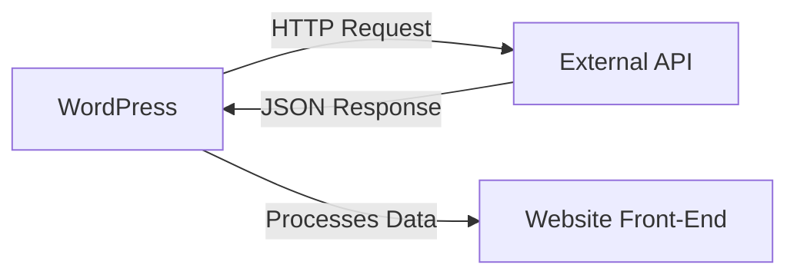

# WordPress External APIs

## Introduction

External APIs (Application Programming Interfaces) allow WordPress developers to connect with third-party services and fetch data from outside sources. By integrating external APIs, you can extend WordPress functionality far beyond its core capabilities, enabling features like social media integration, payment processing, weather forecasts, mapping services, and much more.

This guide will walk you through the fundamentals of working with external APIs in WordPress, from making basic HTTP requests to handling authentication and processing responses. Whether you're building a plugin that needs to communicate with a SaaS platform or enhancing a theme with external data, understanding how to work with external APIs is a crucial skill for WordPress developers.

## Understanding REST APIs

Most modern web services expose their functionality through REST (Representational State Transfer) APIs. REST is an architectural style for designing networked applications, using standard HTTP methods to interact with resources.

### Common HTTP Methods

REST APIs typically use these HTTP methods:

- `GET`: Retrieve data
- `POST`: Create new data
- `PUT`: Update existing data
- `DELETE`: Remove data

### REST API Structure

REST APIs are organized around resources (like users, products, or posts), with endpoints that represent these resources.



## Making API Requests in WordPress

WordPress provides several functions to make HTTP requests to external services. The recommended way is using the WordPress HTTP API.

### WordPress HTTP API

The WordPress HTTP API provides a simple and consistent way to make HTTP requests. The main functions you'll use are:

- `wp_remote_get()`: For GET requests
- `wp_remote_post()`: For POST requests
- `wp_remote_request()`: For custom requests

Let's look at a basic example of fetching data from a public API:

```php
function get_random_joke() {
    // Make a GET request to the API
    $response = wp_remote_get('https://official-joke-api.appspot.com/random_joke');
    
    // Check for errors
    if (is_wp_error($response)) {
        return 'Error: ' . $response->get_error_message();
    }
    
    // Get the response body and decode the JSON
    $body = wp_remote_retrieve_body($response);
    $joke = json_decode($body);
    
    // Format and return the joke
    if ($joke && isset($joke->setup) && isset($joke->punchline)) {
        return '<p><strong>' . esc_html($joke->setup) . '</strong></p>' .
               '<p>' . esc_html($joke->punchline) . '</p>';
    } else {
        return 'Failed to fetch a joke.';
    }
}
```

You can then use this function in a shortcode:

```php
add_shortcode('random_joke', 'get_random_joke');
```

Now users can add `[random_joke]` in their posts or pages to display a random joke.

### API Response Handling

When working with external APIs, it's important to properly handle the responses:

1. **Check for errors**: Always verify the request succeeded
2. **Validate the data**: Ensure the response contains what you expect
3. **Sanitize the output**: Clean any data before displaying it to users
4. **Handle rate limits**: Respect API rate limits by caching responses

```php
function get_weather_data($city) {
    // Check if we have cached data
    $cached_data = get_transient('weather_data_' . sanitize_title($city));
    if (false !== $cached_data) {
        return $cached_data;
    }
    
    // API key should be stored securely (we'll cover this later)
    $api_key = 'YOUR_API_KEY';
    $url = 'https://api.weatherapi.com/v1/current.json?key=' . $api_key . '&q=' . urlencode($city);
    
    $response = wp_remote_get($url);
    
    // Handle errors
    if (is_wp_error($response)) {
        return 'Weather data unavailable.';
    }
    
    $body = wp_remote_retrieve_body($response);
    $data = json_decode($body);
    
    // Validate response
    if (!isset($data->current)) {
        return 'Invalid weather data received.';
    }
    
    // Format weather output
    $output = '<div class="weather-widget">';
    $output .= '<h3>Weather in ' . esc_html($data->location->name) . '</h3>';
    $output .= '<p>Temperature: ' . esc_html($data->current->temp_c) . '°C</p>';
    $output .= '<p>Condition: ' . esc_html($data->current->condition->text) . '</p>';
    $output .= '</div>';
    
    // Cache the result for 1 hour (3600 seconds)
    set_transient('weather_data_' . sanitize_title($city), $output, 3600);
    
    return $output;
}

add_shortcode('weather', function($atts) {
    $atts = shortcode_atts(['city' => 'London'], $atts);
    return get_weather_data($atts['city']);
});
```

## Authentication with External APIs

Most APIs require some form of authentication to access their services. Here are common authentication methods:

### API Keys

Many services use API keys for authentication. These should never be hardcoded in your plugin or theme.

**Good practice**: Store API keys in the WordPress options table:

```php
// Saving an API key
update_option('my_plugin_api_key', $api_key);

// Retrieving an API key
$api_key = get_option('my_plugin_api_key');
```

### OAuth Authentication

OAuth is a more complex authentication protocol used by services like Twitter, Facebook, and Google.

Here's a simplified example of OAuth 2.0 authentication with WordPress:

```php
function get_oauth_token() {
    $client_id = get_option('my_plugin_client_id');
    $client_secret = get_option('my_plugin_client_secret');
    
    $args = [
        'body' => [
            'grant_type' => 'client_credentials',
            'client_id' => $client_id,
            'client_secret' => $client_secret
        ]
    ];
    
    $response = wp_remote_post('https://api.service.com/oauth/token', $args);
    
    if (is_wp_error($response)) {
        return null;
    }
    
    $body = json_decode(wp_remote_retrieve_body($response));
    
    if (isset($body->access_token)) {
        // Store the token with an expiration
        set_transient('my_plugin_access_token', $body->access_token, $body->expires_in);
        return $body->access_token;
    }
    
    return null;
}

function get_authorized_data() {
    // Get existing token or generate new one
    $token = get_transient('my_plugin_access_token');
    if (!$token) {
        $token = get_oauth_token();
    }
    
    if (!$token) {
        return 'Authentication failed.';
    }
    
    // Make API request with token
    $args = [
        'headers' => [
            'Authorization' => 'Bearer ' . $token
        ]
    ];
    
    $response = wp_remote_get('https://api.service.com/data', $args);
    
    // Process response...
    
    return $data;
}
```

## Practical Examples

Let's explore some practical examples of integrating external APIs into WordPress.

### Example 1: Displaying Currency Exchange Rates

```php
function get_exchange_rate($base = 'USD', $target = 'EUR') {
    // Cache key based on currency pair
    $cache_key = 'exchange_rate_' . $base . '_' . $target;
    
    // Check cache first
    $cached_rate = get_transient($cache_key);
    if (false !== $cached_rate) {
        return $cached_rate;
    }
    
    // Make API request
    $response = wp_remote_get(
        'https://api.exchangerate.host/latest?base=' . $base . '&symbols=' . $target
    );
    
    if (is_wp_error($response)) {
        return 'Unable to fetch exchange rate.';
    }
    
    $body = json_decode(wp_remote_retrieve_body($response));
    
    if (!isset($body->rates->{$target})) {
        return 'Exchange rate data not available.';
    }
    
    $rate = $body->rates->{$target};
    
    // Format the output
    $output = '<div class="exchange-rate">';
    $output .= '<p>1 ' . esc_html($base) . ' = ' . esc_html($rate) . ' ' . esc_html($target) . '</p>';
    $output .= '<p><small>Last updated: ' . esc_html(date('F j, Y, g:i a')) . '</small></p>';
    $output .= '</div>';
    
    // Cache for 6 hours
    set_transient($cache_key, $output, 6 * HOUR_IN_SECONDS);
    
    return $output;
}

add_shortcode('exchange_rate', function($atts) {
    $atts = shortcode_atts([
        'from' => 'USD',
        'to' => 'EUR'
    ], $atts);
    
    return get_exchange_rate($atts['from'], $atts['to']);
});
```

### Example 2: Creating a Post with External Content

This example demonstrates how to create a WordPress post using data from an external API:

```php
function create_post_from_external_api() {
    // Get data from the API
    $response = wp_remote_get('https://jsonplaceholder.typicode.com/posts/1');
    
    if (is_wp_error($response)) {
        return false;
    }
    
    $data = json_decode(wp_remote_retrieve_body($response));
    
    if (!$data || !isset($data->title) || !isset($data->body)) {
        return false;
    }
    
    // Create post object
    $new_post = [
        'post_title'    => sanitize_text_field($data->title),
        'post_content'  => wp_kses_post($data->body),
        'post_status'   => 'draft',
        'post_author'   => get_current_user_id(),
        'post_type'     => 'post',
    ];
    
    // Insert the post into the database
    $post_id = wp_insert_post($new_post);
    
    return $post_id;
}
```

## Best Practices for Working with External APIs

1. **Cache API responses**: Reduce the number of API calls by storing results
2. **Handle failures gracefully**: Display fallback content when APIs fail
3. **Respect rate limits**: Use transients to prevent exceeding API quotas
4. **Secure API credentials**: Never hardcode sensitive keys in your code
5. **Validate and sanitize data**: Always clean external data before using it

## Error Handling and Debugging

When working with external APIs, things can go wrong. Here's how to handle and debug common issues:

```php
function debug_api_request($url) {
    // Increase timeout for debugging
    $args = [
        'timeout' => 30,
        'sslverify' => false // Only for debugging, not for production!
    ];
    
    $response = wp_remote_get($url, $args);
    
    if (is_wp_error($response)) {
        return [
            'success' => false,
            'error' => $response->get_error_message(),
        ];
    }
    
    $status = wp_remote_retrieve_response_code($response);
    $body = wp_remote_retrieve_body($response);
    
    return [
        'success' => ($status >= 200 && $status < 300),
        'status' => $status,
        'headers' => wp_remote_retrieve_headers($response),
        'body' => $body,
        'decoded' => json_decode($body),
    ];
}
```

Use this function during development to inspect API responses and identify problems.

## Creating an Admin Interface for API Settings

For a professional plugin, you'll want to create an admin interface to manage API credentials:

```php
// Register the options page
function register_api_settings_page() {
    add_options_page(
        'API Settings',
        'API Settings',
        'manage_options',
        'my-api-settings',
        'render_api_settings_page'
    );
}
add_action('admin_menu', 'register_api_settings_page');

// Register settings
function register_api_settings() {
    register_setting('my_api_settings', 'my_api_key');
    register_setting('my_api_settings', 'my_api_secret');
}
add_action('admin_init', 'register_api_settings');

// Render the settings page
function render_api_settings_page() {
    ?>
    <div class="wrap">
        <h1>API Settings</h1>
        <form method="post" action="options.php">
            <?php settings_fields('my_api_settings'); ?>
            <?php do_settings_sections('my_api_settings'); ?>
            
            <table class="form-table">
                <tr>
                    <th scope="row">API Key</th>
                    <td>
                        <input type="text" name="my_api_key" 
                               value="<?php echo esc_attr(get_option('my_api_key')); ?>" class="regular-text" />
                    </td>
                </tr>
                <tr>
                    <th scope="row">API Secret</th>
                    <td>
                        <input type="password" name="my_api_secret" 
                               value="<?php echo esc_attr(get_option('my_api_secret')); ?>" class="regular-text" />
                    </td>
                </tr>
            </table>
            
            <?php submit_button(); ?>
        </form>
    </div>
    <?php
}
```

## Summary

External APIs greatly expand the possibilities of what you can build with WordPress. In this guide, we've covered:

- Making HTTP requests with the WordPress HTTP API
- Authentication methods for external APIs
- Handling API responses
- Best practices for working with external data
- Creating user interfaces for API settings

By integrating external services into your WordPress projects, you can create more dynamic and feature-rich websites that leverage data and functionality from across the web.

## Additional Resources

Here are some resources to help you continue learning about WordPress and external APIs:

- [WordPress HTTP API Documentation](https://developer.wordpress.org/plugins/http-api/)
- [REST API Handbook](https://developer.wordpress.org/rest-api/)
- [Transients API](https://developer.wordpress.org/apis/transients/)
- [Options API](https://developer.wordpress.org/plugins/settings/options-api/)

## Practice Exercises

1. Create a shortcode that displays the current weather for a user-specified location.
2. Build a simple plugin that imports posts from a REST API endpoint.
3. Integrate a social media API to display recent posts from a specific account.
4. Create a currency converter widget using an exchange rate API.
5. Build an admin page that tests API connectivity and displays the results.

Remember, when working with external APIs, always read their documentation carefully and respect their usage policies and rate limits.