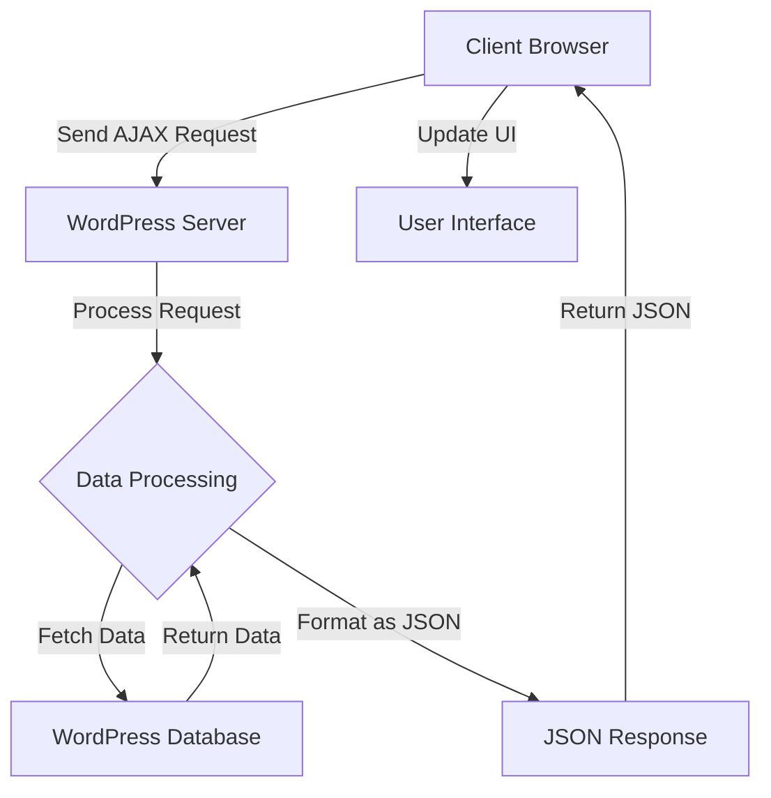

# WordPress JSON Data

## Introduction

JSON (JavaScript Object Notation) has become a fundamental data format for exchanging information between clients and servers on the web. WordPress has embraced JSON through its REST API and various built-in functions that make working with JSON data straightforward and efficient.

In this tutorial, you'll learn how to work with JSON data in WordPress, from basic concepts to practical applications. Whether you're building a custom theme, plugin, or integrating WordPress with external services, understanding JSON data handling is essential.

## What is JSON?

Before diving into WordPress-specific implementations, let's quickly review what JSON is:

JSON is a lightweight data interchange format that's easy for humans to read and write, and easy for machines to parse and generate. It consists of key-value pairs and is language-independent, making it ideal for data exchange between different platforms.

A simple JSON object looks like this:

```json
{
  "name": "John Doe",
  "age": 30,
  "email": "john@example.com",
  "is_admin": true,
  "skills": ["PHP", "WordPress", "JavaScript"]
}
```

## WordPress and JSON: The Basics

WordPress provides several built-in functions to handle JSON data:

1. `wp_json_encode()` - Safely encodes PHP arrays and objects into JSON strings
2. `json_decode()` - PHP native function to decode JSON strings into PHP objects/arrays

### Encoding PHP Data to JSON

The `wp_json_encode()` function is a wrapper around PHP's native `json_encode()` function, but with additional safety measures for WordPress environments.

```php
// Create a PHP array
$user_data = array(
  'name' => 'John Doe',
  'email' => 'john@example.com',
  'role' => 'administrator',
  'meta' => array(
    'last_login' => '2023-05-15',
    'login_count' => 42
  )
);

// Convert to JSON
$json_data = wp_json_encode($user_data);

// Output the JSON data
echo $json_data;
```

Output:
```json
{"name":"John Doe","email":"john@example.com","role":"administrator","meta":{"last_login":"2023-05-15","login_count":42}}
```

### Decoding JSON to PHP

To convert JSON back into PHP data, use the `json_decode()` function:

```php
// Sample JSON string
$json_string = '{"name":"John Doe","email":"john@example.com","role":"administrator"}';

// Convert JSON to PHP object
$php_object = json_decode($json_string);

// Access properties
echo $php_object->name;  // Outputs: John Doe

// Convert JSON to PHP associative array (notice the second parameter)
$php_array = json_decode($json_string, true);

// Access array elements
echo $php_array['name']; // Outputs: John Doe
```

## The WordPress REST API and JSON

The WordPress REST API is built on JSON data exchange. It allows you to send and receive data to and from WordPress using HTTP requests and JSON.

### Basic Structure of the WordPress REST API

The REST API is accessible via endpoints, with the base URL typically being:

```
https://your-site.com/wp-json/
```

Different resources are available at different endpoints:

```
/wp-json/wp/v2/posts       // Posts endpoint
/wp-json/wp/v2/pages       // Pages endpoint
/wp-json/wp/v2/users       // Users endpoint
```

### Retrieving Data with the REST API

Here's an example of how to fetch posts from the WordPress REST API using JavaScript:

```javascript
// Using the Fetch API to get posts from WordPress
fetch('https://example.com/wp-json/wp/v2/posts')
  .then(response => response.json())
  .then(posts => {
    // Do something with the posts
    posts.forEach(post => {
      console.log(post.title.rendered);
      console.log(post.content.rendered);
    });
  })
  .catch(error => console.error('Error:', error));
```

### Sending Data to the REST API

To send data to WordPress via the REST API, you'll need to authenticate first. Here's a simple example using JavaScript:

```javascript
// Data to be sent
const postData = {
  title: 'My New Post',
  content: 'This is the content of my new post.',
  status: 'publish'
};

// Making a POST request
fetch('https://example.com/wp-json/wp/v2/posts', {
  method: 'POST',
  headers: {
    'Content-Type': 'application/json',
    'Authorization': 'Bearer YOUR_TOKEN_HERE'
  },
  body: JSON.stringify(postData)
})
  .then(response => response.json())
  .then(data => console.log('Success:', data))
  .catch(error => console.error('Error:', error));
```

## Working with wp_localize_script() for JSON Data

WordPress provides a handy function called `wp_localize_script()` that allows you to pass PHP data to JavaScript in a safe way, using JSON behind the scenes.

```php
function my_theme_enqueue_scripts() {
  wp_enqueue_script('my-script', get_template_directory_uri() . '/js/script.js', array('jquery'), '1.0.0', true);
  
  // Data to be passed to JavaScript
  $script_data = array(
    'ajax_url' => admin_url('admin-ajax.php'),
    'nonce' => wp_create_nonce('my-nonce'),
    'user_info' => array(
      'logged_in' => is_user_logged_in(),
      'user_id' => get_current_user_id()
    )
  );
  
  // Localize the script with our data
  wp_localize_script('my-script', 'myThemeData', $script_data);
}

add_action('wp_enqueue_scripts', 'my_theme_enqueue_scripts');
```

In your JavaScript file, you can access this data through the global variable `myThemeData`:

```javascript
// Access the data in your JavaScript file
console.log(myThemeData.ajax_url);
console.log(myThemeData.user_info.logged_in);

// Use it for an AJAX request
jQuery.ajax({
  url: myThemeData.ajax_url,
  type: 'POST',
  data: {
    action: 'my_custom_action',
    nonce: myThemeData.nonce,
    user_id: myThemeData.user_info.user_id
  },
  success: function(response) {
    console.log('Response:', response);
  }
});
```

## Creating Custom REST API Endpoints with JSON Data

WordPress allows you to create your own REST API endpoints that return JSON data. This is useful for exposing custom data or functionality.

```php
/**
 * Register a custom REST API endpoint
 */
function register_featured_products_endpoint() {
  register_rest_route('my-shop/v1', '/featured-products', array(
    'methods' => 'GET',
    'callback' => 'get_featured_products',
    'permission_callback' => '__return_true'
  ));
}
add_action('rest_api_init', 'register_featured_products_endpoint');

/**
 * Callback function that returns the featured products
 */
function get_featured_products() {
  // Query for featured products (assuming WooCommerce)
  $args = array(
    'post_type' => 'product',
    'posts_per_page' => 5,
    'tax_query' => array(
      array(
        'taxonomy' => 'product_visibility',
        'field' => 'name',
        'terms' => 'featured',
      ),
    ),
  );
  
  $products = array();
  $query = new WP_Query($args);
  
  if ($query->have_posts()) {
    while ($query->have_posts()) {
      $query->the_post();
      $product = array(
        'id' => get_the_ID(),
        'title' => get_the_title(),
        'image' => get_the_post_thumbnail_url(get_the_ID(), 'medium'),
        'price' => get_post_meta(get_the_ID(), '_price', true),
        'url' => get_permalink()
      );
      $products[] = $product;
    }
    wp_reset_postdata();
  }
  
  // Return the JSON response
  return rest_ensure_response($products);
}
```

You can now access this endpoint at:

```
https://example.com/wp-json/my-shop/v1/featured-products
```

The response will be a JSON array of featured products.

## Error Handling with JSON Responses

When working with JSON data in WordPress, proper error handling is important. Here's how to handle errors in a standardized way:

```php
/**
 * Example function that returns JSON response with error handling
 */
function my_ajax_handler() {
  // Verify the nonce
  if (!isset($_POST['nonce']) || !wp_verify_nonce($_POST['nonce'], 'my-nonce')) {
    wp_send_json_error(array(
      'message' => 'Security check failed'
    ), 403);
  }
  
  // Process the request
  $user_id = isset($_POST['user_id']) ? intval($_POST['user_id']) : 0;
  
  if ($user_id <= 0) {
    wp_send_json_error(array(
      'message' => 'Invalid user ID'
    ), 400);
  }
  
  // Get user data
  $user = get_userdata($user_id);
  
  if (!$user) {
    wp_send_json_error(array(
      'message' => 'User not found'
    ), 404);
  }
  
  // Success! Return user data
  wp_send_json_success(array(
    'user_id' => $user->ID,
    'username' => $user->user_login,
    'email' => $user->user_email
  ));
}
add_action('wp_ajax_my_custom_action', 'my_ajax_handler');
```

WordPress provides these helpful functions for JSON responses:

- `wp_send_json_success($data)` - Sends a JSON response with a `success: true` property
- `wp_send_json_error($data, $status_code)` - Sends a JSON response with a `success: false` property
- `wp_send_json($data, $status_code)` - Sends a generic JSON response

## Practical Example: Building a JSON-powered Search Feature

Let's build a practical example: an AJAX-powered search feature that returns results in JSON format.

### Step 1: Register the AJAX endpoint

```php
// Register AJAX handlers for both logged-in and non-logged-in users
add_action('wp_ajax_live_search', 'my_live_search_handler');
add_action('wp_ajax_nopriv_live_search', 'my_live_search_handler');

/**
 * Handle the live search request
 */
function my_live_search_handler() {
  // Get the search term
  $search_term = isset($_POST['search_term']) ? sanitize_text_field($_POST['search_term']) : '';
  
  // Validate input
  if (empty($search_term) || strlen($search_term) < 3) {
    wp_send_json_error(array(
      'message' => 'Please enter at least 3 characters'
    ));
  }
  
  // Set up the query arguments
  $args = array(
    'post_type' => 'post',
    'post_status' => 'publish',
    's' => $search_term,
    'posts_per_page' => 5
  );
  
  // Run the query
  $search_query = new WP_Query($args);
  
  $results = array();
  
  // Process the results
  if ($search_query->have_posts()) {
    while ($search_query->have_posts()) {
      $search_query->the_post();
      
      $results[] = array(
        'id' => get_the_ID(),
        'title' => get_the_title(),
        'excerpt' => get_the_excerpt(),
        'url' => get_permalink(),
        'date' => get_the_date()
      );
    }
    wp_reset_postdata();
    
    wp_send_json_success(array(
      'results' => $results
    ));
  } else {
    wp_send_json_error(array(
      'message' => 'No posts found matching your search'
    ));
  }
}
```

### Step 2: Create the frontend HTML

```html
<div class="live-search">
  <input type="text" id="search-input" placeholder="Search posts..." />
  <div id="search-results"></div>
</div>
```

### Step 3: Add the JavaScript

```javascript
// Make sure jQuery is available
jQuery(document).ready(function($) {
  const searchInput = $('#search-input');
  const resultsContainer = $('#search-results');
  let searchTimeout;
  
  // Listen for input changes
  searchInput.on('input', function() {
    const term = $(this).val();
    
    // Clear previous timeout
    clearTimeout(searchTimeout);
    
    // Don't search for empty strings
    if (term.length < 3) {
      resultsContainer.empty();
      return;
    }
    
    // Set a timeout to avoid too many requests
    searchTimeout = setTimeout(function() {
      // Show loading indicator
      resultsContainer.html('<p>Searching...</p>');
      
      // Make the AJAX request
      $.ajax({
        url: myThemeData.ajax_url,
        type: 'POST',
        data: {
          action: 'live_search',
          search_term: term
        },
        success: function(response) {
          resultsContainer.empty();
          
          if (response.success) {
            // We found results
            const results = response.data.results;
            
            if (results.length > 0) {
              // Create HTML for each result
              results.forEach(function(result) {
                const resultHTML = `
                  <div class="search-result">
                    <h3><a href="${result.url}">${result.title}</a></h3>
                    <p>${result.excerpt}</p>
                    <span class="date">${result.date}</span>
                  </div>
                `;
                resultsContainer.append(resultHTML);
              });
            }
          } else {
            // Show error message
            resultsContainer.html(`<p>${response.data.message}</p>`);
          }
        },
        error: function() {
          resultsContainer.html('<p>Error connecting to the server</p>');
        }
      });
    }, 500); // 500ms delay
  });
});
```

This example demonstrates a complete JSON-powered search feature in WordPress, showing data flow from client to server and back.

## Best Practices for Working with JSON in WordPress

Here are some best practices to follow when working with JSON data in WordPress:

1. **Always validate and sanitize data**: When receiving JSON data, validate and sanitize it before processing.

2. **Handle errors gracefully**: Provide meaningful error messages and use proper HTTP status codes.

3. **Use WordPress functions**: Use WordPress's built-in functions like `wp_json_encode()` instead of PHP's native functions when possible.

4. **Be mindful of performance**: Large JSON objects can impact performance. Consider pagination for large data sets.

5. **Security first**: Always use nonces for AJAX requests and verify permissions before processing data.

6. **Structure your data well**: Keep your JSON structure consistent and well-documented.

7. **Handle special characters**: Be aware of encoding issues with special characters in JSON strings.

8. **Test thoroughly**: Test your JSON data handling with various input types and edge cases.

## Flow of JSON Data in WordPress Applications

Here's a visual representation of how JSON data typically flows in a WordPress application:



## Summary

In this tutorial, you've learned:

- What JSON is and why it's important in WordPress development
- How to encode and decode JSON data in WordPress
- How to work with the WordPress REST API
- How to pass data from PHP to JavaScript using `wp_localize_script()`
- How to create custom REST API endpoints
- Best practices for JSON error handling
- How to build a practical JSON-powered search feature

Working with JSON data is an essential skill for modern WordPress development, whether you're building custom themes, plugins, or integrating with external services. By following the practices outlined in this guide, you'll be well-equipped to handle JSON data effectively in your WordPress projects.

## Additional Resources

- [WordPress REST API Handbook](https://developer.wordpress.org/rest-api/)
- [PHP JSON functions documentation](https://www.php.net/manual/en/book.json.php)
- [Working with JavaScript in WordPress](https://developer.wordpress.org/coding-standards/wordpress-coding-standards/javascript/)

## Exercises

1. Create a simple plugin that adds a REST API endpoint to retrieve the latest 5 posts from a custom post type.
2. Modify the search feature example to include custom post types and taxonomies.
3. Build a simple dashboard widget that displays data fetched from an external API in JSON format.
4. Create a settings page that saves user preferences as JSON and renders a live preview using that data.
5. Extend the WordPress REST API with custom fields that include JSON metadata for posts.