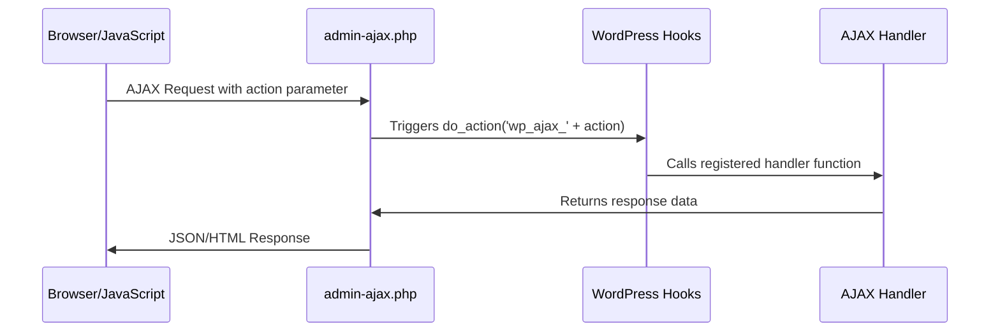

# WordPress AJAX

## Introduction

AJAX (Asynchronous JavaScript and XML) is a technique that allows web pages to communicate with a server in the background without requiring a page reload. In WordPress, AJAX provides a way to create interactive features like live searches, form submissions, real-time notifications, and content updates without disrupting the user experience.

WordPress offers a built-in AJAX API that simplifies the process of handling AJAX requests securely. This guide will walk you through everything you need to know about WordPress AJAX, from basic concepts to practical implementation examples.

## Why Use WordPress AJAX?

Before diving into the technical details, let's understand why AJAX is useful in WordPress:

- **Enhanced User Experience**: Updates content without page reloads
- **Faster Interactions**: Reduces server load by only transferring necessary data
- **Dynamic Content**: Enables real-time updates and interactions
- **Improved Performance**: Loads data only when needed

## WordPress AJAX Basics

WordPress has two main AJAX handlers:

1. **Admin AJAX** (`admin-ajax.php`): The traditional method for handling AJAX in WordPress
2. **REST API**: A more modern approach using WordPress's REST API endpoints

We'll start with Admin AJAX as it's more straightforward for beginners, then introduce the REST API approach.

## Understanding WordPress AJAX Flow

Here's a visual representation of how AJAX works in WordPress:



## Setting Up AJAX in WordPress

Let's implement a basic AJAX functionality step by step.

### Step 1: Enqueue JavaScript

First, you need to enqueue your JavaScript file and pass the AJAX URL to it:

```php
function my_ajax_scripts() {
    // Register and enqueue our custom script
    wp_enqueue_script(
        'my-ajax-script',           // Handle
        get_template_directory_uri() . '/js/ajax-script.js',  // Source
        array('jquery'),            // Dependencies
        '1.0.0',                    // Version
        true                        // In footer
    );
    
    // Pass data to our script
    wp_localize_script(
        'my-ajax-script',                  // Handle
        'my_ajax_object',                  // Object name (will be available in JavaScript)
        array(
            'ajax_url' => admin_url('admin-ajax.php'), // AJAX URL
            'nonce'    => wp_create_nonce('my_ajax_nonce'), // Security nonce
        )
    );
}

add_action('wp_enqueue_scripts', 'my_ajax_scripts');
```

The `wp_localize_script()` function creates a JavaScript object that contains information your script needs, like the AJAX URL and a security nonce.

### Step 2: Create AJAX Handler Functions

Next, create PHP functions that will handle the AJAX requests:

```php
// AJAX handler for logged-in users
function my_ajax_handler() {
    // Verify the security nonce
    check_ajax_referer('my_ajax_nonce', 'security');
    
    // Get the data sent in the request
    $name = isset($_POST['name']) ? sanitize_text_field($_POST['name']) : '';
    
    // Process the data
    $response = array(
        'success' => true,
        'message' => 'Hello, ' . $name . '! Your request was processed successfully.'
    );
    
    // Return response as JSON
    wp_send_json($response);
    
    // Always exit at the end of an AJAX function
    wp_die();
}

// Hook for logged-in users
add_action('wp_ajax_my_action', 'my_ajax_handler');

// Hook for non-logged-in users (if needed)
add_action('wp_ajax_nopriv_my_action', 'my_ajax_handler');
```

Notice the two action hooks:
- `wp_ajax_{action}` - For logged-in users
- `wp_ajax_nopriv_{action}` - For non-logged-in users

The `{action}` part should match the action parameter you'll send from JavaScript.

### Step 3: Create the JavaScript AJAX Code

Create the JavaScript file (in this example, `js/ajax-script.js`):

```javascript
jQuery(document).ready(function($) {
    // When a button with ID "send-ajax" is clicked
    $('#send-ajax').on('click', function() {
        // Get the value from an input field
        var name = $('#name-field').val();
        
        // Prepare data for the AJAX request
        var data = {
            'action': 'my_action',                // Same as in PHP add_action()
            'security': my_ajax_object.nonce,     // The nonce value
            'name': name                          // Our custom data
        };
        
        // Send the AJAX request
        $.ajax({
            url: my_ajax_object.ajax_url,         // Admin AJAX URL from localized script
            type: 'POST',                         // Request method
            data: data,                           // The data we prepared
            success: function(response) {
                // On success, display the response
                alert(response.message);
            },
            error: function(errorThrown) {
                // On error, log it to console
                console.log(errorThrown);
            }
        });
    });
});
```

### Step 4: Create the HTML Interface

Add this to your template file where you want the AJAX functionality:

```html
<div class="ajax-demo">
    <input type="text" id="name-field" placeholder="Enter your name">
    <button id="send-ajax">Send AJAX Request</button>
    <div id="ajax-response"></div>
</div>
```

## Practical Example: AJAX Post Loading

Let's create a more practical example: loading more blog posts without refreshing the page.

### PHP Code (in your theme's functions.php):

```php
function load_more_posts_scripts() {
    wp_enqueue_script(
        'load-more-posts', 
        get_template_directory_uri() . '/js/load-more-posts.js',
        array('jquery'), 
        '1.0.0', 
        true
    );
    
    wp_localize_script(
        'load-more-posts',
        'load_more_obj',
        array(
            'ajax_url' => admin_url('admin-ajax.php'),
            'nonce'    => wp_create_nonce('load_more_nonce')
        )
    );
}
add_action('wp_enqueue_scripts', 'load_more_posts_scripts');

// AJAX handler for loading more posts
function load_more_posts_handler() {
    // Security check
    check_ajax_referer('load_more_nonce', 'security');
    
    $page = isset($_POST['page']) ? intval($_POST['page']) : 1;
    $posts_per_page = 5;
    $offset = ($page - 1) * $posts_per_page;
    
    $args = array(
        'post_type'      => 'post',
        'posts_per_page' => $posts_per_page,
        'offset'         => $offset,
        'post_status'    => 'publish'
    );
    
    $query = new WP_Query($args);
    
    $response = array(
        'success' => false,
        'posts'   => '',
        'has_more' => false
    );
    
    if ($query->have_posts()) {
        $response['success'] = true;
        
        ob_start();
        while ($query->have_posts()) {
            $query->the_post();
            ?>
            <div class="post-item">
                <h3><a href="<?php the_permalink(); ?>"><?php the_title(); ?></a></h3>
                <div class="post-excerpt">
                    <?php the_excerpt(); ?>
                </div>
            </div>
            <?php
        }
        $response['posts'] = ob_get_clean();
        
        // Check if there are more posts to load
        $response['has_more'] = ($query->found_posts > ($offset + $posts_per_page));
        
        wp_reset_postdata();
    }
    
    wp_send_json($response);
    wp_die();
}
add_action('wp_ajax_load_more_posts', 'load_more_posts_handler');
add_action('wp_ajax_nopriv_load_more_posts', 'load_more_posts_handler');
```

### JavaScript (js/load-more-posts.js):

```javascript
jQuery(document).ready(function($) {
    var page = 1;
    var loading = false;
    
    $('#load-more-button').on('click', function() {
        if (loading) return;
        
        loading = true;
        var button = $(this);
        button.text('Loading...');
        
        $.ajax({
            url: load_more_obj.ajax_url,
            type: 'POST',
            data: {
                action: 'load_more_posts',
                security: load_more_obj.nonce,
                page: page + 1
            },
            success: function(response) {
                loading = false;
                
                if (response.success) {
                    $('#posts-container').append(response.posts);
                    page++;
                    
                    if (!response.has_more) {
                        button.text('No More Posts').prop('disabled', true);
                    } else {
                        button.text('Load More Posts');
                    }
                } else {
                    button.text('Error Loading Posts');
                }
            },
            error: function() {
                loading = false;
                button.text('Error Loading Posts');
            }
        });
    });
});
```

### HTML in your template file:

```html
<div id="posts-container">
    <!-- Initial posts will be loaded here by WordPress -->
    <?php
    if (have_posts()) :
        while (have_posts()) :
            the_post();
            ?>
            <div class="post-item">
                <h3><a href="<?php the_permalink(); ?>"><?php the_title(); ?></a></h3>
                <div class="post-excerpt">
                    <?php the_excerpt(); ?>
                </div>
            </div>
            <?php
        endwhile;
    endif;
    ?>
</div>
<button id="load-more-button">Load More Posts</button>
```

## Using the WordPress REST API for AJAX

The REST API provides a more modern approach to AJAX in WordPress. Here's how to use it:

### Registering a Custom REST API Endpoint

```php
function register_my_custom_endpoint() {
    register_rest_route(
        'my-plugin/v1',             // Namespace
        '/greeting',                // Route
        array(
            'methods'  => 'POST',   // HTTP method
            'callback' => 'my_greeting_handler', // Callback function
            'permission_callback' => function () {
                return true;        // Public endpoint, anyone can access
            },
            'args' => array(
                'name' => array(
                    'required' => true,
                    'sanitize_callback' => 'sanitize_text_field'
                )
            )
        )
    );
}
add_action('rest_api_init', 'register_my_custom_endpoint');

function my_greeting_handler($request) {
    $name = $request->get_param('name');
    
    return array(
        'success' => true,
        'message' => 'Hello, ' . $name . '! This response came from the REST API.'
    );
}

function my_rest_scripts() {
    wp_enqueue_script(
        'my-rest-script',
        get_template_directory_uri() . '/js/rest-api.js',
        array('jquery'),
        '1.0.0',
        true
    );
    
    wp_localize_script(
        'my-rest-script',
        'my_rest_obj',
        array(
            'rest_url' => esc_url_raw(rest_url('my-plugin/v1/greeting')),
            'nonce'    => wp_create_nonce('wp_rest')
        )
    );
}
add_action('wp_enqueue_scripts', 'my_rest_scripts');
```

### JavaScript for REST API (rest-api.js):

```javascript
jQuery(document).ready(function($) {
    $('#send-rest').on('click', function() {
        var name = $('#rest-name-field').val();
        
        $.ajax({
            url: my_rest_obj.rest_url,
            type: 'POST',
            beforeSend: function(xhr) {
                xhr.setRequestHeader('X-WP-Nonce', my_rest_obj.nonce);
            },
            data: {
                'name': name
            },
            success: function(response) {
                $('#rest-response').html('<p>' + response.message + '</p>');
            },
            error: function(error) {
                console.log(error);
                $('#rest-response').html('<p>Error: Could not process request</p>');
            }
        });
    });
});
```

### HTML for REST API Example:

```html
<div class="rest-api-demo">
    <input type="text" id="rest-name-field" placeholder="Enter your name">
    <button id="send-rest">Send REST API Request</button>
    <div id="rest-response"></div>
</div>
```

## Best Practices for WordPress AJAX

1. **Always Use Nonces**: Implement nonces for security to prevent CSRF attacks
2. **Sanitize and Validate Input Data**: Clean all incoming data using WordPress sanitization functions
3. **Localize Scripts**: Use `wp_localize_script()` to pass PHP data to JavaScript
4. **Error Handling**: Provide meaningful error messages in your AJAX responses
5. **Rate Limiting**: Consider adding rate limiting for public endpoints
6. **Separation of Concerns**: Keep AJAX handling code modular and organized
7. **Use WP Coding Standards**: Follow WordPress coding standards for maintainability
8. **Always Call wp_die()**: Remember to call `wp_die()` at the end of every AJAX callback
9. **User Capability Checks**: Verify user permissions before performing actions
10. **Consider the REST API**: For new projects, consider using the REST API instead of admin-ajax.php

## Common AJAX Debugging Tips

When your AJAX requests aren't working as expected, try these debugging techniques:

1. Check the browser's Developer Tools console for JavaScript errors
2. Use the Network tab in Developer Tools to inspect the AJAX requests and responses
3. Add `console.log()` statements to your JavaScript to track execution flow
4. Use `error_log()` in your PHP handler to log data to the server's error log
5. Verify the correct action name is being used in both JavaScript and PHP
6. Check if the nonce is being properly generated and verified

## Summary

WordPress AJAX provides a powerful way to create interactive, dynamic websites without page reloads. In this guide, we've covered:

- The basics of how WordPress AJAX works
- Setting up AJAX using the traditional admin-ajax.php method
- Creating a practical "Load More Posts" example
- Implementing AJAX using the WordPress REST API
- Best practices and debugging tips

By understanding and implementing WordPress AJAX, you can significantly enhance the user experience of your WordPress websites with interactive features and dynamic content loading.

## Additional Resources

To deepen your understanding of WordPress AJAX, consider exploring these resources:

1. [WordPress Developer Documentation on AJAX](https://developer.wordpress.org/plugins/javascript/ajax/)
2. [WordPress REST API Handbook](https://developer.wordpress.org/rest-api/)
3. [jQuery AJAX Documentation](https://api.jquery.com/jquery.ajax/)

## Exercises

To practice your WordPress AJAX skills, try these exercises:

1. Create a simple AJAX-powered contact form that validates input without page reload
2. Build a live search feature that displays results as users type
3. Implement a "like" or "favorite" button for posts that works without refreshing the page
4. Create an AJAX-powered comment system that lets users submit comments without reloading
5. Build a custom REST API endpoint that returns filtered post data based on custom criteria

By completing these exercises, you'll gain practical experience with WordPress AJAX and be able to implement sophisticated interactive features in your WordPress projects.