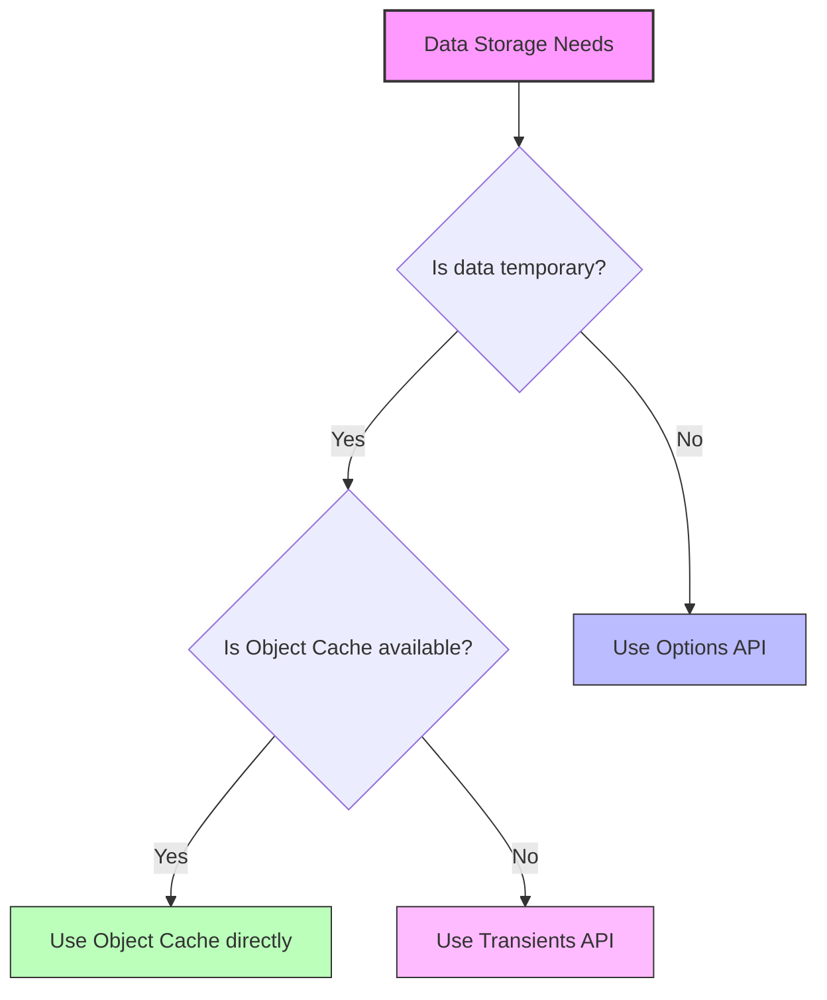

# WordPress Transients API

## Introduction

The WordPress Transients API provides a simple and standardized way to store cached data in your database temporarily. Think of transients as WordPress's built-in caching mechanism - they allow you to save the results of complex or time-consuming operations and reuse them later, significantly improving your site's performance.

Unlike regular WordPress options, transients are designed to expire automatically after a specified time, making them perfect for storing data that needs to be refreshed periodically.

In this guide, we'll explore how to use the WordPress Transients API effectively to optimize your WordPress sites and plugins.

## Why Use Transients?

Before diving into the technical details, let's understand why transients are valuable:

1. **Performance Improvement**: Reduce database queries and expensive API calls
2. **Reduced Server Load**: Minimize resource-intensive operations
3. **Automatic Expiration**: Data refreshes itself after a set period
4. **Simple Interface**: Easy to implement with just a few functions

## Basic Transients API Functions

The Transients API consists of three primary functions:

1. `set_transient()` - Store data as a transient
2. `get_transient()` - Retrieve a transient's value
3. `delete_transient()` - Delete a transient before it expires

Let's explore each function in detail.

### Setting a Transient

The `set_transient()` function creates a new transient or updates an existing one:

```php
set_transient($transient_name, $transient_value, $expiration);
```

**Parameters:**
- `$transient_name` (string): A unique name for your transient
- `$transient_value` (mixed): The data to store (can be any serializable data type)
- `$expiration` (integer): How long the transient should last in seconds (optional)

**Example: Storing API Response**

```php
function get_external_api_data() {
    // Check if we have cached data
    $api_data = get_transient('my_external_api_data');
    
    // If no cached data exists or it has expired
    if (false === $api_data) {
        // Make the API request (this could be a slow operation)
        $response = wp_remote_get('https://api.example.com/data');
        
        if (!is_wp_error($response)) {
            // Extract and process the data
            $api_data = json_decode(wp_remote_retrieve_body($response), true);
            
            // Store in a transient for 1 hour (3600 seconds)
            set_transient('my_external_api_data', $api_data, HOUR_IN_SECONDS);
        }
    }
    
    return $api_data;
}
```

### Retrieving a Transient

To retrieve a previously stored transient, use the `get_transient()` function:

```php
get_transient($transient_name);
```

**Parameters:**
- `$transient_name` (string): The name of the transient to retrieve

**Return Value:**
- The stored value if the transient exists and hasn't expired
- `false` if the transient doesn't exist or has expired

**Example: Getting Cached Post Count**

```php
function get_total_post_count() {
    // Try to get cached value
    $count = get_transient('total_published_posts');
    
    // If transient doesn't exist or has expired
    if (false === $count) {
        // This is a simple query but demonstrates the pattern
        $count = wp_count_posts()->publish;
        
        // Cache for 12 hours
        set_transient('total_published_posts', $count, 12 * HOUR_IN_SECONDS);
    }
    
    return $count;
}

// Usage
$post_count = get_total_post_count();
echo "Total published posts: {$post_count}";

// Output (example):
// Total published posts: 42
```

### Deleting a Transient

To manually delete a transient before it expires, use the `delete_transient()` function:

```php
delete_transient($transient_name);
```

**Parameters:**
- `$transient_name` (string): The name of the transient to delete

**Return Value:**
- `true` if the transient was deleted
- `false` if the transient does not exist or was not deleted

**Example: Clearing Cache on Content Update**

```php
// When a post is updated, clear related transients
function clear_post_transients($post_id) {
    // Only proceed if this is a post update (not auto-save)
    if (wp_is_post_revision($post_id)) {
        return;
    }
    
    // Delete any transients related to this post
    delete_transient('recent_posts_widget');
    delete_transient('post_' . $post_id . '_related');
}

// Hook into WordPress actions
add_action('save_post', 'clear_post_transients');
```

## Understanding Transient Expiration

The expiration parameter in `set_transient()` determines how long the transient will be stored:

- **Positive integer**: Number of seconds until expiration
- **0**: Transient expires immediately (not very useful)
- **Omitted or null**: Transient never expires

WordPress provides some useful time constants:

```php
// Built-in time constants
MINUTE_IN_SECONDS  // 60 seconds
HOUR_IN_SECONDS    // 3600 seconds
DAY_IN_SECONDS     // 86400 seconds
WEEK_IN_SECONDS    // 604800 seconds
MONTH_IN_SECONDS   // 2592000 seconds
YEAR_IN_SECONDS    // 31536000 seconds
```

## Practical Examples

Let's look at some real-world applications of the Transients API.

### Example 1: Caching Complex Database Queries

```php
function get_popular_posts() {
    // Try to get from cache first
    $popular_posts = get_transient('popular_posts_weekly');
    
    if (false === $popular_posts) {
        global $wpdb;
        
        // Complex query that might be resource-intensive
        $popular_posts = $wpdb->get_results("
            SELECT post_id, COUNT(comment_ID) AS comment_count 
            FROM {$wpdb->comments} 
            WHERE comment_date > DATE_SUB(NOW(), INTERVAL 7 DAY) 
            GROUP BY post_id 
            ORDER BY comment_count DESC 
            LIMIT 5
        ");
        
        // Cache for 1 day
        set_transient('popular_posts_weekly', $popular_posts, DAY_IN_SECONDS);
    }
    
    return $popular_posts;
}

// Usage
$posts = get_popular_posts();
foreach ($posts as $post) {
    echo get_the_title($post->post_id) . ' - ' . $post->comment_count . ' comments<br />';
}
```

### Example 2: Caching RSS Feeds

```php
function get_rss_feed_items($feed_url, $num_items = 5) {
    // Create a unique transient name based on the feed URL
    $transient_name = 'rss_feed_' . md5($feed_url);
    
    // Try to get cached feed
    $rss_items = get_transient($transient_name);
    
    if (false === $rss_items) {
        // Fetch the RSS feed
        $rss = fetch_feed($feed_url);
        
        if (!is_wp_error($rss)) {
            // Limit to specified number of items
            $rss->set_item_limit($num_items);
            $rss->init();
            $rss_items = $rss->get_items();
            
            // Cache for 3 hours
            set_transient($transient_name, $rss_items, 3 * HOUR_IN_SECONDS);
        } else {
            // Return empty array on error
            $rss_items = array();
        }
    }
    
    return $rss_items;
}

// Usage
$feed_items = get_rss_feed_items('https://wordpress.org/news/feed/');
foreach ($feed_items as $item) {
    echo '<h3>' . esc_html($item->get_title()) . '</h3>';
    echo '<p>' . esc_html($item->get_description()) . '</p>';
    echo '<a href="' . esc_url($item->get_permalink()) . '">Read more</a><br />';
}
```

### Example 3: Caching External API Calls with Error Handling

```php
function get_weather_data($city) {
    $transient_key = 'weather_data_' . sanitize_title($city);
    $weather_data = get_transient($transient_key);
    
    if (false === $weather_data) {
        // Replace with your actual API key and service
        $api_key = 'YOUR_API_KEY';
        $api_url = "https://api.weather.example.com/current?city={$city}&key={$api_key}";
        
        $response = wp_remote_get($api_url);
        
        if (is_wp_error($response)) {
            // On error, set a short-lived transient to prevent hammering the API
            set_transient($transient_key, 'error', 5 * MINUTE_IN_SECONDS);
            return false;
        }
        
        $body = wp_remote_retrieve_body($response);
        $weather_data = json_decode($body, true);
        
        if (json_last_error() !== JSON_ERROR_NONE) {
            // Invalid JSON, store error status briefly
            set_transient($transient_key, 'error', 5 * MINUTE_IN_SECONDS);
            return false;
        }
        
        // Cache valid data for 3 hours
        set_transient($transient_key, $weather_data, 3 * HOUR_IN_SECONDS);
    }
    
    // If we stored an error status, return false
    if ($weather_data === 'error') {
        return false;
    }
    
    return $weather_data;
}

// Usage
$weather = get_weather_data('New York');

if ($weather) {
    echo "Current temperature: {$weather['temp']}°C";
    echo "Conditions: {$weather['conditions']}";
} else {
    echo "Weather data unavailable at the moment.";
}
```

## Transients vs. Options vs. Object Cache

To understand when to use transients, it helps to compare them with other WordPress storage options:



| Storage Method | Best For | Persistence | Expiration | Performance |
|----------------|----------|-------------|------------|-------------|
| **Transients** | Temporary cached data | DB by default, memory with object cache | Automatic | Good |
| **Options** | Permanent settings | Always DB | Never | Lower |
| **Object Cache** | Session-specific/volatile data | Memory only | Configurable | Highest |

## Best Practices

To get the most out of the Transients API, follow these best practices:

1. **Use Unique Names**: Prefix your transient names with your plugin/theme name to avoid conflicts
2. **Choose Expiration Times Wisely**: Balance freshness against performance
3. **Handle Missing Data**: Always check if a transient returns `false` and have a fallback
4. **Clear Related Transients**: Delete transients when relevant content changes
5. **Don't Store Too Much**: Transients are stored in the database, so avoid huge data sets
6. **Consider Object Caching**: For high-traffic sites, implement an object cache like Redis or Memcached

### Example: Using Transients with Object Cache

WordPress automatically uses object caching for transients when available:

```php
// This code works the same whether or not an object cache is installed
function get_featured_products() {
    $products = get_transient('featured_products');
    
    if (false === $products) {
        // Get products (expensive operation)
        $products = get_posts([
            'post_type' => 'product',
            'meta_key' => 'featured',
            'meta_value' => 'yes',
            'posts_per_page' => 10
        ]);
        
        set_transient('featured_products', $products, 6 * HOUR_IN_SECONDS);
    }
    
    return $products;
}
```

## Network-wide Transients

WordPress Multisite networks can use network-wide transients:

```php
// Network-wide transient functions
set_site_transient($transient, $value, $expiration);
get_site_transient($transient);
delete_site_transient($transient);
```

## Debugging Transients

Sometimes you need to check if your transients are working correctly:

```php
// Plugin to list all transients in the database
function list_all_transients() {
    global $wpdb;
    
    // SQL query for standard WordPress installation
    $sql = "SELECT option_name, option_value, option_expiration 
            FROM $wpdb->options 
            WHERE option_name LIKE '%\_transient\_%'";
            
    $transients = $wpdb->get_results($sql);
    
    echo "<h2>Current Transients</h2>";
    echo "<table border='1'>";
    echo "<tr><th>Name</th><th>Value</th><th>Expiration</th></tr>";
    
    foreach ($transients as $transient) {
        $name = str_replace(['_transient_', '_transient_timeout_'], '', $transient->option_name);
        
        // Only show the actual transients, not the timeout entries
        if (strpos($transient->option_name, '_timeout_') === false) {
            echo "<tr>";
            echo "<td>{$name}</td>";
            echo "<td>" . substr(print_r($transient->option_value, true), 0, 100) . "...</td>";
            
            // Get expiration time if available
            $timeout = $wpdb->get_var("SELECT option_value FROM $wpdb->options WHERE option_name = '_transient_timeout_{$name}'");
            $expiration = $timeout ? date('Y-m-d H:i:s', $timeout) : 'Never';
            
            echo "<td>{$expiration}</td>";
            echo "</tr>";
        }
    }
    
    echo "</table>";
}

// Use on an admin page for debugging
```

## Summary

The WordPress Transients API offers a simple yet powerful way to implement caching in your WordPress projects:

1. Use `set_transient()` to store data temporarily
2. Use `get_transient()` to retrieve cached data
3. Use `delete_transient()` to clear cache when needed

By effectively implementing transients, you can:
- Reduce server load
- Improve site performance
- Handle API rate limits gracefully
- Provide better user experience

Transients strike a perfect balance between ease of implementation and performance benefits, making them an essential tool in any WordPress developer's toolkit.

## Additional Resources

- [WordPress Developer Documentation: Transients API](https://developer.wordpress.org/apis/transients/)
- [WordPress Codex: Transients API](https://codex.wordpress.org/Transients_API)
- [WordPress Core Constants](https://codex.wordpress.org/WordPress_Core_Constants) (for time constants)

## Exercises

1. Create a function that caches the results of a WP_Query for recent posts for 1 hour
2. Implement a system that clears relevant transients when a post is updated or deleted
3. Build a dashboard widget that displays external API data using transients
4. Write a function to cache navigation menus to improve page load time
5. Create a debugging tool that shows all transients and their expiration times in the admin area

Understanding and implementing the WordPress Transients API is a significant step toward building high-performance WordPress sites and plugins. Start integrating transients in your next project to see the benefits firsthand!