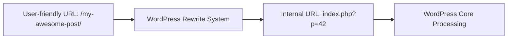

# WordPress Rewrite API

## Introduction

The WordPress Rewrite API is a powerful system that allows developers to manipulate how URLs are structured and processed in WordPress. At its core, the Rewrite API translates human-friendly URLs into parameters that WordPress can understand to serve the appropriate content. This transformation happens behind the scenes, allowing visitors to see clean, meaningful URLs while WordPress works with the necessary query parameters.

Understanding the Rewrite API is essential for developers who want to:
- Create custom URL structures for custom post types
- Build clean URL patterns for custom functionality
- Manipulate permalink structures
- Create SEO-friendly URLs for specialized content

In this guide, we'll explore how the WordPress Rewrite API works, examine its key components, and walk through practical examples of how to use it in your projects.

## Understanding URL Rewriting in WordPress

### What is URL Rewriting?

URL rewriting is the process of modifying the appearance of a URL without changing the underlying resource it accesses. In WordPress, this means transforming a URL like `/my-awesome-post/` into something WordPress can understand internally, such as `index.php?p=42`.



### How WordPress Processes URLs

When a request comes in, WordPress follows these steps:

1. The web server (Apache, Nginx, etc.) receives the request
2. The request is forwarded to WordPress
3. WordPress parses the URL using the rewrite rules
4. WordPress transforms the pretty URL into query variables
5. The query variables are used to fetch and display the appropriate content

## Core Components of the Rewrite API

### Rewrite Rules

Rewrite rules are patterns that WordPress uses to match incoming URLs and transform them into query variables. Each rule consists of:

- A pattern to match against the URL
- A replacement string that specifies the query variables

### Rewrite Tags

Rewrite tags are placeholders used in permalink structures that WordPress automatically converts into regular expressions for matching URLs. Common rewrite tags include:

- `%year%` - The year of the post
- `%monthnum%` - The month of the post
- `%day%` - The day of the post
- `%postname%` - The post slug
- `%category%` - The category slug

### Query Variables

Query variables are parameters that WordPress uses to determine what content to display. These are typically appended to `index.php` in the form of query strings.

## Working with the WordPress Rewrite API

### Adding Custom Rewrite Rules

To add a custom rewrite rule, you can use the `add_rewrite_rule()` function:

```php
function add_custom_rewrite_rule() {
    // Format: add_rewrite_rule($regex, $redirect, $position);
    add_rewrite_rule(
        'showcase/([^/]+)/?$',
        'index.php?post_type=showcase&name=$matches[1]',
        'top'
    );
}
add_action('init', 'add_custom_rewrite_rule');
```

In this example:
- `'showcase/([^/]+)/?$'` is the regex pattern that matches URLs like `/showcase/my-project/`
- `'index.php?post_type=showcase&name=$matches[1]'` is the internal URL pattern with the captured value
- `'top'` indicates this rule should take precedence over others

### Adding Custom Query Variables

WordPress needs to know about any custom query variables you want to use:

```php
function add_custom_query_vars($query_vars) {
    $query_vars[] = 'technology';
    return $query_vars;
}
add_filter('query_vars', 'add_custom_query_vars');
```

Now you can use `technology` as a query variable in your rewrite rules.

### Flushing Rewrite Rules

After adding new rewrite rules, you need to flush the rewrite rules cache for changes to take effect:

```php
function flush_rewrite_on_activation() {
    // Register your custom post type, taxonomies, or add rewrite rules first
    add_custom_rewrite_rule();
    
    // Then flush
    flush_rewrite_rules();
}
register_activation_hook(__FILE__, 'flush_rewrite_on_activation');
```

⚠️ **Important Note**: Never call `flush_rewrite_rules()` on every page load as it's a resource-intensive operation. Typically, you would call it when your plugin is activated or when settings that affect URLs are changed.

## Practical Applications

### Example 1: Custom Post Type with Clean URLs

Let's create a custom post type for "Projects" with URLs like `/projects/project-name/`:

```php
function register_project_post_type() {
    $args = [
        'public' => true,
        'label'  => 'Projects',
        'rewrite' => [
            'slug' => 'projects',
            'with_front' => false
        ],
        'supports' => ['title', 'editor', 'thumbnail']
    ];
    register_post_type('project', $args);
}
add_action('init', 'register_project_post_type');
```

### Example 2: Custom Endpoint for API Access

Create a custom endpoint for accessing project data via API:

```php
function add_project_api_endpoint() {
    add_rewrite_rule(
        'api/projects/([^/]+)/?$',
        'index.php?project=$matches[1]&project_api=true',
        'top'
    );
}
add_action('init', 'add_project_api_endpoint');

function add_project_api_query_var($vars) {
    $vars[] = 'project_api';
    return $vars;
}
add_filter('query_vars', 'add_project_api_query_var');

function handle_project_api_request() {
    if (get_query_var('project_api', false)) {
        $project_slug = get_query_var('project');
        
        // Get the project
        $project = get_page_by_path($project_slug, OBJECT, 'project');
        
        if ($project) {
            // Prepare the data
            $data = [
                'id' => $project->ID,
                'title' => $project->post_title,
                'content' => apply_filters('the_content', $project->post_content),
                'date' => $project->post_date
            ];
            
            // Output as JSON and stop execution
            header('Content-Type: application/json');
            echo json_encode($data);
            exit;
        }
    }
}
add_action('template_redirect', 'handle_project_api_request');
```

Now you can access `/api/projects/project-name/` to get JSON data for a specific project.

### Example 3: Custom Taxonomy Pages with Parameters

Create custom URLs for filtering projects by technology:

```php
function register_technology_taxonomy() {
    $args = [
        'hierarchical' => false,
        'public' => true,
        'label' => 'Technologies',
        'rewrite' => [
            'slug' => 'technology',
            'with_front' => false
        ]
    ];
    register_taxonomy('technology', ['project'], $args);
}
add_action('init', 'register_technology_taxonomy');

function add_technology_filter_rewrite() {
    add_rewrite_rule(
        'projects/filter/([^/]+)/?$',
        'index.php?post_type=project&technology=$matches[1]',
        'top'
    );
}
add_action('init', 'add_technology_filter_rewrite');
```

This creates URLs like `/projects/filter/wordpress/` to show projects tagged with "wordpress".

## Advanced Techniques

### Using `generate_rewrite_rules` Hook

For more complex rewrite scenarios, you can use the `generate_rewrite_rules` hook:

```php
function custom_rewrite_rules($wp_rewrite) {
    $new_rules = [
        'archive/(\d{4})/(\d{2})/([^/]+)/?$' => 'index.php?year=$matches[1]&monthnum=$matches[2]&category_name=$matches[3]'
    ];
    
    $wp_rewrite->rules = $new_rules + $wp_rewrite->rules;
    return $wp_rewrite->rules;
}
add_filter('generate_rewrite_rules', 'custom_rewrite_rules');
```

### Creating Custom Permalink Structures

You can create custom permalink structures for your post types:

```php
function custom_post_type_permalink($permalink, $post) {
    if ($post->post_type !== 'project') {
        return $permalink;
    }
    
    // Get the terms
    $terms = get_the_terms($post->ID, 'technology');
    
    if (!$terms || is_wp_error($terms)) {
        return str_replace('%technology%', 'uncategorized', $permalink);
    }
    
    // Use the first term
    $term = array_shift($terms);
    
    return str_replace('%technology%', $term->slug, $permalink);
}
add_filter('post_type_link', 'custom_post_type_permalink', 10, 2);

function project_post_type_with_custom_permalink() {
    register_post_type('project', [
        'public' => true,
        'label'  => 'Projects',
        'rewrite' => [
            'slug' => 'projects/%technology%',
            'with_front' => false
        ],
        'supports' => ['title', 'editor', 'thumbnail']
    ]);
}
add_action('init', 'project_post_type_with_custom_permalink');
```

This creates URLs like `/projects/wordpress/project-name/` automatically.

## Common Issues and Troubleshooting

### Rewrite Rules Not Working

If your rewrite rules aren't working:

1. Make sure you've flushed the rewrite rules after adding them
2. Check your permalink settings in WordPress admin
3. Verify your web server configuration (Apache needs mod_rewrite, Nginx needs proper directives)
4. Use the [Rewrite Rules Inspector](https://wordpress.org/plugins/rewrite-rules-inspector/) plugin for debugging

### Conflicting Rules

If you have conflicting rules, remember:

- Rules are processed in order (top to bottom)
- More specific rules should come before more general ones
- Use the `top` parameter in `add_rewrite_rule()` to prioritize important rules

### Performance Considerations

- Flush rewrite rules only when necessary (plugin activation/deactivation, settings changes)
- Keep the number of custom rules manageable
- Test your rules with the Query Monitor plugin to identify any inefficiencies

## Summary

The WordPress Rewrite API is a powerful tool that allows developers to create clean, user-friendly URLs for any type of content or functionality in WordPress. By understanding rewrite rules, tags, and query variables, you can build sophisticated URL structures that improve user experience and SEO.

Key takeaways from this guide:

- The Rewrite API transforms pretty URLs into query variables WordPress can process
- Custom rewrite rules allow you to define URL patterns for custom functionality
- Always register custom query variables before using them in rewrite rules
- Flush rewrite rules after adding new ones, but only when necessary
- Use hooks like `init` to register your rules and `template_redirect` to handle custom endpoints

## Additional Resources

- [WordPress Developer Documentation on Rewrite API](https://developer.wordpress.org/reference/functions/add_rewrite_rule/)
- [Understanding WordPress Permalinks](https://wordpress.org/documentation/article/customize-permalinks/)
- [Query Monitor Plugin](https://wordpress.org/plugins/query-monitor/) - Helpful for debugging rewrite issues
- [Rewrite Rules Inspector Plugin](https://wordpress.org/plugins/rewrite-rules-inspector/) - For inspecting and testing rewrite rules

## Exercises

1. Create a custom post type with a custom permalink structure that includes a taxonomy term
2. Implement an endpoint that accepts parameters in the URL and returns a customized result
3. Create a paged URL structure for a custom archive (e.g., `/projects/page/2/`)
4. Build a rewrite system for a custom search feature with multiple parameters

By mastering the WordPress Rewrite API, you'll be able to create elegant, SEO-friendly URL structures for all your WordPress projects.