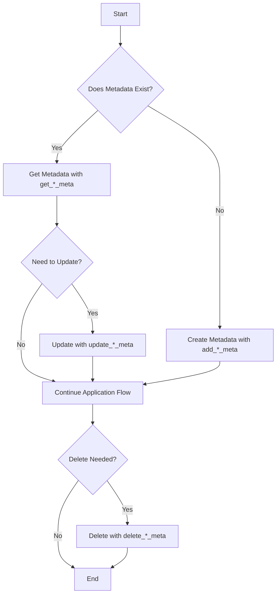

# WordPress Metadata API

## Introduction

The WordPress Metadata API provides a standardized way to store and retrieve additional information (metadata) associated with various WordPress objects like posts, comments, users, and terms. This metadata system allows developers to extend WordPress's default data structures without modifying core database tables, making it essential for plugin and theme development.

Think of metadata as "extra information" that doesn't fit into the standard fields WordPress provides. For example, if you want to store a "mood" for each post or a "favorite color" for each user, the Metadata API gives you the tools to do this efficiently and consistently.

## Core Concepts

### What is Metadata?

Metadata in WordPress is structured as key-value pairs that are associated with specific objects:

- **Meta key**: The name or identifier for the piece of metadata
- **Meta value**: The actual information being stored
- **Object ID**: The ID of the WordPress object (post, user, comment, term) that this metadata belongs to

### Types of Metadata

WordPress offers four main types of metadata, each with its own set of functions:

1. **Post metadata**: Associated with posts, pages, and custom post types
2. **User metadata**: Associated with WordPress user accounts 
3. **Comment metadata**: Associated with comments
4. **Term metadata**: Associated with taxonomy terms (available since WordPress 4.4)

### Database Structure

While you rarely need to interact with the database directly, it's helpful to understand how metadata is stored. WordPress uses these tables:

- `wp_postmeta` - For post metadata
- `wp_usermeta` - For user metadata
- `wp_commentmeta` - For comment metadata
- `wp_termmeta` - For term metadata

Each table follows a similar structure with columns for:
- Meta ID (primary key)
- Object ID (post_id, user_id, etc.)
- Meta key
- Meta value

## Working with Post Metadata

Let's start by exploring post metadata, which is the most commonly used type.

### Adding Post Metadata

To add metadata to a post, use the `add_post_meta()` function:

```php
/**
 * @param int    $post_id    Post ID
 * @param string $meta_key   Metadata name
 * @param mixed  $meta_value Metadata value
 * @param bool   $unique     Whether the same key should not be added
 * @return int|false         Meta ID on success, false on failure
 */
add_post_meta($post_id, $meta_key, $meta_value, $unique);
```

Example - Adding a featured status to a post:

```php
// Add "featured" status to post with ID 42
$result = add_post_meta(42, 'is_featured', true, true);

if ($result) {
    echo "Post marked as featured!";
} else {
    echo "Could not mark post as featured.";
}
```

The `$unique` parameter (when set to `true`) prevents duplicate meta keys for the same post. If a meta key already exists and `$unique` is true, the function will return `false`.

### Getting Post Metadata

To retrieve post metadata, use the `get_post_meta()` function:

```php
/**
 * @param int    $post_id  Post ID
 * @param string $meta_key (Optional) Specific meta key to retrieve
 * @param bool   $single   Whether to return a single value or an array
 * @return mixed           Will be an array if $single is false, otherwise the value
 */
get_post_meta($post_id, $meta_key, $single);
```

Example - Retrieving featured status:

```php
// Get "featured" status for post with ID 42
$is_featured = get_post_meta(42, 'is_featured', true);

if ($is_featured) {
    echo "This post is featured!";
} else {
    echo "This is a regular post.";
}
```

If you omit the `$meta_key` parameter, you'll get all metadata for the post:

```php
// Get all metadata for post with ID 42
$all_meta = get_post_meta(42);
print_r($all_meta);

// Output might look like:
// Array (
//     [is_featured] => Array ( [0] => 1 )
//     [_thumbnail_id] => Array ( [0] => 123 )
//     [view_count] => Array ( [0] => 1500 )
// )
```

### Updating Post Metadata

To modify existing metadata, use the `update_post_meta()` function:

```php
/**
 * @param int    $post_id      Post ID
 * @param string $meta_key     Metadata key
 * @param mixed  $meta_value   New metadata value
 * @param mixed  $prev_value   (Optional) Previous value to check before updating
 * @return int|bool            Meta ID if the key didn't exist, true on success, false on failure
 */
update_post_meta($post_id, $meta_key, $meta_value, $prev_value);
```

Example - Updating a view count:

```php
// Get the current view count
$current_views = get_post_meta(42, 'view_count', true);

// Increment view count
$new_count = (int)$current_views + 1;

// Update the meta value
update_post_meta(42, 'view_count', $new_count);

echo "Post has been viewed {$new_count} times.";
```

The `update_post_meta()` function is very convenient because it:
- Creates the meta key/value if it doesn't exist
- Updates the value if the key exists
- Can check the previous value before updating (using the optional `$prev_value` parameter)

### Deleting Post Metadata

To remove metadata, use the `delete_post_meta()` function:

```php
/**
 * @param int    $post_id     Post ID
 * @param string $meta_key    Metadata key
 * @param mixed  $meta_value  (Optional) Metadata value to delete
 * @return bool               True on success, false on failure
 */
delete_post_meta($post_id, $meta_key, $meta_value);
```

Example - Removing featured status:

```php
// Remove featured status from post with ID 42
$result = delete_post_meta(42, 'is_featured');

if ($result) {
    echo "Featured status removed.";
} else {
    echo "Could not remove featured status.";
}
```

If you specify a `$meta_value`, only entries with that exact value will be deleted.

## Working with User Metadata

User metadata follows the same patterns as post metadata but uses different function names.

### Adding User Metadata

```php
// Store the user's favorite color
add_user_meta(15, 'favorite_color', 'blue', true);
```

### Getting User Metadata

```php
// Get user's favorite color
$color = get_user_meta(15, 'favorite_color', true);
echo "User's favorite color is: {$color}";
```

### Updating User Metadata

```php
// Update user's favorite color
update_user_meta(15, 'favorite_color', 'green');
```

### Deleting User Metadata

```php
// Remove user's favorite color
delete_user_meta(15, 'favorite_color');
```

## Working with Comment and Term Metadata

Comment and term metadata follow the same patterns, with their own respective functions:

### Comment Metadata Functions

- `add_comment_meta($comment_id, $meta_key, $meta_value, $unique)`
- `get_comment_meta($comment_id, $meta_key, $single)`
- `update_comment_meta($comment_id, $meta_key, $meta_value, $prev_value)`
- `delete_comment_meta($comment_id, $meta_key, $meta_value)`

### Term Metadata Functions

- `add_term_meta($term_id, $meta_key, $meta_value, $unique)`
- `get_term_meta($term_id, $meta_key, $single)`
- `update_term_meta($term_id, $meta_key, $meta_value, $prev_value)`
- `delete_term_meta($term_id, $meta_key, $meta_value)`

## Real-World Applications

Let's explore some practical applications of the Metadata API:

### Example 1: Custom Post Rating System

```php
// Function to add or update a post rating
function update_post_rating($post_id, $rating) {
    // Ensure rating is between 1-5
    $rating = max(1, min(5, (int)$rating));
    
    // Store the new rating
    update_post_meta($post_id, 'user_rating', $rating);
    
    // Get existing rating count
    $count = get_post_meta($post_id, 'rating_count', true);
    $count = $count ? (int)$count + 1 : 1;
    
    // Update rating count
    update_post_meta($post_id, 'rating_count', $count);
    
    return true;
}

// Function to display post rating
function display_post_rating($post_id) {
    $rating = get_post_meta($post_id, 'user_rating', true);
    $count = get_post_meta($post_id, 'rating_count', true);
    
    if (!$rating) {
        return 'No ratings yet';
    }
    
    return "Rating: {$rating}/5 from {$count} users";
}
```

### Example 2: User Profile Extension

```php
// Function to save additional user profile fields
function save_extra_user_fields($user_id) {
    if (current_user_can('edit_user', $user_id)) {
        update_user_meta($user_id, 'twitter_handle', $_POST['twitter_handle']);
        update_user_meta($user_id, 'linkedin_profile', $_POST['linkedin_profile']);
    }
}
add_action('personal_options_update', 'save_extra_user_fields');
add_action('edit_user_profile_update', 'save_extra_user_fields');

// Function to display additional user profile fields
function show_extra_user_fields($user) {
    $twitter = get_user_meta($user->ID, 'twitter_handle', true);
    $linkedin = get_user_meta($user->ID, 'linkedin_profile', true);
    ?>
    <h3>Social Profiles</h3>
    <table class="form-table">
        <tr>
            <th><label for="twitter_handle">Twitter</label></th>
            <td>
                <input type="text" name="twitter_handle" value="<?php echo esc_attr($twitter); ?>" />
            </td>
        </tr>
        <tr>
            <th><label for="linkedin_profile">LinkedIn</label></th>
            <td>
                <input type="text" name="linkedin_profile" value="<?php echo esc_attr($linkedin); ?>" />
            </td>
        </tr>
    </table>
    <?php
}
add_action('show_user_profile', 'show_extra_user_fields');
add_action('edit_user_profile', 'show_extra_user_fields');
```

### Example 3: Product Information for WooCommerce

While WooCommerce has its own methods for product data, here's how you could use the Metadata API directly:

```php
// Add custom manufacturing date to product
function add_manufacturing_date_to_product($product_id, $date) {
    update_post_meta($product_id, '_manufacturing_date', sanitize_text_field($date));
}

// Get manufacturing date
function get_product_manufacturing_date($product_id) {
    return get_post_meta($product_id, '_manufacturing_date', true);
}

// Add warranty information
function add_warranty_info_to_product($product_id, $warranty_years) {
    update_post_meta($product_id, '_warranty_years', absint($warranty_years));
}
```

## Best Practices

### 1. Use Prefixes for Meta Keys

To avoid conflicts with other plugins or themes, prefix your meta keys:

```php
// Good: Using a prefix
update_post_meta($post_id, 'acme_featured_image_color', 'blue');

// Bad: No prefix could cause conflicts
update_post_meta($post_id, 'featured_image_color', 'blue');
```

### 2. Sanitize Input, Escape Output

Always sanitize data before storing it and escape when retrieving:

```php
// Sanitize before storing
$clean_value = sanitize_text_field($_POST['user_input']);
update_post_meta($post_id, 'acme_user_feedback', $clean_value);

// Escape when outputting
$feedback = get_post_meta($post_id, 'acme_user_feedback', true);
echo esc_html($feedback);
```

### 3. Use Protected Meta Keys for Internal Data

Prefix internal meta keys with an underscore to hide them from the Custom Fields UI:

```php
// This won't show in the standard Custom Fields metabox
update_post_meta($post_id, '_acme_internal_data', $value);
```

### 4. Use Appropriate Data Types

WordPress serializes complex data types automatically, but it's good practice to store data in appropriate formats:

```php
// Store array of values
$colors = ['red', 'green', 'blue'];
update_post_meta($post_id, 'acme_color_options', $colors);

// Retrieve the array
$saved_colors = get_post_meta($post_id, 'acme_color_options', true);
// $saved_colors is now an array
```

### 5. Consider Performance

Metadata queries can be expensive. Consider using transients for frequently accessed data:

```php
function get_cached_post_stats($post_id) {
    $cache_key = 'post_stats_' . $post_id;
    $stats = get_transient($cache_key);
    
    if (false === $stats) {
        // This might involve several meta lookups
        $views = get_post_meta($post_id, 'view_count', true);
        $likes = get_post_meta($post_id, 'like_count', true);
        $shares = get_post_meta($post_id, 'share_count', true);
        
        $stats = [
            'views' => $views ? $views : 0,
            'likes' => $likes ? $likes : 0,
            'shares' => $shares ? $shares : 0,
        ];
        
        // Cache for 1 hour
        set_transient($cache_key, $stats, HOUR_IN_SECONDS);
    }
    
    return $stats;
}
```

## The Metadata API Flow

Here's a diagram showing the typical flow when working with metadata:



## Summary

The WordPress Metadata API provides a flexible and powerful way to extend WordPress's data structures with custom information. By understanding how to effectively use the API's functions for creating, retrieving, updating, and deleting metadata, developers can build rich, customized WordPress experiences without modifying core database tables.

The key points to remember are:

1. Metadata is stored as key-value pairs associated with WordPress objects (posts, users, comments, terms)
2. There are specific functions for each type of metadata (post, user, comment, term)
3. The API handles serialization and deserialization of complex data types automatically
4. Following best practices like using prefixes helps prevent conflicts with other code
5. The Metadata API enables powerful extensions of WordPress's core functionality

## Additional Resources

For further learning about the WordPress Metadata API:

- [WordPress Developer Documentation: Metadata API](https://developer.wordpress.org/reference/functions/add_post_meta/)
- [WordPress Database Structure](https://codex.wordpress.org/Database_Description)
- [WordPress Plugin Development: Metadata Handling](https://developer.wordpress.org/plugins/metadata/)

## Exercises

1. Create a simple plugin that adds a "Mood" metabox to posts, allowing authors to select their mood when writing the post, and display this mood at the end of the post content.

2. Build a user profile extension that stores and displays social media links for each user.

3. Create a custom plugin that tracks and displays the reading time for posts based on their word count, storing this as post metadata.

4. Implement a "Featured Posts" system that allows administrators to mark certain posts as featured and display them prominently on the homepage.

5. Create a comment rating system that lets users rate comments and stores these ratings as comment metadata.