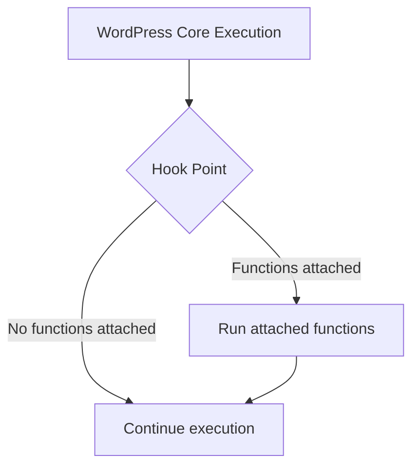

# WordPress Plugin API

## Introduction

The WordPress Plugin API is one of the most powerful features of the WordPress ecosystem. It provides developers with a standardized way to modify and extend WordPress functionality without editing core files. This approach ensures that your customizations won't be overwritten when WordPress updates.

At its core, the Plugin API is built on a system of **hooks**, which come in two varieties:

1. **Actions**: Allow you to add or modify WordPress functionality
2. **Filters**: Allow you to modify data before it's used

This hook system is what makes WordPress incredibly extensible and is the foundation for all WordPress plugins. In this tutorial, we'll explore how to use these hooks effectively to build your own WordPress extensions.

## Understanding Hooks: The Foundation of the Plugin API

Think of hooks as designated spots in the WordPress code where developers can "hook in" their own code. When WordPress reaches a hook during execution, it checks if any functions are registered to that hook and runs them accordingly.



## Working with Actions

### What Are Actions?

Actions are hooks that WordPress triggers at specific points during execution. They allow you to add functionality or modify how WordPress operates.

For example, WordPress triggers the `wp_head` action when it's time to output content in the `<head>` section of a page.

### Adding Actions

To hook a function to an action, use `add_action()`:

```php
add_action('hook_name', 'your_function_name', priority, accepted_args);
```

Parameters:
- `hook_name`: The name of the action hook
- `your_function_name`: The function to execute
- `priority`: Optional. Default 10. Lower numbers run earlier
- `accepted_args`: Optional. Default 1. How many arguments your function accepts

### Example: Adding Content to the Footer

Let's add a simple copyright notice to the footer of a WordPress site:

```php
function add_copyright_notice() {
    echo '<div class="copyright">© ' . date('Y') . ' My Awesome Website. All rights reserved.</div>';
}
add_action('wp_footer', 'add_copyright_notice');
```

When WordPress executes the `wp_footer` hook, our function will run and output the copyright notice.

### Creating Your Own Actions

You can also create custom action hooks in your plugins or themes using `do_action()`:

```php
do_action('hook_name', $arg1, $arg2, ...);
```

Example:

```php
function my_plugin_process_data() {
    // Process some data
    $processed_data = 'processed information';
    
    // Create a hook for other developers to use
    do_action('my_plugin_data_processed', $processed_data);
    
    // Continue execution
}
```

Other developers can now hook into `my_plugin_data_processed` to extend your plugin.

## Working with Filters

### What Are Filters?

Filters are hooks that allow you to modify data before WordPress uses it. Unlike actions, filters always pass variables and expect a return value.

### Adding Filters

To hook a function to a filter, use `add_filter()`:

```php
add_filter('hook_name', 'your_function_name', priority, accepted_args);
```

The parameters are the same as `add_action()`.

### Example: Modifying the Excerpt Length

By default, WordPress excerpts are 55 words. Let's change that to 25 words:

```php
function custom_excerpt_length($length) {
    return 25;
}
add_filter('excerpt_length', 'custom_excerpt_length');
```

In this example:
1. WordPress passes the default excerpt length (55) to our function
2. Our function returns 25 instead
3. WordPress uses 25 as the excerpt length

### Creating Your Own Filters

You can create custom filter hooks using `apply_filters()`:

```php
$value = apply_filters('hook_name', $value, $arg1, $arg2, ...);
```

Example:

```php
function my_plugin_get_title($post_id) {
    $title = get_the_title($post_id);
    
    // Allow developers to modify the title
    return apply_filters('my_plugin_title', $title, $post_id);
}
```

## Removing Hooks

Sometimes you need to remove actions or filters added by WordPress core, themes, or other plugins.

### Removing Actions

```php
remove_action('hook_name', 'function_to_remove', priority);
```

Example: Remove the generator meta tag:

```php
remove_action('wp_head', 'wp_generator');
```

### Removing Filters

```php
remove_filter('hook_name', 'function_to_remove', priority);
```

Example: Remove the default excerpt more text:

```php
function remove_excerpt_more_filter() {
    remove_filter('excerpt_more', 'custom_excerpt_more');
}
add_action('init', 'remove_excerpt_more_filter');
```

## Practical Applications

### Example 1: Custom Login Page Styling

Let's customize the WordPress login page with our own logo and styles:

```php
// Change the logo URL on the login page
function custom_login_logo_url() {
    return home_url();
}
add_filter('login_headerurl', 'custom_login_logo_url');

// Change the logo title text
function custom_login_logo_title() {
    return get_bloginfo('name') . ' - ' . get_bloginfo('description');
}
add_filter('login_headertext', 'custom_login_logo_title');

// Add custom styles to the login page
function custom_login_styles() {
    ?>
    <style type="text/css">
        #login h1 a {
            background-image: url(<?php echo get_stylesheet_directory_uri(); ?>/images/custom-logo.png);
            background-size: contain;
            width: 300px;
            height: 80px;
        }
        body.login {
            background-color: #f5f5f5;
        }
        .login #backtoblog a, .login #nav a {
            color: #0073aa !important;
        }
    </style>
    <?php
}
add_action('login_enqueue_scripts', 'custom_login_styles');
```

### Example 2: Adding Custom Functionality to a Plugin

Let's say you're using a popular e-commerce plugin and want to add custom functionality when a product is purchased:

```php
function track_product_purchase($order_id) {
    $order = wc_get_order($order_id);
    
    foreach ($order->get_items() as $item) {
        $product_id = $item->get_product_id();
        $quantity = $item->get_quantity();
        
        // Log purchase in custom analytics system
        custom_analytics_log_purchase($product_id, $quantity, $order_id);
    }
}
add_action('woocommerce_order_status_completed', 'track_product_purchase');
```

### Example 3: Creating a Simple Plugin

Let's create a simple plugin that adds social media sharing buttons to the end of each post:

```php
<?php
/**
 * Plugin Name: Simple Social Sharing
 * Description: Adds social media sharing buttons to the end of each post
 * Version: 1.0
 * Author: Your Name
 */

// Don't allow direct access
if (!defined('ABSPATH')) {
    exit;
}

function add_social_sharing_buttons($content) {
    // Only add to single posts
    if (!is_single()) {
        return $content;
    }
    
    // Get current page URL
    $url = urlencode(get_permalink());
    
    // Get current page title
    $title = urlencode(get_the_title());
    
    // Build sharing buttons
    $twitter_url = 'https://twitter.com/intent/tweet?text=' . $title . '&url=' . $url;
    $facebook_url = 'https://www.facebook.com/sharer/sharer.php?u=' . $url;
    $linkedin_url = 'https://www.linkedin.com/shareArticle?mini=true&url=' . $url . '&title=' . $title;
    
    $buttons = '<div class="social-sharing">';
    $buttons .= '<h4>Share this post:</h4>';
    $buttons .= '<a href="' . $twitter_url . '" target="_blank" class="share-twitter">Twitter</a>';
    $buttons .= '<a href="' . $facebook_url . '" target="_blank" class="share-facebook">Facebook</a>';
    $buttons .= '<a href="' . $linkedin_url . '" target="_blank" class="share-linkedin">LinkedIn</a>';
    $buttons .= '</div>';
    
    // Allow other developers to modify the buttons
    $buttons = apply_filters('simple_social_buttons', $buttons, $url, $title);
    
    // Add buttons after the content
    return $content . $buttons;
}
add_filter('the_content', 'add_social_sharing_buttons');

// Add some basic styling
function social_sharing_styles() {
    ?>
    <style>
        .social-sharing {
            margin-top: 30px;
            padding: 20px;
            background: #f5f5f5;
            border-radius: 5px;
        }
        .social-sharing a {
            display: inline-block;
            margin-right: 10px;
            padding: 8px 15px;
            color: #fff;
            text-decoration: none;
            border-radius: 3px;
        }
        .share-twitter { background: #1da1f2; }
        .share-facebook { background: #3b5998; }
        .share-linkedin { background: #0077b5; }
    </style>
    <?php
}
add_action('wp_head', 'social_sharing_styles');
```

## Best Practices

1. **Use Unique Prefixes**: Prefix your function names to avoid conflicts with other plugins or themes
2. **Check if Functions Exist**: Before defining functions, check if they already exist
3. **Use Appropriate Hook Priorities**: Lower numbers run earlier (default is 10)
4. **Always Return Values in Filters**: Filters must return a value, or you'll break functionality
5. **Document Your Hooks**: If you create custom hooks, document them for other developers
6. **Use Conditional Tags**: Make sure your code runs only when needed

```php
// Example of best practices
if (!function_exists('my_prefix_custom_function')) {
    function my_prefix_custom_function($content) {
        // Only run on single posts
        if (!is_single()) {
            return $content;
        }
        
        // Do something with $content
        $modified_content = $content . 'Additional content';
        
        return $modified_content;
    }
}
add_filter('the_content', 'my_prefix_custom_function');
```

## Finding Available Hooks

To effectively use the Plugin API, you need to know which hooks are available. Here are some ways to find them:

1. **WordPress Developer Documentation**: The [official developer documentation](https://developer.wordpress.org/plugins/hooks/) lists many hooks
2. **Source Code**: Browse the WordPress core code to find `do_action()` and `apply_filters()`
3. **Plugin Hooks**: Check plugin documentation or source code for available hooks
4. **Hook Sniffer Plugins**: Use plugins that list all available hooks on a page

## Summary

The WordPress Plugin API provides a powerful and flexible system for extending WordPress through hooks: actions and filters. With actions, you can add functionality at specific points in WordPress execution. With filters, you can modify data before WordPress uses it.

This hook system is what makes WordPress so extensible and is the foundation for all WordPress plugins. By understanding and utilizing this API, you can create powerful customizations without editing core WordPress files.

## Additional Resources

Here are some resources to help you dive deeper into the WordPress Plugin API:

- [WordPress Plugin Developer Handbook](https://developer.wordpress.org/plugins/)
- [WordPress Action Reference](https://codex.wordpress.org/Plugin_API/Action_Reference)
- [WordPress Filter Reference](https://codex.wordpress.org/Plugin_API/Filter_Reference)

## Exercises

1. Create a simple plugin that adds a custom message at the end of each post
2. Use filters to modify the default WordPress search to include custom post types
3. Create a custom shortcode that displays the current user's name
4. Add a custom dashboard widget using WordPress hooks
5. Create a plugin that adds a custom meta box to the post editor screen

By mastering the WordPress Plugin API, you'll be able to customize and extend WordPress in countless ways, creating powerful plugins and themes that can transform how WordPress works.