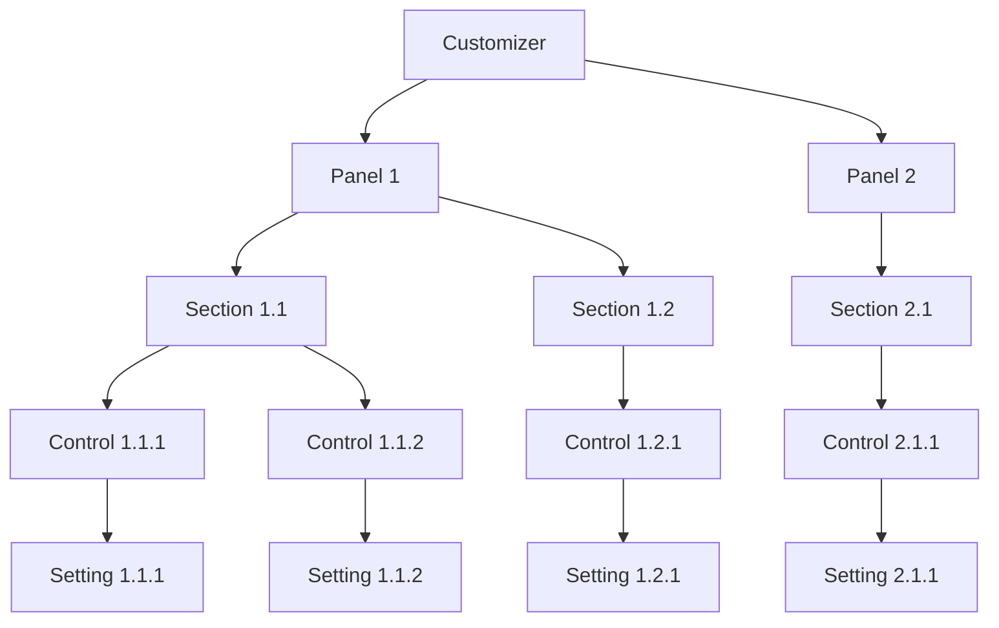

# WordPress Theme Customization API

## Introduction

The WordPress Theme Customization API (often called the Customizer API) provides a powerful framework that allows theme developers to create a user-friendly interface for customizing theme settings. Instead of using custom theme option pages, the Customizer offers a standardized, real-time preview environment where users can modify various aspects of a WordPress theme and see the changes before publishing them.

In this guide, we'll explore how to use the Theme Customization API to create customizable options for your WordPress themes. By the end, you'll understand how to implement custom settings, controls, and sections that give users the ability to personalize their websites without touching a single line of code.

## Understanding the Core Concepts

Before diving into the code, let's understand the fundamental components of the Theme Customization API:

1. **Customizer**: The visual interface that contains all customization options.
2. **Panels**: Large groupings that can contain multiple sections (optional).
3. **Sections**: Groups of controls that are related to each other.
4. **Settings**: Data stored in the database (typically in the wp_options table).
5. **Controls**: UI elements that users interact with to change settings.

Here's a visualization of the hierarchy:



## Getting Started with the Customizer API

### Setting Up the Customizer

The first step is to add a function to your theme's `functions.php` file to register your customizer settings. This function should be hooked to the `customize_register` action.

```php
function mytheme_customize_register($wp_customize) {
    // Customizer code will go here
}
add_action('customize_register', 'mytheme_customize_register');
```

### Adding a Basic Section and Control

Let's start by adding a simple section with a text control for the site tagline:

```php
function mytheme_customize_register($wp_customize) {
    // Add a section
    $wp_customize->add_section('mytheme_general_options', array(
        'title' => __('General Options', 'mytheme'),
        'description' => __('Customize general aspects of the theme', 'mytheme'),
        'priority' => 30,
    ));
    
    // Add a setting
    $wp_customize->add_setting('mytheme_tagline_color', array(
        'default' => '#000000',
        'sanitize_callback' => 'sanitize_hex_color',
        'transport' => 'refresh',
    ));
    
    // Add a control
    $wp_customize->add_control(new WP_Customize_Color_Control($wp_customize, 'mytheme_tagline_color', array(
        'label' => __('Tagline Color', 'mytheme'),
        'section' => 'mytheme_general_options',
        'settings' => 'mytheme_tagline_color',
    )));
}
add_action('customize_register', 'mytheme_customize_register');
```

### Implementing the Changes

To make the customizer settings take effect on your site, we need to add the necessary CSS. This is typically done by hooking into `wp_head`:

```php
function mytheme_customize_css() {
    ?>
    <style type="text/css">
        .site-description {
            color: <?php echo get_theme_mod('mytheme_tagline_color', '#000000'); ?>;
        }
    </style>
    <?php
}
add_action('wp_head', 'mytheme_customize_css');
```

## Advanced Customizer Features

### Creating a Panel

Panels are useful when you have multiple related sections and want to organize them hierarchically:

```php
function mytheme_customize_register($wp_customize) {
    // Add a panel
    $wp_customize->add_panel('mytheme_theme_options', array(
        'title' => __('Theme Options', 'mytheme'),
        'description' => __('All theme customization options', 'mytheme'),
        'priority' => 10,
    ));
    
    // Add a section to the panel
    $wp_customize->add_section('mytheme_colors', array(
        'title' => __('Colors', 'mytheme'),
        'description' => __('Customize theme colors', 'mytheme'),
        'panel' => 'mytheme_theme_options',
    ));
    
    // Add another section to the panel
    $wp_customize->add_section('mytheme_typography', array(
        'title' => __('Typography', 'mytheme'),
        'description' => __('Customize font settings', 'mytheme'),
        'panel' => 'mytheme_theme_options',
    ));
    
    // Now add settings and controls to these sections
    // ...
}
```

### Different Types of Controls

WordPress provides several built-in control types. Here are some examples:

#### Text Control

```php
$wp_customize->add_setting('mytheme_footer_text', array(
    'default' => 'Copyright © ' . date('Y'),
    'sanitize_callback' => 'wp_kses_post',
));

$wp_customize->add_control('mytheme_footer_text', array(
    'label' => __('Footer Text', 'mytheme'),
    'section' => 'mytheme_footer',
    'type' => 'text',
));
```

#### Select Control

```php
$wp_customize->add_setting('mytheme_sidebar_position', array(
    'default' => 'right',
    'sanitize_callback' => 'mytheme_sanitize_select',
));

$wp_customize->add_control('mytheme_sidebar_position', array(
    'label' => __('Sidebar Position', 'mytheme'),
    'section' => 'mytheme_layout',
    'type' => 'select',
    'choices' => array(
        'left' => __('Left', 'mytheme'),
        'right' => __('Right', 'mytheme'),
        'none' => __('No Sidebar', 'mytheme'),
    ),
));

// Don't forget to add the sanitize function
function mytheme_sanitize_select($input, $setting) {
    // Get the list of possible select options
    $choices = $setting->manager->get_control($setting->id)->choices;
    // Return input if valid or return default option
    return (array_key_exists($input, $choices) ? $input : $setting->default);
}
```

#### Image Upload Control

```php
$wp_customize->add_setting('mytheme_logo', array(
    'default' => '',
    'sanitize_callback' => 'esc_url_raw',
));

$wp_customize->add_control(new WP_Customize_Image_Control($wp_customize, 'mytheme_logo', array(
    'label' => __('Logo', 'mytheme'),
    'section' => 'mytheme_branding',
    'settings' => 'mytheme_logo',
)));
```

### Using Partials for Selective Refresh

Selective refresh provides a better user experience by updating only parts of the preview when changes are made, instead of refreshing the entire page:

```php
function mytheme_customize_register($wp_customize) {
    // Add setting with 'postMessage' transport for live preview
    $wp_customize->add_setting('blogname', array(
        'default' => get_option('blogname'),
        'transport' => 'postMessage',
    ));
    
    // Add control
    $wp_customize->add_control('blogname', array(
        'label' => __('Site Title', 'mytheme'),
        'section' => 'title_tagline',
    ));
    
    // Add partial for selective refresh
    if (isset($wp_customize->selective_refresh)) {
        $wp_customize->selective_refresh->add_partial('blogname', array(
            'selector' => '.site-title a',
            'render_callback' => function() {
                return get_bloginfo('name');
            },
        ));
    }
}
```

Then, add JavaScript to your theme for live preview:

```php
function mytheme_customize_preview_js() {
    wp_enqueue_script('mytheme-customizer', get_template_directory_uri() . '/js/customizer.js', array('customize-preview'), '1.0', true);
}
add_action('customize_preview_init', 'mytheme_customize_preview_js');
```

And in your `customizer.js` file:

```js
(function($) {
    // Update site title in real time
    wp.customize('blogname', function(value) {
        value.bind(function(to) {
            $('.site-title a').text(to);
        });
    });
    
    // Update other settings in real time...
})(jQuery);
```

## Real-World Example: Creating a Complete Theme Section

Let's create a comprehensive example for a "Header Options" section with multiple settings:

```php
function mytheme_customize_register($wp_customize) {
    // Add Header Options Section
    $wp_customize->add_section('mytheme_header_options', array(
        'title' => __('Header Options', 'mytheme'),
        'description' => __('Customize your site header', 'mytheme'),
        'priority' => 20,
    ));
    
    // Header Background Color
    $wp_customize->add_setting('header_bg_color', array(
        'default' => '#ffffff',
        'transport' => 'postMessage',
        'sanitize_callback' => 'sanitize_hex_color',
    ));
    
    $wp_customize->add_control(new WP_Customize_Color_Control($wp_customize, 'header_bg_color', array(
        'label' => __('Header Background Color', 'mytheme'),
        'section' => 'mytheme_header_options',
    )));
    
    // Header Text Color
    $wp_customize->add_setting('header_text_color', array(
        'default' => '#000000',
        'transport' => 'postMessage',
        'sanitize_callback' => 'sanitize_hex_color',
    ));
    
    $wp_customize->add_control(new WP_Customize_Color_Control($wp_customize, 'header_text_color', array(
        'label' => __('Header Text Color', 'mytheme'),
        'section' => 'mytheme_header_options',
    )));
    
    // Header Height
    $wp_customize->add_setting('header_height', array(
        'default' => '100',
        'transport' => 'postMessage',
        'sanitize_callback' => 'absint', // Positive integers only
    ));
    
    $wp_customize->add_control('header_height', array(
        'label' => __('Header Height (px)', 'mytheme'),
        'section' => 'mytheme_header_options',
        'type' => 'number',
        'input_attrs' => array(
            'min' => 50,
            'max' => 250,
            'step' => 5,
        ),
    ));
    
    // Sticky Header
    $wp_customize->add_setting('sticky_header', array(
        'default' => false,
        'transport' => 'refresh',
        'sanitize_callback' => 'mytheme_sanitize_checkbox',
    ));
    
    $wp_customize->add_control('sticky_header', array(
        'label' => __('Enable Sticky Header', 'mytheme'),
        'section' => 'mytheme_header_options',
        'type' => 'checkbox',
    ));
}

function mytheme_sanitize_checkbox($checked) {
    return ((isset($checked) && true == $checked) ? true : false);
}

// Add custom styles based on customizer settings
function mytheme_header_customize_css() {
    ?>
    <style type="text/css">
        .site-header {
            background-color: <?php echo get_theme_mod('header_bg_color', '#ffffff'); ?>;
            color: <?php echo get_theme_mod('header_text_color', '#000000'); ?>;
            height: <?php echo get_theme_mod('header_height', '100'); ?>px;
            <?php if (get_theme_mod('sticky_header', false)): ?>
            position: fixed;
            width: 100%;
            z-index: 999;
            top: 0;
            <?php endif; ?>
        }
    </style>
    <?php
}
add_action('wp_head', 'mytheme_header_customize_css');

// Add JavaScript for live preview
function mytheme_customize_preview_js() {
    wp_enqueue_script('mytheme-customizer', get_template_directory_uri() . '/js/customizer.js', array('jquery', 'customize-preview'), '1.0', true);
}
add_action('customize_preview_init', 'mytheme_customize_preview_js');
```

And here's what your `customizer.js` file might look like:

```js
(function($) {
    // Header background color
    wp.customize('header_bg_color', function(value) {
        value.bind(function(to) {
            $('.site-header').css('background-color', to);
        });
    });
    
    // Header text color
    wp.customize('header_text_color', function(value) {
        value.bind(function(to) {
            $('.site-header').css('color', to);
        });
    });
    
    // Header height
    wp.customize('header_height', function(value) {
        value.bind(function(to) {
            $('.site-header').css('height', to + 'px');
        });
    });
})(jQuery);
```

## Best Practices for Theme Customization

1. **Sanitize All Inputs**: Always use appropriate sanitization callbacks for security.

2. **Use Descriptive IDs**: Make your setting and control IDs clear and descriptive.

3. **Group Related Options**: Use sections and panels to organize your options logically.

4. **Use Transport Methods Appropriately**:
   - `refresh`: Reloads the entire page (default)
   - `postMessage`: Updates via JavaScript without reloading (smoother)

5. **Provide Defaults**: Always set default values for your settings.

6. **Add Context**: Use descriptions to explain what options do.

7. **Respect WordPress Core**: Avoid duplicating or overriding core customizer sections unnecessarily.

8. **Validate User Input**: Use validation callbacks to ensure data integrity.

## Summary

The WordPress Theme Customization API provides a powerful and standardized way to add customization options to your themes. By leveraging panels, sections, settings, and controls, you can create a user-friendly interface that allows site owners to customize their themes without touching code.

We've covered:
- Setting up the customizer framework
- Adding panels, sections, settings, and controls
- Working with different control types
- Implementing selective refresh for a better user experience
- Creating a real-world example with header options
- Best practices for theme customization

By implementing these techniques in your WordPress themes, you can provide a richer, more flexible experience for your users while maintaining a clean, standardized approach to theme settings.

## Additional Resources

- [WordPress Developer Documentation on Theme Customization API](https://developer.wordpress.org/themes/customize-api/)
- [WordPress Codex on Theme Customization API](https://codex.wordpress.org/Theme_Customization_API)
- [Theme Customizer Handbook](https://developer.wordpress.org/themes/customize-api/)

## Exercises

1. Create a customizer section that allows users to customize the footer of a theme.

2. Implement a customizer section that lets users choose between different layout options for posts.

3. Add a customizer control that allows users to upload a custom favicon.

4. Create a customizer section with typography options that allows users to select different fonts for headings and body text.

5. Implement a customizer panel with color scheme options that changes multiple elements at once.