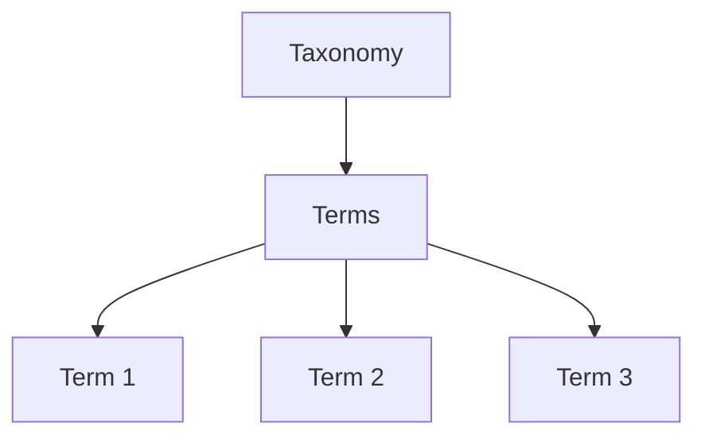

# WordPress Custom Taxonomies

## Introduction

WordPress comes with two built-in taxonomies: categories and tags. While these are sufficient for many websites, more complex sites often need additional ways to organize and classify content. This is where custom taxonomies come into play.

Custom taxonomies allow you to create your own classification systems for posts, pages, or custom post types. They provide a powerful way to organize content and improve site navigation, search functionality, and overall user experience.

In this guide, you'll learn:
- What taxonomies are and why they matter
- How to create custom taxonomies
- Best practices for taxonomy implementation
- Real-world applications and examples

## Understanding Taxonomies in WordPress

### What is a Taxonomy?

A taxonomy is a way to group and classify content. In WordPress, taxonomies consist of two main components:

1. **Taxonomy**: The classification method itself (e.g., "Category", "Tag")
2. **Terms**: The actual classifiers within a taxonomy (e.g., "News", "Sports" as terms in the "Category" taxonomy)



### Built-in vs. Custom Taxonomies

WordPress comes with these built-in taxonomies:

- **Categories**: Hierarchical, meant for broad grouping
- **Tags**: Non-hierarchical, for specific topics
- **Post Formats**: For styling different post types
- **Link Categories**: Used in the Links Manager

Custom taxonomies allow you to create your own classification systems tailored to your specific needs.

## Creating Custom Taxonomies

There are two main methods to register custom taxonomies:

1. Using the `register_taxonomy()` function
2. Using plugins like "Custom Post Type UI"

### Method 1: Using `register_taxonomy()`

The most direct way to create a custom taxonomy is by using the `register_taxonomy()` function. This function should be called from within a function that's hooked to the `init` action.

Here's a basic example:

```php
function register_book_taxonomy() {
    // Set up the arguments
    $args = array(
        'hierarchical'      => true,
        'labels'            => array(
            'name'              => _x('Genres', 'taxonomy general name'),
            'singular_name'     => _x('Genre', 'taxonomy singular name'),
            'search_items'      => __('Search Genres'),
            'all_items'         => __('All Genres'),
            'parent_item'       => __('Parent Genre'),
            'parent_item_colon' => __('Parent Genre:'),
            'edit_item'         => __('Edit Genre'),
            'update_item'       => __('Update Genre'),
            'add_new_item'      => __('Add New Genre'),
            'new_item_name'     => __('New Genre Name'),
            'menu_name'         => __('Genres'),
        ),
        'show_ui'           => true,
        'show_admin_column' => true,
        'query_var'         => true,
        'rewrite'           => array('slug' => 'genre'),
    );
    
    // Register the taxonomy
    register_taxonomy('genre', array('book'), $args);
}

// Hook into the 'init' action
add_action('init', 'register_book_taxonomy', 0);
```

In this example:
- We're creating a taxonomy called "genre" for a custom post type called "book"
- We set it to be hierarchical (like categories)
- We define labels for the admin interface
- We set up the URL structure with a slug of "genre"

### Method 2: Using Custom Post Type UI Plugin

If you prefer a GUI approach, the Custom Post Type UI plugin provides an intuitive interface:

1. Install and activate the "Custom Post Type UI" plugin
2. Go to "CPT UI" > "Add/Edit Taxonomies" in your admin dashboard
3. Fill out the form to create your custom taxonomy
4. Click "Add Taxonomy"

## Important Parameters for `register_taxonomy()`

Let's explore some key parameters you can use with `register_taxonomy()`:

### Hierarchical

```php
'hierarchical' => true, // Like categories (can have parent/child)
'hierarchical' => false, // Like tags (flat)
```

### Public Visibility

```php
'public' => true, // Visible to website visitors
'public' => false, // Admin use only
```

### Show UI

```php
'show_ui' => true, // Creates a default UI for managing the taxonomy
```

### Show in REST

```php
'show_in_rest' => true, // Makes the taxonomy available in the REST API (important for Gutenberg)
```

### Rewrite

```php
'rewrite' => array(
    'slug' => 'custom-slug', // URL slug
    'with_front' => true, // Should the permalink structure be prepended
    'hierarchical' => true // Allow hierarchical URLs (like /parent/child/)
),
```

## Custom Taxonomy Best Practices

1. **Use descriptive names**: Make your taxonomy name clear and descriptive of its purpose.

2. **Consider hierarchy needs**: Decide if your taxonomy needs to be hierarchical before creating it.

3. **Plan your URL structure**: Set up proper permalink structures using the rewrite parameter.

4. **Add taxonomy to appropriate post types**: Only connect taxonomies to relevant post types.

5. **Use translation functions**: Make your taxonomies translatable with `__()` and `_x()`.

6. **Consider REST API support**: Enable REST API support for modern editing experiences.

7. **Set appropriate capabilities**: Control who can edit taxonomy terms.

## Real-world Examples

Let's look at some practical applications of custom taxonomies:

### Example 1: Recipe Website

```php
function register_recipe_taxonomies() {
    // Cuisine taxonomy (hierarchical like categories)
    register_taxonomy('cuisine', array('recipe'), array(
        'hierarchical'      => true,
        'labels'            => array(
            'name'              => __('Cuisines'),
            'singular_name'     => __('Cuisine'),
            'search_items'      => __('Search Cuisines'),
            'all_items'         => __('All Cuisines'),
            'parent_item'       => __('Parent Cuisine'),
            'parent_item_colon' => __('Parent Cuisine:'),
            'edit_item'         => __('Edit Cuisine'),
            'update_item'       => __('Update Cuisine'),
            'add_new_item'      => __('Add New Cuisine'),
            'new_item_name'     => __('New Cuisine Name'),
            'menu_name'         => __('Cuisines'),
        ),
        'show_ui'           => true,
        'show_admin_column' => true,
        'query_var'         => true,
        'rewrite'           => array('slug' => 'cuisine'),
        'show_in_rest'      => true,
    ));
    
    // Dietary restrictions (non-hierarchical like tags)
    register_taxonomy('dietary', array('recipe'), array(
        'hierarchical'      => false,
        'labels'            => array(
            'name'              => __('Dietary Restrictions'),
            'singular_name'     => __('Dietary Restriction'),
            'search_items'      => __('Search Dietary Restrictions'),
            'all_items'         => __('All Dietary Restrictions'),
            'edit_item'         => __('Edit Dietary Restriction'),
            'update_item'       => __('Update Dietary Restriction'),
            'add_new_item'      => __('Add New Dietary Restriction'),
            'new_item_name'     => __('New Dietary Restriction Name'),
            'menu_name'         => __('Dietary Restrictions'),
        ),
        'show_ui'           => true,
        'show_admin_column' => true,
        'query_var'         => true,
        'rewrite'           => array('slug' => 'dietary'),
        'show_in_rest'      => true,
    ));
}

add_action('init', 'register_recipe_taxonomies', 0);
```

In this example, we create:
- A hierarchical "cuisine" taxonomy (Italian > Northern Italian)
- A non-hierarchical "dietary" taxonomy (Vegan, Gluten-Free, etc.)

### Example 2: Real Estate Website

```php
function register_property_taxonomies() {
    // Property Type taxonomy
    register_taxonomy('property-type', array('property'), array(
        'hierarchical'      => true,
        'labels'            => array(
            'name'              => __('Property Types'),
            'singular_name'     => __('Property Type'),
            'search_items'      => __('Search Property Types'),
            'all_items'         => __('All Property Types'),
            'parent_item'       => __('Parent Property Type'),
            'parent_item_colon' => __('Parent Property Type:'),
            'edit_item'         => __('Edit Property Type'),
            'update_item'       => __('Update Property Type'),
            'add_new_item'      => __('Add New Property Type'),
            'new_item_name'     => __('New Property Type Name'),
            'menu_name'         => __('Property Types'),
        ),
        'show_ui'           => true,
        'show_admin_column' => true,
        'query_var'         => true,
        'rewrite'           => array('slug' => 'property-type'),
    ));
    
    // Location taxonomy
    register_taxonomy('location', array('property'), array(
        'hierarchical'      => true,
        'labels'            => array(
            'name'              => __('Locations'),
            'singular_name'     => __('Location'),
            'search_items'      => __('Search Locations'),
            'all_items'         => __('All Locations'),
            'parent_item'       => __('Parent Location'),
            'parent_item_colon' => __('Parent Location:'),
            'edit_item'         => __('Edit Location'),
            'update_item'       => __('Update Location'),
            'add_new_item'      => __('Add New Location'),
            'new_item_name'     => __('New Location Name'),
            'menu_name'         => __('Locations'),
        ),
        'show_ui'           => true,
        'show_admin_column' => true,
        'query_var'         => true,
        'rewrite'           => array('slug' => 'location'),
    ));
    
    // Features taxonomy (non-hierarchical)
    register_taxonomy('feature', array('property'), array(
        'hierarchical'      => false,
        'labels'            => array(
            'name'              => __('Features'),
            'singular_name'     => __('Feature'),
            'search_items'      => __('Search Features'),
            'all_items'         => __('All Features'),
            'edit_item'         => __('Edit Feature'),
            'update_item'       => __('Update Feature'),
            'add_new_item'      => __('Add New Feature'),
            'new_item_name'     => __('New Feature Name'),
            'menu_name'         => __('Features'),
        ),
        'show_ui'           => true,
        'show_admin_column' => true,
        'query_var'         => true,
        'rewrite'           => array('slug' => 'feature'),
    ));
}

add_action('init', 'register_property_taxonomies', 0);
```

## Working with Custom Taxonomies

### Adding Terms to a Taxonomy

You can programmatically add terms to your taxonomy:

```php
// Check if the term exists
if (!term_exists('italian', 'cuisine')) {
    // Add the term if it doesn't exist
    wp_insert_term('Italian', 'cuisine', array(
        'description' => 'Italian cuisine',
        'slug'        => 'italian'
    ));
    
    // Add a child term
    $parent_term = term_exists('italian', 'cuisine');
    wp_insert_term('Sicilian', 'cuisine', array(
        'description' => 'Sicilian cuisine',
        'slug'        => 'sicilian',
        'parent'      => $parent_term['term_id'] 
    ));
}
```

### Displaying Custom Taxonomy Terms

To display terms from your custom taxonomy in a template:

```php
<?php
if (have_posts()) :
    while (have_posts()) :
        the_post();
        
        // Get the terms for this post
        $cuisine_terms = get_the_terms(get_the_ID(), 'cuisine');
        
        if ($cuisine_terms && !is_wp_error($cuisine_terms)) {
            echo '<div class="cuisine-terms">';
            echo '<strong>Cuisine: </strong>';
            
            $term_links = array();
            foreach ($cuisine_terms as $term) {
                $term_links[] = '<a href="' . esc_url(get_term_link($term)) . '">' . esc_html($term->name) . '</a>';
            }
            
            echo implode(', ', $term_links);
            echo '</div>';
        }
        
        // Display the content
        the_content();
        
    endwhile;
endif;
?>
```

### Querying Posts by Taxonomy

You can query posts based on taxonomy terms:

```php
<?php
$args = array(
    'post_type' => 'recipe',
    'tax_query' => array(
        array(
            'taxonomy' => 'cuisine',
            'field'    => 'slug',
            'terms'    => 'italian',
        ),
        array(
            'taxonomy' => 'dietary',
            'field'    => 'slug',
            'terms'    => 'vegetarian',
        ),
        'relation' => 'AND',
    ),
);

$query = new WP_Query($args);

if ($query->have_posts()) :
    while ($query->have_posts()) :
        $query->the_post();
        // Display post content
        the_title('<h2>', '</h2>');
        the_excerpt();
    endwhile;
    wp_reset_postdata();
else :
    echo 'No recipes found';
endif;
?>
```

This query finds all recipes that are both Italian cuisine AND vegetarian.

## Advanced Taxonomy Features

### Meta Boxes for Taxonomies

You can add custom meta data to your taxonomy terms:

```php
// Add a custom field to the cuisine taxonomy
function add_cuisine_image_field() {
    ?>
    <div class="form-field term-image-wrap">
        <label for="cuisine-image"><?php _e('Cuisine Image'); ?></label>
        <input type="text" name="cuisine_image" id="cuisine-image" value="" />
        <p><?php _e('Enter an image URL for this cuisine'); ?></p>
    </div>
    <?php
}
add_action('cuisine_add_form_fields', 'add_cuisine_image_field');

// Save the custom field
function save_cuisine_image_field($term_id) {
    if (isset($_POST['cuisine_image'])) {
        $image = sanitize_text_field($_POST['cuisine_image']);
        add_term_meta($term_id, 'cuisine_image', $image, true);
    }
}
add_action('created_cuisine', 'save_cuisine_image_field');
```

### Custom REST API Fields

You can expose custom taxonomy data to the REST API:

```php
function add_cuisine_fields_to_rest() {
    register_rest_field('cuisine', 'cuisine_image', array(
        'get_callback' => function($term_arr) {
            return get_term_meta($term_arr['id'], 'cuisine_image', true);
        },
        'update_callback' => function($value, $object) {
            update_term_meta($object->term_id, 'cuisine_image', sanitize_text_field($value));
        },
        'schema' => array(
            'description' => __('Cuisine Image URL'),
            'type'        => 'string'
        ),
    ));
}
add_action('rest_api_init', 'add_cuisine_fields_to_rest');
```

## Summary

Custom taxonomies are one of WordPress's most powerful features for organizing content. They allow you to create custom classification systems that go beyond the standard categories and tags, making your content more accessible, filterable, and navigable.

Key takeaways:
- Custom taxonomies help organize content in ways specific to your site's needs
- They can be hierarchical (like categories) or non-hierarchical (like tags)
- The `register_taxonomy()` function is the foundation of creating custom taxonomies
- Well-designed taxonomies improve SEO, user experience, and admin workflows
- Taxonomies work best when integrated with related custom post types

## Exercise Ideas

1. Create a custom "Project Type" taxonomy for a portfolio custom post type
2. Build a movie database with "Genre" and "Actor" taxonomies
3. Design an e-commerce product system with "Brand" and "Product Category" taxonomies
4. Create a taxonomy that has custom meta fields (like an image or color)
5. Build a recipe filtering system using multiple taxonomy queries

## Additional Resources

- [WordPress Codex: Function Reference/register taxonomy](https://developer.wordpress.org/reference/functions/register_taxonomy/)
- [WordPress Developer Resources: Taxonomies](https://developer.wordpress.org/themes/basics/categories-tags-custom-taxonomies/)
- [WordPress Codex: WP_Query Taxonomy Parameters](https://developer.wordpress.org/reference/classes/wp_query/#taxonomy-parameters)

By mastering custom taxonomies, you'll be able to create more sophisticated, well-organized WordPress sites that provide better experiences for both administrators and users.