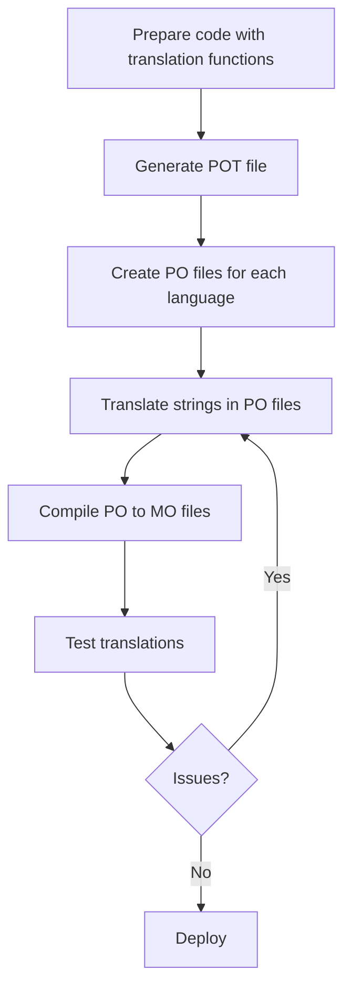

# WordPress Localization

## Introduction

In our increasingly connected world, making your WordPress themes and plugins accessible to global audiences is not just a nice-to-have feature—it's essential. WordPress Localization (L10n) is the process of adapting your WordPress project to different languages and regions, ensuring your content resonates with users worldwide.

Localization works hand-in-hand with Internationalization (I18n), which is the process of designing your code to be language-independent. Together, these practices enable WordPress sites to be translated and adapted for different cultures, languages, and regions without engineering changes.

In this guide, we'll explore the complete workflow for making your WordPress themes and plugins translation-ready.

## Why Localization Matters

Before diving into the technical aspects, let's understand why localization is crucial:

- **Global Reach**: Extend your audience beyond English-speaking users
- **User Experience**: Provide a more comfortable experience for non-native English speakers
- **Accessibility**: Make your content accessible to more people
- **SEO Benefits**: Improve search engine rankings in local markets
- **WordPress Core Value**: Contributing to WordPress's mission of democratizing publishing

## Understanding I18n and L10n

Let's clarify two terms you'll encounter frequently:

- **Internationalization (I18n)**: The process of developing your product so it can be adapted to various languages without engineering changes. The "18" represents the number of letters between 'i' and 'n' in "internationalization."

- **Localization (L10n)**: The actual adaptation of your product for a specific region or language. The "10" represents the number of letters between 'l' and 'n' in "localization."

Think of internationalization as preparing the soil and localization as planting region-specific seeds.

## Setting Up Your WordPress Project for Localization

### Step 1: Prepare Your Theme/Plugin

First, you need to load the text domain. The text domain is a unique identifier that ensures WordPress can distinguish between different themes and plugins when loading translations.

Add this to your main plugin file or theme's `functions.php`:

```php
function my_plugin_load_textdomain() {
    load_plugin_textdomain( 
        'my-plugin', 
        false, 
        dirname( plugin_basename( __FILE__ ) ) . '/languages/' 
    );
}
add_action( 'plugins_loaded', 'my_plugin_load_textdomain' );
```

For themes, use:

```php
function my_theme_load_textdomain() {
    load_theme_textdomain( 
        'my-theme', 
        get_template_directory() . '/languages' 
    );
}
add_action( 'after_setup_theme', 'my_theme_load_textdomain' );
```

### Step 2: Make Strings Translatable

WordPress provides several functions to make your strings translatable:

1. **Basic Translation**:

```php
// Before
echo "Welcome to my website";

// After
echo __( 'Welcome to my website', 'my-textdomain' );
```

2. **Echo Translation**:

```php
// Before
echo "Welcome to my website";

// After
_e( 'Welcome to my website', 'my-textdomain' );
```

3. **Translation with Variables**:

```php
// Before
echo "Hello, " . $name . "! You have " . $count . " new messages.";

// After
printf(
    /* translators: %1$s: user name, %2$d: message count */
    __( 'Hello, %1$s! You have %2$d new messages.', 'my-textdomain' ),
    $name,
    $count
);
```

4. **Singular/Plural Forms**:

```php
printf(
    /* translators: %d: number of comments */
    _n(
        'You have %d comment',
        'You have %d comments',
        $comment_count,
        'my-textdomain'
    ),
    $comment_count
);
```

### Step 3: Create a POT File

POT (Portable Object Template) files contain all translatable strings from your theme or plugin.

You can use tools like WP-CLI or Poedit to generate these files:

Using WP-CLI:

```bash
wp i18n make-pot /path/to/your/project /path/to/your/project/languages/my-textdomain.pot --domain=my-textdomain
```

### Step 4: Create Translation Files

From your POT file, you can create language-specific PO (Portable Object) files. For example, for Spanish, you'd create a file named `my-textdomain-es_ES.po`.

After editing the PO file with translations, you need to compile it into a machine-readable MO (Machine Object) file.

With Poedit, this is as simple as saving your PO file, which automatically generates the corresponding MO file.

## Real-world Implementation Example

Let's build a simple contact form plugin with localization support:

### 1. Plugin Structure

```
simple-contact-form/
├── languages/
│   └── simple-contact-form.pot
├── simple-contact-form.php
└── includes/
    └── form-template.php
```

### 2. Main Plugin File

```php
<?php
/*
Plugin Name: Simple Contact Form
Plugin URI: https://example.com/plugins/simple-contact-form
Description: A simple contact form with localization support
Version: 1.0.0
Author: Your Name
Text Domain: simple-contact-form
Domain Path: /languages
*/

// Load text domain for translations
function scf_load_textdomain() {
    load_plugin_textdomain(
        'simple-contact-form',
        false,
        dirname( plugin_basename( __FILE__ ) ) . '/languages/'
    );
}
add_action( 'plugins_loaded', 'scf_load_textdomain' );

// Include the form template
require_once plugin_dir_path( __FILE__ ) . 'includes/form-template.php';

// Register shortcode
function scf_contact_form_shortcode() {
    return scf_get_form_template();
}
add_shortcode( 'contact_form', 'scf_contact_form_shortcode' );
```

### 3. Form Template

```php
<?php
// Form template with localized strings
function scf_get_form_template() {
    ob_start();
    ?>
    <div class="contact-form-container">
        <h2><?php _e( 'Contact Us', 'simple-contact-form' ); ?></h2>
        
        <form method="post" action="">
            <div class="form-field">
                <label for="name">
                    <?php _e( 'Your Name', 'simple-contact-form' ); ?>
                </label>
                <input type="text" id="name" name="name" required>
            </div>
            
            <div class="form-field">
                <label for="email">
                    <?php _e( 'Email Address', 'simple-contact-form' ); ?>
                </label>
                <input type="email" id="email" name="email" required>
            </div>
            
            <div class="form-field">
                <label for="message">
                    <?php _e( 'Message', 'simple-contact-form' ); ?>
                </label>
                <textarea id="message" name="message" rows="5" required></textarea>
            </div>
            
            <button type="submit">
                <?php _e( 'Send Message', 'simple-contact-form' ); ?>
            </button>
            
            <p class="privacy-note">
                <?php
                printf(
                    /* translators: %s: link to privacy policy */
                    __( 'By submitting this form, you agree to our %s', 'simple-contact-form' ),
                    '<a href="#">' . __( 'Privacy Policy', 'simple-contact-form' ) . '</a>'
                );
                ?>
            </p>
        </form>
    </div>
    <?php
    return ob_get_clean();
}
```

### 4. Generating the POT File

Using WP-CLI:

```bash
wp i18n make-pot /path/to/simple-contact-form /path/to/simple-contact-form/languages/simple-contact-form.pot --domain=simple-contact-form
```

### 5. Creating a Spanish Translation

Create a file `simple-contact-form-es_ES.po` in the languages folder with the following translations:

```
msgid "Contact Us"
msgstr "Contáctenos"

msgid "Your Name"
msgstr "Su Nombre"

msgid "Email Address"
msgstr "Correo Electrónico"

msgid "Message"
msgstr "Mensaje"

msgid "Send Message"
msgstr "Enviar Mensaje"

msgid "By submitting this form, you agree to our %s"
msgstr "Al enviar este formulario, acepta nuestra %s"

msgid "Privacy Policy"
msgstr "Política de Privacidad"
```

After saving this as a PO file and compiling it to a MO file, WordPress will use these Spanish translations when the site language is set to Spanish.

## Best Practices for WordPress Localization

### 1. Context for Translators

Use translator comments to provide context:

```php
/* translators: %s: user name */
printf( __( 'Welcome back, %s!', 'my-textdomain' ), $user_name );
```

### 2. Avoid String Concatenation

Don't do this:
```php
// Bad practice - can't be properly translated
echo __( 'Welcome', 'my-textdomain' ) . ' ' . $user_name;
```

Do this instead:
```php
// Good practice
printf( __( 'Welcome %s', 'my-textdomain' ), $user_name );
```

### 3. Handle Plurals Properly

```php
printf(
    _n(
        '%d item in your cart',
        '%d items in your cart',
        $item_count,
        'my-textdomain'
    ),
    $item_count
);
```

### 4. Escape Translations

Always escape output:

```php
echo esc_html__( 'Welcome', 'my-textdomain' );
```

### 5. Text Domain Consistency

Use the same text domain throughout your theme or plugin.

## The Localization Workflow

Here's the typical workflow for WordPress localization:



## Advanced Localization Features

### Supporting Right-to-Left (RTL) Languages

WordPress automatically switches direction for RTL languages. To enhance RTL support in your themes:

1. Create an `rtl.css` file.
2. Use the `is_rtl()` function for conditional logic:

```php
if ( is_rtl() ) {
    // RTL-specific code
} else {
    // LTR-specific code
}
```

### Localizing JavaScript

WordPress provides a function called `wp_localize_script()` to make PHP variables available to JavaScript:

```php
wp_enqueue_script( 'my-script', 'path/to/script.js', array(), '1.0.0', true );

wp_localize_script( 
    'my-script',
    'myPluginVars',
    array(
        'ajaxUrl' => admin_url( 'admin-ajax.php' ),
        'welcomeText' => __( 'Welcome to our site!', 'my-textdomain' ),
        'errorMessage' => __( 'Something went wrong.', 'my-textdomain' )
    )
);
```

In your JavaScript file, you can access these variables:

```javascript
console.log(myPluginVars.welcomeText); // "Welcome to our site!"

// Display error if something fails
function showError() {
    alert(myPluginVars.errorMessage);
}
```

## Testing Your Translations

To test your translations:

1. Change your WordPress language in Settings > General.
2. Use a plugin like "Loco Translate" to test translations without changing site-wide settings.
3. Create a testing checklist to verify all translated elements.

## Summary

WordPress localization is a powerful way to make your themes and plugins accessible to a global audience. By properly internationalizing your code and creating translations, you can significantly expand your reach.

Key takeaways:
- Always use WordPress translation functions like `__()`, `_e()`, `_n()` etc.
- Provide context for translators with comments
- Generate POT files to make translation easier
- Test your translations thoroughly
- Consider RTL languages when designing layouts
- Don't forget to localize JavaScript strings

By embracing localization from the beginning of your development process, you'll create more inclusive and globally-friendly WordPress projects.

## Additional Resources

- [WordPress Developer Documentation on i18n](https://developer.wordpress.org/plugins/internationalization/)
- [Poedit Translation Editor](https://poedit.net/)
- [Loco Translate Plugin](https://wordpress.org/plugins/loco-translate/)
- [WP-CLI i18n commands](https://developer.wordpress.org/cli/commands/i18n/)

## Exercises

1. Convert a simple WordPress plugin to be translation-ready using the techniques described in this guide.
2. Create a POT file and translate a theme or plugin into your native language.
3. Practice using different translation functions (`__()`, `_e()`, `_n()`, etc.) in various contexts.
4. Add RTL support to a theme and test with languages like Arabic or Hebrew.
5. Create a multilingual form that validates user input in different languages.

By completing these exercises, you'll gain practical experience with WordPress localization that you can apply to all your future projects.