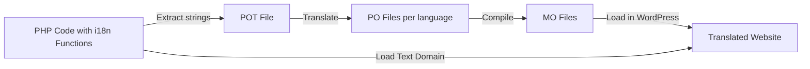

# WordPress Internationalization

## Introduction

Internationalization (often abbreviated as i18n - "i", 18 letters, "n") is the process of designing your WordPress themes and plugins so they can be easily translated into different languages. This is a crucial aspect of WordPress development if you want your product to reach a global audience.

In this guide, we'll learn how to internationalize WordPress themes and plugins, making them translation-ready. We'll explore WordPress's built-in functions for text translation, handle date/time formats, and understand the complete workflow from internationalization to localization.

## Why Internationalization Matters

WordPress powers over 40% of all websites on the internet, with users spanning the globe speaking hundreds of different languages. By internationalizing your WordPress products, you:

- Make your theme/plugin accessible to non-English speaking users
- Increase your potential market and user base
- Follow WordPress best practices and standards
- Demonstrate professionalism in your development approach

## The Difference Between i18n and l10n

Before diving deeper, let's clarify two commonly confused terms:

- **Internationalization (i18n)**: The process of preparing your code for translation (what developers do)
- **Localization (l10n)**: The actual translation process (what translators do)

As developers, our primary focus will be on internationalization - making our code ready for translation.

## WordPress Text Domain

A text domain is a unique identifier that ensures WordPress can distinguish between different translations. It's typically the name of your theme or plugin.

For example:

```php
// In a plugin called "awesome-plugin"
__('Welcome to my plugin', 'awesome-plugin');
```

The text domain should be:
- All lowercase
- Use hyphens between words
- Match your theme/plugin slug

## Basic Translation Functions

WordPress provides several functions for making strings translatable:

### 1. Basic Translation Functions

#### `__()` - Translate a string

```php
// Basic usage
$translated_text = __('Hello World', 'my-text-domain');
echo $translated_text;

// Output (before translation): Hello World
// Output (after Spanish translation): Hola Mundo
```

#### `_e()` - Translate and echo a string

```php
// This translates and immediately outputs the text
_e('Hello World', 'my-text-domain');

// Output (before translation): Hello World
// Output (after Spanish translation): Hola Mundo
```

### 2. Functions with Context

Sometimes, the same word in English might translate differently based on context. For these cases, use:

#### `_x()` - Translate with context

```php
// "Post" could be a noun or verb depending on context
$post_noun = _x('Post', 'noun', 'my-text-domain');
$post_verb = _x('Post', 'verb', 'my-text-domain'); 

echo $post_noun; // Might translate to "Article" in some languages
echo $post_verb; // Might translate to "Publish" in some languages
```

#### `_ex()` - Translate with context and echo

```php
_ex('Book', 'noun', 'my-text-domain'); // As in "a book to read"
_ex('Book', 'verb', 'my-text-domain'); // As in "to book a reservation"
```

### 3. Functions for Plurals

#### `_n()` - Singular and plural forms

```php
$count = 5;
printf(
    _n(
        'You have %d notification',
        'You have %d notifications',
        $count,
        'my-text-domain'
    ),
    $count
);

// Output (when $count = 1): You have 1 notification
// Output (when $count = 5): You have 5 notifications
```

#### `_nx()` - Singular and plural forms with context

```php
$count = 3;
printf(
    _nx(
        '%d comment',
        '%d comments',
        $count,
        'Comment count',
        'my-text-domain'
    ),
    $count
);
```

## Loading Text Domains

For WordPress to find your translations, you need to load your text domain:

### For Plugins

```php
function my_plugin_load_textdomain() {
    load_plugin_textdomain(
        'my-plugin', 
        false, 
        dirname(plugin_basename(__FILE__)) . '/languages/'
    );
}
add_action('plugins_loaded', 'my_plugin_load_textdomain');
```

### For Themes

```php
function my_theme_load_textdomain() {
    load_theme_textdomain(
        'my-theme', 
        get_template_directory() . '/languages'
    );
}
add_action('after_setup_theme', 'my_theme_load_textdomain');
```

## Escaping Translated Strings

Always escape output, even with translated text:

```php
// Correct usage for HTML output
echo esc_html__('Hello World', 'my-text-domain');

// For attributes
echo '<a title="' . esc_attr__('Visit Homepage', 'my-text-domain') . '">';

// For URLs
echo esc_url(__('https://example.com', 'my-text-domain'));
```

WordPress provides specific escaping functions for translations:

- `esc_html__()` and `esc_html_e()` - Escape and translate for HTML
- `esc_attr__()` and `esc_attr_e()` - Escape and translate for HTML attributes

## Internationalizing Variables

When working with variables in translatable strings, you have two approaches:

### Using printf() or sprintf()

```php
// Correct approach
$username = 'John';
printf(
    /* translators: %s: username */
    __('Welcome back, %s!', 'my-text-domain'), 
    $username
);

// Output: Welcome back, John!
```

### For multiple variables

```php
$first_name = 'John';
$last_name = 'Doe';
printf(
    /* translators: %1$s: first name, %2$s: last name */
    __('Welcome, %1$s %2$s!', 'my-text-domain'),
    $first_name,
    $last_name
);

// Output: Welcome, John Doe!
```

## Localizing JavaScript

For JavaScript files, you need to use the `wp_localize_script()` function:

```php
function my_enqueue_scripts() {
    wp_enqueue_script(
        'my-script',
        get_template_directory_uri() . '/js/script.js',
        array('jquery'),
        '1.0.0',
        true
    );
    
    wp_localize_script(
        'my-script',
        'myPluginL10n',
        array(
            'welcome' => __('Welcome to my website', 'my-text-domain'),
            'goodbye' => __('Thank you for visiting', 'my-text-domain'),
            'error' => __('An error occurred', 'my-text-domain'),
        )
    );
}
add_action('wp_enqueue_scripts', 'my_enqueue_scripts');
```

Then in your JavaScript file:

```javascript
// Using the localized strings
console.log(myPluginL10n.welcome);
alert(myPluginL10n.error);

// Output depends on the active language translation
```

## Date and Time Internationalization

WordPress handles date/time formatting based on the locale:

```php
// Outputs date formatted according to locale settings
echo date_i18n(
    get_option('date_format')
);

// Custom format based on locale
echo date_i18n(
    __('F j, Y', 'my-text-domain')
);
```

## Translation Ready Checklist

1. All user-facing strings are wrapped in translation functions
2. Text domain is properly defined and consistent
3. Text domain is loaded correctly
4. Translation files are in the correct directory
5. Comments for translators are added to complex strings
6. JavaScript strings are properly localized
7. Date/time strings use the `date_i18n()` function

## Creating POT Files

The POT (Portable Object Template) file is the template for translations. You can generate it using WP-CLI or tools like Poedit.

Using WP-CLI:

```bash
wp i18n make-pot /path/to/your/project /path/to/your/project/languages/my-text-domain.pot --domain=my-text-domain
```

## Real-world Example: Internationalizing a Contact Form

Let's see a complete example of internationalizing a simple contact form:

```php
/**
 * Display a contact form with internationalized strings
 */
function display_contact_form() {
    $output = '<form id="contact-form" method="post">';
    
    // Form title
    $output .= '<h2>' . esc_html__('Contact Us', 'my-text-domain') . '</h2>';
    
    // Name field
    $output .= '<div class="form-group">';
    $output .= '<label for="name">' . esc_html__('Your Name', 'my-text-domain') . '</label>';
    $output .= '<input type="text" id="name" name="name" required>';
    $output .= '</div>';
    
    // Email field
    $output .= '<div class="form-group">';
    $output .= '<label for="email">' . esc_html__('Your Email', 'my-text-domain') . '</label>';
    $output .= '<input type="email" id="email" name="email" required>';
    $output .= '</div>';
    
    // Message field
    $output .= '<div class="form-group">';
    $output .= '<label for="message">' . esc_html__('Your Message', 'my-text-domain') . '</label>';
    $output .= '<textarea id="message" name="message" rows="5" required></textarea>';
    $output .= '</div>';
    
    // Submit button with dynamic count
    $submissions = get_option('contact_form_submissions', 0);
    $output .= '<button type="submit">';
    $output .= sprintf(
        _n(
            'Send Message (%d submission today)',
            'Send Message (%d submissions today)',
            $submissions,
            'my-text-domain'
        ),
        $submissions
    );
    $output .= '</button>';
    
    $output .= '</form>';
    
    // Display terms notice with a link
    $output .= '<p class="form-notice">';
    $output .= sprintf(
        /* translators: %s: URL to terms page */
        __('By submitting this form, you agree to our <a href="%s">terms and conditions</a>.', 'my-text-domain'),
        esc_url(get_permalink(get_page_by_path('terms')))
    );
    $output .= '</p>';
    
    return $output;
}
```

## The Full Translation Process

Here's a visualization of the complete translation workflow:



## Summary

Internationalization is a crucial aspect of professional WordPress development. By following the practices outlined in this guide, you can ensure your themes and plugins are accessible to a global audience:

- Use WordPress translation functions like `__()` and `_e()`
- Always include a text domain with your translations
- Properly load the text domain in your theme or plugin
- Create translator comments for complex strings
- Use proper escaping functions for security
- Handle plurals with `_n()` and `_nx()`
- Localize JavaScript strings using `wp_localize_script()`
- Use `date_i18n()` for date and time formatting

By making internationalization a standard part of your development workflow, you'll create more inclusive and globally accessible WordPress products.

## Additional Resources

- [WordPress Developer Documentation on i18n](https://developer.wordpress.org/plugins/internationalization/)
- [WordPress Coding Standards: Internationalization](https://make.wordpress.org/core/handbook/best-practices/internationalization/)
- [Poedit](https://poedit.net/) - A popular translation file editor
- [Loco Translate](https://wordpress.org/plugins/loco-translate/) - WordPress plugin for translation

## Exercises

1. Take an existing plugin or theme and identify all user-facing strings that should be internationalized.
2. Create a simple plugin with internationalized strings and generate the POT file.
3. Create translations for your plugin in at least one language.
4. Practice using different translation functions like `_n()` and `_x()` to understand their practical applications.
5. Internationalize a JavaScript file and test it with different language settings.