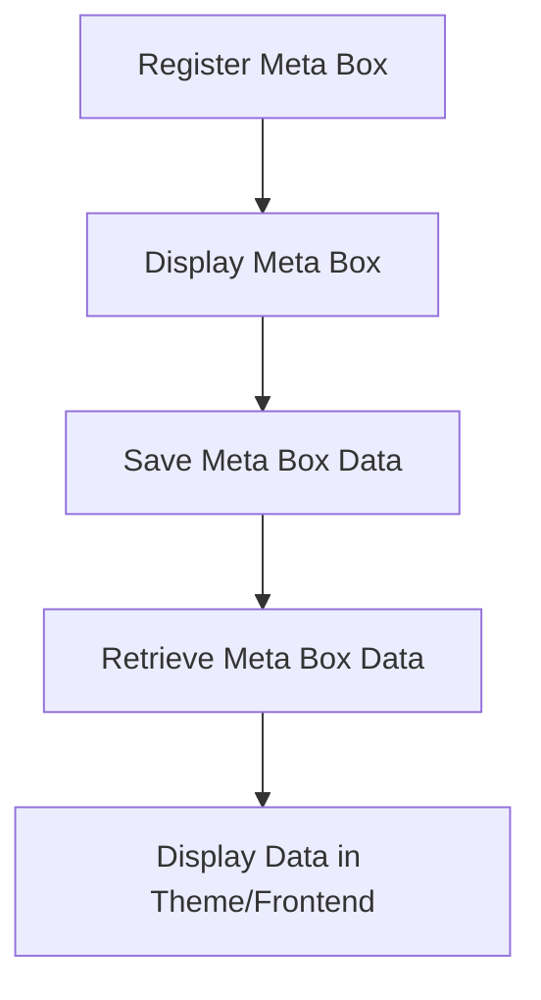

# WordPress Meta Boxes

## Introduction

Meta boxes are an essential feature of the WordPress admin interface that allow developers to add custom sections to the edit screens of posts, pages, or custom post types. These boxes contain form elements that enable users to enter additional data associated with content, which gets stored as post meta data in the database.

If you've ever worked with the WordPress editor, you've already seen meta boxes in action - the Categories, Tags, Featured Image, and Publish sections are all examples of native WordPress meta boxes.

In this tutorial, you'll learn how to create custom meta boxes from scratch, save and retrieve the data they collect, and implement them in real-world scenarios to enhance your WordPress projects.

## Why Use Meta Boxes?

Meta boxes provide several benefits:

- They extend WordPress content with custom fields
- They offer a user-friendly interface for clients to input data
- They store data in a structured format that's easy to retrieve
- They integrate seamlessly with WordPress's administrative interface
- They can be restricted to specific user roles

## Understanding Meta Box Architecture

Meta boxes in WordPress follow a specific registration pattern and lifecycle:



Let's break down this process into manageable steps.

## Step 1: Registering a Meta Box

To create a meta box, we use the `add_meta_box()` function. This function should be called during the `add_meta_boxes` action hook.

Here's the basic structure:

```php
function prefix_add_custom_meta_box() {
    add_meta_box(
        'prefix_custom_meta_box',           // Unique ID
        'Custom Meta Box',                  // Box title
        'prefix_custom_meta_box_callback',  // Content callback function
        'post',                             // Post type
        'normal',                           // Context (normal, side, advanced)
        'high'                              // Priority (high, core, default, low)
    );
}
add_action('add_meta_boxes', 'prefix_add_custom_meta_box');
```

The `add_meta_box()` function accepts six parameters:

1. **ID** - A unique identifier for your meta box
2. **Title** - The title displayed at the top of the meta box
3. **Callback** - The function that outputs the content of the meta box
4. **Screen** - The post type(s) to add the meta box to
5. **Context** - The part of the page where the meta box should be shown
6. **Priority** - The priority within the context where the box should be shown

## Step 2: Creating the Meta Box Content

Next, we need to define the callback function that will render the content inside our meta box:

```php
function prefix_custom_meta_box_callback($post) {
    // Add a nonce field for security
    wp_nonce_field('prefix_save_meta_box_data', 'prefix_meta_box_nonce');

    // Retrieve existing value from the database
    $value = get_post_meta($post->ID, '_prefix_custom_meta_value', true);

    // Output the field
    ?>
    <label for="prefix_custom_field">Description for this field:</label>
    <input type="text" id="prefix_custom_field" name="prefix_custom_field" 
           value="<?php echo esc_attr($value); ?>" size="25" />
    <?php
}
```

In this function:

1. We create a security nonce field to verify the request later
2. We retrieve any existing meta data for this post
3. We output HTML for the form fields

## Step 3: Saving the Meta Box Data

When a post is saved, we need to save our custom meta data. We do this by hooking into the `save_post` action:

```php
function prefix_save_meta_box_data($post_id) {
    // Check if our nonce is set and verify it
    if (!isset($_POST['prefix_meta_box_nonce']) || 
        !wp_verify_nonce($_POST['prefix_meta_box_nonce'], 'prefix_save_meta_box_data')) {
        return;
    }

    // Check if this is an autosave
    if (defined('DOING_AUTOSAVE') && DOING_AUTOSAVE) {
        return;
    }

    // Check user permissions
    if (isset($_POST['post_type']) && 'post' === $_POST['post_type']) {
        if (!current_user_can('edit_post', $post_id)) {
            return;
        }
    }

    // Check if our custom field is set and sanitize the input
    if (isset($_POST['prefix_custom_field'])) {
        $custom_data = sanitize_text_field($_POST['prefix_custom_field']);
        
        // Update the meta field
        update_post_meta($post_id, '_prefix_custom_meta_value', $custom_data);
    }
}
add_action('save_post', 'prefix_save_meta_box_data');
```

Important security measures in this function:
- We verify the nonce to ensure the request came from the expected page
- We check if this is an autosave to avoid duplicate processing
- We verify the current user has proper permissions
- We sanitize the input data before saving it

## Step 4: Retrieving and Using Meta Box Data

To retrieve and display the saved meta data on the frontend or elsewhere in your theme:

```php
function prefix_display_custom_meta_data() {
    global $post;
    
    $custom_value = get_post_meta($post->ID, '_prefix_custom_meta_value', true);
    
    if (!empty($custom_value)) {
        echo '<div class="custom-meta-data">';
        echo esc_html($custom_value);
        echo '</div>';
    }
}
```

## Creating Complex Meta Boxes

For more complex applications, you might want to include different types of fields within a single meta box. Here's an expanded example:

```php
function prefix_complex_meta_box_callback($post) {
    wp_nonce_field('prefix_save_complex_meta', 'prefix_complex_meta_nonce');
    
    // Get saved values
    $text_value = get_post_meta($post->ID, '_prefix_text_value', true);
    $select_value = get_post_meta($post->ID, '_prefix_select_value', true);
    $checkbox_value = get_post_meta($post->ID, '_prefix_checkbox_value', true);
    
    ?>
    <div class="meta-row">
        <div class="meta-th">
            <label for="prefix_text_field">Text Field</label>
        </div>
        <div class="meta-td">
            <input type="text" id="prefix_text_field" name="prefix_text_field" 
                   value="<?php echo esc_attr($text_value); ?>">
        </div>
    </div>
    
    <div class="meta-row">
        <div class="meta-th">
            <label for="prefix_select_field">Select Option</label>
        </div>
        <div class="meta-td">
            <select id="prefix_select_field" name="prefix_select_field">
                <option value="">Select an option</option>
                <option value="option1" <?php selected($select_value, 'option1'); ?>>Option 1</option>
                <option value="option2" <?php selected($select_value, 'option2'); ?>>Option 2</option>
                <option value="option3" <?php selected($select_value, 'option3'); ?>>Option 3</option>
            </select>
        </div>
    </div>
    
    <div class="meta-row">
        <div class="meta-th">
            <label for="prefix_checkbox_field">Checkbox Field</label>
        </div>
        <div class="meta-td">
            <input type="checkbox" id="prefix_checkbox_field" name="prefix_checkbox_field" 
                   value="yes" <?php checked($checkbox_value, 'yes'); ?>>
            <span class="description">Check this box if you want to enable this feature</span>
        </div>
    </div>
    
    <style>
        .meta-row {
            margin-bottom: 15px;
        }
        .meta-th {
            margin-bottom: 5px;
            font-weight: bold;
        }
        .meta-td {
            margin-left: 10px;
        }
        .description {
            font-style: italic;
            color: #777;
            font-size: 0.9em;
        }
    </style>
    <?php
}
```

And here's how you would save this complex data:

```php
function prefix_save_complex_meta_data($post_id) {
    // Security checks (same as before)
    if (!isset($_POST['prefix_complex_meta_nonce']) || 
        !wp_verify_nonce($_POST['prefix_complex_meta_nonce'], 'prefix_save_complex_meta')) {
        return;
    }
    
    if (defined('DOING_AUTOSAVE') && DOING_AUTOSAVE) {
        return;
    }
    
    if (!current_user_can('edit_post', $post_id)) {
        return;
    }
    
    // Save text field
    if (isset($_POST['prefix_text_field'])) {
        $text_value = sanitize_text_field($_POST['prefix_text_field']);
        update_post_meta($post_id, '_prefix_text_value', $text_value);
    }
    
    // Save select field
    if (isset($_POST['prefix_select_field'])) {
        $select_value = sanitize_text_field($_POST['prefix_select_field']);
        update_post_meta($post_id, '_prefix_select_value', $select_value);
    }
    
    // Save checkbox field
    $checkbox_value = isset($_POST['prefix_checkbox_field']) ? 'yes' : 'no';
    update_post_meta($post_id, '_prefix_checkbox_value', $checkbox_value);
}
add_action('save_post', 'prefix_save_complex_meta_data');
```

## Real-World Example: Product Specifications Meta Box

Let's create a practical example that you might use in a real project - a meta box for adding product specifications to a "product" custom post type:

```php
function product_specs_meta_box() {
    add_meta_box(
        'product_specs_meta',
        'Product Specifications',
        'product_specs_callback',
        'product',  // Assumes you have a 'product' post type
        'normal',
        'high'
    );
}
add_action('add_meta_boxes', 'product_specs_meta_box');

function product_specs_callback($post) {
    wp_nonce_field('save_product_specs', 'product_specs_nonce');
    
    // Get saved values
    $specs = get_post_meta($post->ID, '_product_specifications', true);
    
    if (!is_array($specs)) {
        $specs = array(
            array('name' => '', 'value' => '')
        );
    }
    
    ?>
    <div id="product_specs_container">
        <?php foreach ($specs as $index => $spec) : ?>
            <div class="spec-row" data-index="<?php echo esc_attr($index); ?>">
                <input type="text" name="product_specs[<?php echo esc_attr($index); ?>][name]" 
                       placeholder="Specification name" 
                       value="<?php echo esc_attr($spec['name']); ?>" />
                       
                <input type="text" name="product_specs[<?php echo esc_attr($index); ?>][value]" 
                       placeholder="Specification value" 
                       value="<?php echo esc_attr($spec['value']); ?>" />
                       
                <button type="button" class="remove-spec button">Remove</button>
            </div>
        <?php endforeach; ?>
    </div>
    
    <button type="button" id="add-spec" class="button">Add Specification</button>
    
    <style>
        .spec-row {
            margin-bottom: 10px;
            display: flex;
            align-items: center;
        }
        .spec-row input {
            margin-right: 10px;
            width: 40%;
        }
    </style>
    
    <script>
        jQuery(document).ready(function($) {
            var container = $('#product_specs_container');
            var nextIndex = <?php echo count($specs); ?>;
            
            $('#add-spec').on('click', function() {
                var newRow = $('<div class="spec-row" data-index="' + nextIndex + '">' +
                    '<input type="text" name="product_specs[' + nextIndex + '][name]" placeholder="Specification name" />' +
                    '<input type="text" name="product_specs[' + nextIndex + '][value]" placeholder="Specification value" />' +
                    '<button type="button" class="remove-spec button">Remove</button>' +
                '</div>');
                
                container.append(newRow);
                nextIndex++;
            });
            
            $(document).on('click', '.remove-spec', function() {
                $(this).closest('.spec-row').remove();
            });
        });
    </script>
    <?php
}

function save_product_specs($post_id) {
    // Security checks
    if (!isset($_POST['product_specs_nonce']) || 
        !wp_verify_nonce($_POST['product_specs_nonce'], 'save_product_specs')) {
        return;
    }
    
    if (defined('DOING_AUTOSAVE') && DOING_AUTOSAVE) {
        return;
    }
    
    if (!current_user_can('edit_post', $post_id)) {
        return;
    }
    
    // Save specifications
    if (isset($_POST['product_specs']) && is_array($_POST['product_specs'])) {
        $specs = array();
        
        foreach ($_POST['product_specs'] as $spec) {
            if (!empty($spec['name']) && !empty($spec['value'])) {
                $specs[] = array(
                    'name' => sanitize_text_field($spec['name']),
                    'value' => sanitize_text_field($spec['value'])
                );
            }
        }
        
        update_post_meta($post_id, '_product_specifications', $specs);
    }
}
add_action('save_post', 'save_product_specs');
```

To display these specifications on the frontend:

```php
function display_product_specs() {
    global $post;
    
    if ('product' !== get_post_type()) {
        return;
    }
    
    $specs = get_post_meta($post->ID, '_product_specifications', true);
    
    if (!empty($specs) && is_array($specs)) {
        echo '<div class="product-specifications">';
        echo '<h3>Product Specifications</h3>';
        echo '<table class="specs-table">';
        
        foreach ($specs as $spec) {
            echo '<tr>';
            echo '<th>' . esc_html($spec['name']) . '</th>';
            echo '<td>' . esc_html($spec['value']) . '</td>';
            echo '</tr>';
        }
        
        echo '</table>';
        echo '</div>';
    }
}
```

## Best Practices for Meta Boxes

1. **Use unique prefixes** for all functions, meta keys, and IDs to avoid conflicts with other plugins
2. **Always validate and sanitize data** before saving it to the database
3. **Include nonce fields** to verify the request source
4. **Check user permissions** to ensure security
5. **Use descriptive labels** and help text to guide users
6. **Group related meta fields** into a single meta box for better usability
7. **Use appropriate field types** for different data types (e.g., date pickers for dates)
8. **Write efficient queries** when retrieving meta data on the frontend

## Enhancing Meta Boxes with CSS and JavaScript

To make your meta boxes more user-friendly, consider adding custom CSS and JavaScript. Here's a simplified example:

```php
function prefix_enqueue_meta_box_scripts($hook) {
    global $post;
    
    // Only enqueue on post edit screens
    if (!('post.php' === $hook || 'post-new.php' === $hook)) {
        return;
    }
    
    // Only for specific post types
    if ('your_post_type' !== get_post_type($post)) {
        return;
    }
    
    // Enqueue your scripts and styles
    wp_enqueue_script(
        'prefix-meta-script',
        get_template_directory_uri() . '/js/meta-box.js', 
        array('jquery', 'jquery-ui-datepicker'),
        '1.0.0',
        true
    );
    
    wp_enqueue_style(
        'prefix-meta-style',
        get_template_directory_uri() . '/css/meta-box.css'
    );
}
add_action('admin_enqueue_scripts', 'prefix_enqueue_meta_box_scripts');
```

## Summary

Meta boxes are a powerful feature in WordPress that allow developers to extend the content management system with custom fields and data structures. By following these steps, you can create meta boxes that enhance the editing experience and provide structured data for your themes and plugins.

Key points covered in this tutorial:
- Registering custom meta boxes with `add_meta_box()`
- Creating callback functions to display meta box content
- Saving meta box data securely with proper validation
- Retrieving and displaying meta data in your themes
- Creating complex meta boxes with multiple field types
- Building a real-world example of a product specifications meta box

## Additional Resources and Exercises

### Resources
- [WordPress Developer Documentation on Meta Boxes](https://developer.wordpress.org/plugins/metadata/custom-meta-boxes/)
- [WordPress Code Reference for add_meta_box()](https://developer.wordpress.org/reference/functions/add_meta_box/)
- [WordPress Code Reference for update_post_meta()](https://developer.wordpress.org/reference/functions/update_post_meta/)

### Exercises

1. **Basic Exercise**: Create a simple meta box for posts that allows users to add a "Featured Quote" to be displayed prominently in your theme.

2. **Intermediate Exercise**: Build a "Related Content" meta box that lets editors manually select related posts from a list of checkboxes.

3. **Advanced Exercise**: Create a "Location" meta box that integrates with the Google Maps API to let users select a location on a map, storing the latitude and longitude coordinates as meta data.

4. **Challenge Exercise**: Build a reusable meta box class that can be configured with different field types and automatically handles saving and retrieving the data.

By mastering meta boxes, you'll be able to create more tailored and functional WordPress sites that precisely meet your clients' content management needs.