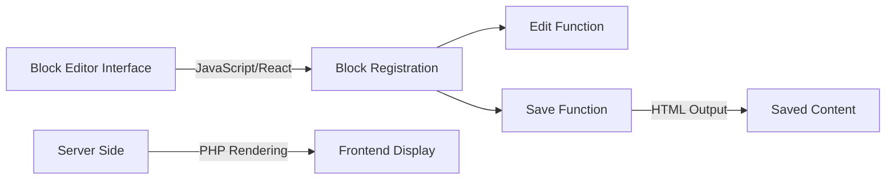
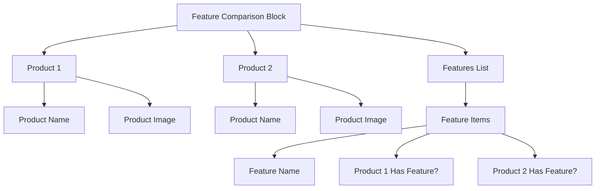

# WordPress Custom Blocks

## Introduction

WordPress introduced the Gutenberg editor in version 5.0, revolutionizing the content creation process with a block-based approach. While WordPress comes with many built-in blocks, creating custom blocks allows developers to extend the editor's functionality with tailored solutions for specific needs.

Custom blocks empower content creators with specialized components that maintain consistency across the site while providing flexible content management options. Whether you need a unique testimonial display, a custom call-to-action, or an interactive data visualization, custom blocks make it possible.

In this guide, we'll explore how to create custom Gutenberg blocks, from the essential concepts to practical implementations you can use in your WordPress projects.

## Prerequisites

Before diving into custom block development, ensure you have:

- Basic knowledge of WordPress development
- Familiarity with JavaScript (particularly ES6+)
- Understanding of React basics
- Node.js and npm installed on your development machine
- A local WordPress development environment

## Understanding Block Architecture

Gutenberg blocks are built primarily with JavaScript (specifically React) for the editor interface, while the server-side rendering typically uses PHP. This separation creates a dynamic editing experience while ensuring proper content display for site visitors.



### Key Components of a Block

1. **Block Registration**: Defines block attributes, category, and metadata
2. **Edit Function**: Controls how the block appears in the editor
3. **Save Function**: Determines the HTML saved to the database
4. **Block.json**: Defines block settings and metadata (Block API v2)

## Setting Up Your Development Environment

Let's create a simple plugin to house our custom blocks:

1. Create a new directory in your WordPress plugins folder:

```bash
cd wp-content/plugins
mkdir my-custom-blocks
cd my-custom-blocks
```

2. Initialize a new npm project:

```bash
npm init -y
```

3. Install required dependencies:

```bash
npm install @wordpress/scripts --save-dev
```

4. Set up your `package.json` script commands:

```json
"scripts": {
  "start": "wp-scripts start",
  "build": "wp-scripts build"
}
```

5. Create the main plugin file:

```php
<?php
/**
 * Plugin Name: My Custom Blocks
 * Description: A collection of custom Gutenberg blocks
 * Version: 1.0.0
 * Author: Your Name
 */

// Exit if accessed directly
if (!defined('ABSPATH')) {
    exit;
}

// Register block category
function my_custom_block_category($categories) {
    return array_merge(
        $categories,
        [
            [
                'slug' => 'my-custom-blocks',
                'title' => 'My Custom Blocks',
            ],
        ]
    );
}
add_filter('block_categories_all', 'my_custom_block_category');

// Register blocks
function my_custom_blocks_register() {
    // Check if Gutenberg exists
    if (!function_exists('register_block_type')) {
        return;
    }
    
    // Register script
    wp_register_script(
        'my-custom-blocks',
        plugins_url('build/index.js', __FILE__),
        ['wp-blocks', 'wp-element', 'wp-editor', 'wp-components'],
        filemtime(plugin_dir_path(__FILE__) . 'build/index.js')
    );
    
    // Register block
    register_block_type('my-custom-blocks/testimonial', [
        'editor_script' => 'my-custom-blocks',
    ]);
}
add_action('init', 'my_custom_blocks_register');
```

## Creating Your First Custom Block

Let's create a simple testimonial block as our first custom block. This will showcase most of the core concepts.

### Directory Structure

First, let's set up our directory structure:

```
my-custom-blocks/
├── build/
├── src/
│   ├── index.js
│   ├── testimonial/
│   │   ├── index.js
│   │   ├── edit.js
│   │   ├── save.js
│   │   ├── block.json
│   │   └── style.scss
├── package.json
└── my-custom-blocks.php
```

### Block Registration

Create the `src/index.js` file:

```javascript
import { registerBlockType } from '@wordpress/blocks';

// Import block files
import * as testimonial from './testimonial';

// Register blocks
const blocks = [
    testimonial,
];

// Register each block
blocks.forEach(block => {
    if (!block) return;
    const { metadata, settings, name } = block;
    registerBlockType(name, {
        ...metadata,
        ...settings,
    });
});
```

### Block Definition

Now, let's create our testimonial block. First, the `block.json` file in `src/testimonial/block.json`:

```json
{
  "$schema": "https://schemas.wp.org/trunk/block.json",
  "apiVersion": 2,
  "name": "my-custom-blocks/testimonial",
  "title": "Testimonial",
  "category": "my-custom-blocks",
  "icon": "format-quote",
  "description": "Display a customer testimonial with citation",
  "keywords": ["testimonial", "quote", "review"],
  "version": "1.0.0",
  "textdomain": "my-custom-blocks",
  "attributes": {
    "quote": {
      "type": "string",
      "source": "html",
      "selector": ".testimonial-quote"
    },
    "author": {
      "type": "string",
      "source": "html",
      "selector": ".testimonial-author"
    },
    "backgroundColor": {
      "type": "string",
      "default": "#f5f5f5"
    },
    "textColor": {
      "type": "string",
      "default": "#333333"
    }
  },
  "supports": {
    "html": false
  },
  "editorScript": "file:./index.js",
  "style": "file:./style.css"
}
```

Now, let's create the `src/testimonial/index.js` file:

```javascript
import { registerBlockType } from '@wordpress/blocks';
import metadata from './block.json';
import Edit from './edit';
import Save from './save';
import './style.scss';

// Export block name
export const name = metadata.name;

// Export block metadata
export { metadata };

// Export block settings
export const settings = {
    edit: Edit,
    save: Save,
};
```

### Edit Component

Create the `src/testimonial/edit.js` file:

```javascript
import { __ } from '@wordpress/i18n';
import { 
    useBlockProps, 
    RichText, 
    InspectorControls 
} from '@wordpress/block-editor';
import { 
    PanelBody, 
    ColorPicker 
} from '@wordpress/components';

export default function Edit({ attributes, setAttributes }) {
    const { quote, author, backgroundColor, textColor } = attributes;
    
    const blockProps = useBlockProps({
        style: {
            backgroundColor: backgroundColor,
            color: textColor,
            padding: '20px',
            borderRadius: '5px',
            marginBottom: '20px'
        }
    });
    
    return (
        <>
            <InspectorControls>
                <PanelBody title={__('Appearance Settings', 'my-custom-blocks')}>
                    <div className="wp-block-my-custom-blocks-color-settings">
                        <p>{__('Background Color', 'my-custom-blocks')}</p>
                        <ColorPicker
                            color={backgroundColor}
                            onChangeComplete={(color) => {
                                setAttributes({ backgroundColor: color.hex });
                            }}
                        />
                        <p>{__('Text Color', 'my-custom-blocks')}</p>
                        <ColorPicker
                            color={textColor}
                            onChangeComplete={(color) => {
                                setAttributes({ textColor: color.hex });
                            }}
                        />
                    </div>
                </PanelBody>
            </InspectorControls>
            
            <div {...blockProps}>
                <RichText
                    tagName="blockquote"
                    className="testimonial-quote"
                    value={quote}
                    onChange={(quote) => setAttributes({ quote })}
                    placeholder={__('Write testimonial text here...', 'my-custom-blocks')}
                />
                <RichText
                    tagName="cite"
                    className="testimonial-author"
                    value={author}
                    onChange={(author) => setAttributes({ author })}
                    placeholder={__('Author name', 'my-custom-blocks')}
                />
            </div>
        </>
    );
}
```

### Save Component

Create the `src/testimonial/save.js` file:

```javascript
import { useBlockProps, RichText } from '@wordpress/block-editor';

export default function Save({ attributes }) {
    const { quote, author, backgroundColor, textColor } = attributes;
    
    const blockProps = useBlockProps.save({
        style: {
            backgroundColor: backgroundColor,
            color: textColor,
            padding: '20px',
            borderRadius: '5px',
            marginBottom: '20px'
        },
        className: 'testimonial-block'
    });
    
    return (
        <div {...blockProps}>
            <RichText.Content 
                tagName="blockquote" 
                className="testimonial-quote" 
                value={quote} 
            />
            <RichText.Content 
                tagName="cite" 
                className="testimonial-author" 
                value={author} 
            />
        </div>
    );
}
```

### Style File

Create the `src/testimonial/style.scss` file:

```scss
.wp-block-my-custom-blocks-testimonial {
    margin: 0 0 1.5em;
    
    blockquote.testimonial-quote {
        font-size: 1.2em;
        line-height: 1.6;
        margin: 0 0 12px;
        position: relative;
        
        &:before {
            content: '\201C';
            font-size: 3em;
            position: absolute;
            left: -0.5em;
            top: -0.5em;
            opacity: 0.2;
        }
    }
    
    cite.testimonial-author {
        display: block;
        font-style: italic;
        text-align: right;
        font-size: 0.9em;
        
        &:before {
            content: '— ';
        }
    }
}
```

## Building and Using Your Block

1. Build your block for development:

```bash
npm run start
```

2. For production build:

```bash
npm run build
```

3. Activate your plugin in WordPress

4. In the WordPress editor, you'll now see your custom testimonial block in the "My Custom Blocks" category

## Advanced Block Techniques

### Server-Side Rendering

For dynamic content that needs PHP processing, use server-side rendering:

```php
// In your main plugin file
register_block_type('my-custom-blocks/dynamic-block', [
    'editor_script' => 'my-custom-blocks',
    'render_callback' => 'my_dynamic_block_render',
    'attributes' => [
        'content' => [
            'type' => 'string',
            'default' => ''
        ]
    ]
]);

function my_dynamic_block_render($attributes) {
    // Process dynamic content here
    $content = !empty($attributes['content']) ? $attributes['content'] : '';
    $current_date = date('F j, Y');
    
    return sprintf(
        '<div class="dynamic-block"><p>%s</p><p>Current date: %s</p></div>',
        esc_html($content),
        esc_html($current_date)
    );
}
```

The JavaScript side would need an edit component but could have an empty save function since rendering is handled by PHP.

### Block Transforms

Enable users to transform between different blocks:

```javascript
import { createBlock } from '@wordpress/blocks';

// Add to your block's settings
transforms: {
    from: [
        {
            type: 'block',
            blocks: ['core/paragraph'],
            transform: ({ content }) => {
                return createBlock('my-custom-blocks/testimonial', {
                    quote: content,
                    author: ''
                });
            },
        },
    ],
    to: [
        {
            type: 'block',
            blocks: ['core/paragraph'],
            transform: ({ quote, author }) => {
                return createBlock('core/paragraph', {
                    content: quote + ' — ' + author
                });
            },
        },
    ],
},
```

### Custom Block Patterns

Combine your blocks into reusable patterns:

```php
// Register a pattern in your plugin
function register_testimonial_pattern() {
    register_block_pattern(
        'my-custom-blocks/testimonial-group',
        array(
            'title'       => __('Testimonial Group', 'my-custom-blocks'),
            'description' => __('A group of three testimonials in a row', 'my-custom-blocks'),
            'categories'  => array('testimonials'),
            'content'     => '<!-- wp:columns -->
                <div class="wp-block-columns">
                <!-- wp:column -->
                <div class="wp-block-column">
                <!-- wp:my-custom-blocks/testimonial {"backgroundColor":"#eef9ff","textColor":"#333333"} -->
                <div class="wp-block-my-custom-blocks-testimonial testimonial-block" style="background-color:#eef9ff;color:#333333;padding:20px;border-radius:5px;margin-bottom:20px">
                <blockquote class="testimonial-quote">The product exceeded our expectations. Would highly recommend!</blockquote>
                <cite class="testimonial-author">John Smith, CEO</cite></div>
                <!-- /wp:my-custom-blocks/testimonial --></div>
                <!-- /wp:column -->
                <!-- wp:column -->
                <div class="wp-block-column">
                <!-- wp:my-custom-blocks/testimonial {"backgroundColor":"#f5fff0","textColor":"#333333"} -->
                <div class="wp-block-my-custom-blocks-testimonial testimonial-block" style="background-color:#f5fff0;color:#333333;padding:20px;border-radius:5px;margin-bottom:20px">
                <blockquote class="testimonial-quote">Customer service was outstanding and the quality was superb.</blockquote>
                <cite class="testimonial-author">Jane Doe, Marketing</cite></div>
                <!-- /wp:my-custom-blocks/testimonial --></div>
                <!-- /wp:column -->
                <!-- wp:column -->
                <div class="wp-block-column">
                <!-- wp:my-custom-blocks/testimonial {"backgroundColor":"#fff5f5","textColor":"#333333"} -->
                <div class="wp-block-my-custom-blocks-testimonial testimonial-block" style="background-color:#fff5f5;color:#333333;padding:20px;border-radius:5px;margin-bottom:20px">
                <blockquote class="testimonial-quote">I've been using this for years and it never disappoints.</blockquote>
                <cite class="testimonial-author">Alex Johnson, Designer</cite></div>
                <!-- /wp:my-custom-blocks/testimonial --></div>
                <!-- /wp:column -->
                </div>
                <!-- /wp:columns -->',
        )
    );
}
add_action('init', 'register_testimonial_pattern');
```

## Real-World Example: Feature Comparison Block

Let's create a more complex block for comparing product features:

### Block Structure



### Implementation

This is a more advanced block that would have:

1. Multiple products to compare
2. Dynamic feature rows
3. Inner blocks for nested content
4. Custom controls for feature toggles

While this is a more complex block, the principles are the same as our testimonial example. You'd have:

1. A block registration with attributes for products and features
2. Edit components that handle the UI for entering comparison data
3. Save function that outputs the formatted comparison table

## Best Practices for Custom Blocks

1. **Follow Block Guidelines**: Adhere to WordPress design patterns for consistent UX
2. **Optimize for Accessibility**: Ensure blocks are accessible to all users
3. **Add Block Transforms**: Allow conversion between compatible block types
4. **Use Block Variations**: Create variations instead of multiple similar blocks
5. **Provide Clear Documentation**: Help users understand your block's purpose and options
6. **Test Thoroughly**: Verify blocks work in various themes and with other plugins
7. **Localize Your Block**: Make your block translatable with WordPress i18n tools

## Common Pitfalls and Solutions

### Block Not Appearing in Editor
- Check if your block is properly registered
- Verify that build script is working correctly
- Check browser console for JavaScript errors

### Edit View Differs from Frontend
- Ensure your save component outputs compatible HTML
- Add proper editor styles that match frontend appearance

### Block Validation Errors
- Make sure save function output is deterministic
- Use attributes for dynamic content, not props
- Keep edit and save component outputs consistent

## Summary

Custom Gutenberg blocks provide a powerful way to extend WordPress with tailored content components. By understanding the block architecture and following the patterns outlined in this guide, you can create blocks that enhance content creation while maintaining a seamless user experience.

In this guide, we've covered:

1. Setting up a development environment for block creation
2. Creating a basic testimonial block
3. Implementing advanced block features
4. Following best practices for block development
5. Solving common block development challenges

Custom blocks represent the future of WordPress content management, enabling rich, interactive experiences while keeping content structured and semantically meaningful.

## Additional Resources

- [Official Block Editor Handbook](https://developer.wordpress.org/block-editor/)
- [WordPress Gutenberg Examples](https://github.com/WordPress/gutenberg-examples)
- [Block API Reference](https://developer.wordpress.org/block-editor/reference-guides/block-api/block-registration/)

## Exercises

1. Modify the testimonial block to include an optional avatar image
2. Create a "Call to Action" block with customizable button and background
3. Build a block that displays recent posts from a specific category
4. Create a block with inner blocks to make a custom layout container
5. Build a block that integrates with a third-party API to display dynamic content

By working through these exercises, you'll develop practical skills in custom block development and be ready to create tailored solutions for your WordPress projects.