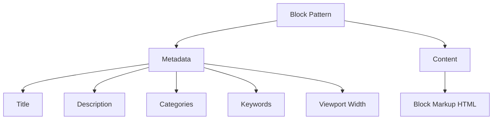

# WordPress Block Patterns

## Introduction

WordPress Block Patterns are pre-designed arrangements of blocks that can be inserted into your content with a single click. They allow users to quickly build complex layouts without having to create them from scratch each time. Introduced in WordPress 5.5, block patterns are a powerful feature for both developers and content creators, enabling:

- Design consistency across a website
- Efficiency in content creation
- Reduced learning curve for complex layouts
- Enhanced user experience for site editors

In this guide, we'll cover everything you need to know about WordPress Block Patterns, from understanding their structure to creating, registering, and organizing your own patterns for theme development or client projects.

## Understanding Block Patterns

Block patterns are essentially saved configurations of Gutenberg blocks that can be reused throughout a website. Think of them as "templates" for specific content sections like headers, testimonials, pricing tables, or call-to-action sections.

### Block Patterns vs. Reusable Blocks

Before diving deeper, it's important to understand the difference between block patterns and reusable blocks:

| Feature | Block Patterns | Reusable Blocks |
|---------|---------------|----------------|
| Purpose | Templates for new content | Synchronize identical content |
| Editing | Independent after insertion | Global changes affect all instances |
| Storage | Part of theme/plugin | Stored in database as posts |
| Creation | Developer-focused | User-focused |
| Use case | Consistent layouts | Repeated exact content |

## Block Pattern Structure

At its core, a block pattern is defined by two main components:

1. **Pattern metadata** - Information about the pattern (title, description, categories, etc.)
2. **Pattern content** - The actual block markup in HTML format

Here's a simplified representation of how a block pattern is structured:



## Creating Your First Block Pattern

Creating a block pattern involves two main steps:

1. Design the pattern using the block editor
2. Register the pattern in your theme or plugin

### Step 1: Design Your Pattern

The easiest way to create a block pattern is to build it directly in the WordPress editor.

1. Create a new post or page
2. Add and configure the blocks as desired
3. Select all blocks that should be part of your pattern
4. Click the "More options" menu (three dots) and select "Copy"

Now you have the HTML markup for your pattern in your clipboard.

### Step 2: Register Your Pattern

To register a block pattern, you'll use the `register_block_pattern()` function in your theme's `functions.php` file or in a plugin:

```php
function my_plugin_register_block_patterns() {
    // Only register block patterns if the function exists
    if ( function_exists( 'register_block_pattern' ) ) {
        register_block_pattern(
            'my-plugin/testimonial',
            array(
                'title'       => __( 'Testimonial with Image', 'my-plugin' ),
                'description' => __( 'A testimonial with customer image, text, and citation', 'my-plugin' ),
                'categories'  => array( 'testimonials' ),
                'content'     => '<!-- wp:columns -->
<div class="wp-block-columns">
    <!-- wp:column -->
    <div class="wp-block-column">
        <!-- wp:image {"sizeSlug":"large","className":"is-style-rounded"} -->
        <figure class="wp-block-image size-large is-style-rounded">
            
        </figure>
        <!-- /wp:image -->
    </div>
    <!-- /wp:column -->
    <!-- wp:column -->
    <div class="wp-block-column">
        <!-- wp:quote -->
        <blockquote class="wp-block-quote">
            <p>This is an amazing testimonial about how great this product is!</p>
            <cite>Jane Smith, CEO</cite>
        </blockquote>
        <!-- /wp:quote -->
    </div>
    <!-- /wp:column -->
</div>
<!-- /wp:columns -->',
            )
        );
    }
}
add_action( 'init', 'my_plugin_register_block_patterns' );
```

## Block Pattern Parameters

When registering a block pattern, you can use these parameters:

- **title**: The name of the pattern shown in the pattern inserter
- **description**: A brief explanation of what the pattern does
- **content**: The block markup in HTML format
- **categories**: Array of pattern categories it belongs to
- **keywords**: Array of search terms to help users find the pattern
- **viewportWidth**: The width of the pattern when previewed (e.g., 1200)

## Creating Custom Block Pattern Categories

By default, WordPress provides several categories for organizing block patterns. However, you might want to create custom categories specific to your theme or plugin:

```php
function my_plugin_register_pattern_categories() {
    if ( function_exists( 'register_block_pattern_category' ) ) {
        register_block_pattern_category(
            'testimonials',
            array( 'label' => __( 'Testimonials', 'my-plugin' ) )
        );
        
        register_block_pattern_category(
            'pricing',
            array( 'label' => __( 'Pricing Tables', 'my-plugin' ) )
        );
    }
}
add_action( 'init', 'my_plugin_register_pattern_categories' );
```

## Generating Block Markup

While copying markup from the editor is simple, here are three approaches for generating pattern content:

### 1. Copy from Block Editor

1. Build your pattern in the editor
2. Select all blocks
3. Copy the blocks
4. Paste into your code editor
5. Escape quotes and format as needed

### 2. Use `do_blocks()` and `serialize_blocks()`

For dynamically generated patterns:

```php
function get_dynamic_pattern_content() {
    $blocks = parse_blocks('<!-- wp:paragraph --><p>Dynamic content here</p><!-- /wp:paragraph -->');
    // Maybe modify blocks programmatically here
    return serialize_blocks($blocks);
}
```

### 3. Use Block Parser

For advanced customization, you can use WP's block parser:

```php
function get_parsed_pattern_content() {
    $parser = new WP_Block_Parser();
    $result = $parser->parse('<!-- wp:paragraph --><p>Hello world</p><!-- /wp:paragraph -->');
    // Modify $result as needed
    return serialize_blocks($result);
}
```

## Practical Examples

### Example 1: Hero Section Pattern

```php
register_block_pattern(
    'my-theme/hero-section',
    array(
        'title'       => __( 'Hero Section with CTA', 'my-theme' ),
        'description' => __( 'Full-width hero section with heading, text and call-to-action buttons', 'my-theme' ),
        'categories'  => array( 'header' ),
        'keywords'    => array( 'hero', 'banner', 'header' ),
        'content'     => '<!-- wp:cover {"url":"https://example.com/bg-image.jpg","id":123,"dimRatio":50,"align":"full"} -->
<div class="wp-block-cover alignfull"><span aria-hidden="true" class="wp-block-cover__background has-background-dim"></span><div class="wp-block-cover__inner-container">
<!-- wp:heading {"level":1,"textAlign":"center","style":{"color":{"text":"#ffffff"}}} -->
<h1 class="has-text-align-center has-text-color" style="color:#ffffff">Welcome to Our Website</h1>
<!-- /wp:heading -->

<!-- wp:paragraph {"align":"center","textColor":"white"} -->
<p class="has-text-align-center has-white-color has-text-color">Create beautiful designs with our amazing services.</p>
<!-- /wp:paragraph -->

<!-- wp:buttons {"layout":{"type":"flex","justifyContent":"center"}} -->
<div class="wp-block-buttons">
<!-- wp:button -->
<div class="wp-block-button"><a class="wp-block-button__link">Get Started</a></div>
<!-- /wp:button -->
<!-- wp:button {"className":"is-style-outline"} -->
<div class="wp-block-button is-style-outline"><a class="wp-block-button__link">Learn More</a></div>
<!-- /wp:button -->
</div>
<!-- /wp:buttons -->
</div></div>
<!-- /wp:cover -->',
    )
);
```

### Example 2: Testimonial Grid Pattern

```php
register_block_pattern(
    'my-theme/testimonial-grid',
    array(
        'title'       => __( 'Testimonial Grid', 'my-theme' ),
        'description' => __( 'Grid layout with 3 customer testimonials', 'my-theme' ),
        'categories'  => array( 'testimonials' ),
        'content'     => '<!-- wp:heading {"textAlign":"center"} -->
<h2 class="has-text-align-center">What Our Customers Say</h2>
<!-- /wp:heading -->

<!-- wp:columns -->
<div class="wp-block-columns">
<!-- wp:column -->
<div class="wp-block-column">
<!-- wp:quote {"align":"center"} -->
<blockquote class="wp-block-quote has-text-align-center"><p>Best service I\'ve ever used!</p><cite>— John Doe, Company A</cite></blockquote>
<!-- /wp:quote -->
</div>
<!-- /wp:column -->

<!-- wp:column -->
<div class="wp-block-column">
<!-- wp:quote {"align":"center"} -->
<blockquote class="wp-block-quote has-text-align-center"><p>Absolutely love the results!</p><cite>— Jane Smith, Company B</cite></blockquote>
<!-- /wp:quote -->
</div>
<!-- /wp:column -->

<!-- wp:column -->
<div class="wp-block-column">
<!-- wp:quote {"align":"center"} -->
<blockquote class="wp-block-quote has-text-align-center"><p>Highly recommended!</p><cite>— Mike Johnson, Company C</cite></blockquote>
<!-- /wp:quote -->
</div>
<!-- /wp:column -->
</div>
<!-- /wp:columns -->',
    )
);
```

## Block Pattern Directory Integration

WordPress 5.8 introduced the Pattern Directory, which allows themes to automatically register patterns. To enable this integration:

```php
add_theme_support( 'core-block-patterns' );
```

You can also disable the built-in WordPress patterns and only use your custom ones:

```php
remove_theme_support( 'core-block-patterns' );
```

## Best Practices for Block Patterns

1. **Keep it focused**: Each pattern should serve a single purpose
2. **Use meaningful names**: Clear titles and descriptions help users find the right patterns
3. **Use categories wisely**: Organize patterns logically
4. **Test responsively**: Ensure patterns look good on all screen sizes
5. **Use theme.json**: Leverage theme.json for consistent styling across patterns
6. **Consider internationalization**: Use `__()` for translatable strings
7. **Document pattern usage**: Provide guidelines for users

## Advanced Pattern Registration

For larger projects, you might want to organize your patterns in separate files:

```php
function my_theme_register_patterns() {
    $patterns_dir = get_template_directory() . '/patterns/';
    
    // Require all pattern files
    foreach ( glob( $patterns_dir . '*.php' ) as $pattern ) {
        require $pattern;
    }
}
add_action( 'init', 'my_theme_register_patterns', 9 );
```

Then create individual files in a `/patterns/` directory:

```php
// patterns/cta-section.php
register_block_pattern(
    'my-theme/cta-section',
    array(
        'title' => __( 'Call to Action Section', 'my-theme' ),
        // other pattern properties
    )
);
```

## Dynamically Generated Patterns

For more advanced use cases, you can create patterns dynamically:

```php
function my_theme_register_dynamic_patterns() {
    $team_members = get_team_members_data(); // Custom function to get team data
    
    $team_markup = '<!-- wp:heading {"textAlign":"center"} --><h2 class="has-text-align-center">Our Team</h2><!-- /wp:heading -->';
    $team_markup .= '<!-- wp:columns --><div class="wp-block-columns">';
    
    foreach ( $team_members as $member ) {
        $team_markup .= '<!-- wp:column --><div class="wp-block-column">';
        $team_markup .= '<!-- wp:image --><figure class="wp-block-image"></figure><!-- /wp:image -->';
        $team_markup .= '<!-- wp:heading {"level":3,"textAlign":"center"} --><h3 class="has-text-align-center">' . esc_html( $member['name'] ) . '</h3><!-- /wp:heading -->';
        $team_markup .= '<!-- wp:paragraph {"align":"center"} --><p class="has-text-align-center">' . esc_html( $member['position'] ) . '</p><!-- /wp:paragraph -->';
        $team_markup .= '</div><!-- /wp:column -->';
    }
    
    $team_markup .= '</div><!-- /wp:columns -->';
    
    register_block_pattern(
        'my-theme/team-section',
        array(
            'title'       => __( 'Team Section', 'my-theme' ),
            'description' => __( 'Display your team members in a grid', 'my-theme' ),
            'categories'  => array( 'team' ),
            'content'     => $team_markup,
        )
    );
}
add_action( 'init', 'my_theme_register_dynamic_patterns' );
```

## Unregistering Block Patterns

In some cases, you may want to remove built-in patterns:

```php
function my_theme_unregister_patterns() {
    // Unregister a core pattern
    unregister_block_pattern( 'core/two-buttons' );
    
    // Unregister all core patterns
    $core_patterns = WP_Block_Patterns_Registry::get_instance()->get_all_registered();
    foreach ( $core_patterns as $pattern ) {
        if ( strpos( $pattern['name'], 'core/' ) === 0 ) {
            unregister_block_pattern( $pattern['name'] );
        }
    }
}
add_action( 'init', 'my_theme_unregister_patterns', 20 );
```

## Locking Patterns

WordPress 6.0 introduced the ability to lock patterns, preventing users from modifying specific aspects:

```php
register_block_pattern(
    'my-theme/locked-cta',
    array(
        'title'       => __( 'Locked CTA', 'my-theme' ),
        'content'     => '<!-- wp:group {"lock":{"move":true,"remove":true}} -->
<div class="wp-block-group">
<!-- wp:heading {"lock":{"move":true,"remove":true}} -->
<h2>Limited Time Offer!</h2>
<!-- /wp:heading -->
<!-- wp:paragraph -->
<p>This content can be edited but the structure is preserved.</p>
<!-- /wp:paragraph -->
</div>
<!-- /wp:group -->',
    )
);
```

The `"lock"` attribute can have these properties:
- `"move": true` - Prevents moving the block
- `"remove": true` - Prevents removing the block

## Summary

WordPress Block Patterns are a powerful feature that bridges the gap between developers and content creators. They allow developers to create pre-designed layouts that content creators can easily implement, maintaining design consistency while streamlining the content creation process.

In this guide, we've covered:
- What block patterns are and how they differ from reusable blocks
- How to create and register custom block patterns
- Creating custom pattern categories
- Advanced pattern techniques including dynamic generation
- Organizing patterns in theme development
- Controlling pattern availability

By leveraging block patterns effectively, you can enhance the editing experience for your users and maintain a consistent design across your WordPress websites.

## Additional Resources

- [WordPress Block Pattern Directory](https://wordpress.org/patterns/)
- [Block Pattern Developer Documentation](https://developer.wordpress.org/block-editor/reference-guides/block-api/block-patterns/)
- [WordPress Block Editor Handbook](https://developer.wordpress.org/block-editor/)
- [Theme.json Documentation](https://developer.wordpress.org/block-editor/how-to-guides/themes/theme-json/)

## Exercises

1. Create a custom "Features" block pattern with three columns, each containing an icon, heading, and paragraph.
2. Build a "Contact Section" pattern with a heading, contact form, and map.
3. Create a custom pattern category for your theme and register at least three patterns in it.
4. Experiment with dynamically generating patterns based on post data or custom fields.
5. Create a pattern that uses advanced features like nested blocks and block variations.