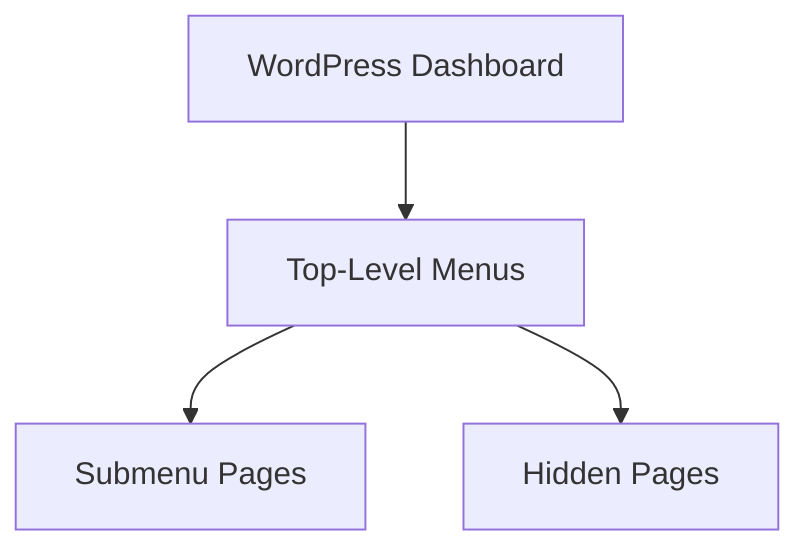

# WordPress Admin Pages

## Introduction

WordPress admin pages are custom interfaces within the WordPress administration area that developers can create to extend WordPress functionality. These pages allow plugin and theme developers to add settings panels, management interfaces, or any other custom functionality directly into the WordPress admin dashboard.

In this tutorial, we'll explore how to create custom admin pages for your WordPress plugins or themes. You'll learn about the WordPress admin menu API, how to register pages, security best practices, and how to create interfaces that match the WordPress look and feel.

## Why Create Custom Admin Pages?

Custom admin pages serve several purposes:

- Provide interfaces for configuring plugin or theme settings
- Create management dashboards for custom content types
- Add reporting or analytics views
- Integrate third-party services with WordPress
- Simplify complex administration tasks

## WordPress Admin Menu Architecture

Before diving into code, it's important to understand the WordPress admin menu structure:



WordPress allows you to:
- Add top-level menu items
- Add submenu items under existing or custom top-level menus
- Create hidden admin pages (accessible via URL but not shown in the menu)

## Creating a Basic Admin Page

Let's start with creating a simple admin page for a plugin. We'll use the `add_menu_page()` function to add a top-level menu item.

```php
/**
 * Register a custom menu page.
 */
function my_custom_menu_page() {
    add_menu_page(
        'My Custom Page',     // Page title
        'Custom Menu',        // Menu title
        'manage_options',     // Capability required
        'my-custom-page',     // Menu slug
        'my_custom_page_callback', // Callback function
        'dashicons-admin-generic',  // Icon
        6                     // Position
    );
}
add_action('admin_menu', 'my_custom_menu_page');

/**
 * Display callback for the custom page
 */
function my_custom_page_callback() {
    ?>
    <div class="wrap">
        <h1><?php echo esc_html(get_admin_page_title()); ?></h1>
        <p>Welcome to my custom admin page!</p>
    </div>
    <?php
}
```

This code adds a new menu item to the WordPress admin menu. When clicked, it loads a page that displays "Welcome to my custom admin page!".

### Important Parameters Explained:

1. **Page title** - The text displayed in the browser's title bar
2. **Menu title** - The text shown in the menu
3. **Capability** - The WordPress capability required to see this menu
4. **Menu slug** - A unique identifier for this menu
5. **Callback** - The function that outputs the page content
6. **Icon** - Dashicon name or URL to a custom icon
7. **Position** - Where the menu should appear (smaller numbers = higher position)

## Adding Submenu Pages

Often, you'll want to create submenu pages instead of (or in addition to) a top-level menu. Use `add_submenu_page()` for this purpose:

```php
/**
 * Register a custom submenu page.
 */
function my_custom_submenu_page() {
    add_submenu_page(
        'tools.php',           // Parent slug (existing WP menu)
        'My Custom Submenu',   // Page title
        'My Submenu',          // Menu title
        'manage_options',      // Capability
        'my-custom-submenu',   // Menu slug
        'my_submenu_callback'  // Callback
    );
}
add_action('admin_menu', 'my_custom_submenu_page');

/**
 * Display callback for the submenu page
 */
function my_submenu_callback() {
    ?>
    <div class="wrap">
        <h1><?php echo esc_html(get_admin_page_title()); ?></h1>
        <p>This is a submenu page under the Tools menu.</p>
    </div>
    <?php
}
```

## Creating Settings Pages With Options API

Most admin pages are used to store and manage settings. WordPress provides the Settings API for this purpose. Here's a complete example:

```php
/**
 * Register a settings page with fields
 */
function my_plugin_settings_init() {
    // Register a settings group
    register_setting(
        'my_plugin_options',    // Option group
        'my_plugin_settings',   // Option name
        'my_plugin_sanitize'    // Sanitization callback
    );
    
    // Add a settings section
    add_settings_section(
        'my_plugin_general',    // ID
        'General Settings',     // Title
        'my_section_callback',  // Callback
        'my-plugin-settings'    // Page slug
    );
    
    // Add fields to the section
    add_settings_field(
        'my_plugin_text_field',  // ID
        'Text Field',            // Title
        'my_text_field_callback', // Callback
        'my-plugin-settings',     // Page slug
        'my_plugin_general'       // Section ID
    );
}
add_action('admin_init', 'my_plugin_settings_init');

/**
 * Section description callback
 */
function my_section_callback() {
    echo 'Configure general settings for my plugin:';
}

/**
 * Text field callback
 */
function my_text_field_callback() {
    $options = get_option('my_plugin_settings');
    $value = isset($options['my_plugin_text_field']) ? $options['my_plugin_text_field'] : '';
    ?>
    <input type="text" name="my_plugin_settings[my_plugin_text_field]" value="<?php echo esc_attr($value); ?>" />
    <p class="description">Enter a value for this field.</p>
    <?php
}

/**
 * Sanitize settings
 */
function my_plugin_sanitize($input) {
    $sanitized = array();
    if (isset($input['my_plugin_text_field'])) {
        $sanitized['my_plugin_text_field'] = sanitize_text_field($input['my_plugin_text_field']);
    }
    return $sanitized;
}

/**
 * Create the menu item
 */
function my_plugin_add_options_page() {
    add_options_page(
        'My Plugin Settings',
        'My Plugin',
        'manage_options',
        'my-plugin-settings',
        'my_plugin_settings_page'
    );
}
add_action('admin_menu', 'my_plugin_add_options_page');

/**
 * Settings page display callback
 */
function my_plugin_settings_page() {
    ?>
    <div class="wrap">
        <h1><?php echo esc_html(get_admin_page_title()); ?></h1>
        <form action="options.php" method="post">
            <?php
            settings_fields('my_plugin_options');
            do_settings_sections('my-plugin-settings');
            submit_button('Save Settings');
            ?>
        </form>
    </div>
    <?php
}
```

This example creates a settings page under the "Settings" menu with a form field that will be properly saved to the WordPress database.

## Creating Custom UI Elements

For more advanced admin pages, you might want to add tabs, metaboxes, or other UI elements. Here's how to create a tabbed interface:

```php
function my_plugin_admin_page() {
    ?>
    <div class="wrap">
        <h1><?php echo esc_html(get_admin_page_title()); ?></h1>
        
        <?php
        // Get current tab
        $active_tab = isset($_GET['tab']) ? sanitize_text_field($_GET['tab']) : 'general';
        ?>
        
        <h2 class="nav-tab-wrapper">
            <a href="?page=my-custom-page&tab=general" class="nav-tab <?php echo $active_tab == 'general' ? 'nav-tab-active' : ''; ?>">
                General
            </a>
            <a href="?page=my-custom-page&tab=advanced" class="nav-tab <?php echo $active_tab == 'advanced' ? 'nav-tab-active' : ''; ?>">
                Advanced
            </a>
        </h2>
        
        <div class="tab-content">
            <?php
            switch($active_tab) {
                case 'advanced':
                    echo '<p>Advanced settings content goes here.</p>';
                    break;
                default: // 'general'
                    echo '<p>General settings content goes here.</p>';
                    break;
            }
            ?>
        </div>
    </div>
    <?php
}
```

## Adding Custom Styles and Scripts

To make your admin pages more interactive or styled, you can enqueue custom CSS and JavaScript:

```php
/**
 * Enqueue admin scripts and styles for our custom page
 */
function my_plugin_admin_scripts($hook) {
    // Only load on our admin page
    if ($hook != 'toplevel_page_my-custom-page') {
        return;
    }
    
    wp_enqueue_style(
        'my-plugin-admin-styles',
        plugin_dir_url(__FILE__) . 'css/admin-styles.css',
        array(),
        '1.0.0'
    );
    
    wp_enqueue_script(
        'my-plugin-admin-script',
        plugin_dir_url(__FILE__) . 'js/admin-script.js',
        array('jquery'),
        '1.0.0',
        true
    );
    
    // Pass data to JavaScript
    wp_localize_script(
        'my-plugin-admin-script',
        'myPluginData',
        array(
            'ajaxUrl' => admin_url('admin-ajax.php'),
            'nonce' => wp_create_nonce('my_plugin_nonce')
        )
    );
}
add_action('admin_enqueue_scripts', 'my_plugin_admin_scripts');
```

## Security Best Practices

Security is crucial when creating admin pages:

1. **Check capabilities**: Always verify that the current user has the appropriate capability:

```php
// At the beginning of your admin page callback function
if (!current_user_can('manage_options')) {
    wp_die(__('You do not have sufficient permissions to access this page.'));
}
```

2. **Use nonces for forms**:

```php
// In your form
wp_nonce_field('my_plugin_action', 'my_plugin_nonce');

// When processing the form
if (!isset($_POST['my_plugin_nonce']) || !wp_verify_nonce($_POST['my_plugin_nonce'], 'my_plugin_action')) {
    wp_die('Security check failed');
}
```

3. **Sanitize inputs and escape outputs**:

```php
// Sanitizing input
$clean_data = sanitize_text_field($_POST['user_input']);

// Escaping output
echo esc_html($user_data);
```

## Real-World Example: Analytics Dashboard

Let's create a more complete example - an analytics dashboard that displays post view counts:

```php
/**
 * Register the admin page
 */
function post_analytics_menu() {
    add_menu_page(
        'Post Analytics',
        'Post Analytics',
        'edit_posts',
        'post-analytics',
        'post_analytics_page',
        'dashicons-chart-bar',
        25
    );
}
add_action('admin_menu', 'post_analytics_menu');

/**
 * Admin page display callback
 */
function post_analytics_page() {
    // Security check
    if (!current_user_can('edit_posts')) {
        wp_die(__('You do not have sufficient permissions to access this page.'));
    }
    
    // Get top 10 posts by view count
    $posts = get_posts(array(
        'post_type' => 'post',
        'posts_per_page' => 10,
        'meta_key' => 'post_views',
        'orderby' => 'meta_value_num',
        'order' => 'DESC',
    ));
    ?>
    <div class="wrap">
        <h1><?php echo esc_html(get_admin_page_title()); ?></h1>
        
        <div class="analytics-dashboard">
            <div class="postbox">
                <h2 class="hndle"><span>Top 10 Posts by Views</span></h2>
                <div class="inside">
                    <?php if (empty($posts)): ?>
                        <p>No view data available yet.</p>
                    <?php else: ?>
                        <table class="widefat">
                            <thead>
                                <tr>
                                    <th>Post Title</th>
                                    <th>Views</th>
                                    <th>Published Date</th>
                                </tr>
                            </thead>
                            <tbody>
                                <?php foreach ($posts as $post): ?>
                                    <?php $views = get_post_meta($post->ID, 'post_views', true) ?: 0; ?>
                                    <tr>
                                        <td>
                                            <a href="<?php echo esc_url(get_edit_post_link($post->ID)); ?>">
                                                <?php echo esc_html($post->post_title); ?>
                                            </a>
                                        </td>
                                        <td><?php echo esc_html(number_format($views)); ?></td>
                                        <td><?php echo esc_html(get_the_date('', $post->ID)); ?></td>
                                    </tr>
                                <?php endforeach; ?>
                            </tbody>
                        </table>
                    <?php endif; ?>
                </div>
            </div>
            
            <div class="postbox">
                <h2 class="hndle"><span>Total Views</span></h2>
                <div class="inside">
                    <?php
                    global $wpdb;
                    $total_views = $wpdb->get_var(
                        "SELECT SUM(meta_value) 
                        FROM $wpdb->postmeta 
                        WHERE meta_key = 'post_views'"
                    );
                    ?>
                    <div class="total-views">
                        <h3><?php echo esc_html(number_format($total_views ?: 0)); ?></h3>
                        <p>Total post views across all content</p>
                    </div>
                </div>
            </div>
        </div>
    </div>
    <?php
}

/**
 * Enqueue styles for the analytics page
 */
function post_analytics_styles($hook) {
    if ($hook != 'toplevel_page_post-analytics') {
        return;
    }
    
    wp_enqueue_style(
        'post-analytics-styles',
        plugin_dir_url(__FILE__) . 'css/analytics.css',
        array(),
        '1.0.0'
    );
}
add_action('admin_enqueue_scripts', 'post_analytics_styles');
```

This example creates an analytics dashboard that displays the most viewed posts and a total view count.

## Summary

In this tutorial, we've covered:

1. How to create top-level and submenu admin pages
2. Implementing settings pages with the WordPress Settings API
3. Creating custom UI with tabs and other elements
4. Adding custom styles and scripts to admin pages
5. Security best practices for admin interfaces
6. A practical example of an analytics dashboard

WordPress admin pages are powerful tools for extending WordPress functionality. By following the WordPress UI guidelines and security best practices, you can create professional-looking interfaces that integrate seamlessly with WordPress.

## Additional Resources

- [WordPress Administration Menus API Documentation](https://developer.wordpress.org/reference/functions/add_menu_page/)
- [WordPress Settings API Documentation](https://developer.wordpress.org/plugins/settings/settings-api/)
- [WordPress Dashicons Reference](https://developer.wordpress.org/resource/dashicons/)

## Exercises

1. Create a simple plugin with an admin page that allows users to input and save a custom copyright notice.
2. Extend the analytics dashboard example to include a graph of views over time.
3. Create a settings page with multiple tabs and various input field types (text, select, checkboxes).
4. Build an admin page that displays information from an external API (like weather forecasts).
5. Create a dashboard widget that provides a simplified view of your custom admin page.