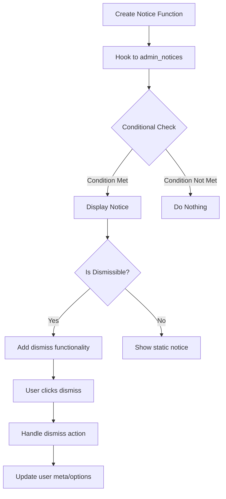

# WordPress Admin Notices

## Introduction

Admin notices are those colored message boxes that appear at the top of WordPress admin pages. They serve as an essential communication channel between your plugin or theme and the user, providing feedback about operations, errors, warnings, or success messages.


In this comprehensive guide, we'll explore how to create, customize, and effectively utilize WordPress admin notices in your development projects. You'll learn how to implement different notice types, make them dismissible, and manage them effectively.

## Understanding Admin Notices

Admin notices in WordPress are HTML elements with specific CSS classes that determine their appearance. The WordPress core uses them extensively to communicate system status, update information, and error messages.

### Types of Admin Notices

WordPress provides four standard types of admin notices, each with its own color scheme and purpose:

1. **Success notices**: Green background, used to indicate successful operations
2. **Error notices**: Red background, used to display errors or critical issues
3. **Warning notices**: Yellow/orange background, used for cautionary messages
4. **Info notices**: Blue background, used for general information

Each notice type corresponds to a specific CSS class that you'll use when creating your notices.

## Basic Admin Notice Implementation

Let's start with creating a simple admin notice. The core function you'll use is the WordPress action hook `admin_notices`.

```php
// Basic admin notice
function my_plugin_admin_notice() {
    ?>
    <div class="notice notice-success">
        <p><?php _e('Your settings have been saved successfully!', 'my-plugin-textdomain'); ?></p>
    </div>
    <?php
}
add_action('admin_notices', 'my_plugin_admin_notice');
```

This code adds a simple success notice that will be displayed on all admin pages. Let's break down the components:

1. We create a function that outputs the HTML for our notice
2. We use the `notice` class combined with a type-specific class (`notice-success`)
3. We hook this function to the `admin_notices` action

### Available Notice Classes

Here are the CSS classes for different types of notices:

- `notice-success`: Green background (success messages)
- `notice-error`: Red background (error messages)
- `notice-warning`: Yellow background (warning messages)
- `notice-info`: Blue background (informational messages)

## Making Notices Dismissible

Static notices that remain on screen can become annoying to users. WordPress provides a built-in way to make notices dismissible by adding the `is-dismissible` class.

```php
function my_plugin_dismissible_notice() {
    ?>
    <div class="notice notice-info is-dismissible">
        <p><?php _e('This is a dismissible info notice.', 'my-plugin-textdomain'); ?></p>
    </div>
    <?php
}
add_action('admin_notices', 'my_plugin_dismissible_notice');
```

The user can now dismiss the notice by clicking the "X" button that appears in the top-right corner of the notice.

### Permanently Dismissible Notices

The default dismissible notice only hides the notice until the page is refreshed. To create permanently dismissible notices, you'll need to:

1. Generate a unique notice ID
2. Use AJAX to handle the dismiss action
3. Store the dismissed state in user metadata

Here's a complete example:

```php
// Step 1: Display the notice with a unique ID
function my_plugin_permanent_dismissible_notice() {
    // Check if user has already dismissed the notice
    $user_id = get_current_user_id();
    if (get_user_meta($user_id, 'my_plugin_notice_dismissed', true)) {
        return;
    }
    
    ?>
    <div class="notice notice-warning is-dismissible" data-notice-id="my_plugin_notice">
        <p><?php _e('This is a permanently dismissible notice. Once dismissed, it won\'t appear again.', 'my-plugin-textdomain'); ?></p>
    </div>
    <?php
}
add_action('admin_notices', 'my_plugin_permanent_dismissible_notice');

// Step 2: Add JavaScript to handle the dismiss action
function my_plugin_notice_scripts() {
    ?>
    <script>
    jQuery(document).ready(function($) {
        $(document).on('click', '.notice[data-notice-id="my_plugin_notice"] .notice-dismiss', function() {
            $.ajax({
                url: ajaxurl,
                data: {
                    action: 'my_plugin_dismiss_notice'
                }
            });
        });
    });
    </script>
    <?php
}
add_action('admin_footer', 'my_plugin_notice_scripts');

// Step 3: Handle the AJAX request
function my_plugin_dismiss_notice_ajax() {
    $user_id = get_current_user_id();
    update_user_meta($user_id, 'my_plugin_notice_dismissed', true);
    wp_die();
}
add_action('wp_ajax_my_plugin_dismiss_notice', 'my_plugin_dismiss_notice_ajax');
```

## Conditional Admin Notices

Most of the time, you'll want to show admin notices only under specific conditions, such as after a form submission or on certain admin pages.

### Displaying Notices After Form Submission

Here's how to display a notice after processing a form:

```php
// Process form submission
function my_plugin_process_form() {
    // Check if our form was submitted
    if (isset($_POST['my_plugin_form_submit'])) {
        // Process form data
        // ...
        
        // Set transient to display notice
        set_transient('my_plugin_form_notice', 'success', 5);
        
        // Redirect to prevent form resubmission
        wp_redirect(admin_url('admin.php?page=my-plugin-page'));
        exit;
    }
}
add_action('admin_init', 'my_plugin_process_form');

// Display notice if transient exists
function my_plugin_admin_form_notice() {
    // Check for our transient
    $notice = get_transient('my_plugin_form_notice');
    
    if ($notice === 'success') {
        ?>
        <div class="notice notice-success is-dismissible">
            <p><?php _e('Form processed successfully!', 'my-plugin-textdomain'); ?></p>
        </div>
        <?php
        // Delete the transient so the notice only shows once
        delete_transient('my_plugin_form_notice');
    }
}
add_action('admin_notices', 'my_plugin_admin_form_notice');
```

### Page-Specific Admin Notices

To display notices only on specific admin pages:

```php
function my_plugin_page_specific_notice() {
    // Get current screen
    $screen = get_current_screen();
    
    // Only show notice on our plugin page
    if ($screen->id === 'toplevel_page_my-plugin-page') {
        ?>
        <div class="notice notice-info is-dismissible">
            <p><?php _e('This notice only appears on the My Plugin page!', 'my-plugin-textdomain'); ?></p>
        </div>
        <?php
    }
}
add_action('admin_notices', 'my_plugin_page_specific_notice');
```

## Customizing Admin Notices

While WordPress provides standard styling for notices, you might want to customize them further to match your plugin's branding or add additional functionalities.

### Adding Custom Styling

You can add custom CSS to modify the appearance of your notices:

```php
function my_plugin_custom_notice_styles() {
    ?>
    <style>
        .my-plugin-custom-notice {
            border-left-color: #6c5ce7;
            background-color: #f8f9fa;
        }
        .my-plugin-custom-notice h2 {
            margin-top: 0;
            color: #6c5ce7;
        }
    </style>
    <?php
}
add_action('admin_head', 'my_plugin_custom_notice_styles');

function my_plugin_custom_styled_notice() {
    ?>
    <div class="notice my-plugin-custom-notice is-dismissible">
        <h2><?php _e('Custom Notice', 'my-plugin-textdomain'); ?></h2>
        <p><?php _e('This is a custom styled notice with brand colors and formatting.', 'my-plugin-textdomain'); ?></p>
    </div>
    <?php
}
add_action('admin_notices', 'my_plugin_custom_styled_notice');
```

### Adding Action Buttons

Sometimes you might want to include buttons or links in your notices to prompt the user to take action:

```php
function my_plugin_notice_with_action() {
    ?>
    <div class="notice notice-warning is-dismissible">
        <p>
            <?php _e('Your license key is about to expire! ', 'my-plugin-textdomain'); ?>
            <a href="<?php echo admin_url('admin.php?page=my-plugin-license'); ?>" class="button button-primary">
                <?php _e('Renew Now', 'my-plugin-textdomain'); ?>
            </a>
        </p>
    </div>
    <?php
}
add_action('admin_notices', 'my_plugin_notice_with_action');
```

## Advanced Notice Management

For larger plugins with multiple types of notices, it's good practice to implement a centralized notice management system.

### Notice Manager Class

Here's a simple class to manage different types of notices:

```php
class My_Plugin_Notice_Manager {
    private static $instance = null;
    private $notices = array();
    
    // Singleton pattern
    public static function get_instance() {
        if (self::$instance === null) {
            self::$instance = new self();
        }
        return self::$instance;
    }
    
    private function __construct() {
        add_action('admin_notices', array($this, 'display_notices'));
    }
    
    // Add a notice to the queue
    public function add_notice($message, $type = 'info', $dismissible = true) {
        $this->notices[] = array(
            'message' => $message,
            'type' => $type,
            'dismissible' => $dismissible
        );
    }
    
    // Display all queued notices
    public function display_notices() {
        foreach ($this->notices as $notice) {
            $dismissible_class = $notice['dismissible'] ? 'is-dismissible' : '';
            ?>
            <div class="notice notice-<?php echo esc_attr($notice['type']); ?> <?php echo $dismissible_class; ?>">
                <p><?php echo wp_kses_post($notice['message']); ?></p>
            </div>
            <?php
        }
    }
}

// Usage example:
function my_plugin_init() {
    $notice_manager = My_Plugin_Notice_Manager::get_instance();
    
    if (some_condition()) {
        $notice_manager->add_notice('This is a success message!', 'success');
    }
    
    if (another_condition()) {
        $notice_manager->add_notice('This is an error message!', 'error');
    }
}
add_action('admin_init', 'my_plugin_init');
```

## Best Practices for Admin Notices

To ensure your notices are helpful rather than annoying, follow these best practices:

### 1. Use the Right Notice Type

Match the notice type to the message content:
- **Success** (green): For successful operations
- **Error** (red): For critical errors that require immediate attention
- **Warning** (yellow): For potential issues or important information
- **Info** (blue): For general information or guidance

### 2. Be Concise and Clear

Keep your notice text concise and to the point. Users should understand the message at a glance.

### 3. Make Notices Dismissible When Appropriate

For non-critical notifications, always make them dismissible. For critical errors that require action, you might want to keep them persistent.

### 4. Don't Overuse Notices

Too many notices create "notice fatigue" where users start ignoring all notices. Use them sparingly and only when necessary.

### 5. Consider Context

Display notices only in relevant contexts, such as specific admin pages or after certain actions.

## Real-World Examples

Let's look at some practical examples of when and how to use admin notices in plugins and themes.

### Plugin Activation Notice

```php
function my_plugin_activation_notice() {
    // Check if the plugin was just activated
    if (get_transient('my_plugin_activated')) {
        ?>
        <div class="notice notice-info is-dismissible">
            <h3><?php _e('Thanks for installing My Plugin!', 'my-plugin-textdomain'); ?></h3>
            <p>
                <?php _e('Get started by visiting the settings page:', 'my-plugin-textdomain'); ?>
                <a href="<?php echo admin_url('admin.php?page=my-plugin-settings'); ?>"><?php _e('Settings', 'my-plugin-textdomain'); ?></a>
            </p>
        </div>
        <?php
        // Delete the transient
        delete_transient('my_plugin_activated');
    }
}
add_action('admin_notices', 'my_plugin_activation_notice');

// Set transient upon plugin activation
function my_plugin_activation() {
    set_transient('my_plugin_activated', true, 5);
}
register_activation_hook(__FILE__, 'my_plugin_activation');
```

### Required Plugin Dependency Notice

```php
function my_plugin_dependency_notice() {
    // Check if WooCommerce is active
    if (!class_exists('WooCommerce')) {
        ?>
        <div class="notice notice-error">
            <p>
                <?php _e('<strong>My Plugin</strong> requires WooCommerce to be installed and activated.', 'my-plugin-textdomain'); ?>
                <?php if (current_user_can('install_plugins')): ?>
                    <a href="<?php echo admin_url('plugin-install.php?s=woocommerce&tab=search&type=term'); ?>"><?php _e('Install WooCommerce', 'my-plugin-textdomain'); ?></a>
                <?php endif; ?>
            </p>
        </div>
        <?php
    }
}
add_action('admin_notices', 'my_plugin_dependency_notice');
```

### Configuration Required Notice

```php
function my_plugin_configuration_notice() {
    // Get plugin settings
    $api_key = get_option('my_plugin_api_key');
    
    // Check if settings are configured
    if (empty($api_key) && current_user_can('manage_options')) {
        ?>
        <div class="notice notice-warning">
            <p>
                <?php _e('<strong>My Plugin</strong> needs configuration. Please enter your API key to enable full functionality.', 'my-plugin-textdomain'); ?>
                <a href="<?php echo admin_url('admin.php?page=my-plugin-settings'); ?>" class="button button-primary"><?php _e('Configure Now', 'my-plugin-textdomain'); ?></a>
            </p>
        </div>
        <?php
    }
}
add_action('admin_notices', 'my_plugin_configuration_notice');
```

## Workflow Diagram

Here's a flowchart illustrating the lifecycle of an admin notice:



## Summary

Admin notices are a powerful way to communicate with WordPress users in the admin area. When used properly, they provide valuable feedback and important information without being intrusive.

In this guide, we've covered:

- The different types of admin notices (success, error, warning, info)
- How to create basic and dismissible notices
- Making notices permanently dismissible
- Displaying conditional notices in specific contexts
- Customizing notices with styling and action buttons
- Best practices for effective admin notices
- Real-world examples of notice implementation

By following these guidelines and examples, you'll be able to effectively communicate with your plugin or theme users, improving their experience and helping them use your product more effectively.

## Additional Resources

- [WordPress Developer Handbook - Admin Notices](https://developer.wordpress.org/reference/hooks/admin_notices/)
- [WordPress Design System - Notice Components](https://make.wordpress.org/design/handbook/design-guide/components/notices/)

## Exercises

1. Create a simple plugin that displays a welcome notice when activated.
2. Implement a permanently dismissible notice that appears only on a specific admin page.
3. Create a notice manager class that can handle multiple types of notices with different priorities.
4. Build a system that displays a notice when a form is submitted successfully, using transients to ensure the notice only appears once.
5. Create a custom styled notice with your own color scheme and design elements.

By mastering WordPress admin notices, you'll add a powerful tool to your development toolkit that will help you create more user-friendly and communicative WordPress plugins and themes.