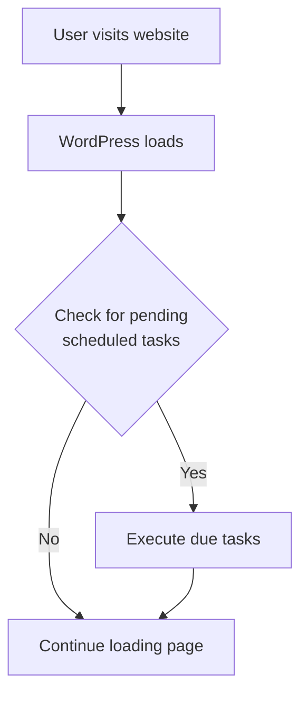

# WordPress Cron Jobs

## Introduction

WordPress Cron (WP-Cron) is a scheduling system built into WordPress that allows you to automate tasks at predetermined intervals. Unlike traditional Unix cron jobs that run at system level, WordPress implements a pseudo-cron system that triggers scheduled events when users visit your website.

Understanding how WP-Cron works is essential for WordPress developers who need to schedule recurring tasks like sending emails, publishing scheduled posts, running database cleanup operations, or fetching external data periodically.

## How WordPress Cron Works

WordPress Cron doesn't actually run on schedule like a traditional server cron job. Instead, it checks for scheduled tasks whenever someone visits your WordPress site. This approach allows WordPress to work on virtually any hosting environment without requiring server-level configuration.



### Key Components of WP-Cron

1. **Cron Schedules** - Predefined time intervals (hourly, twice daily, daily)
2. **Cron Events** - The tasks that need to be executed
3. **Cron Hooks** - WordPress action hooks that get triggered by the cron system

## Working with WordPress Cron

### Registering a Custom Cron Schedule

WordPress provides several default schedules:
- `hourly` (once every hour)
- `twicedaily` (once every 12 hours)
- `daily` (once every 24 hours)

If you need different intervals, you can add your own custom schedules:

```php
/**
 * Add custom cron schedules
 */
function my_custom_cron_schedules($schedules) {
    // Add a 'weekly' schedule to the existing schedules
    $schedules['weekly'] = array(
        'interval' => 7 * 24 * 60 * 60, // 7 days in seconds
        'display' => __('Once Weekly')
    );
    
    // Add a '5min' schedule
    $schedules['five_minutes'] = array(
        'interval' => 5 * 60, // 5 minutes in seconds
        'display' => __('Every Five Minutes')
    );
    
    return $schedules;
}
add_filter('cron_schedules', 'my_custom_cron_schedules');
```

### Scheduling a Single Event

To schedule a one-time event:

```php
/**
 * Schedule a single event to run once at a specific time
 */
function schedule_my_single_event() {
    // Schedule the event if it's not already scheduled
    if (!wp_next_scheduled('my_single_event_hook')) {
        // Schedule event to run in 1 hour
        wp_schedule_single_event(time() + 3600, 'my_single_event_hook');
    }
}
add_action('init', 'schedule_my_single_event');

/**
 * Function to execute when the event is triggered
 */
function my_single_event_function() {
    // Your task code here
    // For example, send an email notification
    wp_mail('admin@example.com', 'Single Event Executed', 'Your scheduled task has run successfully.');
}
add_action('my_single_event_hook', 'my_single_event_function');
```

### Scheduling a Recurring Event

For tasks that need to run repeatedly:

```php
/**
 * Schedule a recurring event
 */
function schedule_my_recurring_event() {
    // Schedule the event if it's not already scheduled
    if (!wp_next_scheduled('my_recurring_event_hook')) {
        // Schedule event to run daily
        wp_schedule_event(time(), 'daily', 'my_recurring_event_hook');
    }
}
add_action('wp_loaded', 'schedule_my_recurring_event');

/**
 * Function to execute when the recurring event is triggered
 */
function my_recurring_event_function() {
    // Your recurring task code here
    // For example, clean up old data from a custom table
    global $wpdb;
    $table_name = $wpdb->prefix . 'my_custom_logs';
    
    // Delete logs older than 30 days
    $wpdb->query(
        $wpdb->prepare(
            "DELETE FROM $table_name WHERE log_date < %s",
            date('Y-m-d', strtotime('-30 days'))
        )
    );
}
add_action('my_recurring_event_hook', 'my_recurring_event_function');
```

### Canceling a Scheduled Event

When you no longer need a scheduled event:

```php
/**
 * Remove a scheduled event
 */
function remove_my_scheduled_event() {
    $timestamp = wp_next_scheduled('my_recurring_event_hook');
    if ($timestamp) {
        wp_unschedule_event($timestamp, 'my_recurring_event_hook');
    }
}
```

## Plugin Activation/Deactivation Hooks

It's a best practice to set up and clean up cron events when your plugin is activated or deactivated:

```php
/**
 * Schedule events on plugin activation
 */
function my_plugin_activation() {
    // Schedule your cron jobs
    if (!wp_next_scheduled('my_recurring_event_hook')) {
        wp_schedule_event(time(), 'daily', 'my_recurring_event_hook');
    }
}
register_activation_hook(__FILE__, 'my_plugin_activation');

/**
 * Clean up events on plugin deactivation
 */
function my_plugin_deactivation() {
    // Remove any scheduled hooks
    $timestamp = wp_next_scheduled('my_recurring_event_hook');
    if ($timestamp) {
        wp_unschedule_event($timestamp, 'my_recurring_event_hook');
    }
}
register_deactivation_hook(__FILE__, 'my_plugin_deactivation');
```

## Real-World Examples

### Example 1: Scheduled Content Syndication

Let's create a cron job that fetches content from an external API and creates posts automatically:

```php
/**
 * Schedule content syndication
 */
function setup_content_syndication_cron() {
    if (!wp_next_scheduled('fetch_external_content')) {
        wp_schedule_event(time(), 'twicedaily', 'fetch_external_content');
    }
}
add_action('wp_loaded', 'setup_content_syndication_cron');

/**
 * Fetch and import content from external API
 */
function import_external_content() {
    // API endpoint
    $api_url = 'https://api.example.com/content';
    
    // Fetch content
    $response = wp_remote_get($api_url);
    
    if (is_wp_error($response)) {
        // Log error and exit
        error_log('Content syndication failed: ' . $response->get_error_message());
        return;
    }
    
    $body = wp_remote_retrieve_body($response);
    $content_items = json_decode($body, true);
    
    if (!empty($content_items) && is_array($content_items)) {
        foreach ($content_items as $item) {
            // Check if post already exists by title or custom meta
            $existing_post = get_posts(array(
                'post_type' => 'post',
                'meta_key' => '_external_content_id',
                'meta_value' => $item['id'],
                'posts_per_page' => 1
            ));
            
            if (empty($existing_post)) {
                // Create new post
                $post_id = wp_insert_post(array(
                    'post_title' => sanitize_text_field($item['title']),
                    'post_content' => wp_kses_post($item['content']),
                    'post_status' => 'publish',
                    'post_author' => 1, // Default admin
                    'post_category' => array(get_cat_ID('Imported'))
                ));
                
                if ($post_id) {
                    // Store reference to external content ID
                    update_post_meta($post_id, '_external_content_id', $item['id']);
                    update_post_meta($post_id, '_content_source', 'api.example.com');
                }
            }
        }
    }
}
add_action('fetch_external_content', 'import_external_content');
```

### Example 2: Automated Database Optimization

This example demonstrates a weekly database optimization task:

```php
/**
 * Schedule weekly database optimization
 */
function setup_db_optimization_cron() {
    if (!wp_next_scheduled('weekly_db_optimization')) {
        wp_schedule_event(time(), 'weekly', 'weekly_db_optimization');
    }
}
add_action('wp_loaded', 'setup_db_optimization_cron');

/**
 * Perform database optimization tasks
 */
function optimize_database() {
    global $wpdb;
    
    // Get all tables
    $tables = $wpdb->get_results("SHOW TABLES", ARRAY_N);
    
    if (!empty($tables)) {
        foreach ($tables as $table) {
            $table_name = $table[0];
            
            // Only optimize WordPress tables
            if (strpos($table_name, $wpdb->prefix) === 0) {
                $wpdb->query("OPTIMIZE TABLE $table_name");
                
                // Log the optimization
                error_log("Optimized table: $table_name");
            }
        }
    }
    
    // Clean up old post revisions (keep last 5)
    $wpdb->query(
        "DELETE FROM $wpdb->posts 
         WHERE post_type = 'revision' 
         AND ID NOT IN (
             SELECT * FROM (
                 SELECT ID FROM $wpdb->posts
                 WHERE post_type = 'revision'
                 ORDER BY post_date DESC
                 LIMIT 5
             ) AS temp
         )"
    );
    
    // Clean up auto drafts
    $wpdb->query(
        "DELETE FROM $wpdb->posts 
         WHERE post_status = 'auto-draft' 
         AND DATEDIFF(NOW(), post_date) > 7"
    );
    
    // Clean up expired transients
    $wpdb->query(
        "DELETE FROM $wpdb->options 
         WHERE option_name LIKE '%_transient_%' 
         AND option_name NOT LIKE '%_transient_timeout_%'"
    );
}
add_action('weekly_db_optimization', 'optimize_database');
```

## Common WP-Cron Issues and Solutions

### Issue 1: Missed or Delayed Events

WordPress Cron events only run when someone visits your site. On low-traffic websites, this can lead to missed or delayed events.

**Solution**: Set up a real server cron job to trigger WordPress Cron:

```bash
# Add this to your server's crontab
*/15 * * * * wget -q -O /dev/null "https://example.com/wp-cron.php?doing_wp_cron" > /dev/null 2>&1
```

And disable the default WP-Cron by adding this to your `wp-config.php`:

```php
define('DISABLE_WP_CRON', true);
```

### Issue 2: Long-Running Cron Tasks

Sometimes cron tasks can take too long and timeout.

**Solution**: For heavy tasks, implement a batching mechanism:

```php
/**
 * Process heavy task in batches
 */
function process_heavy_task_batch() {
    // Get current batch position
    $current_batch = get_option('heavy_task_current_batch', 0);
    $batch_size = 50; // Process 50 items at a time
    
    // Query items for this batch
    $items = get_items_for_batch($current_batch, $batch_size);
    
    if (empty($items)) {
        // Task complete, reset batch counter
        update_option('heavy_task_current_batch', 0);
        return;
    }
    
    // Process items
    foreach ($items as $item) {
        process_single_item($item);
    }
    
    // Update batch position
    update_option('heavy_task_current_batch', $current_batch + 1);
    
    // Schedule the next batch soon
    wp_schedule_single_event(time() + 60, 'process_heavy_task_batch');
}
add_action('process_heavy_task_batch', 'process_heavy_task_batch');

// Helper functions
function get_items_for_batch($batch, $batch_size) {
    global $wpdb;
    $offset = $batch * $batch_size;
    
    return $wpdb->get_results(
        $wpdb->prepare(
            "SELECT * FROM {$wpdb->prefix}my_items 
             WHERE processed = 0 
             LIMIT %d OFFSET %d",
            $batch_size, $offset
        )
    );
}

function process_single_item($item) {
    // Process logic here
    // ...
    
    // Mark as processed
    global $wpdb;
    $wpdb->update(
        "{$wpdb->prefix}my_items",
        ['processed' => 1],
        ['id' => $item->id]
    );
}
```

## Debugging WordPress Cron

To view all scheduled events and their next run time:

```php
/**
 * Debug function to display all scheduled cron events
 */
function display_scheduled_cron_events() {
    // Only show to admins
    if (!current_user_can('manage_options')) {
        return;
    }
    
    $cron_jobs = _get_cron_array();
    
    echo '<div class="wrap">';
    echo '<h2>Scheduled Cron Events</h2>';
    echo '<table class="widefat">';
    echo '<thead><tr><th>Hook Name</th><th>Arguments</th><th>Next Run</th><th>Schedule</th></tr></thead>';
    echo '<tbody>';
    
    foreach ($cron_jobs as $timestamp => $cron_job) {
        foreach ($cron_job as $hook => $events) {
            foreach ($events as $key => $event) {
                echo '<tr>';
                echo '<td>' . esc_html($hook) . '</td>';
                echo '<td>' . (empty($event['args']) ? '—' : print_r($event['args'], true)) . '</td>';
                echo '<td>' . esc_html(date_i18n('Y-m-d H:i:s', $timestamp)) . '</td>';
                echo '<td>' . (isset($event['schedule']) ? esc_html($event['schedule']) : 'One-time event') . '</td>';
                echo '</tr>';
            }
        }
    }
    
    echo '</tbody></table></div>';
}

// Add to admin footer for debugging
add_action('admin_footer', 'display_scheduled_cron_events');
```

## Best Practices for WordPress Cron Jobs

1. **Keep tasks lightweight**: Break large operations into smaller, manageable chunks.

2. **Use transients for state management**: For multi-stage operations, use transients to track progress.

3. **Consider switching to real cron for critical tasks**: On production sites, use server-level cron for time-sensitive operations.

4. **Include error handling**: Log errors and implement retry mechanisms for important tasks.

5. **Clean up after your plugin**: Always remove scheduled events when your plugin is deactivated.

6. **Use unique hook names**: Prefix your cron hooks with your plugin name to avoid conflicts.

7. **Test thoroughly**: Ensure your cron tasks work correctly with various time intervals.

## Summary

WordPress Cron provides a flexible way to schedule recurring tasks in WordPress, but understanding its event-based nature is crucial for effective implementation. In this tutorial, we covered:

- How WordPress Cron differs from system-level cron jobs
- Creating custom cron schedules and events
- Scheduling one-time and recurring tasks
- Handling plugin activation/deactivation hooks
- Real-world examples of WP-Cron in action
- Common issues and solutions
- Debugging and best practices

With this knowledge, you can now effectively implement scheduled tasks in your WordPress plugins and themes, automate routine operations, and enhance your WordPress applications.

## Additional Resources

- [WordPress Cron API Documentation](https://developer.wordpress.org/plugins/cron/)
- [wp-crontrol plugin](https://wordpress.org/plugins/wp-crontrol/) - A plugin that helps manage and debug cron events
- [WP CLI Cron Commands](https://developer.wordpress.org/cli/commands/cron/) - Manage WP-Cron events and schedules from the command line

## Exercises

1. Create a custom cron schedule that runs every 4 hours and use it to schedule a task.

2. Build a simple plugin that uses cron to send a daily email report of new user registrations.

3. Implement a batched cron task that processes large data sets in smaller chunks.

4. Create a debugging tool that shows all currently scheduled cron events in the WordPress admin area.

5. Modify the database optimization example to include cleaning up spam comments older than 30 days.