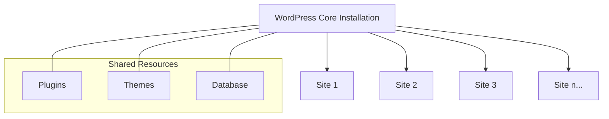
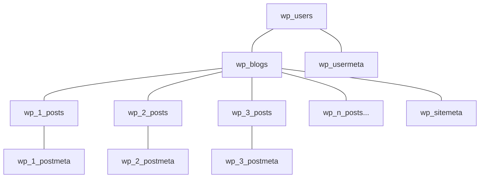

# WordPress Multisite

WordPress Multisite is a powerful feature that allows you to run multiple websites from a single WordPress installation. It's like having multiple WordPress sites that share the same core files, plugins, and themes, but each site can have its own content, appearance, and functionality.

## What is WordPress Multisite?

WordPress Multisite (formerly known as WordPress Multi-User or WPMU) is a feature built into WordPress core that transforms a regular WordPress installation into a network of sites. Each site in the network shares the same WordPress core installation, plugins, and themes, but can be managed separately with its own content, users, and settings.



## When to Use WordPress Multisite

Multisite is ideal for:

1. **Organizations with multiple departments** - Universities, corporations
2. **Networks of related websites** - Blog networks, franchise businesses
3. **Client management** - Agencies managing multiple client sites
4. **Multi-language websites** - Sites requiring separate installations for each language
5. **Testing environments** - Developers who need separate sites for testing

## Advantages of WordPress Multisite

- **Centralized management** - Manage all sites from one dashboard
- **Shared resources** - Single installation of plugins and themes
- **Lower maintenance** - One WordPress core to update
- **Space efficiency** - Optimized database and file structure
- **Network-wide user management** - Users can access multiple sites with one account

## Setting Up WordPress Multisite

### Prerequisites

Before you start, ensure:

1. You have a fresh WordPress installation or are willing to convert an existing one
2. You have access to edit your site's configuration files
3. You have adequate hosting that supports Multisite
4. Your hosting has either Apache with mod_rewrite or Nginx

### Step 1: Enable Multisite in wp-config.php

Add the following line to your `wp-config.php` file, just before the line that says `/* That's all, stop editing! Happy publishing. */`:

```php
/* Multisite */
define( 'WP_ALLOW_MULTISITE', true );
```

### Step 2: Install the Network

After adding the line above, log in to your WordPress admin panel. Navigate to **Tools → Network Setup**. You'll see options for setting up your network:

1. Choose between subdomains (site1.example.com) or subdirectories (example.com/site1)
2. Set a network title
3. Enter the admin email address

Click "Install" to proceed.

### Step 3: Update Configuration Files

WordPress will provide you with specific code to add to your `wp-config.php` and `.htaccess` files. The code will look similar to:

For wp-config.php:

```php
define( 'MULTISITE', true );
define( 'SUBDOMAIN_INSTALL', false ); // Set to true for subdomain installation
define( 'DOMAIN_CURRENT_SITE', 'example.com' );
define( 'PATH_CURRENT_SITE', '/' );
define( 'SITE_ID_CURRENT_SITE', 1 );
define( 'BLOG_ID_CURRENT_SITE', 1 );
```

For .htaccess (on Apache servers):

```apache
RewriteEngine On
RewriteBase /
RewriteRule ^index\.php$ - [L]

# Add a trailing slash to /wp-admin
RewriteRule ^([_0-9a-zA-Z-]+/)?wp-admin$ $1wp-admin/ [R=301,L]

RewriteCond %{REQUEST_FILENAME} -f [OR]
RewriteCond %{REQUEST_FILENAME} -d
RewriteRule ^ - [L]
RewriteRule ^([_0-9a-zA-Z-]+/)?(wp-(content|admin|includes).*) $2 [L]
RewriteRule ^([_0-9a-zA-Z-]+/)?(.*\.php)$ $2 [L]
RewriteRule . index.php [L]
```

### Step 4: Log Back In

After updating the configuration files, log out and log back in to WordPress. You now have a Multisite network!

## Managing Your Multisite Network

### Network Admin Dashboard

A new menu item called "Network Admin" will appear in your admin bar. This dashboard gives you network-wide control:

1. **Sites** - Add, manage, and delete sites
2. **Users** - Manage users across the entire network
3. **Themes** - Control which themes are available to sites
4. **Plugins** - Manage plugins across the network
5. **Settings** - Configure network-wide settings
6. **Updates** - Update WordPress core, plugins, and themes

### Creating New Sites

To add a new site to your network:

1. Go to **Network Admin → Sites → Add New**
2. Enter:
   - Site Address (URL)
   - Site Title
   - Admin Email
3. Click "Add Site"

```php
// Programmatically create a new site
$site_id = wpmu_create_blog(
    'site3.example.com', // domain
    '/',                 // path
    'Site Three',        // title
    get_current_user_id() // user ID
);

if ( is_wp_error( $site_id ) ) {
    echo 'Error creating site: ' . $site_id->get_error_message();
} else {
    echo 'New site created with ID: ' . $site_id;
}
```

### Managing Themes and Plugins

In a Multisite network, only Super Admins can install themes and plugins. By default, all themes are available to all sites, but plugins are not network-activated by default.

To network-activate a plugin:
1. Go to **Network Admin → Plugins**
2. Find the plugin you want to activate
3. Click "Network Activate"

```php
// Programmatically network activate a plugin
$plugin = 'akismet/akismet.php'; // Plugin path relative to plugins directory
$network_wide = true;            // Network activate
activate_plugin( $plugin, '', $network_wide );
```

### User Management

Users can be:
- **Network users**: Exist in the network but aren't assigned to any site
- **Site users**: Assigned to one or more specific sites with various roles

Super Admins manage the entire network and have access to all sites.

```php
// Add a user to a site
add_user_to_blog( 
    $site_id,      // ID of the site
    $user_id,      // ID of the user 
    'contributor'  // Role to assign
);

// Make a user a Super Admin
grant_super_admin( $user_id );

// Remove Super Admin status
revoke_super_admin( $user_id );
```

## Advanced Multisite Features

### Domain Mapping

Domain mapping allows sites in your network to use completely different domains. For example, instead of site1.example.com or example.com/site1, the site could use myuniquedomain.com.

While WordPress once required plugins for this, modern WordPress supports domain mapping natively:

1. Add the domain to your hosting account and point it to your WordPress installation
2. In Network Admin → Sites, edit the site
3. Under "Site Address (URL)", enter the mapped domain

### Per-Site Content Management

Each site can have its own:
1. Posts, pages, and custom post types
2. Media library
3. Navigation menus
4. Widget configurations
5. Theme settings

### Database Structure

Multisite uses an extended database structure:



Core tables (`wp_users`, `wp_usermeta`, etc.) are shared, but each site gets its own set of tables with a numbered prefix (e.g., `wp_1_posts`, `wp_2_comments`).

### Shared User Table

All sites share the same user table, but users can have different roles on different sites:

```php
// Get all sites where a user has a role
$sites = get_blogs_of_user( $user_id );

foreach ( $sites as $site ) {
    echo "User has access to: " . $site->blogname;
}
```

## Practical Examples

### Example 1: Creating a Blog Network for a University

A university might set up WordPress Multisite with:
- The main university site as the primary site
- Each department with its own subsite
- Faculty members with author roles on their department sites
- Shared branding themes across all sites

### Example 2: Developer Testing Environment

A developer could use Multisite to:
- Create separate sites for development, staging, and production
- Test different plugin combinations on each site
- Develop client-specific features in isolation

### Example 3: Client Management Agency

A web agency could implement Multisite to:
1. Create a site for each client
2. Use domain mapping for client-specific domains
3. Centrally manage updates and security
4. Provide clients with editor access to their specific sites

## Common Issues and Solutions

### Problem 1: 404 Errors After Installation

**Solution**: Double-check your .htaccess file and make sure it contains the correct rewrite rules.

### Problem 2: Unable to Upload Media

**Solution**: Each site has an upload directory limit. To increase it:

```php
define( 'MULTISITE_MAX_UPLOAD_SIZE', '10MB' );
```

Add this to your wp-config.php file.

### Problem 3: Plugins Not Available to Subsites

**Solution**: Go to Network Admin → Plugins and "Network Activate" the plugins you want available on all sites.

## Performance Considerations

1. **Choose quality hosting** - Multisite requires more resources
2. **Use caching** - Implement object caching and page caching
3. **Consider separate directories** - Use separate upload directories if you have many sites
4. **Monitor database size** - More sites mean larger databases
5. **Use a CDN** - Content Delivery Networks help with media-heavy multisites

```php
// Define separate upload directories for sites
define( 'UPLOADS', 'wp-content/blogs.dir/' );
```

## Security Best Practices

1. **Limit plugin installation** - Only allow Super Admins to install plugins
2. **Regular backups** - Back up the entire network regularly
3. **Limit theme access** - Only allow specific themes on certain sites
4. **Strong passwords** - Enforce strong passwords, especially for Super Admins
5. **Updated core** - Keep WordPress core updated

```php
// Allow only specific users to install plugins
define( 'DISALLOW_FILE_MODS', true );

// Exception for Super Admins
if ( is_super_admin() ) {
    define( 'DISALLOW_FILE_MODS', false );
}
```

## Summary

WordPress Multisite transforms a single WordPress installation into a powerful network of sites with shared resources and centralized management. It's ideal for organizations, agencies, and developers who need to manage multiple websites efficiently.

Setting up Multisite requires modifying configuration files and understanding the extended capabilities of WordPress, but the benefits of consolidated management, reduced overhead, and efficient resource usage make it worthwhile for many use cases.

## Additional Resources

- [WordPress Codex: Create a Network](https://wordpress.org/support/article/create-a-network/)
- [WordPress Multisite Functions](https://developer.wordpress.org/reference/functions/#multisite)
- [WP-CLI Multisite Commands](https://developer.wordpress.org/cli/commands/site/)

## Exercises

1. Set up a local WordPress Multisite installation using subdirectories.
2. Create three sites in your network with different themes.
3. Write a plugin that displays information from multiple sites in the network on the main site's homepage.
4. Implement a custom user role that works across multiple sites in your network.
5. Create a custom dashboard widget that shows Super Admins the status of all sites in the network.