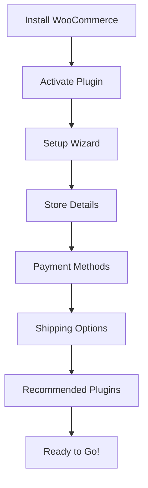
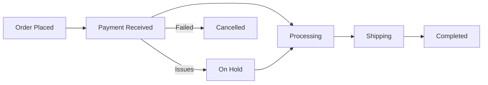

# WordPress WooCommerce Basics

## Introduction

WooCommerce is a powerful, open-source e-commerce plugin built for WordPress. It transforms your WordPress website into a fully functional online store, offering everything you need to sell products or services online. With over 5 million active installations, WooCommerce powers approximately 30% of all online stores, making it one of the most popular e-commerce solutions globally.

In this guide, we'll explore the basic concepts and functionality of WooCommerce, from installation to setting up your first product, configuring payment methods, and understanding the core features that make WooCommerce an excellent choice for beginners.

## Why Choose WooCommerce?

Before diving into the technical aspects, let's understand why WooCommerce stands out:

- **Free and Open-Source**: The core plugin is completely free to use.
- **Highly Customizable**: Extensive extension library and theme compatibility.
- **WordPress Integration**: Works seamlessly with your existing WordPress website.
- **Scalability**: Suitable for businesses of all sizes, from small shops to large enterprises.
- **Community Support**: Large community and extensive documentation available.

## Installation and Setup

### Installing WooCommerce

The first step in your WooCommerce journey is installing the plugin:

1. Log in to your WordPress admin dashboard
2. Navigate to Plugins > Add New
3. Search for "WooCommerce"
4. Click "Install Now" and then "Activate"

After activation, WooCommerce launches a setup wizard that guides you through the basic configuration:



### Store Setup Essentials

During the setup wizard, you'll configure:

1. **Store Details**: Address, currency, and what type of products you'll sell
2. **Payment Methods**: Credit cards, PayPal, bank transfers, etc.
3. **Shipping Options**: Shipping zones, rates, and calculations
4. **Tax Settings**: Tax rates based on location
5. **Optional Extensions**: Additional functionality based on your needs

## WooCommerce Dashboard Overview

After completing the setup wizard, you'll notice new menu items in your WordPress dashboard:

- **WooCommerce**: General settings and overview
- **Products**: Where you manage your inventory
- **Analytics**: Sales reports and statistics
- **Marketing**: Promotions and marketing tools
- **Orders**: Order management system

The WooCommerce dashboard provides a snapshot of your store's performance, including:

- Recent orders
- Stock notifications
- Sales statistics
- Status updates

## Creating Your First Product

Let's create a simple product to understand the basics:

1. Go to Products > Add New
2. Enter a product name and description
3. Set product details:

```jsx
// Product data sections include:
// - General (pricing)
// - Inventory
// - Shipping
// - Linked Products
// - Attributes
// - Advanced

// Example pricing structure
Regular price: $29.99
Sale price: $24.99 (optional)
Tax status: Taxable
Tax class: Standard
```

### Product Types Explained

WooCommerce offers several product types:

- **Simple Product**: A single, standalone item
- **Variable Product**: Products with options (size, color, etc.)
- **Grouped Product**: Collection of related products
- **External/Affiliate Product**: Links to products on other websites
- **Virtual Product**: Non-physical items that don't need shipping
- **Downloadable Product**: Digital products like ebooks or software

### Product Attributes and Categories

Organizing your products is essential for a good customer experience:

```jsx
// Creating a product category
Categories: Clothing > T-Shirts > Men's T-Shirts

// Adding product attributes
Attribute: Color
Values: Red, Blue, Green, Black

Attribute: Size
Values: S, M, L, XL, XXL
```

## Setting Up Payment Gateways

WooCommerce comes with several built-in payment options:

1. **Direct Bank Transfer**: For manual payments
2. **Check Payments**: Traditional check payments
3. **Cash on Delivery**: Pay when the product is delivered
4. **PayPal Standard**: Basic PayPal integration

For credit card processing, you might need extensions:

```jsx
// Example payment gateway setup in wp-config.php (for development)
define('WOOCOMMERCE_USE_SANDBOX', true); // Set to false in production
```

### Configuring PayPal Standard

To set up PayPal Standard:

1. Navigate to WooCommerce > Settings > Payments
2. Enable PayPal Standard
3. Click "Set up" or "Manage"
4. Enter your PayPal email address
5. Configure additional options like IPN, sandbox mode, etc.

## Managing Orders

When customers place orders, they appear in the Orders section:

1. Navigate to WooCommerce > Orders
2. View order details by clicking on an order
3. Update order status as needed:

```jsx
// Common order statuses
Pending payment
Processing
On hold
Completed
Cancelled
Refunded
Failed
```

### Order Processing Workflow



## Shipping Configuration

Setting up shipping is crucial for physical products:

1. Go to WooCommerce > Settings > Shipping
2. Add shipping zones (geographic regions)
3. Add shipping methods to each zone:
   - Flat rate
   - Free shipping
   - Local pickup
   - Other methods via extensions

Example shipping zone setup:

```jsx
// Shipping Zone: United States
Methods:
- Flat Rate: $5.00
- Free Shipping (minimum order: $50)

// Shipping Zone: Europe
Methods:
- Flat Rate: $15.00
- Free Shipping (minimum order: $100)
```

## Tax Settings

For many businesses, handling taxes correctly is essential:

1. Go to WooCommerce > Settings > Tax
2. Choose tax calculation options
3. Set up tax rates based on locations

Example tax configuration:

```jsx
// Standard tax rates
Country: United States
State: California
Rate: 7.25%
Tax Name: CA State Tax
Priority: 1

// City tax (additional)
Country: United States
State: California
City: San Francisco
Rate: 1.5%
Tax Name: SF City Tax
Priority: 2
```

## Understanding WooCommerce Templates

WooCommerce uses templates to display content on the frontend. You can override these templates in your theme:

1. Create a `woocommerce` folder in your theme directory
2. Copy the template file from the WooCommerce plugin directory
3. Modify the template as needed

```jsx
// Structure for template overrides
your-theme/
├── woocommerce/
│   ├── single-product.php
│   ├── content-product.php
│   ├── checkout/
│   │   └── form-checkout.php
│   └── emails/
│       └── customer-completed-order.php
```

## Basic WooCommerce Customization

### Adding Custom Functionality

You can extend WooCommerce with hooks (actions and filters). Here's a simple example of adding content after product summary:

```php
// Add to your theme's functions.php
function custom_after_product_summary() {
    echo '<div class="custom-guarantee">
        <p>30-day money-back guarantee on all products!</p>
    </div>';
}
add_action('woocommerce_after_single_product_summary', 'custom_after_product_summary', 15);
```

### Modifying the Checkout Fields

You can customize the checkout fields with this example:

```php
// Add to your theme's functions.php
function custom_override_checkout_fields($fields) {
    // Add a new field
    $fields['billing']['billing_birth_date'] = array(
        'label'       => 'Birth Date',
        'placeholder' => 'YYYY-MM-DD',
        'required'    => false,
        'class'       => array('form-row-wide'),
        'clear'       => true
    );
    
    // Remove a field
    unset($fields['billing']['billing_company']);
    
    return $fields;
}
add_filter('woocommerce_checkout_fields', 'custom_override_checkout_fields');
```

## Essential WooCommerce Extensions

While WooCommerce is powerful on its own, extensions can add specific functionality:

1. **WooCommerce Subscriptions**: For recurring payments
2. **WooCommerce Bookings**: For appointment and booking systems
3. **WooCommerce Memberships**: For creating membership sites
4. **WooCommerce Product Add-ons**: For product customizations
5. **WooCommerce Google Analytics**: For enhanced tracking

## Optimizing Your WooCommerce Store

For best performance:

1. **Use a quality hosting provider**: WooCommerce requires more resources than a standard WordPress site
2. **Implement caching**: But exclude cart, checkout, and my-account pages
3. **Optimize images**: Compress and resize product images
4. **Limit plugins**: Use only what you need
5. **Regular updates**: Keep WordPress, WooCommerce, and extensions updated

## Security Considerations

Secure your WooCommerce store with these practices:

1. **SSL Certificate**: Always use HTTPS
2. **Strong Passwords**: For admin and customer accounts
3. **Regular Backups**: Store data and files safely
4. **Security Plugins**: Consider specialized e-commerce security solutions
5. **PCI Compliance**: Ensure payment processing meets security standards

## Summary

WooCommerce transforms WordPress into a powerful e-commerce platform, providing all the essential tools to create and manage an online store. We've covered the basics of installation, product creation, payment configuration, shipping and tax settings, order management, and customization options.

With these fundamentals, you're well-equipped to start building your own online store using WordPress and WooCommerce. As your business grows, you can extend functionality with the vast ecosystem of extensions and customizations available.

## Additional Resources

- [Official WooCommerce Documentation](https://docs.woocommerce.com/)
- [WooCommerce Extension Marketplace](https://woocommerce.com/products/)
- [WordPress.org WooCommerce Plugin Page](https://wordpress.org/plugins/woocommerce/)

## Practice Exercises

1. Install WooCommerce on a test WordPress site and complete the setup wizard
2. Create three products of different types (simple, variable, and downloadable)
3. Set up a basic shipping structure with at least two shipping zones
4. Configure PayPal Standard as a payment method
5. Create a custom thank you message that appears after order completion
6. Add a new custom field to the checkout page

By mastering these WooCommerce basics, you'll be ready to create sophisticated online stores and continue exploring advanced WooCommerce features in future lessons.