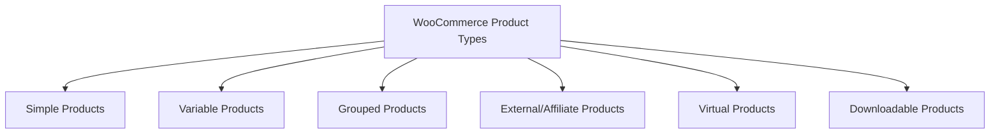

# WordPress Product Setup

## Introduction

Setting up products correctly in your WordPress e-commerce store is a crucial step for online business success. Whether you're selling physical goods, digital downloads, or services, a well-configured product catalog forms the foundation of your online store. In this guide, we'll focus primarily on WooCommerce (the most popular WordPress e-commerce plugin) and walk through the entire process of setting up products that not only showcase your offerings effectively but also provide a seamless shopping experience for your customers.

By the end of this guide, you'll understand how to create various product types, organize your catalog, and implement best practices that help drive conversions.

## WooCommerce Basics

Before diving into product setup, let's ensure WooCommerce is properly installed and configured:

1. Install the WooCommerce plugin from the WordPress plugin directory
2. Complete the setup wizard to configure your store's basics
3. Verify your payment gateways are working
4. Set up your shipping methods (for physical products)

Once these foundations are in place, you're ready to start building your product catalog.

## Product Types in WooCommerce

WooCommerce supports several product types to accommodate different business needs:



Let's examine each product type and when to use them:

### Simple Products

Simple products are standalone, single items with no options or variations. They're the most basic product type.

**When to use**: For products that don't have different options, sizes, or colors.

### Variable Products

Variable products have multiple variations, each potentially with a different SKU, price, and inventory level.

**When to use**: For products that come in different options like sizes, colors, materials, etc.

### Grouped Products

Grouped products are collections of related simple products that can be purchased individually.

**When to use**: When you want to display related products together on a single page.

### External/Affiliate Products

These products link to other websites where the actual purchase happens.

**When to use**: For affiliate marketing or when you want to refer customers to another store.

### Virtual Products

Virtual products don't require shipping or physical handling.

**When to use**: For services, memberships, or anything without a physical form.

### Downloadable Products

Downloadable products provide files that customers can download after purchase.

**When to use**: For digital goods like eBooks, music, software, etc.

## Creating Your First Product

Let's walk through the process of creating a simple product in WooCommerce:

1. Navigate to **Products > Add New** in your WordPress dashboard
2. Enter the product name and description
3. Set the product data section to "Simple product"

Here's how to configure the basic product settings:

```php
// Note: This is not code you need to enter, but rather demonstrates 
// the structure of product data in WordPress

// Basic product data
$product = new WC_Product_Simple();
$product->set_name('Example T-Shirt');
$product->set_status('publish');
$product->set_catalog_visibility('visible');
$product->set_description('This is a high-quality cotton T-shirt.');
$product->set_short_description('A comfortable cotton T-shirt.');
$product->set_regular_price('19.99');
$product->set_sale_price('14.99');
$product->set_sku('TS-001');
$product->set_manage_stock(true);
$product->set_stock_quantity(100);
$product->set_weight('0.5');
$product->set_length('10');
$product->set_width('10');
$product->set_height('2');
```

### Product General Settings

In the "General" tab of the product data section:

1. Set the regular price (and optional sale price)
2. Add a product SKU (Stock Keeping Unit) for inventory tracking
3. Manage tax status and tax class if applicable

### Product Inventory Settings

In the "Inventory" tab:

1. Enable stock management at product level
2. Enter the stock quantity
3. Choose backorder options
4. Set low stock thresholds for notifications
5. Enable/disable sold individually option (limits purchases to 1 per order)

### Shipping Settings

For physical products, configure:

1. Weight of the product
2. Dimensions (length, width, height)
3. Shipping class if you have different shipping rules for different products

### Linked Products

Use the "Linked Products" tab to set up:

1. Upsells (products you promote instead of the currently viewed product)
2. Cross-sells (products promoted in the cart, based on the current product)

### Attributes & Variations

For variable products, you'll need to:

1. Define attributes (like size, color, material)
2. Create variations based on these attributes

Here's how to set up a variable product with attributes:

1. In the "Attributes" tab, add attributes like "Size" with values "Small, Medium, Large"
2. Check the "Used for variations" box for each attribute
3. Go to the "Variations" tab and click "Create variations from all attributes"
4. Configure each variation's price, stock, SKU, etc.

## Product Images and Galleries

High-quality images are essential for e-commerce success:

1. Set a main product image (featured image) that appears on catalog pages
2. Add multiple gallery images that customers can browse on the product page
3. Consider adding lifestyle images showing the product in use

To add images:

1. Click "Set product image" in the Product Image box
2. Upload or select an image from your Media Library
3. Click "Set product image"
4. For gallery images, click "Add product gallery images" in the Product Gallery box
5. Select multiple images and click "Add to gallery"

## Product Categories and Tags

Organize your products with categories and tags to improve navigation:

### Creating Product Categories

1. Go to **Products > Categories**
2. Add a category name, slug (URL-friendly version), and description
3. Optionally add a category image
4. Click "Add new category"

Example category structure:

```
- Clothing
  - Men's Clothing
    - T-Shirts
    - Jeans
  - Women's Clothing
    - Dresses
    - Tops
- Electronics
  - Smartphones
  - Laptops
```

### Using Product Tags

Tags provide another way to group related products:

1. Go to **Products > Tags** or use the Tags meta box on the product edit screen
2. Add relevant tags that describe product features or attributes

## Advanced Product Options

### Product Short Description

The short description appears prominently on the product page, usually near the price:

1. Enter a concise, compelling description in the "Product short description" field
2. Keep it to 2-3 sentences highlighting key features or benefits

### Custom Fields

For specialized information, use custom fields:

1. In the product editor, find the "Custom fields" meta box (enable it via Screen Options if not visible)
2. Add key-value pairs for special product attributes

Example custom fields:
- Material: 100% Cotton
- Care Instructions: Machine wash cold
- Country of Origin: USA

### Product Reviews Settings

Managing reviews:

1. In the "Advanced" tab, you can enable/disable reviews for specific products

## Setting Up a Variable Product (Example)

Let's walk through a complete example of creating a variable product for a t-shirt that comes in different sizes and colors:

1. Create a new product named "Premium Cotton T-Shirt"
2. Set the product data to "Variable product"
3. Add product description, short description, and categories

### Adding Attributes:

1. Go to the "Attributes" tab
2. Add an attribute called "Size"
3. Enter values: "Small, Medium, Large, X-Large"
4. Check "Used for variations"
5. Add another attribute called "Color"
6. Enter values: "Black, White, Red, Blue"
7. Check "Used for variations"
8. Save attributes

### Creating Variations:

1. Go to the "Variations" tab
2. Choose "Create variations from all attributes"
3. This creates 16 variations (4 sizes × 4 colors)
4. Click "Set variation image" for each variation to add specific images
5. Configure price, stock, SKU for each variation:
   - Black/Small: $19.99, SKU: TS-B-S
   - Black/Medium: $19.99, SKU: TS-B-M
   - And so on...

### Bulk Editing Variations:

1. Use the dropdown to select "Set regular price" and enter a value
2. Apply to all variations or only select variations
3. Repeat for other fields that need bulk editing

## Product SEO Best Practices

Optimize your products for search engines:

1. Use descriptive product titles with important keywords
2. Write unique, detailed product descriptions
3. Add alt text to all product images
4. Use SEO plugins like Yoast SEO or Rank Math to optimize meta descriptions

Example product title structure:
```
[Brand Name] [Product Type] with [Key Feature] - [Size/Color/Variation]
```

Example alt text format:
```
[Brand Name] [Product Name] in [Color] - [View Type (front, side, etc.)]
```

## Inventory Management

Effective inventory control is crucial:

1. Enable stock management in WooCommerce settings
2. Configure low stock thresholds
3. Set up email notifications for low or out-of-stock products
4. Consider using automated inventory plugins for larger stores

## Adding Product Add-Ons

For additional product options:

1. Install the "Product Add-Ons" extension or similar plugins
2. Configure options like text fields, checkboxes, or file uploads
3. Set pricing adjustments for each add-on

For example, add personalization to a product:

1. Create a custom text field add-on called "Personalized Message"
2. Set a character limit and any additional cost
3. Save the add-on settings

## Bulk Product Import

For stores with many products:

1. Create a CSV file with product data following WooCommerce's template
2. Go to **Products > Import**
3. Upload your CSV file and map the columns
4. Run the import

Sample CSV structure:
```
SKU,Name,Description,Regular price,Categories
TS-001,"Basic Tee","A simple cotton t-shirt",19.99,"Clothing > T-shirts"
TS-002,"Premium Polo","A high-quality polo shirt",29.99,"Clothing > Polos"
```

## Common Issues and Solutions

### Products Not Appearing in Shop

Check:
- Product status is "Published"
- Product visibility is not set to "Hidden"
- Product is assigned to categories
- Product inventory status (if enabled)

### Variable Products Showing "From $0"

Ensure:
- All variations have prices set
- At least one variation is enabled
- Stock status is correct for variations

## Summary

Setting up products correctly in your WordPress e-commerce store is the foundation for online retail success. In this guide, we've covered:

- Different product types and when to use each
- Step-by-step product creation and configuration
- Managing product variations and attributes
- Product organization with categories and tags
- Advanced features like custom fields and add-ons
- Best practices for product SEO and inventory management

Remember that a well-structured product catalog not only makes management easier for you but also significantly improves the shopping experience for your customers, leading to higher conversion rates and customer satisfaction.

## Additional Resources and Exercises

### Resources

- [Official WooCommerce Documentation](https://docs.woocommerce.com/documentation/plugins/woocommerce/getting-started/managing-products/)
- [WordPress.org E-commerce Plugins](https://wordpress.org/plugins/search/ecommerce/)

### Practice Exercises

1. **Basic Exercise**: Create a simple product with appropriate categories, tags, and images.

2. **Intermediate Exercise**: Set up a variable product with at least two attributes and configure all variations.

3. **Advanced Exercise**: Create a grouped product that contains several related items, and set up cross-sells and upsells between your products.

4. **Challenge**: Create a CSV file with at least 10 products and import them successfully into your store.

By mastering product setup in WordPress e-commerce, you'll be well-equipped to manage an online store of any size or complexity.